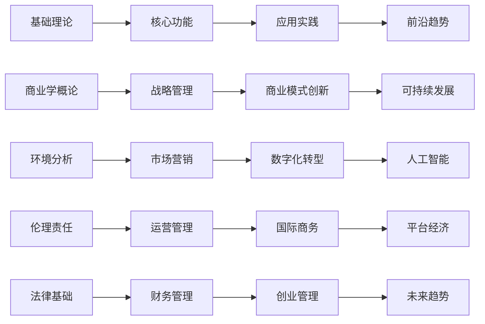
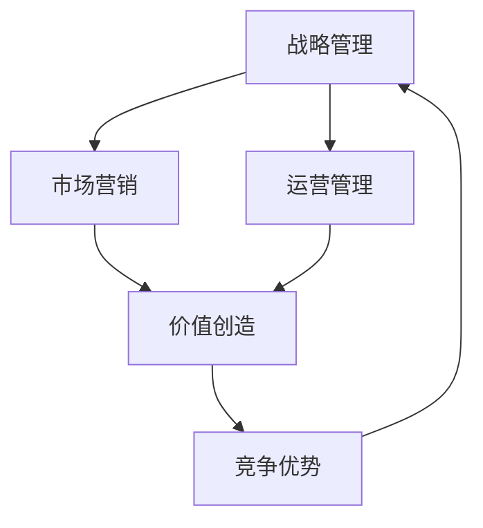
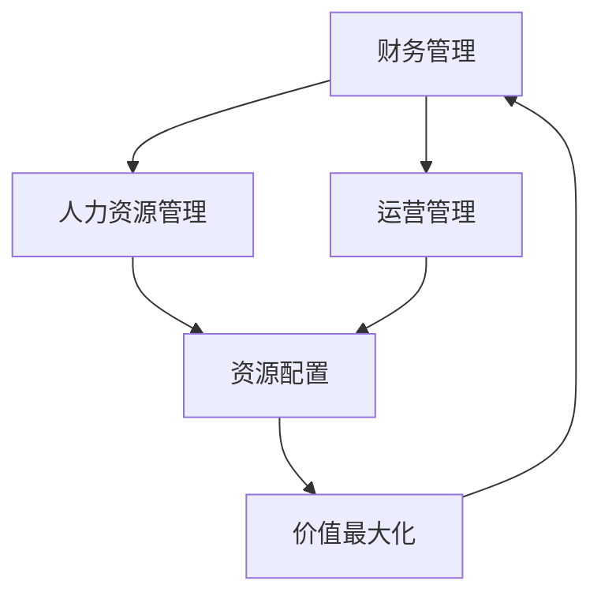

# 知识点关联图

## 🎯 学习目标
理解商业学各知识点间的逻辑关系，构建知识网络，形成系统性思维框架。

## 🕸️ 知识关联网络

### 核心关联链


## 🔗 层次间关联

### L1 → L2：理论基础支撑
| 基础理论 | 支撑功能 | 关联说明 |
|----------|----------|----------|
| [[01-商业学概论]] | [[05-战略管理]] | 战略思维基础 |
| [[02-商业环境分析]] | [[01-市场营销]] | 市场环境分析 |
| [[03-商业伦理与社会责任]] | [[02-运营管理]] | 可持续运营 |
| [[04-商业法律基础]] | [[03-财务管理]] | 合规财务管理 |

### L2 → L3：功能模块整合
| 核心功能 | 应用实践 | 整合方式 |
|----------|----------|----------|
| [[01-市场营销]] + [[02-运营管理]] | [[01-商业模式创新]] | 价值创造与传递 |
| [[03-财务管理]] + [[04-人力资源管理]] | [[02-数字化转型]] | 资源配置优化 |
| [[05-战略管理]] + [[01-市场营销]] | [[03-国际商务]] | 全球化战略 |
| 所有核心功能 | [[04-创业管理]] | 综合商业能力 |

### L3 → L4：实践指导前沿
| 应用实践 | 前沿趋势 | 指导关系 |
|----------|----------|----------|
| [[01-商业模式创新]] | [[03-平台经济]] | 平台商业模式 |
| [[02-数字化转型]] | [[02-人工智能与商业]] | AI商业应用 |
| [[03-国际商务]] | [[01-可持续发展商业]] | 全球可持续发展 |
| [[04-创业管理]] | [[04-未来商业趋势]] | 创业趋势预测 |

## 🔄 跨领域关联

### 战略-营销-运营三角


**关联要点**：
- 战略决定营销方向和运营重点
- 营销创造客户价值，运营提升效率
- 两者结合形成竞争优势
- 竞争优势支撑战略实现

### 财务-人力-运营三角


**关联要点**：
- 财务提供资源配置框架
- 人力提供核心资源
- 运营实现资源转化
- 三者协同实现价值最大化

## 🧠 认知层次关联

### 认知递进关系
| 层次 | 认知目标 | 关联方式 | 输出成果 |
|------|----------|----------|----------|
| **L1 认知** | 理解概念 | 概念关联 | 知识框架 |
| **L2 理解** | 掌握原理 | 原理应用 | 分析能力 |
| **L3 应用** | 实践技能 | 技能整合 | 解决问题 |
| **L4 创新** | 前瞻思维 | 趋势预测 | 创新方案 |

### 学习路径关联
```
理论学习 → 案例分析 → 实践应用 → 创新思考
    ↓         ↓         ↓         ↓
  概念理解   原理掌握   技能应用   思维创新
```

## 🔍 重点关联分析

### 1. 战略管理中心地位
**核心关联**：
- [[01-商业学概论]] → 战略思维基础
- [[02-商业环境分析]] → 战略分析工具
- [[01-市场营销]] → 营销战略
- [[02-运营管理]] → 运营战略
- [[03-财务管理]] → 财务战略
- [[04-人力资源管理]] → 人才战略

**学习建议**：以战略管理为核心，理解各功能模块的战略意义

### 2. 价值链整合关联
**关联链条**：
```
市场调研 → 产品设计 → 生产制造 → 营销推广 → 客户服务
    ↓         ↓         ↓         ↓         ↓
  需求分析   价值创造   价值实现   价值传递   价值维护
```

**学习建议**：理解价值链各环节的关联，优化整体价值创造

### 3. 数字化转型关联
**技术驱动关联**：
- [[02-数字化转型]] → [[01-人工智能与商业]]
- [[01-商业模式创新]] → [[03-平台经济]]
- [[03-国际商务]] → [[01-可持续发展商业]]

**学习建议**：理解技术对商业模式的根本性改变

## 💡 关联学习策略

### 1. 主题式学习
**选择主题**：如"数字化转型"
**关联学习**：
- 基础：[[02-商业环境分析]] - 技术环境
- 核心：[[02-运营管理]] - 数字化运营
- 应用：[[02-数字化转型]] - 转型实践
- 前沿：[[02-人工智能与商业]] - AI应用

### 2. 问题导向学习
**提出问题**：如"如何提升企业竞争力？"
**关联分析**：
- 环境分析：[[02-商业环境分析]]
- 战略制定：[[05-战略管理]]
- 功能优化：各核心功能模块
- 创新实践：[[01-商业模式创新]]

### 3. 案例驱动学习
**选择案例**：如"苹果公司成功分析"
**关联学习**：
- 战略分析：[[05-战略管理]]
- 营销策略：[[01-市场营销]]
- 运营管理：[[02-运营管理]]
- 创新模式：[[01-商业模式创新]]

## 🎯 关联学习检验

### 知识关联检验
- [ ] 能够解释各知识点间的逻辑关系
- [ ] 能够运用关联思维分析问题
- [ ] 能够整合不同模块的知识
- [ ] 能够预测知识发展趋势

### 应用关联检验
- [ ] 能够制定综合性商业方案
- [ ] 能够识别跨领域商业机会
- [ ] 能够解决复杂商业问题
- [ ] 能够创新商业模式

---
**下一步**：开始[[01-基础理论层]]学习