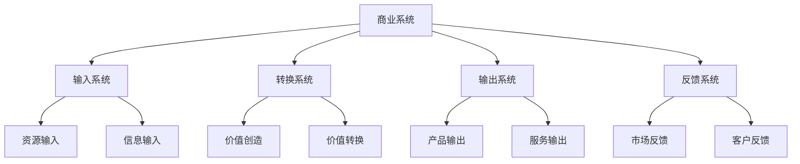

# 商业学定义与范畴

## 🎯 学习目标
理解商业学的本质定义，掌握商业学的研究范畴，建立商业学的基础认知框架。

## 📖 商业学定义

### 核心定义
**商业学**是研究商业活动规律、商业组织管理、商业环境适应和商业价值创造的综合性学科。

### 定义解析
| 要素 | 含义 | 重要性 |
|------|------|--------|
| **商业活动规律** | 商业运行的内在逻辑 | 理论基础 |
| **商业组织管理** | 企业经营管理方法 | 实践核心 |
| **商业环境适应** | 对外部环境的响应 | 生存能力 |
| **商业价值创造** | 价值创造与传递 | 存在意义 |

## 🔍 研究范畴

### 微观层面：企业经营管理
**研究内容**：
- 企业内部管理
- 商业决策制定
- 资源配置优化
- 运营效率提升

**核心问题**：
- 如何提高企业效率？
- 如何优化资源配置？
- 如何制定有效决策？

### 中观层面：行业竞争分析
**研究内容**：
- 行业竞争格局
- 供应链管理
- 产业集群发展
- 市场结构分析

**核心问题**：
- 行业如何发展？
- 竞争如何演化？
- 供应链如何优化？

### 宏观层面：商业环境分析
**研究内容**：
- 商业环境分析
- 商业政策研究
- 商业发展趋势
- 全球经济影响

**核心问题**：
- 环境如何影响商业？
- 政策如何引导商业？
- 趋势如何预测？

## 🎯 核心问题

### 1. 如何创造和传递价值？
**价值创造**：
- 产品创新
- 服务优化
- 流程改进
- 商业模式创新

**价值传递**：
- 营销策略
- 渠道建设
- 客户关系
- 品牌建设

### 2. 如何优化资源配置？
**资源类型**：
- 人力资源
- 财务资源
- 技术资源
- 信息资源

**优化方法**：
- 资源配置模型
- 效率提升工具
- 成本控制方法
- 风险管理策略

### 3. 如何适应环境变化？
**环境类型**：
- 政治环境
- 经济环境
- 社会环境
- 技术环境

**适应策略**：
- 环境扫描
- 趋势分析
- 战略调整
- 组织变革

### 4. 如何实现可持续发展？
**可持续发展维度**：
- 经济可持续
- 社会可持续
- 环境可持续
- 治理可持续

## 🧠 商业学思维框架

### 系统思维


### 价值思维
**价值创造链**：
```
需求识别 → 价值设计 → 价值创造 → 价值传递 → 价值实现
    ↓         ↓         ↓         ↓         ↓
  市场调研   产品设计   生产制造   营销推广   客户满意
```

### 竞争思维
**竞争优势来源**：
- 成本优势
- 差异化优势
- 聚焦优势
- 创新优势

## 💡 学习要点

### 费曼学习法应用
1. **选择概念**：商业学定义
2. **简化解释**：用一句话解释商业学
3. **识别盲点**：找出理解不足的地方
4. **重新学习**：针对盲点深入学习

### 刻意练习要点
- **概念理解**：准确理解商业学定义
- **范畴掌握**：掌握三个研究层面
- **问题思考**：深入思考四个核心问题
- **思维建立**：形成商业学思维框架

## 🔗 关联学习

### 前置知识
- 经济学基础
- 管理学基础
- 社会学基础

### 后续学习
- [[02-商业发展历程]] - 商业发展脉络
- [[03-商业系统理论]] - 系统思维框架
- [[04-商业研究方法论]] - 研究方法

### 实践应用
- 企业案例分析
- 商业环境分析
- 商业模式设计

## 🎯 学习检验

### 理解检验
- [ ] 能够准确解释商业学定义
- [ ] 能够说明商业学的研究范畴
- [ ] 能够分析商业学的核心问题
- [ ] 能够建立商业学思维框架

### 应用检验
- [ ] 能够分析企业的商业活动
- [ ] 能够识别商业价值创造点
- [ ] 能够评估商业环境适应性
- [ ] 能够设计可持续发展方案

---
**下一步**：[[02-商业发展历程]] - 了解商业发展脉络