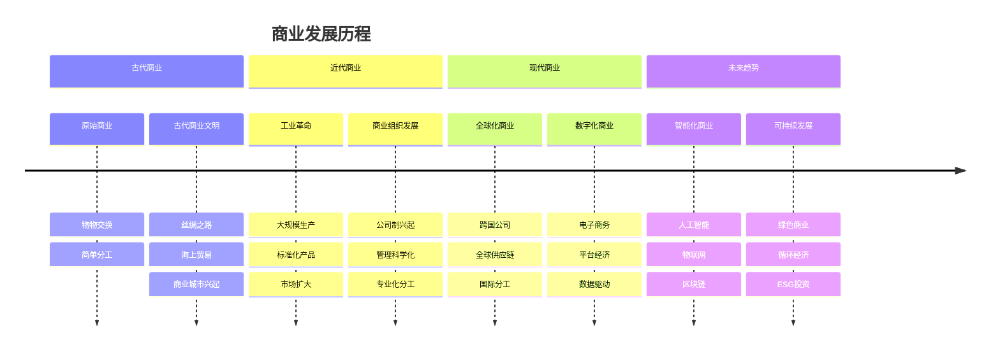

# 商业发展历程

## 🎯 学习目标
了解商业发展的历史脉络，理解商业演进的规律，掌握商业发展的趋势。

## 📈 商业发展时间轴

## 🏛️ 古代商业

### 原始商业阶段
**特征**：
- 物物交换
- 简单分工
- 自给自足
- 部落经济

**商业活动**：
- 食物交换
- 工具交换
- 技能交换
- 信息交换

### 古代商业文明
**重要标志**：
- **丝绸之路**：东西方贸易通道
- **海上贸易**：海洋贸易网络
- **商业城市**：贸易中心形成

**商业特点**：
- 长途贸易
- 货币出现
- 商业法规
- 商人阶层

## 🏭 近代商业

### 工业革命影响
**技术变革**：
- 蒸汽机发明
- 机械化生产
- 交通运输革命
- 通信技术发展

**商业变革**：
- 大规模生产
- 标准化产品
- 市场扩大
- 价格竞争

### 商业组织发展
**公司制兴起**：
- 有限责任
- 股份制度
- 法人治理
- 现代企业

**管理科学化**：
- 科学管理
- 组织理论
- 管理教育
- 专业管理

## 🌍 现代商业

### 全球化商业
**全球化特征**：
- 跨国公司
- 全球供应链
- 国际分工
- 资本流动

**全球化影响**：
- 市场扩大
- 竞争加剧
- 技术扩散
- 文化融合

### 数字化商业
**数字技术**：
- 互联网
- 移动通信
- 云计算
- 大数据

**商业变革**：
- 电子商务
- 平台经济
- 数据驱动
- 个性化服务

## 🚀 未来趋势

### 智能化商业
**技术驱动**：
- 人工智能
- 物联网
- 区块链
- 量子计算

**商业变革**：
- 智能决策
- 自动化运营
- 个性化服务
- 预测分析

### 可持续发展
**发展理念**：
- 绿色商业
- 循环经济
- ESG投资
- 社会责任

**实践路径**：
- 清洁能源
- 绿色供应链
- 可持续消费
- 碳中和目标

## 📊 商业发展规律

### 发展驱动因素
| 因素 | 古代 | 近代 | 现代 | 未来 |
|------|------|------|------|------|
| **技术** | 手工技术 | 机械技术 | 信息技术 | 智能技术 |
| **市场** | 本地市场 | 区域市场 | 全球市场 | 数字市场 |
| **组织** | 个人/家族 | 公司制 | 跨国公司 | 平台组织 |
| **竞争** | 资源竞争 | 价格竞争 | 品牌竞争 | 创新竞争 |

### 演进规律
1. **技术驱动**：技术进步推动商业变革
2. **市场扩大**：市场范围不断扩大
3. **组织进化**：组织形式不断优化
4. **竞争升级**：竞争方式不断升级

## 🧠 学习要点

### 历史思维
**发展脉络**：
- 理解商业发展的连续性
- 识别商业变革的转折点
- 分析商业发展的驱动因素
- 预测商业发展的未来趋势

### 比较思维
**阶段比较**：
- 不同阶段的商业特征
- 商业模式的演进规律
- 竞争方式的变化趋势
- 组织形式的进化过程

## 💡 实践应用

### 案例分析
**选择企业**：如苹果公司
**分析维度**：
- 技术演进：从个人电脑到智能手机
- 市场扩展：从美国到全球
- 组织发展：从创业公司到跨国公司
- 竞争策略：从产品竞争到生态竞争

### 趋势预测
**分析方法**：
- 历史趋势分析
- 技术发展预测
- 市场需求预测
- 竞争格局预测

## 🔗 关联学习

### 前置知识
- [[01-商业学定义与范畴]] - 商业学基础
- 历史学基础
- 经济学基础

### 后续学习
- [[03-商业系统理论]] - 系统思维
- [[04-商业研究方法论]] - 研究方法
- [[02-商业环境分析]] - 环境分析

### 实践应用
- 企业历史分析
- 行业发展趋势
- 商业模式创新

## 🎯 学习检验

### 理解检验
- [ ] 能够描述商业发展的主要阶段
- [ ] 能够分析商业发展的驱动因素
- [ ] 能够识别商业发展的规律
- [ ] 能够预测商业发展的趋势

### 应用检验
- [ ] 能够分析企业的发展历程
- [ ] 能够识别行业的发展趋势
- [ ] 能够设计未来的商业模式
- [ ] 能够制定发展战略

---
**下一步**：[[03-商业系统理论]] - 建立系统思维框架