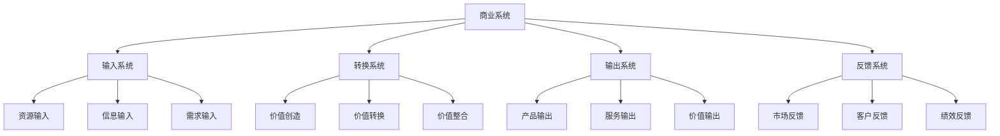
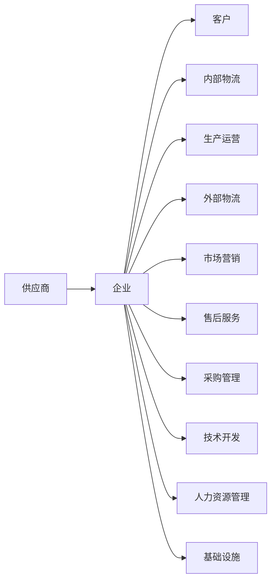
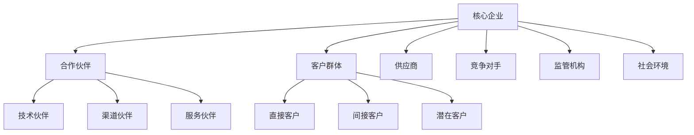

# 商业系统理论

## 🎯 学习目标
掌握系统论基础，理解商业系统构成，学会运用系统思维分析商业问题。

## 🧠 系统论基础

### 系统特征
| 特征 | 定义 | 商业应用 |
|------|------|----------|
| **整体性** | 系统整体大于部分之和 | 企业价值大于各部门价值之和 |
| **层次性** | 系统具有层次结构 | 企业-部门-团队-个人 |
| **关联性** | 系统要素相互关联 | 各部门相互影响 |
| **动态性** | 系统不断发展变化 | 企业持续适应环境 |

### 系统思维
**核心原则**：
- 整体思考
- 动态分析
- 关联分析
- 反馈控制

**思维模式**：
```
输入 → 转换 → 输出 → 反馈
  ↓      ↓      ↓      ↓
资源   价值创造  产品   市场反馈
```

## 🏢 商业系统构成

### 系统结构


### 系统要素
**输入要素**：
- 人力资源
- 财务资源
- 物质资源
- 信息资源

**转换要素**：
- 生产流程
- 管理流程
- 服务流程
- 创新流程

**输出要素**：
- 产品服务
- 客户价值
- 社会价值
- 经济价值

**反馈要素**：
- 市场反馈
- 客户反馈
- 员工反馈
- 社会反馈

## 🔄 商业系统模型

### 价值链模型


**价值链分析**：
- **基本活动**：直接创造价值的活动
- **支持活动**：支撑基本活动的活动
- **价值创造**：通过活动组合创造价值
- **竞争优势**：通过优化价值链获得优势

### 商业生态系统


**生态系统特征**：
- **共生关系**：各主体相互依存
- **协同效应**：整体价值大于个体之和
- **动态平衡**：系统不断调整平衡
- **进化发展**：系统持续演进

## 🔧 系统分析方法

### 系统思维方法
**整体思维**：
- 从全局角度思考问题
- 考虑系统整体目标
- 分析系统整体效应
- 优化系统整体性能

**动态思维**：
- 分析系统发展变化
- 预测系统未来趋势
- 适应系统环境变化
- 引导系统发展方向

**关联思维**：
- 识别系统要素关联
- 分析关联强度影响
- 优化关联结构
- 利用关联效应

**反馈思维**：
- 建立反馈机制
- 监控反馈信息
- 分析反馈结果
- 调整系统行为

### 系统优化方法
**目标设定**：
- 明确系统目标
- 设定目标指标
- 建立目标体系
- 平衡目标冲突

**约束识别**：
- 识别系统约束
- 分析约束影响
- 评估约束强度
- 制定约束策略

**方案设计**：
- 设计优化方案
- 评估方案可行性
- 比较方案优劣
- 选择最优方案

**效果评估**：
- 评估优化效果
- 分析效果原因
- 识别改进空间
- 持续优化改进

## 💡 实践应用

### 企业系统分析
**分析框架**：
1. **系统识别**：识别企业系统边界
2. **要素分析**：分析系统构成要素
3. **关联分析**：分析要素间关联
4. **优化设计**：设计系统优化方案

**分析工具**：
- 系统图
- 流程图
- 关联图
- 优化模型

### 商业模式设计
**设计原则**：
- 系统性设计
- 价值导向
- 客户中心
- 持续创新

**设计步骤**：
1. 系统分析
2. 价值设计
3. 流程设计
4. 组织设计

## 🧠 学习要点

### 费曼学习法应用
1. **选择概念**：商业系统理论
2. **简化解释**：用简单语言解释系统思维
3. **识别盲点**：找出理解不足的地方
4. **重新学习**：针对盲点深入学习

### 刻意练习要点
- **概念理解**：准确理解系统论基础
- **模型掌握**：掌握商业系统模型
- **方法应用**：运用系统分析方法
- **思维建立**：形成系统思维模式

## 🔗 关联学习

### 前置知识
- [[01-商业学定义与范畴]] - 商业学基础
- [[02-商业发展历程]] - 发展脉络
- 系统论基础

### 后续学习
- [[04-商业研究方法论]] - 研究方法
- [[02-商业环境分析]] - 环境分析
- [[05-战略管理]] - 战略思维

### 实践应用
- 企业系统分析
- 商业模式设计
- 组织优化设计

## 🎯 学习检验

### 理解检验
- [ ] 能够解释系统论基础概念
- [ ] 能够描述商业系统构成
- [ ] 能够运用系统分析方法
- [ ] 能够建立系统思维框架

### 应用检验
- [ ] 能够分析企业系统结构
- [ ] 能够设计商业模式
- [ ] 能够优化组织系统
- [ ] 能够解决系统性问题

---
**下一步**：[[04-商业研究方法论]] - 掌握研究方法