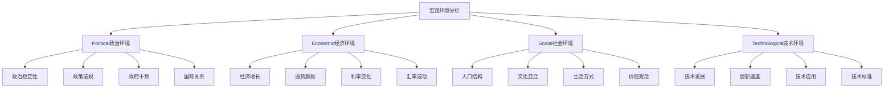

# 宏观环境分析(PEST)

## 🎯 学习目标
掌握PEST分析框架，学会分析宏观环境对企业的影响，提高环境适应能力。

## 📊 PEST分析框架

### 框架结构

## 🏛️ Political（政治环境）

### 政治稳定性
**影响因素**：
- 政府更替频率
- 政治冲突程度
- 社会稳定性
- 法治环境

**对企业影响**：
- 投资决策
- 经营风险
- 市场准入
- 政策预期

### 政策法规
**政策类型**：
- 产业政策
- 税收政策
- 贸易政策
- 环保政策

**法规影响**：
- 合规成本
- 经营限制
- 市场准入
- 竞争环境

### 政府干预
**干预方式**：
- 直接干预
- 间接调控
- 政策引导
- 市场监管

**干预影响**：
- 市场机制
- 竞争格局
- 资源配置
- 企业行为

### 国际关系
**关系类型**：
- 双边关系
- 多边关系
- 贸易关系
- 投资关系

**关系影响**：
- 贸易便利
- 投资环境
- 技术合作
- 市场准入

## 💰 Economic（经济环境）

### 经济增长
**增长指标**：
- GDP增长率
- 人均收入
- 消费水平
- 投资规模

**增长影响**：
- 市场需求
- 投资机会
- 消费能力
- 发展空间

### 通货膨胀
**通胀类型**：
- 需求拉动
- 成本推动
- 结构性通胀
- 输入性通胀

**通胀影响**：
- 成本上升
- 价格水平
- 购买力
- 利率水平

### 利率变化
**利率类型**：
- 基准利率
- 市场利率
- 实际利率
- 名义利率

**利率影响**：
- 融资成本
- 投资决策
- 消费行为
- 汇率水平

### 汇率波动
**汇率类型**：
- 名义汇率
- 实际汇率
- 有效汇率
- 均衡汇率

**汇率影响**：
- 进出口成本
- 国际竞争力
- 资本流动
- 价格水平

## 👥 Social（社会环境）

### 人口结构
**结构要素**：
- 年龄结构
- 性别结构
- 教育结构
- 收入结构

**结构影响**：
- 市场需求
- 劳动力供给
- 消费模式
- 社会需求

### 文化变迁
**变迁内容**：
- 价值观念
- 生活方式
- 消费习惯
- 社会规范

**变迁影响**：
- 产品需求
- 营销策略
- 品牌定位
- 企业文化

### 生活方式
**生活方式类型**：
- 工作方式
- 消费方式
- 娱乐方式
- 社交方式

**方式影响**：
- 产品设计
- 服务模式
- 渠道选择
- 营销方式

### 价值观念
**价值类型**：
- 个人价值
- 社会价值
- 文化价值
- 道德价值

**价值影响**：
- 消费选择
- 品牌偏好
- 社会责任
- 企业形象

## 🔬 Technological（技术环境）

### 技术发展
**发展类型**：
- 基础技术
- 应用技术
- 前沿技术
- 颠覆技术

**发展影响**：
- 生产效率
- 产品创新
- 商业模式
- 竞争格局

### 创新速度
**速度指标**：
- 专利数量
- 研发投入
- 技术转化
- 创新周期

**速度影响**：
- 技术更新
- 产品生命周期
- 竞争优势
- 投资回报

### 技术应用
**应用领域**：
- 生产制造
- 服务提供
- 管理运营
- 营销推广

**应用影响**：
- 效率提升
- 成本降低
- 质量改善
- 服务创新

### 技术标准
**标准类型**：
- 技术标准
- 产品标准
- 服务标准
- 管理标准

**标准影响**：
- 技术门槛
- 市场准入
- 竞争格局
- 国际合作

## 🔍 分析方法

### 环境扫描
**扫描方法**：
- 信息收集
- 趋势识别
- 影响评估
- 机会威胁分析

**扫描工具**：
- 文献研究
- 专家访谈
- 数据收集
- 趋势分析

### 情景规划
**情景构建**：
- 乐观情景
- 悲观情景
- 基准情景
- 极端情景

**规划步骤**：
- 情景构建
- 概率评估
- 影响分析
- 应对策略

## 💡 实践应用

### PEST分析步骤
1. **信息收集**：收集各环境要素信息
2. **趋势分析**：分析各要素发展趋势
3. **影响评估**：评估对企业的影响
4. **机会威胁**：识别机会和威胁
5. **策略制定**：制定应对策略

### 分析工具
**信息收集工具**：
- 政府报告
- 统计数据
- 研究报告
- 新闻媒体

**分析工具**：
- 趋势分析
- 影响矩阵
- 情景分析
- 战略地图

## 🧠 学习要点

### 费曼学习法应用
1. **选择概念**：PEST分析框架
2. **简化解释**：用简单语言解释PEST分析
3. **识别盲点**：找出理解不足的地方
4. **重新学习**：针对盲点深入学习

### 刻意练习要点
- **框架掌握**：掌握PEST分析框架
- **信息收集**：学会收集环境信息
- **趋势分析**：能够分析环境趋势
- **影响评估**：能够评估环境影响

## 🔗 关联学习

### 前置知识
- [[04-商业研究方法论]] - 研究方法
- 经济学基础
- 政治学基础

### 后续学习
- [[02-行业环境分析]] - 行业分析
- [[03-竞争环境分析]] - 竞争分析
- [[05-战略管理]] - 战略分析

### 实践应用
- 企业环境分析
- 投资环境评估
- 市场进入分析
- 战略规划制定

## 🎯 学习检验

### 理解检验
- [ ] 能够解释PEST分析框架
- [ ] 能够分析各环境要素
- [ ] 能够识别环境趋势
- [ ] 能够评估环境影响

### 应用检验
- [ ] 能够进行PEST分析
- [ ] 能够识别机会威胁
- [ ] 能够制定应对策略
- [ ] 能够预测环境变化

---
**下一步**：[[02-行业环境分析]] - 行业竞争分析