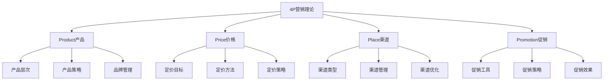

# 4P营销理论

## 🎯 学习目标
掌握4P营销理论框架，理解营销组合要素，学会制定营销策略。

## 📊 4P理论框架

### 核心要素

## 🛍️ Product（产品）

### 产品层次
**五层产品概念**：
1. **核心产品**：基本功能
2. **形式产品**：外观包装
3. **期望产品**：期望属性
4. **附加产品**：增值服务
5. **潜在产品**：未来可能

### 产品策略
**产品组合**：
- 产品线宽度
- 产品线深度
- 产品线长度
- 产品线一致性

**产品生命周期**：
| 阶段 | 特征 | 策略 |
|------|------|------|
| **导入期** | 销量低，成本高 | 快速渗透 |
| **成长期** | 销量增长，竞争加剧 | 市场扩张 |
| **成熟期** | 销量稳定，竞争激烈 | 差异化 |
| **衰退期** | 销量下降，利润减少 | 退出或转型 |

### 品牌管理
**品牌要素**：
- 品牌名称
- 品牌标识
- 品牌口号
- 品牌形象

**品牌策略**：
- 品牌定位
- 品牌延伸
- 品牌组合
- 品牌保护

## 💰 Price（价格）

### 定价目标
**目标类型**：
- 利润最大化
- 市场份额
- 竞争导向
- 生存导向

### 定价方法
**成本导向定价**：
- 成本加成法
- 目标利润法
- 盈亏平衡法

**需求导向定价**：
- 价值定价法
- 需求弹性法
- 心理定价法

**竞争导向定价**：
- 随行就市法
- 投标定价法
- 拍卖定价法

### 定价策略
**新产品定价**：
- 撇脂定价
- 渗透定价
- 适中定价

**心理定价**：
- 尾数定价
- 整数定价
- 声望定价

## 🏪 Place（渠道）

### 渠道类型
**直接渠道**：
- 直销
- 网络销售
- 电话销售

**间接渠道**：
- 批发商
- 零售商
- 代理商

**多渠道**：
- 线上线下结合
- 传统现代结合
- 直接间接结合

### 渠道管理
**渠道设计**：
- 渠道长度
- 渠道宽度
- 渠道密度
- 渠道类型

**渠道选择**：
- 市场因素
- 产品因素
- 企业因素
- 环境因素

**渠道激励**：
- 价格激励
- 促销激励
- 服务激励
- 培训激励

## 📢 Promotion（促销）

### 促销工具
**广告**：
- 电视广告
- 网络广告
- 户外广告
- 印刷广告

**销售促进**：
- 折扣促销
- 赠品促销
- 抽奖促销
- 体验促销

**人员推销**：
- 销售代表
- 电话销售
- 网络销售
- 会议销售

**公共关系**：
- 媒体关系
- 政府关系
- 社区关系
- 投资者关系

### 促销策略
**推式策略**：
- 向渠道推
- 向终端推
- 向消费者推

**拉式策略**：
- 吸引消费者
- 拉动需求
- 拉动渠道

## 🔄 4P整合

### 整合原则
- **一致性**：各要素协调一致
- **互补性**：各要素相互补充
- **协同性**：各要素协同效应
- **动态性**：各要素动态调整

### 整合策略
**产品-价格整合**：
- 价值定价
- 差异化定价
- 生命周期定价

**产品-渠道整合**：
- 渠道适配
- 渠道创新
- 渠道优化

**产品-促销整合**：
- 产品推广
- 品牌传播
- 价值沟通

## 💡 实践应用

### 营销组合设计
**设计步骤**：
1. 市场分析
2. 目标设定
3. 策略制定
4. 组合设计
5. 实施监控

### 案例分析
**选择案例**：如苹果iPhone
**4P分析**：
- **Product**：创新设计，用户体验
- **Price**：高端定位，价值定价
- **Place**：直营店+授权店
- **Promotion**：品牌营销，口碑传播

## 🧠 学习要点

### 费曼学习法应用
1. **选择概念**：4P营销理论
2. **简化解释**：用简单语言解释4P
3. **识别盲点**：找出理解不足的地方
4. **重新学习**：针对盲点深入学习

### 刻意练习要点
- **框架掌握**：掌握4P理论框架
- **要素理解**：理解各要素内涵
- **策略制定**：能够制定营销策略
- **整合应用**：能够整合应用4P

## 🔗 关联学习

### 前置知识
- [[02-商业环境分析]] - 环境分析
- [[03-消费者行为学]] - 消费者分析

### 后续学习
- [[02-STP战略]] - 市场细分
- [[04-品牌管理]] - 品牌策略
- [[01-数字营销]] - 数字营销

### 实践应用
- 营销策略制定
- 产品上市规划
- 品牌推广活动
- 渠道管理优化

## 🎯 学习检验

### 理解检验
- [ ] 能够解释4P理论框架
- [ ] 能够分析各要素内涵
- [ ] 能够制定营销策略
- [ ] 能够整合应用4P

### 应用检验
- [ ] 能够设计营销组合
- [ ] 能够分析营销案例
- [ ] 能够制定营销计划
- [ ] 能够评估营销效果

---
**下一步**：[[02-STP战略]] - 市场细分定位