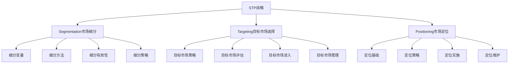

# STP战略

## 🎯 学习目标
掌握STP战略框架，学会市场细分、目标市场选择和市场定位，制定精准营销策略。

## 📊 STP战略框架

### 战略要素

## 🔍 Segmentation（市场细分）

### 细分变量
**地理变量**：
- **地区**：国家、省份、城市、区域
- **城市规模**：特大城市、大城市、中等城市、小城市
- **气候**：热带、亚热带、温带、寒带
- **人口密度**：高密度、中密度、低密度

**人口变量**：
- **年龄**：儿童、青少年、青年、中年、老年
- **性别**：男性、女性
- **收入**：高收入、中收入、低收入
- **教育**：小学、中学、大学、研究生

**心理变量**：
- **生活方式**：传统型、现代型、时尚型
- **个性**：内向、外向、理性、感性
- **价值观**：传统价值观、现代价值观
- **兴趣**：体育、音乐、旅游、科技

**行为变量**：
- **购买行为**：购买频率、购买时机、购买动机
- **使用行为**：使用频率、使用场合、使用方式
- **忠诚度**：高忠诚、中忠诚、低忠诚
- **价格敏感度**：高敏感、中敏感、低敏感

### 细分方法
**单一变量细分**：
- 选择一个变量进行细分
- 方法简单，易于操作
- 适合初步细分
- 细分效果有限

**多变量细分**：
- 选择多个变量进行细分
- 细分更加精准
- 操作相对复杂
- 细分效果更好

**聚类分析**：
- 基于数据统计的细分
- 客观性强
- 需要大量数据
- 细分结果科学

**因子分析**：
- 基于因子分析的细分
- 识别潜在因子
- 统计方法复杂
- 细分结果深入

### 细分有效性
**可测量性**：
- 细分市场可以测量
- 市场规模可以估算
- 市场特征可以描述
- 市场潜力可以评估

**可进入性**：
- 企业可以进入细分市场
- 有合适的营销渠道
- 有足够的营销资源
- 有相应的营销能力

**可盈利性**：
- 细分市场有足够规模
- 细分市场有盈利潜力
- 细分市场有增长前景
- 细分市场有竞争优势

**可区分性**：
- 细分市场有明显差异
- 细分市场有不同需求
- 细分市场有不同行为
- 细分市场有不同特征

## 🎯 Targeting（目标市场选择）

### 目标市场策略
**无差异营销**：
- **策略特点**：忽略市场差异，提供统一产品
- **适用条件**：市场需求同质化，产品标准化
- **优势**：成本低，管理简单
- **劣势**：竞争激烈，难以满足个性化需求

**差异营销**：
- **策略特点**：针对不同细分市场提供不同产品
- **适用条件**：市场需求差异化，企业资源充足
- **优势**：满足不同需求，提高市场占有率
- **劣势**：成本高，管理复杂

**集中营销**：
- **策略特点**：专注于一个或少数几个细分市场
- **适用条件**：企业资源有限，细分市场有潜力
- **优势**：专业化经营，竞争优势明显
- **劣势**：市场风险大，增长空间有限

**定制营销**：
- **策略特点**：为每个客户提供定制化产品
- **适用条件**：客户需求个性化，技术能力充足
- **优势**：客户满意度高，竞争优势强
- **劣势**：成本高，规模效应有限

### 目标市场评估
**市场规模**：
- **市场容量**：细分市场的总体规模
- **市场增长**：细分市场的增长速度
- **市场潜力**：细分市场的发展潜力
- **市场成熟度**：细分市场的发展阶段

**市场结构**：
- **竞争强度**：细分市场的竞争程度
- **进入壁垒**：进入细分市场的难度
- **退出壁垒**：退出细分市场的成本
- **替代威胁**：替代品的威胁程度

**市场吸引力**：
- **盈利能力**：细分市场的盈利水平
- **增长前景**：细分市场的发展前景
- **风险程度**：细分市场的风险水平
- **战略价值**：细分市场的战略意义

### 目标市场进入
**进入时机**：
- **早期进入**：市场发展初期进入
- **同步进入**：市场发展中期进入
- **后期进入**：市场发展成熟期进入
- **重新进入**：市场重新启动时进入

**进入方式**：
- **直接进入**：企业直接进入市场
- **合作进入**：与合作伙伴共同进入
- **收购进入**：通过收购现有企业进入
- **授权进入**：通过授权方式进入

**进入策略**：
- **快速进入**：快速占领市场
- **渐进进入**：逐步扩大市场份额
- **重点进入**：重点突破关键市场
- **全面进入**：全面覆盖目标市场

## 📍 Positioning（市场定位）

### 定位基础
**产品属性**：
- **功能属性**：产品的基本功能
- **质量属性**：产品的质量水平
- **价格属性**：产品的价格水平
- **服务属性**：产品的服务水平

**产品利益**：
- **功能利益**：产品带来的功能价值
- **情感利益**：产品带来的情感价值
- **社会利益**：产品带来的社会价值
- **自我实现利益**：产品带来的自我实现价值

**使用场合**：
- **使用时间**：产品使用的时间
- **使用地点**：产品使用的地点
- **使用人群**：产品使用的人群
- **使用目的**：产品使用的目的

**用户类型**：
- **用户特征**：用户的个人特征
- **用户需求**：用户的需求特征
- **用户行为**：用户的行为特征
- **用户价值**：用户的价值观念

### 定位策略
**领导者定位**：
- **策略特点**：定位为市场领导者
- **适用条件**：企业是市场领导者
- **优势**：品牌影响力强，市场份额大
- **策略**：保持领先地位，持续创新

**挑战者定位**：
- **策略特点**：定位为市场挑战者
- **适用条件**：企业是市场挑战者
- **优势**：竞争意识强，创新能力强
- **策略**：挑战领导者，争取市场份额

**跟随者定位**：
- **策略特点**：定位为市场跟随者
- **适用条件**：企业是市场跟随者
- **优势**：风险较低，成本较低
- **策略**：跟随领导者，保持稳定

**补缺者定位**：
- **策略特点**：定位为市场补缺者
- **适用条件**：企业是市场补缺者
- **优势**：专业化经营，竞争压力小
- **策略**：专注细分市场，建立优势

### 定位实施
**定位传播**：
- **传播内容**：定位信息的传播内容
- **传播渠道**：定位信息的传播渠道
- **传播方式**：定位信息的传播方式
- **传播效果**：定位信息的传播效果

**定位维护**：
- **定位一致性**：保持定位的一致性
- **定位稳定性**：保持定位的稳定性
- **定位适应性**：适应市场变化调整定位
- **定位创新性**：持续创新定位内容

**定位评估**：
- **定位认知度**：目标客户对定位的认知
- **定位认同度**：目标客户对定位的认同
- **定位差异化**：与竞争对手的差异化程度
- **定位效果**：定位对营销效果的影响

## 💡 实践应用

### STP战略制定流程
1. **市场细分**：识别细分变量，进行市场细分
2. **细分评估**：评估细分市场的有效性
3. **目标选择**：选择目标细分市场
4. **市场定位**：为目标市场制定定位策略
5. **策略实施**：实施STP战略
6. **效果评估**：评估STP战略效果

### 案例分析
**选择案例**：如星巴克咖啡
**STP分析**：
- **Segmentation**：按生活方式、收入、年龄细分
- **Targeting**：选择中高收入、追求品质生活的都市白领
- **Positioning**：定位为"第三空间"，提供高品质咖啡体验

## 🧠 学习要点

### 费曼学习法应用
1. **选择概念**：STP战略
2. **简化解释**：用简单语言解释STP
3. **识别盲点**：找出理解不足的地方
4. **重新学习**：针对盲点深入学习

### 刻意练习要点
- **框架掌握**：掌握STP战略框架
- **方法应用**：能够应用细分方法
- **策略制定**：能够制定目标市场策略
- **定位实施**：能够实施市场定位

## 🔗 关联学习

### 前置知识
- [[01-4P营销理论]] - 营销基础
- [[02-商业环境分析]] - 环境分析
- [[03-消费者行为学]] - 消费者分析

### 后续学习
- [[04-品牌管理]] - 品牌策略
- [[01-数字营销]] - 数字营销
- [[02-内容营销]] - 内容营销

### 实践应用
- 市场细分分析
- 目标市场选择
- 市场定位策略
- 营销策略制定

## 🎯 学习检验

### 理解检验
- [ ] 能够解释STP战略框架
- [ ] 能够进行市场细分
- [ ] 能够选择目标市场
- [ ] 能够制定市场定位

### 应用检验
- [ ] 能够分析市场细分机会
- [ ] 能够评估目标市场
- [ ] 能够设计市场定位
- [ ] 能够实施STP战略

---
**下一步**：[[03-消费者行为学]] - 消费者分析