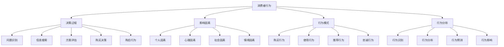

# 消费者行为学

## 🎯 学习目标
理解消费者行为规律，掌握消费者决策过程，学会分析消费者行为。

## 📊 消费者行为框架

### 行为要素

## 🔄 消费者决策过程

### 问题识别
**需求识别**：
- **功能需求**：产品的基本功能需求
- **情感需求**：产品的情感价值需求
- **社会需求**：产品的社会价值需求
- **自我实现需求**：产品的自我实现需求

**问题定义**：
- **问题类型**：问题属于什么类型
- **问题严重性**：问题的严重程度
- **问题紧迫性**：问题的紧迫程度
- **问题解决性**：问题是否可解决

**需求强度**：
- **需求强度**：需求的强烈程度
- **需求频率**：需求的频繁程度
- **需求稳定性**：需求的稳定程度
- **需求变化性**：需求的变化程度

### 信息搜索
**内部搜索**：
- **记忆搜索**：从记忆中搜索信息
- **经验搜索**：从经验中搜索信息
- **知识搜索**：从知识中搜索信息
- **直觉搜索**：从直觉中搜索信息

**外部搜索**：
- **人际搜索**：从他人处搜索信息
- **商业搜索**：从商业渠道搜索信息
- **公共搜索**：从公共渠道搜索信息
- **网络搜索**：从网络渠道搜索信息

**信息来源**：
- **个人来源**：家人、朋友、同事
- **商业来源**：广告、销售人员、包装
- **公共来源**：媒体、消费者组织
- **经验来源**：使用、检查、试用

**搜索行为**：
- **搜索广度**：搜索信息的范围
- **搜索深度**：搜索信息的深度
- **搜索时间**：搜索信息的时间
- **搜索成本**：搜索信息的成本

### 方案评估
**评估标准**：
- **功能标准**：产品功能是否满足需求
- **质量标准**：产品质量是否达到要求
- **价格标准**：产品价格是否合理
- **服务标准**：产品服务是否满意

**评估方法**：
- **补偿性评估**：综合考虑所有属性
- **非补偿性评估**：重点考虑关键属性
- **词典式评估**：按重要性排序评估
- **排除式评估**：逐步排除不满足的方案

**考虑集合**：
- **意识集合**：消费者意识到的品牌
- **考虑集合**：消费者考虑购买的品牌
- **选择集合**：消费者最终选择的品牌
- **拒绝集合**：消费者拒绝的品牌

**选择规则**：
- **最优选择**：选择最优方案
- **满意选择**：选择满意方案
- **习惯选择**：选择习惯方案
- **随机选择**：随机选择方案

### 购买决策
**购买意图**：
- **购买意愿**：购买意愿的强烈程度
- **购买计划**：购买计划的具体程度
- **购买时机**：购买时机的选择
- **购买地点**：购买地点的选择

**购买行为**：
- **购买方式**：线上购买、线下购买
- **购买数量**：购买数量的多少
- **购买频率**：购买频率的高低
- **购买金额**：购买金额的大小

**购买过程**：
- **购买前**：购买前的准备
- **购买中**：购买中的行为
- **购买后**：购买后的行为
- **购买评价**：购买后的评价

### 购后行为
**购后评价**：
- **满意度评价**：对购买结果的满意度
- **期望对比**：实际结果与期望的对比
- **价值评价**：对购买价值的评价
- **后悔评价**：对购买决策的后悔程度

**购后行为**：
- **重复购买**：是否重复购买
- **推荐行为**：是否推荐给他人
- **投诉行为**：是否投诉产品问题
- **忠诚行为**：是否保持品牌忠诚

**购后学习**：
- **经验积累**：积累购买经验
- **知识更新**：更新产品知识
- **态度调整**：调整对产品的态度
- **行为调整**：调整购买行为

## 👤 影响因素

### 个人因素
**人口特征**：
- **年龄**：不同年龄段的消费行为
- **性别**：不同性别的消费行为
- **收入**：不同收入水平的消费行为
- **教育**：不同教育程度的消费行为

**生活方式**：
- **生活态度**：对生活的态度和观念
- **生活兴趣**：生活的兴趣和爱好
- **生活活动**：生活的活动和行为
- **生活观念**：生活的观念和价值观

**个性特征**：
- **个性类型**：内向、外向、理性、感性
- **个性特征**：自信、焦虑、创新、保守
- **个性影响**：个性对消费行为的影响
- **个性测量**：个性的测量方法

### 心理因素
**动机**：
- **生理动机**：满足生理需求
- **安全动机**：满足安全需求
- **社交动机**：满足社交需求
- **尊重动机**：满足尊重需求
- **自我实现动机**：满足自我实现需求

**感知**：
- **感觉**：通过感官获得信息
- **知觉**：对感觉信息的解释
- **选择性感知**：选择性接收信息
- **感知偏差**：感知过程中的偏差

**学习**：
- **经典条件反射**：通过条件反射学习
- **操作条件反射**：通过操作结果学习
- **认知学习**：通过认知过程学习
- **社会学习**：通过社会观察学习

**态度**：
- **态度构成**：认知、情感、行为意向
- **态度形成**：态度的形成过程
- **态度改变**：态度的改变过程
- **态度测量**：态度的测量方法

### 社会因素
**文化**：
- **文化价值观**：文化的核心价值观
- **文化规范**：文化的行为规范
- **文化影响**：文化对消费行为的影响
- **文化适应**：文化适应过程

**亚文化**：
- **民族亚文化**：不同民族的亚文化
- **宗教亚文化**：不同宗教的亚文化
- **地域亚文化**：不同地域的亚文化
- **年龄亚文化**：不同年龄的亚文化

**社会阶层**：
- **阶层划分**：社会阶层的划分标准
- **阶层特征**：不同阶层的特征
- **阶层影响**：社会阶层对消费的影响
- **阶层流动**：社会阶层的流动

**参照群体**：
- **群体类型**：主要群体、次要群体
- **群体影响**：参照群体的影响
- **群体压力**：群体压力对行为的影响
- **群体认同**：群体认同对行为的影响

### 情境因素
**购买情境**：
- **购买环境**：购买时的环境
- **购买时间**：购买时的时间
- **购买地点**：购买时的地点
- **购买同伴**：购买时的同伴

**使用情境**：
- **使用环境**：使用时的环境
- **使用时间**：使用时的时间
- **使用地点**：使用时的地点
- **使用目的**：使用时的目的

**处置情境**：
- **处置方式**：产品的处置方式
- **处置原因**：产品处置的原因
- **处置影响**：处置对环境的影响
- **处置选择**：处置方式的选择

## 📈 行为模式

### 购买行为模式
**复杂购买行为**：
- **特征**：高参与度、品牌差异大
- **过程**：详细的信息搜索和评估
- **策略**：提供详细信息，建立品牌形象

**减少失调购买行为**：
- **特征**：高参与度、品牌差异小
- **过程**：快速决策，购后寻找支持信息
- **策略**：提供购后支持，减少失调

**习惯性购买行为**：
- **特征**：低参与度、品牌差异小
- **过程**：习惯性购买，很少信息搜索
- **策略**：价格促销，重复广告

**寻求多样性购买行为**：
- **特征**：低参与度、品牌差异大
- **过程**：经常更换品牌
- **策略**：产品创新，促销活动

### 使用行为模式
**使用频率**：
- **高频使用**：经常使用产品
- **中频使用**：偶尔使用产品
- **低频使用**：很少使用产品
- **不使用**：不使用产品

**使用方式**：
- **正常使用**：按正常方式使用
- **创新使用**：创新性使用产品
- **误用**：错误使用产品
- **滥用**：过度使用产品

**使用效果**：
- **满意使用**：使用效果满意
- **不满意使用**：使用效果不满意
- **中性使用**：使用效果中性
- **无效果使用**：使用无效果

### 推荐行为模式
**推荐意愿**：
- **高推荐意愿**：愿意推荐产品
- **中推荐意愿**：偶尔推荐产品
- **低推荐意愿**：很少推荐产品
- **不推荐意愿**：不推荐产品

**推荐方式**：
- **口头推荐**：口头推荐产品
- **书面推荐**：书面推荐产品
- **网络推荐**：网络推荐产品
- **行为推荐**：通过行为推荐产品

**推荐效果**：
- **有效推荐**：推荐产生效果
- **无效推荐**：推荐无效果
- **负面推荐**：推荐产生负面效果
- **中性推荐**：推荐产生中性效果

## 🔍 行为分析方法

### 定性研究方法
**深度访谈**：
- **方法**：一对一深入访谈
- **优势**：获得深度信息
- **劣势**：样本量小，主观性强
- **适用**：探索性研究

**焦点小组**：
- **方法**：小组讨论
- **优势**：互动启发，成本较低
- **劣势**：群体压力，代表性有限
- **适用**：概念测试

**观察法**：
- **方法**：直接观察行为
- **优势**：真实自然，客观性强
- **劣势**：观察者偏差，成本高
- **适用**：行为研究

**投射技术**：
- **方法**：间接了解内心想法
- **优势**：避免社会期望偏差
- **劣势**：解释困难，主观性强
- **适用**：动机研究

### 定量研究方法
**问卷调查**：
- **方法**：标准化问卷
- **优势**：样本量大，统计性强
- **劣势**：深度有限，回收率低
- **适用**：描述性研究

**实验研究**：
- **方法**：控制变量实验
- **优势**：因果关系明确
- **劣势**：外部效度低，成本高
- **适用**：因果研究

**面板研究**：
- **方法**：跟踪同一群体
- **优势**：变化趋势清晰
- **劣势**：样本流失，成本高
- **适用**：趋势研究

**大数据分析**：
- **方法**：分析大量数据
- **优势**：数据量大，实时性强
- **劣势**：隐私问题，解释困难
- **适用**：行为预测

## 💡 实践应用

### 消费者行为分析流程
1. **行为识别**：识别消费者行为
2. **行为分析**：分析行为原因
3. **行为预测**：预测行为趋势
4. **行为影响**：影响消费者行为

### 案例分析
**选择案例**：如苹果iPhone消费者行为
**分析维度**：
- 决策过程：问题识别→信息搜索→方案评估→购买决策→购后行为
- 影响因素：个人因素、心理因素、社会因素、情境因素
- 行为模式：复杂购买行为、品牌忠诚行为

## 🧠 学习要点

### 费曼学习法应用
1. **选择概念**：消费者行为学
2. **简化解释**：用简单语言解释消费者行为
3. **识别盲点**：找出理解不足的地方
4. **重新学习**：针对盲点深入学习

### 刻意练习要点
- **理论掌握**：掌握消费者行为理论
- **方法应用**：能够应用研究方法
- **分析能力**：能够分析消费者行为
- **预测能力**：能够预测消费者行为

## 🔗 关联学习

### 前置知识
- [[01-4P营销理论]] - 营销基础
- [[02-STP战略]] - 市场细分
- [[01-商业环境分析]] - 环境分析

### 后续学习
- [[04-品牌管理]] - 品牌策略
- [[01-数字营销]] - 数字营销
- [[02-内容营销]] - 内容营销

### 实践应用
- 消费者行为分析
- 市场细分研究
- 产品设计优化
- 营销策略制定

## 🎯 学习检验

### 理解检验
- [ ] 能够解释消费者决策过程
- [ ] 能够分析影响消费者行为的因素
- [ ] 能够识别消费者行为模式
- [ ] 能够应用消费者行为分析方法

### 应用检验
- [ ] 能够分析具体消费者行为
- [ ] 能够预测消费者行为趋势
- [ ] 能够制定影响消费者行为的策略
- [ ] 能够评估消费者行为研究效果

---
**下一步**：[[04-品牌管理]] - 品牌策略