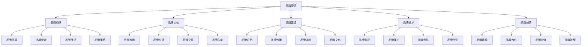

# 品牌管理

## 🎯 学习目标
掌握品牌管理的核心理念和方法，学会品牌建设、品牌维护和品牌创新，提升品牌价值。

## 📊 品牌管理框架

### 管理要素

## 🎯 品牌战略

### 品牌愿景
**愿景设定**：
- **未来状态**：品牌未来状态描述
- **价值创造**：品牌价值创造
- **市场地位**：品牌市场地位
- **社会影响**：品牌社会影响

**愿景特点**：
- **前瞻性**：具有前瞻性思维
- **激励性**：具有激励作用
- **可实现性**：具有可实现性
- **独特性**：具有独特性

**愿景制定**：
- **愿景调研**：进行愿景调研
- **愿景设计**：设计品牌愿景
- **愿景沟通**：沟通品牌愿景
- **愿景共识**：达成愿景共识

### 品牌使命
**使命定义**：
- **存在意义**：品牌存在意义
- **价值主张**：品牌价值主张
- **服务对象**：品牌服务对象
- **社会责任**：品牌社会责任

**使命特点**：
- **明确性**：使命表述明确
- **价值性**：具有价值导向
- **可持续性**：具有可持续性
- **社会性**：具有社会意义

**使命制定**：
- **使命分析**：分析品牌使命
- **使命设计**：设计品牌使命
- **使命传播**：传播品牌使命
- **使命践行**：践行品牌使命

### 品牌目标
**目标设定**：
- **市场目标**：品牌市场目标
- **客户目标**：品牌客户目标
- **财务目标**：品牌财务目标
- **社会目标**：品牌社会目标

**目标特点**：
- **具体性**：目标设定具体
- **可测量性**：目标可测量
- **可实现性**：目标可实现
- **时间性**：目标有时间限制

**目标管理**：
- **目标分解**：目标分解方法
- **目标跟踪**：目标跟踪方法
- **目标调整**：目标调整方法
- **目标评估**：目标评估方法

### 品牌策略
**策略制定**：
- **市场策略**：品牌市场策略
- **产品策略**：品牌产品策略
- **价格策略**：品牌价格策略
- **渠道策略**：品牌渠道策略

**策略特点**：
- **系统性**：策略具有系统性
- **协调性**：策略具有协调性
- **灵活性**：策略具有灵活性
- **创新性**：策略具有创新性

**策略实施**：
- **策略执行**：策略执行方法
- **策略监控**：策略监控方法
- **策略调整**：策略调整方法
- **策略评估**：策略评估方法

## 📍 品牌定位

### 目标市场
**市场细分**：
- **地理细分**：按地理位置细分
- **人口细分**：按人口特征细分
- **心理细分**：按心理特征细分
- **行为细分**：按行为特征细分

**目标选择**：
- **市场评估**：目标市场评估
- **市场选择**：目标市场选择
- **市场进入**：目标市场进入
- **市场维护**：目标市场维护

**市场分析**：
- **需求分析**：市场需求分析
- **竞争分析**：市场竞争分析
- **机会分析**：市场机会分析
- **威胁分析**：市场威胁分析

### 品牌价值
**价值定义**：
- **功能价值**：品牌功能价值
- **情感价值**：品牌情感价值
- **社会价值**：品牌社会价值
- **自我实现价值**：品牌自我实现价值

**价值创造**：
- **价值设计**：品牌价值设计
- **价值传递**：品牌价值传递
- **价值实现**：品牌价值实现
- **价值提升**：品牌价值提升

**价值管理**：
- **价值评估**：品牌价值评估
- **价值监控**：品牌价值监控
- **价值优化**：品牌价值优化
- **价值创新**：品牌价值创新

### 品牌个性
**个性特征**：
- **个性维度**：品牌个性维度
- **个性描述**：品牌个性描述
- **个性表达**：品牌个性表达
- **个性一致性**：品牌个性一致性

**个性塑造**：
- **个性设计**：品牌个性设计
- **个性传播**：品牌个性传播
- **个性体验**：品牌个性体验
- **个性维护**：品牌个性维护

**个性管理**：
- **个性监控**：品牌个性监控
- **个性调整**：品牌个性调整
- **个性创新**：品牌个性创新
- **个性优化**：品牌个性优化

### 品牌形象
**形象构成**：
- **视觉形象**：品牌视觉形象
- **听觉形象**：品牌听觉形象
- **触觉形象**：品牌触觉形象
- **综合形象**：品牌综合形象

**形象塑造**：
- **形象设计**：品牌形象设计
- **形象传播**：品牌形象传播
- **形象体验**：品牌形象体验
- **形象维护**：品牌形象维护

**形象管理**：
- **形象监控**：品牌形象监控
- **形象调整**：品牌形象调整
- **形象创新**：品牌形象创新
- **形象优化**：品牌形象优化

## 🏗️ 品牌建设

### 品牌识别
**识别系统**：
- **品牌标识**：品牌标识设计
- **品牌名称**：品牌名称设计
- **品牌口号**：品牌口号设计
- **品牌色彩**：品牌色彩设计

**识别要素**：
- **视觉要素**：品牌视觉要素
- **听觉要素**：品牌听觉要素
- **触觉要素**：品牌触觉要素
- **综合要素**：品牌综合要素

**识别管理**：
- **识别标准**：品牌识别标准
- **识别应用**：品牌识别应用
- **识别保护**：品牌识别保护
- **识别创新**：品牌识别创新

### 品牌传播
**传播策略**：
- **传播目标**：品牌传播目标
- **传播对象**：品牌传播对象
- **传播内容**：品牌传播内容
- **传播渠道**：品牌传播渠道

**传播方式**：
- **广告传播**：品牌广告传播
- **公关传播**：品牌公关传播
- **促销传播**：品牌促销传播
- **数字传播**：品牌数字传播

**传播管理**：
- **传播计划**：品牌传播计划
- **传播执行**：品牌传播执行
- **传播监控**：品牌传播监控
- **传播评估**：品牌传播评估

### 品牌体验
**体验设计**：
- **体验规划**：品牌体验规划
- **体验设计**：品牌体验设计
- **体验实施**：品牌体验实施
- **体验优化**：品牌体验优化

**体验要素**：
- **产品体验**：品牌产品体验
- **服务体验**：品牌服务体验
- **环境体验**：品牌环境体验
- **情感体验**：品牌情感体验

**体验管理**：
- **体验监控**：品牌体验监控
- **体验评估**：品牌体验评估
- **体验改进**：品牌体验改进
- **体验创新**：品牌体验创新

### 品牌文化
**文化建设**：
- **文化理念**：品牌文化理念
- **文化价值观**：品牌文化价值观
- **文化行为**：品牌文化行为
- **文化氛围**：品牌文化氛围

**文化传播**：
- **文化传播**：品牌文化传播
- **文化教育**：品牌文化教育
- **文化实践**：品牌文化实践
- **文化传承**：品牌文化传承

**文化管理**：
- **文化监控**：品牌文化监控
- **文化评估**：品牌文化评估
- **文化改进**：品牌文化改进
- **文化创新**：品牌文化创新

## 🛡️ 品牌维护

### 品牌监控
**监控体系**：
- **监控指标**：品牌监控指标
- **监控方法**：品牌监控方法
- **监控工具**：品牌监控工具
- **监控流程**：品牌监控流程

**监控内容**：
- **品牌认知**：品牌认知监控
- **品牌形象**：品牌形象监控
- **品牌忠诚**：品牌忠诚监控
- **品牌价值**：品牌价值监控

**监控管理**：
- **监控计划**：品牌监控计划
- **监控执行**：品牌监控执行
- **监控分析**：品牌监控分析
- **监控报告**：品牌监控报告

### 品牌保护
**保护策略**：
- **法律保护**：品牌法律保护
- **技术保护**：品牌技术保护
- **市场保护**：品牌市场保护
- **文化保护**：品牌文化保护

**保护措施**：
- **商标保护**：品牌商标保护
- **专利保护**：品牌专利保护
- **版权保护**：品牌版权保护
- **商业秘密保护**：品牌商业秘密保护

**保护管理**：
- **保护计划**：品牌保护计划
- **保护执行**：品牌保护执行
- **保护监控**：品牌保护监控
- **保护评估**：品牌保护评估

### 品牌危机
**危机识别**：
- **危机类型**：品牌危机类型
- **危机预警**：品牌危机预警
- **危机识别**：品牌危机识别
- **危机评估**：品牌危机评估

**危机应对**：
- **危机预案**：品牌危机预案
- **危机响应**：品牌危机响应
- **危机处理**：品牌危机处理
- **危机恢复**：品牌危机恢复

**危机管理**：
- **危机预防**：品牌危机预防
- **危机监控**：品牌危机监控
- **危机学习**：品牌危机学习
- **危机改进**：品牌危机改进

### 品牌优化
**优化策略**：
- **优化目标**：品牌优化目标
- **优化方向**：品牌优化方向
- **优化方法**：品牌优化方法
- **优化措施**：品牌优化措施

**优化实施**：
- **优化计划**：品牌优化计划
- **优化执行**：品牌优化执行
- **优化监控**：品牌优化监控
- **优化评估**：品牌优化评估

**优化管理**：
- **优化分析**：品牌优化分析
- **优化调整**：品牌优化调整
- **优化创新**：品牌优化创新
- **优化持续**：品牌优化持续

## 🚀 品牌创新

### 品牌延伸
**延伸策略**：
- **产品延伸**：品牌产品延伸
- **市场延伸**：品牌市场延伸
- **渠道延伸**：品牌渠道延伸
- **服务延伸**：品牌服务延伸

**延伸方法**：
- **水平延伸**：品牌水平延伸
- **垂直延伸**：品牌垂直延伸
- **相关延伸**：品牌相关延伸
- **不相关延伸**：品牌不相关延伸

**延伸管理**：
- **延伸规划**：品牌延伸规划
- **延伸实施**：品牌延伸实施
- **延伸监控**：品牌延伸监控
- **延伸评估**：品牌延伸评估

### 品牌合作
**合作策略**：
- **战略合作**：品牌战略合作
- **营销合作**：品牌营销合作
- **技术合作**：品牌技术合作
- **渠道合作**：品牌渠道合作

**合作方式**：
- **品牌联盟**：品牌联盟合作
- **品牌授权**：品牌授权合作
- **品牌联合**：品牌联合合作
- **品牌并购**：品牌并购合作

**合作管理**：
- **合作规划**：品牌合作规划
- **合作实施**：品牌合作实施
- **合作监控**：品牌合作监控
- **合作评估**：品牌合作评估

### 品牌升级
**升级策略**：
- **形象升级**：品牌形象升级
- **产品升级**：品牌产品升级
- **服务升级**：品牌服务升级
- **体验升级**：品牌体验升级

**升级方法**：
- **渐进升级**：品牌渐进升级
- **激进升级**：品牌激进升级
- **局部升级**：品牌局部升级
- **全面升级**：品牌全面升级

**升级管理**：
- **升级规划**：品牌升级规划
- **升级实施**：品牌升级实施
- **升级监控**：品牌升级监控
- **升级评估**：品牌升级评估

### 品牌转型
**转型策略**：
- **市场转型**：品牌市场转型
- **产品转型**：品牌产品转型
- **服务转型**：品牌服务转型
- **模式转型**：品牌模式转型

**转型方法**：
- **渐进转型**：品牌渐进转型
- **激进转型**：品牌激进转型
- **局部转型**：品牌局部转型
- **全面转型**：品牌全面转型

**转型管理**：
- **转型规划**：品牌转型规划
- **转型实施**：品牌转型实施
- **转型监控**：品牌转型监控
- **转型评估**：品牌转型评估

## 💡 实践应用

### 品牌管理流程
1. **品牌战略**：制定品牌战略
2. **品牌定位**：确定品牌定位
3. **品牌建设**：建设品牌体系
4. **品牌维护**：维护品牌价值
5. **品牌创新**：创新品牌发展

### 案例分析
**选择案例**：如苹果品牌管理
**分析维度**：
- 品牌战略：品牌愿景、使命、目标、策略
- 品牌定位：目标市场、品牌价值、个性、形象
- 品牌建设：品牌识别、传播、体验、文化
- 品牌维护：品牌监控、保护、危机、优化
- 品牌创新：品牌延伸、合作、升级、转型

## 🧠 学习要点

### 费曼学习法应用
1. **选择概念**：品牌管理
2. **简化解释**：用简单语言解释品牌管理
3. **识别盲点**：找出理解不足的地方
4. **重新学习**：针对盲点深入学习

### 刻意练习要点
- **理论掌握**：掌握品牌管理理论
- **方法应用**：能够应用品牌管理方法
- **案例分析**：能够分析品牌管理案例
- **实践能力**：能够实施品牌管理实践

## 🔗 关联学习

### 前置知识
- [[01-4P营销理论]] - 营销基础
- [[02-STP战略]] - 市场细分
- [[03-消费者行为学]] - 消费者分析

### 后续学习
- [[01-数字营销]] - 数字营销
- [[02-内容营销]] - 内容营销
- [[03-搜索引擎营销]] - 搜索引擎营销

### 实践应用
- 品牌战略制定
- 品牌定位设计
- 品牌建设实施
- 品牌维护管理

## 🎯 学习检验

### 理解检验
- [ ] 能够解释品牌管理概念
- [ ] 能够掌握品牌管理框架
- [ ] 能够应用品牌管理方法
- [ ] 能够分析品牌管理案例

### 应用检验
- [ ] 能够制定品牌战略
- [ ] 能够设计品牌定位
- [ ] 能够建设品牌体系
- [ ] 能够维护品牌价值

---
**下一步**：[[01-数字营销]] - 数字营销