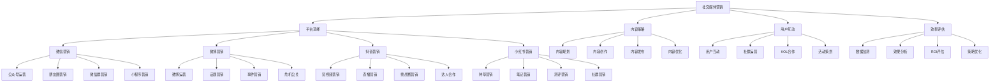

# 社交媒体营销

## 🎯 学习目标
掌握社交媒体营销理论和方法，学会运用社交媒体平台进行品牌推广和客户关系管理。

## 📊 社交媒体营销框架

### 社交媒体营销模型

## 📱 平台选择

### 微信营销
**公众号运营**：
- **内容策略**：公众号内容策略
- **排版设计**：内容排版设计
- **互动功能**：互动功能设计
- **用户增长**：用户增长策略

**朋友圈营销**：
- **内容规划**：朋友圈内容规划
- **发布策略**：发布策略制定
- **互动技巧**：互动技巧应用
- **转化策略**：转化策略设计

**微信群营销**：
- **群建设**：微信群建设
- **群管理**：微信群管理
- **群运营**：微信群运营
- **群转化**：群转化策略

**小程序营销**：
- **小程序开发**：小程序开发
- **功能设计**：功能设计
- **用户体验**：用户体验优化
- **营销推广**：营销推广策略

### 微博营销
**微博运营**：
- **账号建设**：微博账号建设
- **内容规划**：内容规划策略
- **发布策略**：发布策略制定
- **互动管理**：互动管理

**话题营销**：
- **话题策划**：话题策划
- **话题推广**：话题推广
- **话题参与**：话题参与策略
- **话题效果**：话题效果评估

**事件营销**：
- **事件策划**：事件营销策划
- **事件执行**：事件执行
- **事件传播**：事件传播
- **事件效果**：事件效果评估

**危机公关**：
- **危机识别**：危机识别
- **危机应对**：危机应对策略
- **危机沟通**：危机沟通
- **危机恢复**：危机恢复

### 抖音营销
**短视频营销**：
- **视频策划**：短视频策划
- **视频制作**：视频制作
- **视频发布**：视频发布策略
- **视频推广**：视频推广

**直播营销**：
- **直播策划**：直播营销策划
- **直播执行**：直播执行
- **直播互动**：直播互动
- **直播转化**：直播转化

**挑战赛营销**：
- **挑战设计**：挑战赛设计
- **挑战推广**：挑战赛推广
- **用户参与**：用户参与引导
- **效果评估**：挑战赛效果评估

**达人合作**：
- **达人选择**：达人选择策略
- **合作模式**：合作模式设计
- **内容创作**：内容创作
- **效果评估**：合作效果评估

### 小红书营销
**种草营销**：
- **种草策略**：种草营销策略
- **内容创作**：种草内容创作
- **用户引导**：用户引导策略
- **转化优化**：转化优化

**笔记营销**：
- **笔记策划**：笔记营销策划
- **笔记创作**：笔记创作
- **笔记推广**：笔记推广
- **笔记优化**：笔记优化

**测评营销**：
- **测评策划**：测评营销策划
- **测评执行**：测评执行
- **测评推广**：测评推广
- **测评效果**：测评效果评估

**社群营销**：
- **社群建设**：社群建设
- **社群运营**：社群运营
- **社群互动**：社群互动
- **社群转化**：社群转化

## 📝 内容策略

### 内容规划
**内容策略**：
- **策略制定**：内容策略制定
- **目标设定**：内容目标设定
- **受众分析**：受众分析
- **平台适配**：平台适配策略

**内容类型**：
- **图文内容**：图文内容创作
- **视频内容**：视频内容创作
- **音频内容**：音频内容创作
- **互动内容**：互动内容设计

**内容主题**：
- **主题规划**：内容主题规划
- **主题选择**：主题选择策略
- **主题创新**：主题创新
- **主题优化**：主题优化

**内容日历**：
- **日历制定**：内容日历制定
- **发布时间**：发布时间规划
- **内容分配**：内容分配策略
- **调整优化**：日历调整优化

### 内容创作
**创作流程**：
- **创作流程**：内容创作流程
- **素材收集**：素材收集
- **内容制作**：内容制作
- **质量审核**：质量审核

**创作技巧**：
- **写作技巧**：写作技巧
- **设计技巧**：设计技巧
- **拍摄技巧**：拍摄技巧
- **剪辑技巧**：剪辑技巧

**创作工具**：
- **写作工具**：写作工具
- **设计工具**：设计工具
- **拍摄工具**：拍摄工具
- **剪辑工具**：剪辑工具

**创作团队**：
- **团队建设**：创作团队建设
- **分工协作**：分工协作
- **质量管控**：质量管控
- **效率提升**：效率提升

### 内容发布
**发布策略**：
- **发布策略**：内容发布策略
- **发布时间**：发布时间选择
- **发布频率**：发布频率控制
- **发布渠道**：发布渠道选择

**发布优化**：
- **标题优化**：标题优化
- **标签优化**：标签优化
- **描述优化**：描述优化
- **封面优化**：封面优化

**发布管理**：
- **发布管理**：发布管理
- **内容审核**：内容审核
- **发布监控**：发布监控
- **问题处理**：问题处理

### 内容优化
**优化策略**：
- **优化策略**：内容优化策略
- **A/B测试**：A/B测试
- **数据分析**：数据分析
- **持续改进**：持续改进

**优化方法**：
- **内容优化**：内容优化方法
- **形式优化**：形式优化方法
- **时机优化**：时机优化方法
- **渠道优化**：渠道优化方法

**优化工具**：
- **分析工具**：分析工具
- **优化工具**：优化工具
- **监控工具**：监控工具
- **报告工具**：报告工具

## 👥 用户互动

### 用户互动
**互动策略**：
- **互动策略**：用户互动策略
- **互动方式**：互动方式选择
- **互动频率**：互动频率控制
- **互动质量**：互动质量控制

**互动技巧**：
- **回复技巧**：回复技巧
- **引导技巧**：引导技巧
- **转化技巧**：转化技巧
- **维护技巧**：维护技巧

**互动工具**：
- **互动工具**：互动工具
- **自动化工具**：自动化工具
- **分析工具**：分析工具
- **管理工具**：管理工具

**互动效果**：
- **效果评估**：互动效果评估
- **效果分析**：效果分析
- **效果优化**：效果优化
- **效果改进**：效果改进

### 社群运营
**社群建设**：
- **社群定位**：社群定位
- **社群规则**：社群规则制定
- **社群文化**：社群文化建设
- **社群价值**：社群价值创造

**社群运营**：
- **运营策略**：社群运营策略
- **活动策划**：活动策划
- **内容运营**：内容运营
- **用户运营**：用户运营

**社群管理**：
- **社群管理**：社群管理
- **成员管理**：成员管理
- **内容管理**：内容管理
- **活动管理**：活动管理

**社群转化**：
- **转化策略**：社群转化策略
- **转化路径**：转化路径设计
- **转化工具**：转化工具
- **转化效果**：转化效果评估

### KOL合作
**KOL选择**：
- **KOL识别**：KOL识别
- **KOL评估**：KOL评估
- **KOL筛选**：KOL筛选
- **KOL匹配**：KOL匹配

**合作模式**：
- **合作模式**：合作模式设计
- **合作内容**：合作内容设计
- **合作流程**：合作流程设计
- **合作管理**：合作管理

**合作执行**：
- **合作执行**：合作执行
- **内容创作**：内容创作
- **发布推广**：发布推广
- **效果监控**：效果监控

**合作优化**：
- **合作优化**：合作优化
- **效果评估**：效果评估
- **关系维护**：关系维护
- **长期合作**：长期合作

### 活动策划
**活动策划**：
- **活动策划**：活动策划
- **活动设计**：活动设计
- **活动执行**：活动执行
- **活动评估**：活动评估

**活动类型**：
- **线上活动**：线上活动策划
- **线下活动**：线下活动策划
- **混合活动**：混合活动策划
- **主题活动**：主题活动策划

**活动推广**：
- **推广策略**：活动推广策略
- **推广渠道**：推广渠道选择
- **推广内容**：推广内容创作
- **推广效果**：推广效果评估

**活动优化**：
- **活动优化**：活动优化
- **效果分析**：效果分析
- **经验总结**：经验总结
- **改进建议**：改进建议

## 📊 效果评估

### 数据监测
**监测指标**：
- **曝光指标**：曝光量、覆盖率
- **互动指标**：点赞、评论、分享
- **转化指标**：点击率、转化率
- **品牌指标**：品牌认知、品牌偏好

**监测工具**：
- **平台工具**：平台自带工具
- **第三方工具**：第三方监测工具
- **自建工具**：自建监测工具
- **分析工具**：数据分析工具

**监测方法**：
- **实时监测**：实时监测
- **定期监测**：定期监测
- **专项监测**：专项监测
- **对比监测**：对比监测

### 效果分析
**分析方法**：
- **数据分析**：数据分析方法
- **对比分析**：对比分析方法
- **趋势分析**：趋势分析方法
- **归因分析**：归因分析方法

**分析维度**：
- **时间维度**：时间维度分析
- **平台维度**：平台维度分析
- **内容维度**：内容维度分析
- **用户维度**：用户维度分析

**分析工具**：
- **分析工具**：分析工具
- **可视化工具**：可视化工具
- **报告工具**：报告工具
- **决策工具**：决策工具

### ROI评估
**ROI计算**：
- **ROI计算**：ROI计算方法
- **成本核算**：成本核算
- **收益计算**：收益计算
- **ROI分析**：ROI分析

**ROI优化**：
- **ROI优化**：ROI优化策略
- **成本控制**：成本控制
- **收益提升**：收益提升
- **效率改进**：效率改进

**ROI报告**：
- **ROI报告**：ROI报告
- **报告内容**：报告内容
- **报告格式**：报告格式
- **报告应用**：报告应用

### 策略优化
**优化策略**：
- **优化策略**：策略优化
- **内容优化**：内容优化
- **渠道优化**：渠道优化
- **时机优化**：时机优化

**优化方法**：
- **优化方法**：优化方法
- **A/B测试**：A/B测试
- **数据分析**：数据分析
- **持续改进**：持续改进

**优化工具**：
- **优化工具**：优化工具
- **测试工具**：测试工具
- **分析工具**：分析工具
- **改进工具**：改进工具

## 💡 社交媒体营销案例

### 成功案例
**完美日记**：
- **平台策略**：多平台布局
- **内容策略**：UGC内容营销
- **KOL合作**：美妆博主合作
- **效果**：快速品牌崛起

**三只松鼠**：
- **平台策略**：微博+抖音
- **内容策略**：萌宠IP营销
- **互动策略**：用户互动营销
- **效果**：品牌知名度提升

**小米**：
- **平台策略**：全平台营销
- **内容策略**：科技内容营销
- **活动策略**：新品发布营销
- **效果**：粉丝经济成功

### 失败案例
**失败原因**：
- **策略不当**：营销策略不当
- **内容质量差**：内容质量差
- **互动不足**：用户互动不足
- **效果评估不准确**：效果评估不准确

**失败教训**：
- **策略制定**：制定合适策略
- **内容质量**：重视内容质量
- **用户互动**：加强用户互动
- **效果评估**：准确评估效果

## 🧠 学习要点

### 费曼学习法应用
1. **选择概念**：社交媒体营销
2. **简化解释**：用简单语言解释社交媒体营销
3. **识别盲点**：找出理解不足的地方
4. **重新学习**：针对盲点深入学习

### 刻意练习要点
- **理论掌握**：掌握社交媒体营销理论
- **方法应用**：掌握社交媒体营销方法
- **案例分析**：分析成功失败案例
- **实践应用**：实践应用社交媒体营销

## 🔗 关联学习

### 前置知识
- [[04-数字化营销]] - 数字化营销
- [[01-4P营销理论]] - 4P营销理论
- [[02-STP战略]] - STP战略

### 后续学习
- [[02-内容营销]] - 内容营销
- [[03-搜索引擎营销]] - 搜索引擎营销
- [[04-营销自动化]] - 营销自动化

### 实践应用
- 社交媒体营销策略制定
- 内容创作和发布
- 用户互动和社群运营
- 效果评估和优化

## 🎯 学习检验

### 理解检验
- [ ] 能够理解社交媒体营销理论
- [ ] 能够掌握平台选择策略
- [ ] 能够制定内容策略
- [ ] 能够进行用户互动

### 应用检验
- [ ] 能够制定社交媒体营销策略
- [ ] 能够创作优质内容
- [ ] 能够进行有效互动
- [ ] 能够评估营销效果

---
**下一步**：[[02-内容营销]] - 内容营销