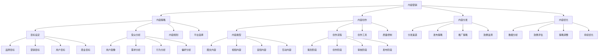

# 内容营销

## 🎯 学习目标
掌握内容营销理论和方法，学会创作优质内容，建立品牌影响力，实现营销目标。

## 📊 内容营销框架

### 内容营销模型

## 🎯 内容策略

### 目标设定
**品牌目标**：
- **品牌认知**：提升品牌认知度
- **品牌形象**：塑造品牌形象
- **品牌价值**：传递品牌价值
- **品牌忠诚**：建立品牌忠诚度

**营销目标**：
- **获客目标**：客户获取目标
- **转化目标**：转化率目标
- **留存目标**：客户留存目标
- **增长目标**：业务增长目标

**用户目标**：
- **用户教育**：用户教育目标
- **用户参与**：用户参与目标
- **用户满意**：用户满意度目标
- **用户推荐**：用户推荐目标

**商业目标**：
- **销售目标**：销售目标
- **收入目标**：收入目标
- **利润目标**：利润目标
- **市场份额**：市场份额目标

### 受众分析
**用户画像**：
- **人口特征**：年龄、性别、地域
- **行为特征**：消费行为、使用习惯
- **心理特征**：价值观、兴趣爱好
- **需求特征**：需求类型、需求强度

**需求分析**：
- **显性需求**：明确表达的需求
- **隐性需求**：潜在未表达的需求
- **功能需求**：产品功能需求
- **情感需求**：情感体验需求

**行为分析**：
- **浏览行为**：内容浏览行为
- **互动行为**：内容互动行为
- **分享行为**：内容分享行为
- **购买行为**：购买决策行为

**偏好分析**：
- **内容偏好**：内容类型偏好
- **平台偏好**：平台使用偏好
- **时间偏好**：内容消费时间偏好
- **形式偏好**：内容形式偏好

### 内容规划
**内容主题**：
- **主题规划**：内容主题规划
- **主题分类**：主题分类体系
- **主题创新**：主题创新策略
- **主题优化**：主题优化方法

**内容类型**：
- **教育内容**：知识教育内容
- **娱乐内容**：娱乐性内容
- **资讯内容**：资讯信息内容
- **互动内容**：互动参与内容

**内容形式**：
- **图文形式**：图文内容形式
- **视频形式**：视频内容形式
- **音频形式**：音频内容形式
- **互动形式**：互动内容形式

**内容频率**：
- **发布频率**：内容发布频率
- **更新频率**：内容更新频率
- **互动频率**：互动频率
- **优化频率**：优化频率

### 平台选择
**平台分析**：
- **平台特征**：平台特征分析
- **用户特征**：平台用户特征
- **内容特征**：平台内容特征
- **算法特征**：平台算法特征

**平台选择**：
- **选择标准**：平台选择标准
- **选择策略**：平台选择策略
- **选择组合**：平台组合策略
- **选择优化**：平台选择优化

**平台适配**：
- **内容适配**：内容平台适配
- **形式适配**：形式平台适配
- **风格适配**：风格平台适配
- **策略适配**：策略平台适配

## ✍️ 内容创作

### 内容类型
**图文内容**：
- **文章内容**：深度文章内容
- **图文内容**：图文结合内容
- **信息图**：信息图表内容
- **海报内容**：营销海报内容

**视频内容**：
- **短视频**：短视频内容
- **长视频**：长视频内容
- **直播内容**：直播内容
- **动画内容**：动画内容

**音频内容**：
- **播客内容**：播客内容
- **音频课程**：音频课程内容
- **音乐内容**：音乐内容
- **语音内容**：语音内容

**互动内容**：
- **问答内容**：问答互动内容
- **投票内容**：投票互动内容
- **游戏内容**：游戏互动内容
- **挑战内容**：挑战互动内容

### 创作流程
**策划阶段**：
- **需求分析**：内容需求分析
- **主题确定**：内容主题确定
- **大纲制定**：内容大纲制定
- **资源准备**：创作资源准备

**创作阶段**：
- **内容创作**：内容创作
- **素材收集**：素材收集
- **内容制作**：内容制作
- **初稿完成**：初稿完成

**审核阶段**：
- **内容审核**：内容质量审核
- **合规审核**：合规性审核
- **品牌审核**：品牌一致性审核
- **效果预判**：效果预判

**发布阶段**：
- **发布准备**：发布准备工作
- **发布执行**：发布执行
- **发布监控**：发布监控
- **发布优化**：发布优化

### 创作工具
**写作工具**：
- **写作软件**：专业写作软件
- **协作工具**：协作写作工具
- **模板工具**：内容模板工具
- **校对工具**：内容校对工具

**设计工具**：
- **设计软件**：专业设计软件
- **在线工具**：在线设计工具
- **模板库**：设计模板库
- **素材库**：设计素材库

**视频工具**：
- **拍摄设备**：视频拍摄设备
- **剪辑软件**：视频剪辑软件
- **特效工具**：视频特效工具
- **发布工具**：视频发布工具

**音频工具**：
- **录音设备**：音频录制设备
- **编辑软件**：音频编辑软件
- **处理工具**：音频处理工具
- **发布平台**：音频发布平台

### 质量控制
**质量标准**：
- **内容质量**：内容质量标准
- **创意质量**：创意质量标准
- **技术质量**：技术质量标准
- **品牌质量**：品牌质量标准

**质量控制**：
- **质量控制**：质量控制流程
- **质量检查**：质量检查机制
- **质量改进**：质量改进机制
- **质量评估**：质量评估机制

**质量工具**：
- **检查工具**：质量检查工具
- **评估工具**：质量评估工具
- **改进工具**：质量改进工具
- **监控工具**：质量监控工具

## 📤 内容分发

### 分发渠道
**自有渠道**：
- **官网渠道**：官方网站渠道
- **APP渠道**：移动应用渠道
- **邮件渠道**：邮件营销渠道
- **短信渠道**：短信营销渠道

**社交媒体**：
- **微信渠道**：微信平台渠道
- **微博渠道**：微博平台渠道
- **抖音渠道**：抖音平台渠道
- **小红书渠道**：小红书平台渠道

**第三方平台**：
- **新闻平台**：新闻资讯平台
- **视频平台**：视频分享平台
- **音频平台**：音频分享平台
- **知识平台**：知识分享平台

**合作渠道**：
- **KOL合作**：意见领袖合作
- **媒体合作**：媒体合作
- **企业合作**：企业合作
- **机构合作**：机构合作

### 发布策略
**发布时间**：
- **最佳时间**：最佳发布时间
- **用户习惯**：用户使用习惯
- **平台特征**：平台特征分析
- **内容特征**：内容特征分析

**发布频率**：
- **发布频率**：内容发布频率
- **更新频率**：内容更新频率
- **互动频率**：互动频率
- **优化频率**：优化频率

**发布方式**：
- **同步发布**：多平台同步发布
- **错峰发布**：错峰发布策略
- **定制发布**：平台定制发布
- **组合发布**：组合发布策略

**发布优化**：
- **标题优化**：标题优化
- **标签优化**：标签优化
- **描述优化**：描述优化
- **封面优化**：封面优化

### 推广策略
**推广方式**：
- **自然推广**：自然流量推广
- **付费推广**：付费广告推广
- **合作推广**：合作推广
- **口碑推广**：口碑营销推广

**推广策略**：
- **推广策略**：推广策略制定
- **推广渠道**：推广渠道选择
- **推广内容**：推广内容设计
- **推广时机**：推广时机选择

**推广工具**：
- **推广工具**：推广工具
- **广告工具**：广告投放工具
- **分析工具**：推广分析工具
- **优化工具**：推广优化工具

**推广效果**：
- **效果评估**：推广效果评估
- **效果分析**：效果分析
- **效果优化**：效果优化
- **效果改进**：效果改进

### 效果监测
**监测指标**：
- **曝光指标**：曝光量、覆盖率
- **互动指标**：点赞、评论、分享
- **转化指标**：点击率、转化率
- **品牌指标**：品牌认知、品牌偏好

**监测工具**：
- **监测工具**：效果监测工具
- **分析工具**：数据分析工具
- **报告工具**：报告生成工具
- **预警工具**：预警工具

**监测方法**：
- **实时监测**：实时效果监测
- **定期监测**：定期效果监测
- **专项监测**：专项效果监测
- **对比监测**：对比效果监测

## 📈 内容优化

### 数据分析
**数据收集**：
- **数据收集**：数据收集方法
- **数据来源**：数据来源分析
- **数据质量**：数据质量控制
- **数据整理**：数据整理方法

**数据分析**：
- **数据分析**：数据分析方法
- **趋势分析**：趋势分析方法
- **对比分析**：对比分析方法
- **归因分析**：归因分析方法

**数据应用**：
- **数据应用**：数据应用方法
- **决策支持**：决策支持应用
- **策略调整**：策略调整应用
- **效果优化**：效果优化应用

### 效果评估
**评估指标**：
- **评估指标**：效果评估指标
- **量化指标**：量化评估指标
- **质性指标**：质性评估指标
- **综合指标**：综合评估指标

**评估方法**：
- **评估方法**：效果评估方法
- **对比评估**：对比评估方法
- **基准评估**：基准评估方法
- **动态评估**：动态评估方法

**评估工具**：
- **评估工具**：效果评估工具
- **分析工具**：分析工具
- **报告工具**：报告工具
- **决策工具**：决策工具

### 策略调整
**调整策略**：
- **调整策略**：策略调整策略
- **内容调整**：内容调整策略
- **渠道调整**：渠道调整策略
- **时机调整**：时机调整策略

**调整方法**：
- **调整方法**：策略调整方法
- **A/B测试**：A/B测试方法
- **数据分析**：数据分析方法
- **持续改进**：持续改进方法

**调整工具**：
- **调整工具**：策略调整工具
- **测试工具**：测试工具
- **分析工具**：分析工具
- **改进工具**：改进工具

### 持续优化
**优化策略**：
- **优化策略**：持续优化策略
- **内容优化**：内容持续优化
- **渠道优化**：渠道持续优化
- **效果优化**：效果持续优化

**优化方法**：
- **优化方法**：持续优化方法
- **迭代优化**：迭代优化方法
- **创新优化**：创新优化方法
- **学习优化**：学习优化方法

**优化工具**：
- **优化工具**：持续优化工具
- **监控工具**：监控工具
- **分析工具**：分析工具
- **改进工具**：改进工具

## 💡 内容营销案例

### 成功案例
**红牛**：
- **内容策略**：极限运动内容营销
- **内容形式**：视频内容为主
- **分发渠道**：多平台分发
- **效果**：品牌形象塑造成功

**杜蕾斯**：
- **内容策略**：创意互动内容营销
- **内容形式**：图文创意内容
- **分发渠道**：社交媒体为主
- **效果**：品牌话题度提升

**可口可乐**：
- **内容策略**：情感共鸣内容营销
- **内容形式**：视频+图文内容
- **分发渠道**：全媒体分发
- **效果**：品牌情感连接成功

### 失败案例
**失败原因**：
- **内容质量差**：内容质量不高
- **策略不当**：内容策略不当
- **渠道选择错误**：渠道选择错误
- **效果评估不准确**：效果评估不准确

**失败教训**：
- **内容质量**：重视内容质量
- **策略制定**：制定合适策略
- **渠道选择**：选择合适的渠道
- **效果评估**：准确评估效果

## 🧠 学习要点

### 费曼学习法应用
1. **选择概念**：内容营销
2. **简化解释**：用简单语言解释内容营销
3. **识别盲点**：找出理解不足的地方
4. **重新学习**：针对盲点深入学习

### 刻意练习要点
- **理论掌握**：掌握内容营销理论
- **方法应用**：掌握内容营销方法
- **案例分析**：分析成功失败案例
- **实践应用**：实践应用内容营销

## 🔗 关联学习

### 前置知识
- [[01-社交媒体营销]] - 社交媒体营销
- [[01-4P营销理论]] - 4P营销理论
- [[02-STP战略]] - STP战略

### 后续学习
- [[03-搜索引擎营销]] - 搜索引擎营销
- [[04-营销自动化]] - 营销自动化
- [[01-品牌管理]] - 品牌管理

### 实践应用
- 内容营销策略制定
- 内容创作和制作
- 内容分发和推广
- 内容效果评估和优化

## 🎯 学习检验

### 理解检验
- [ ] 能够理解内容营销理论
- [ ] 能够制定内容策略
- [ ] 能够创作优质内容
- [ ] 能够进行内容分发

### 应用检验
- [ ] 能够制定内容营销策略
- [ ] 能够创作高质量内容
- [ ] 能够有效分发内容
- [ ] 能够评估和优化内容效果

---
**下一步**：[[03-搜索引擎营销]] - 搜索引擎营销