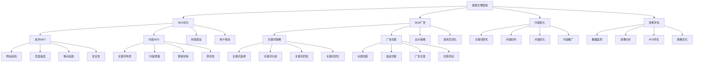

# 搜索引擎营销

## 🎯 学习目标
掌握搜索引擎营销理论和方法，学会运用SEO和SEM技术提升网站排名和流量，实现精准营销目标。

## 📊 搜索引擎营销框架

### 搜索引擎营销模型

## 🔍 SEO优化

### 技术SEO
**网站结构**：
- **URL结构**：URL结构优化
- **导航结构**：网站导航优化
- **内链结构**：内部链接优化
- **面包屑**：面包屑导航

**页面速度**：
- **加载速度**：页面加载速度优化
- **图片优化**：图片压缩和优化
- **代码优化**：代码精简和优化
- **CDN使用**：CDN加速服务

**移动适配**：
- **响应式设计**：响应式网站设计
- **移动友好**：移动端用户体验
- **触摸优化**：触摸操作优化
- **移动测试**：移动端测试

**安全性**：
- **HTTPS**：SSL证书配置
- **安全防护**：网站安全防护
- **数据保护**：用户数据保护
- **漏洞修复**：安全漏洞修复

### 内容SEO
**关键词布局**：
- **关键词密度**：关键词密度控制
- **关键词分布**：关键词分布优化
- **长尾关键词**：长尾关键词优化
- **语义关键词**：语义相关关键词

**内容质量**：
- **内容原创**：原创内容创作
- **内容深度**：内容深度和广度
- **内容价值**：内容价值提供
- **内容更新**：内容定期更新

**更新频率**：
- **更新频率**：内容更新频率
- **更新策略**：更新策略制定
- **更新质量**：更新内容质量
- **更新监控**：更新效果监控

**原创性**：
- **原创内容**：原创内容创作
- **内容创新**：内容创新
- **价值独特**：独特价值提供
- **差异化**：内容差异化

### 外链建设
**外链策略**：
- **外链策略**：外链建设策略
- **外链质量**：外链质量评估
- **外链数量**：外链数量控制
- **外链分布**：外链分布优化

**外链类型**：
- **友情链接**：友情链接交换
- **目录提交**：网站目录提交
- **新闻外链**：新闻媒体外链
- **社交外链**：社交媒体外链

**外链获取**：
- **外链获取**：外链获取方法
- **内容营销**：内容营销获取外链
- **关系建设**：关系建设获取外链
- **工具使用**：外链工具使用

**外链监控**：
- **外链监控**：外链监控
- **外链分析**：外链分析
- **外链优化**：外链优化
- **外链维护**：外链维护

### 用户体验
**用户体验**：
- **用户体验**：用户体验优化
- **页面设计**：页面设计优化
- **交互设计**：交互设计优化
- **视觉设计**：视觉设计优化

**用户行为**：
- **用户行为**：用户行为分析
- **停留时间**：页面停留时间
- **跳出率**：页面跳出率
- **转化率**：页面转化率

**用户反馈**：
- **用户反馈**：用户反馈收集
- **满意度**：用户满意度
- **问题解决**：问题解决
- **体验改进**：体验改进

## 💰 SEM广告

### 关键词策略
**关键词选择**：
- **关键词研究**：关键词研究方法
- **搜索量分析**：搜索量分析
- **竞争度分析**：竞争度分析
- **商业价值**：商业价值评估

**关键词分组**：
- **分组策略**：关键词分组策略
- **主题分组**：主题相关分组
- **意图分组**：搜索意图分组
- **匹配分组**：匹配类型分组

**关键词匹配**：
- **精确匹配**：精确匹配类型
- **短语匹配**：短语匹配类型
- **广泛匹配**：广泛匹配类型
- **否定匹配**：否定匹配设置

**关键词优化**：
- **关键词优化**：关键词优化
- **出价优化**：出价优化
- **质量度优化**：质量度优化
- **效果优化**：效果优化

### 广告创意
**标题创意**：
- **标题创意**：广告标题创意
- **标题优化**：标题优化
- **标题测试**：标题A/B测试
- **标题效果**：标题效果评估

**描述创意**：
- **描述创意**：广告描述创意
- **描述优化**：描述优化
- **描述测试**：描述A/B测试
- **描述效果**：描述效果评估

**广告文案**：
- **文案策略**：广告文案策略
- **文案创作**：文案创作
- **文案优化**：文案优化
- **文案测试**：文案测试

**创意测试**：
- **创意测试**：创意A/B测试
- **测试方法**：测试方法
- **测试分析**：测试分析
- **测试优化**：测试优化

### 出价策略
**出价策略**：
- **出价策略**：出价策略制定
- **手动出价**：手动出价策略
- **自动出价**：自动出价策略
- **智能出价**：智能出价策略

**出价优化**：
- **出价优化**：出价优化
- **成本控制**：成本控制
- **效果平衡**：效果平衡
- **ROI优化**：ROI优化

**出价管理**：
- **出价管理**：出价管理
- **出价调整**：出价调整
- **出价监控**：出价监控
- **出价分析**：出价分析

### 落地页优化
**落地页设计**：
- **页面设计**：落地页设计
- **用户体验**：用户体验优化
- **转化路径**：转化路径设计
- **页面速度**：页面速度优化

**落地页内容**：
- **内容策略**：落地页内容策略
- **内容优化**：内容优化
- **内容测试**：内容A/B测试
- **内容效果**：内容效果评估

**落地页功能**：
- **功能设计**：功能设计
- **表单优化**：表单优化
- **按钮优化**：按钮优化
- **导航优化**：导航优化

## 📝 内容优化

### 关键词研究
**关键词研究**：
- **关键词研究**：关键词研究方法
- **工具使用**：关键词研究工具
- **数据分析**：关键词数据分析
- **趋势分析**：关键词趋势分析

**关键词分析**：
- **搜索量**：搜索量分析
- **竞争度**：竞争度分析
- **商业价值**：商业价值分析
- **用户意图**：用户意图分析

**关键词选择**：
- **关键词选择**：关键词选择策略
- **主关键词**：主关键词选择
- **长尾关键词**：长尾关键词选择
- **语义关键词**：语义关键词选择

### 内容创作
**内容策略**：
- **内容策略**：内容策略制定
- **内容规划**：内容规划
- **内容主题**：内容主题选择
- **内容形式**：内容形式选择

**内容创作**：
- **内容创作**：内容创作
- **关键词布局**：关键词布局
- **内容结构**：内容结构设计
- **内容质量**：内容质量控制

**内容优化**：
- **内容优化**：内容优化
- **SEO优化**：SEO内容优化
- **用户体验**：用户体验优化
- **转化优化**：转化优化

### 内容推广
**内容推广**：
- **内容推广**：内容推广策略
- **推广渠道**：推广渠道选择
- **推广方式**：推广方式选择
- **推广时机**：推广时机选择

**推广策略**：
- **推广策略**：推广策略制定
- **社交媒体**：社交媒体推广
- **邮件营销**：邮件营销推广
- **合作推广**：合作推广

## 📊 效果评估

### 数据监测
**监测指标**：
- **流量指标**：网站流量指标
- **排名指标**：关键词排名指标
- **转化指标**：转化率指标
- **成本指标**：成本效益指标

**监测工具**：
- **监测工具**：数据监测工具
- **分析工具**：数据分析工具
- **报告工具**：报告生成工具
- **预警工具**：预警工具

**监测方法**：
- **实时监测**：实时数据监测
- **定期监测**：定期数据监测
- **专项监测**：专项数据监测
- **对比监测**：对比数据监测

### 效果分析
**分析方法**：
- **数据分析**：数据分析方法
- **趋势分析**：趋势分析方法
- **对比分析**：对比分析方法
- **归因分析**：归因分析方法

**分析维度**：
- **时间维度**：时间维度分析
- **渠道维度**：渠道维度分析
- **关键词维度**：关键词维度分析
- **用户维度**：用户维度分析

### ROI评估
**ROI计算**：
- **ROI计算**：ROI计算方法
- **成本核算**：成本核算
- **收益计算**：收益计算
- **ROI分析**：ROI分析

**ROI优化**：
- **ROI优化**：ROI优化策略
- **成本控制**：成本控制
- **收益提升**：收益提升
- **效率改进**：效率改进

### 策略优化
**优化策略**：
- **优化策略**：策略优化
- **SEO优化**：SEO策略优化
- **SEM优化**：SEM策略优化
- **内容优化**：内容策略优化

**优化方法**：
- **优化方法**：优化方法
- **A/B测试**：A/B测试
- **数据分析**：数据分析
- **持续改进**：持续改进

## 💡 搜索引擎营销案例

### 成功案例
**小米**：
- **SEO策略**：技术SEO优化
- **SEM策略**：精准关键词投放
- **内容策略**：产品内容营销
- **效果**：品牌知名度提升

**华为**：
- **SEO策略**：内容SEO优化
- **SEM策略**：品牌词保护
- **内容策略**：技术内容营销
- **效果**：技术品牌形象建立

**字节跳动**：
- **SEO策略**：内容生态建设
- **SEM策略**：产品推广投放
- **内容策略**：UGC内容营销
- **效果**：用户增长成功

### 失败案例
**失败原因**：
- **关键词选择不当**：关键词选择不当
- **内容质量差**：内容质量差
- **技术问题**：技术SEO问题
- **策略错误**：营销策略错误

**失败教训**：
- **关键词研究**：重视关键词研究
- **内容质量**：重视内容质量
- **技术优化**：重视技术优化
- **策略制定**：制定正确策略

## 🧠 学习要点

### 费曼学习法应用
1. **选择概念**：搜索引擎营销
2. **简化解释**：用简单语言解释搜索引擎营销
3. **识别盲点**：找出理解不足的地方
4. **重新学习**：针对盲点深入学习

### 刻意练习要点
- **理论掌握**：掌握搜索引擎营销理论
- **方法应用**：掌握SEO和SEM方法
- **案例分析**：分析成功失败案例
- **实践应用**：实践应用搜索引擎营销

## 🔗 关联学习

### 前置知识
- [[02-内容营销]] - 内容营销
- [[01-社交媒体营销]] - 社交媒体营销
- [[01-4P营销理论]] - 4P营销理论

### 后续学习
- [[04-营销自动化]] - 营销自动化
- [[01-品牌管理]] - 品牌管理
- [[01-客户生命周期价值]] - 客户生命周期价值

### 实践应用
- 搜索引擎营销策略制定
- SEO优化实施
- SEM广告投放
- 营销效果评估和优化

## 🎯 学习检验

### 理解检验
- [ ] 能够理解搜索引擎营销理论
- [ ] 能够掌握SEO优化方法
- [ ] 能够掌握SEM广告策略
- [ ] 能够进行效果评估

### 应用检验
- [ ] 能够制定搜索引擎营销策略
- [ ] 能够实施SEO优化
- [ ] 能够投放SEM广告
- [ ] 能够评估和优化营销效果

---
**下一步**：[[04-营销自动化]] - 营销自动化