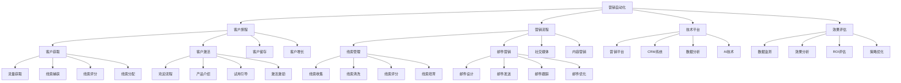

# 营销自动化

## 🎯 学习目标
掌握营销自动化理论和技术，学会运用营销自动化工具提升营销效率，实现精准营销和客户关系管理。

## 📊 营销自动化框架

### 营销自动化模型

## 🛤️ 客户旅程

### 客户获取
**流量获取**：
- **流量来源**：多渠道流量获取
- **流量质量**：流量质量评估
- **流量转化**：流量转化优化
- **流量成本**：流量成本控制

**线索捕获**：
- **线索捕获**：线索捕获策略
- **表单设计**：线索捕获表单
- **着陆页**：线索捕获着陆页
- **CTA设计**：行动召唤设计

**线索评分**：
- **评分模型**：线索评分模型
- **评分规则**：评分规则制定
- **评分算法**：评分算法设计
- **评分优化**：评分模型优化

**线索分配**：
- **分配规则**：线索分配规则
- **分配策略**：分配策略制定
- **分配优化**：分配效果优化
- **分配监控**：分配过程监控

### 客户激活
**欢迎流程**：
- **欢迎邮件**：欢迎邮件序列
- **欢迎页面**：欢迎页面设计
- **欢迎内容**：欢迎内容设计
- **欢迎体验**：欢迎体验优化

**产品介绍**：
- **产品介绍**：产品介绍内容
- **功能介绍**：功能介绍内容
- **价值传递**：价值传递内容
- **使用指导**：使用指导内容

**试用引导**：
- **试用流程**：试用流程设计
- **试用指导**：试用指导内容
- **试用支持**：试用支持服务
- **试用转化**：试用转化策略

**激活激励**：
- **激励策略**：激活激励策略
- **激励内容**：激励内容设计
- **激励时机**：激励时机选择
- **激励效果**：激励效果评估

### 客户留存
**留存策略**：
- **留存策略**：客户留存策略
- **留存内容**：留存内容设计
- **留存活动**：留存活动策划
- **留存工具**：留存工具使用

**价值传递**：
- **价值传递**：价值传递策略
- **价值内容**：价值内容设计
- **价值体验**：价值体验优化
- **价值评估**：价值评估方法

**关系维护**：
- **关系维护**：客户关系维护
- **沟通策略**：沟通策略制定
- **服务支持**：服务支持提供
- **问题解决**：问题解决机制

**忠诚度建设**：
- **忠诚度建设**：客户忠诚度建设
- **会员体系**：会员体系建设
- **积分奖励**：积分奖励体系
- **专属服务**：专属服务提供

### 客户增长
**增长策略**：
- **增长策略**：客户增长策略
- **升级引导**：升级引导策略
- **交叉销售**：交叉销售策略
- **推荐营销**：推荐营销策略

**价值提升**：
- **价值提升**：客户价值提升
- **使用深度**：使用深度提升
- **使用广度**：使用广度扩展
- **价值创造**：价值创造

**推荐激励**：
- **推荐激励**：推荐激励策略
- **推荐奖励**：推荐奖励设计
- **推荐跟踪**：推荐跟踪机制
- **推荐优化**：推荐效果优化

## ⚙️ 营销流程

### 线索管理
**线索收集**：
- **线索收集**：线索收集策略
- **收集渠道**：收集渠道建设
- **收集工具**：收集工具使用
- **收集质量**：收集质量控制

**线索清洗**：
- **线索清洗**：线索清洗流程
- **数据验证**：数据验证
- **重复去除**：重复线索去除
- **质量评估**：线索质量评估

**线索评分**：
- **评分模型**：线索评分模型
- **评分规则**：评分规则制定
- **评分算法**：评分算法设计
- **评分优化**：评分模型优化

**线索培育**：
- **培育策略**：线索培育策略
- **培育内容**：培育内容设计
- **培育流程**：培育流程设计
- **培育效果**：培育效果评估

### 邮件营销
**邮件设计**：
- **邮件设计**：邮件设计策略
- **模板设计**：邮件模板设计
- **内容设计**：邮件内容设计
- **视觉设计**：视觉设计优化

**邮件发送**：
- **发送策略**：邮件发送策略
- **发送时机**：发送时机选择
- **发送频率**：发送频率控制
- **发送列表**：发送列表管理

**邮件跟踪**：
- **跟踪指标**：邮件跟踪指标
- **打开率**：邮件打开率
- **点击率**：邮件点击率
- **转化率**：邮件转化率

**邮件优化**：
- **邮件优化**：邮件优化策略
- **A/B测试**：邮件A/B测试
- **内容优化**：内容优化
- **发送优化**：发送优化

### 社交媒体
**社交媒体**：
- **社交媒体**：社交媒体营销
- **平台选择**：平台选择策略
- **内容策略**：内容策略制定
- **互动策略**：互动策略制定

**内容发布**：
- **内容发布**：内容发布策略
- **发布时间**：发布时间优化
- **发布频率**：发布频率控制
- **发布效果**：发布效果评估

**用户互动**：
- **用户互动**：用户互动策略
- **互动方式**：互动方式选择
- **互动频率**：互动频率控制
- **互动质量**：互动质量控制

**社群运营**：
- **社群运营**：社群运营策略
- **社群建设**：社群建设
- **社群管理**：社群管理
- **社群转化**：社群转化策略

### 内容营销
**内容策略**：
- **内容策略**：内容策略制定
- **内容规划**：内容规划
- **内容创作**：内容创作
- **内容分发**：内容分发

**内容自动化**：
- **内容自动化**：内容自动化
- **内容生成**：内容自动生成
- **内容分发**：内容自动分发
- **内容优化**：内容自动优化

**个性化内容**：
- **个性化内容**：个性化内容
- **用户画像**：用户画像应用
- **内容推荐**：内容推荐算法
- **内容定制**：内容定制

## 🛠️ 技术平台

### 营销平台
**营销平台**：
- **营销平台**：营销自动化平台
- **平台选择**：平台选择策略
- **平台功能**：平台功能评估
- **平台集成**：平台集成方案

**平台功能**：
- **营销功能**：营销功能模块
- **自动化功能**：自动化功能
- **分析功能**：分析功能
- **集成功能**：集成功能

**平台管理**：
- **平台管理**：平台管理
- **用户管理**：用户管理
- **权限管理**：权限管理
- **配置管理**：配置管理

### CRM系统
**CRM系统**：
- **CRM系统**：客户关系管理系统
- **系统选择**：CRM系统选择
- **系统集成**：系统集成方案
- **系统优化**：系统优化

**客户数据**：
- **客户数据**：客户数据管理
- **数据收集**：数据收集
- **数据清洗**：数据清洗
- **数据应用**：数据应用

**销售管理**：
- **销售管理**：销售管理
- **销售流程**：销售流程管理
- **销售跟踪**：销售跟踪
- **销售分析**：销售分析

### 数据分析
**数据分析**：
- **数据分析**：数据分析
- **数据收集**：数据收集
- **数据处理**：数据处理
- **数据应用**：数据应用

**分析工具**：
- **分析工具**：数据分析工具
- **可视化工具**：数据可视化工具
- **报告工具**：报告生成工具
- **预警工具**：预警工具

**分析应用**：
- **分析应用**：分析应用
- **决策支持**：决策支持
- **策略优化**：策略优化
- **效果评估**：效果评估

### AI技术
**AI技术**：
- **AI技术**：人工智能技术
- **机器学习**：机器学习应用
- **自然语言处理**：自然语言处理
- **计算机视觉**：计算机视觉

**AI应用**：
- **AI应用**：AI应用场景
- **智能推荐**：智能推荐
- **预测分析**：预测分析
- **自动化决策**：自动化决策

**AI优化**：
- **AI优化**：AI优化
- **算法优化**：算法优化
- **模型优化**：模型优化
- **效果优化**：效果优化

## 📊 效果评估

### 数据监测
**监测指标**：
- **监测指标**：营销自动化指标
- **流量指标**：流量指标
- **转化指标**：转化指标
- **ROI指标**：ROI指标

**监测工具**：
- **监测工具**：数据监测工具
- **分析工具**：数据分析工具
- **报告工具**：报告生成工具
- **预警工具**：预警工具

**监测方法**：
- **监测方法**：监测方法
- **实时监测**：实时监测
- **定期监测**：定期监测
- **专项监测**：专项监测

### 效果分析
**分析方法**：
- **分析方法**：效果分析方法
- **趋势分析**：趋势分析
- **对比分析**：对比分析
- **归因分析**：归因分析

**分析维度**：
- **分析维度**：分析维度
- **时间维度**：时间维度分析
- **渠道维度**：渠道维度分析
- **用户维度**：用户维度分析

**分析应用**：
- **分析应用**：分析应用
- **决策支持**：决策支持
- **策略调整**：策略调整
- **效果优化**：效果优化

### ROI评估
**ROI计算**：
- **ROI计算**：ROI计算方法
- **成本核算**：成本核算
- **收益计算**：收益计算
- **ROI分析**：ROI分析

**ROI优化**：
- **ROI优化**：ROI优化策略
- **成本控制**：成本控制
- **收益提升**：收益提升
- **效率改进**：效率改进

### 策略优化
**优化策略**：
- **优化策略**：策略优化
- **流程优化**：流程优化
- **内容优化**：内容优化
- **技术优化**：技术优化

**优化方法**：
- **优化方法**：优化方法
- **A/B测试**：A/B测试
- **数据分析**：数据分析
- **持续改进**：持续改进

## 💡 营销自动化案例

### 成功案例
**HubSpot**：
- **自动化策略**：全流程营销自动化
- **技术应用**：AI驱动的营销自动化
- **效果**：营销效率显著提升
- **ROI**：投资回报率提升

**Salesforce**：
- **自动化策略**：CRM集成营销自动化
- **技术应用**：云端营销自动化平台
- **效果**：客户关系管理优化
- **ROI**：销售效率提升

**Marketo**：
- **自动化策略**：B2B营销自动化
- **技术应用**：企业级营销自动化
- **效果**：线索转化率提升
- **ROI**：营销ROI优化

### 失败案例
**失败原因**：
- **技术选择不当**：技术平台选择不当
- **策略制定错误**：营销策略制定错误
- **数据质量差**：数据质量差
- **团队能力不足**：团队能力不足

**失败教训**：
- **技术选择**：选择合适的平台
- **策略制定**：制定正确的策略
- **数据质量**：重视数据质量
- **团队建设**：加强团队建设

## 🧠 学习要点

### 费曼学习法应用
1. **选择概念**：营销自动化
2. **简化解释**：用简单语言解释营销自动化
3. **识别盲点**：找出理解不足的地方
4. **重新学习**：针对盲点深入学习

### 刻意练习要点
- **理论掌握**：掌握营销自动化理论
- **技术应用**：掌握营销自动化技术
- **案例分析**：分析成功失败案例
- **实践应用**：实践应用营销自动化

## 🔗 关联学习

### 前置知识
- [[03-搜索引擎营销]] - 搜索引擎营销
- [[02-内容营销]] - 内容营销
- [[01-社交媒体营销]] - 社交媒体营销

### 后续学习
- [[01-客户生命周期价值]] - 客户生命周期价值
- [[01-品牌管理]] - 品牌管理
- [[01-营销ROI分析]] - 营销ROI分析

### 实践应用
- 营销自动化策略制定
- 营销自动化平台选择
- 营销自动化流程设计
- 营销自动化效果评估

## 🎯 学习检验

### 理解检验
- [ ] 能够理解营销自动化理论
- [ ] 能够掌握营销自动化技术
- [ ] 能够设计营销自动化流程
- [ ] 能够评估营销自动化效果

### 应用检验
- [ ] 能够制定营销自动化策略
- [ ] 能够选择营销自动化平台
- [ ] 能够实施营销自动化
- [ ] 能够优化营销自动化效果

---
**下一步**：[[01-客户生命周期价值]] - 客户生命周期价值