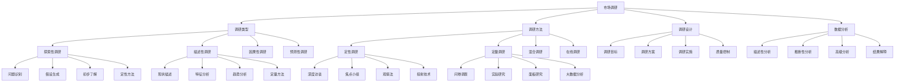

# 市场调研方法

## 🎯 学习目标
掌握市场调研理论和方法，学会设计和实施市场调研项目，为营销决策提供数据支持。

## 📊 市场调研框架

### 市场调研模型

## 🔍 调研类型

### 探索性调研
**问题识别**：
- **问题识别**：市场问题识别
- **问题定义**：问题定义和界定
- **问题分析**：问题分析
- **问题优先级**：问题优先级排序

**假设生成**：
- **假设生成**：研究假设生成
- **假设验证**：假设验证方法
- **假设修正**：假设修正
- **假设应用**：假设应用

**初步了解**：
- **初步了解**：市场初步了解
- **信息收集**：信息收集
- **信息整理**：信息整理
- **信息分析**：信息分析

**定性方法**：
- **定性方法**：定性研究方法
- **深度访谈**：深度访谈
- **焦点小组**：焦点小组
- **观察法**：观察法

### 描述性调研
**现状描述**：
- **现状描述**：市场现状描述
- **现状分析**：现状分析
- **现状评估**：现状评估
- **现状报告**：现状报告

**特征分析**：
- **特征分析**：市场特征分析
- **特征识别**：特征识别
- **特征分类**：特征分类
- **特征描述**：特征描述

**趋势分析**：
- **趋势分析**：市场趋势分析
- **趋势识别**：趋势识别
- **趋势预测**：趋势预测
- **趋势应用**：趋势应用

**定量方法**：
- **定量方法**：定量研究方法
- **问卷调查**：问卷调查
- **统计分析**：统计分析
- **数据挖掘**：数据挖掘

### 因果性调研
**因果关系**：
- **因果关系**：因果关系研究
- **因果识别**：因果识别
- **因果验证**：因果验证
- **因果应用**：因果应用

**实验设计**：
- **实验设计**：实验设计
- **实验控制**：实验控制
- **实验变量**：实验变量
- **实验效果**：实验效果

**控制变量**：
- **控制变量**：控制变量设计
- **变量控制**：变量控制方法
- **变量测量**：变量测量
- **变量分析**：变量分析

**因果推断**：
- **因果推断**：因果推断方法
- **推断逻辑**：推断逻辑
- **推断验证**：推断验证
- **推断应用**：推断应用

### 预测性调研
**预测模型**：
- **预测模型**：预测模型构建
- **模型选择**：模型选择
- **模型验证**：模型验证
- **模型应用**：模型应用

**预测方法**：
- **预测方法**：预测方法
- **时间序列**：时间序列分析
- **回归分析**：回归分析
- **机器学习**：机器学习

**预测精度**：
- **预测精度**：预测精度评估
- **精度指标**：精度指标
- **精度改进**：精度改进
- **精度监控**：精度监控

## 🛠️ 调研方法

### 定性调研
**深度访谈**：
- **深度访谈**：深度访谈方法
- **访谈设计**：访谈设计
- **访谈技巧**：访谈技巧
- **访谈分析**：访谈分析

**焦点小组**：
- **焦点小组**：焦点小组方法
- **小组设计**：小组设计
- **小组管理**：小组管理
- **小组分析**：小组分析

**观察法**：
- **观察法**：观察法
- **观察设计**：观察设计
- **观察记录**：观察记录
- **观察分析**：观察分析

**投射技术**：
- **投射技术**：投射技术
- **技术选择**：技术选择
- **技术应用**：技术应用
- **技术分析**：技术分析

### 定量调研
**问卷调查**：
- **问卷调查**：问卷调查方法
- **问卷设计**：问卷设计
- **问卷测试**：问卷测试
- **问卷分析**：问卷分析

**实验研究**：
- **实验研究**：实验研究方法
- **实验设计**：实验设计
- **实验实施**：实验实施
- **实验结果**：实验结果

**面板研究**：
- **面板研究**：面板研究方法
- **面板设计**：面板设计
- **面板管理**：面板管理
- **面板分析**：面板分析

**大数据分析**：
- **大数据分析**：大数据分析方法
- **数据收集**：数据收集
- **数据处理**：数据处理
- **数据分析**：数据分析

### 混合调研
**定性定量结合**：
- **结合策略**：定性定量结合策略
- **结合方法**：结合方法
- **结合时机**：结合时机
- **结合效果**：结合效果

**多方法验证**：
- **多方法验证**：多方法验证
- **验证策略**：验证策略
- **验证方法**：验证方法
- **验证结果**：验证结果

**三角验证**：
- **三角验证**：三角验证方法
- **验证设计**：验证设计
- **验证实施**：验证实施
- **验证分析**：验证分析

**综合分析**：
- **综合分析**：综合分析
- **分析框架**：分析框架
- **分析方法**：分析方法
- **分析结果**：分析结果

### 在线调研
**在线调研**：
- **在线调研**：在线调研方法
- **平台选择**：平台选择
- **工具使用**：工具使用
- **效果评估**：效果评估

**移动调研**：
- **移动调研**：移动调研方法
- **移动设计**：移动设计
- **移动优化**：移动优化
- **移动分析**：移动分析

**社交媒体调研**：
- **社交媒体调研**：社交媒体调研
- **平台分析**：平台分析
- **内容分析**：内容分析
- **用户分析**：用户分析

## 📋 调研设计

### 调研目标
**问题定义**：
- **问题定义**：调研问题定义
- **问题分析**：问题分析
- **问题优先级**：问题优先级
- **问题解决**：问题解决

**目标设定**：
- **目标设定**：调研目标设定
- **目标层次**：目标层次
- **目标量化**：目标量化
- **目标评估**：目标评估

**假设提出**：
- **假设提出**：研究假设提出
- **假设类型**：假设类型
- **假设验证**：假设验证
- **假设应用**：假设应用

**变量设计**：
- **变量设计**：变量设计
- **变量类型**：变量类型
- **变量测量**：变量测量
- **变量控制**：变量控制

### 调研方案
**调研方法**：
- **调研方法**：调研方法选择
- **方法组合**：方法组合
- **方法优化**：方法优化
- **方法评估**：方法评估

**样本设计**：
- **样本设计**：样本设计
- **抽样方法**：抽样方法
- **样本规模**：样本规模
- **样本质量**：样本质量

**数据收集**：
- **数据收集**：数据收集计划
- **收集方法**：收集方法
- **收集工具**：收集工具
- **收集质量**：收集质量

**分析计划**：
- **分析计划**：分析计划
- **分析方法**：分析方法
- **分析工具**：分析工具
- **分析结果**：分析结果

### 调研实施
**调研准备**：
- **调研准备**：调研准备工作
- **人员培训**：人员培训
- **工具准备**：工具准备
- **资源准备**：资源准备

**数据收集**：
- **数据收集**：数据收集实施
- **收集监控**：收集监控
- **收集质量**：收集质量控制
- **收集进度**：收集进度管理

**质量控制**：
- **质量控制**：质量控制
- **质量检查**：质量检查
- **质量改进**：质量改进
- **质量评估**：质量评估

**进度管理**：
- **进度管理**：进度管理
- **进度监控**：进度监控
- **进度调整**：进度调整
- **进度报告**：进度报告

### 质量控制
**质量体系**：
- **质量体系**：质量体系建立
- **质量标准**：质量标准
- **质量流程**：质量流程
- **质量监控**：质量监控

**质量检查**：
- **质量检查**：质量检查
- **检查方法**：检查方法
- **检查频率**：检查频率
- **检查结果**：检查结果

**质量改进**：
- **质量改进**：质量改进
- **改进方法**：改进方法
- **改进实施**：改进实施
- **改进效果**：改进效果

## 📊 数据分析

### 描述性分析
**频数分析**：
- **频数分析**：频数分析
- **频数分布**：频数分布
- **频数统计**：频数统计
- **频数解释**：频数解释

**描述统计**：
- **描述统计**：描述统计
- **集中趋势**：集中趋势
- **离散程度**：离散程度
- **分布形状**：分布形状

**交叉分析**：
- **交叉分析**：交叉分析
- **交叉表**：交叉表
- **交叉统计**：交叉统计
- **交叉解释**：交叉解释

**趋势分析**：
- **趋势分析**：趋势分析
- **趋势识别**：趋势识别
- **趋势描述**：趋势描述
- **趋势预测**：趋势预测

### 推断性分析
**假设检验**：
- **假设检验**：假设检验
- **检验方法**：检验方法
- **检验结果**：检验结果
- **检验解释**：检验解释

**相关分析**：
- **相关分析**：相关分析
- **相关系数**：相关系数
- **相关强度**：相关强度
- **相关解释**：相关解释

**回归分析**：
- **回归分析**：回归分析
- **回归模型**：回归模型
- **回归结果**：回归结果
- **回归解释**：回归解释

**因子分析**：
- **因子分析**：因子分析
- **因子提取**：因子提取
- **因子旋转**：因子旋转
- **因子解释**：因子解释

### 高级分析
**聚类分析**：
- **聚类分析**：聚类分析
- **聚类方法**：聚类方法
- **聚类结果**：聚类结果
- **聚类解释**：聚类解释

**判别分析**：
- **判别分析**：判别分析
- **判别函数**：判别函数
- **判别结果**：判别结果
- **判别解释**：判别解释

**结构方程模型**：
- **结构方程模型**：结构方程模型
- **模型构建**：模型构建
- **模型拟合**：模型拟合
- **模型解释**：模型解释

**机器学习**：
- **机器学习**：机器学习方法
- **算法选择**：算法选择
- **模型训练**：模型训练
- **模型应用**：模型应用

### 结果解释
**结果解释**：
- **结果解释**：结果解释
- **解释方法**：解释方法
- **解释逻辑**：解释逻辑
- **解释验证**：解释验证

**结果应用**：
- **结果应用**：结果应用
- **应用策略**：应用策略
- **应用方法**：应用方法
- **应用效果**：应用效果

**结果报告**：
- **结果报告**：结果报告
- **报告内容**：报告内容
- **报告格式**：报告格式
- **报告应用**：报告应用

## 💡 市场调研案例

### 成功案例
**苹果iPhone**：
- **调研类型**：探索性+描述性调研
- **调研方法**：定性+定量结合
- **关键发现**：用户对智能手机的需求
- **效果**：成功推出iPhone

**星巴克**：
- **调研类型**：描述性+因果性调研
- **调研方法**：观察法+问卷调查
- **关键发现**：第三空间概念
- **效果**：成功建立品牌

**特斯拉**：
- **调研类型**：探索性+预测性调研
- **调研方法**：深度访谈+大数据分析
- **关键发现**：电动汽车市场潜力
- **效果**：成功进入市场

### 失败案例
**失败原因**：
- **调研设计不当**：调研设计不当
- **样本选择错误**：样本选择错误
- **数据分析错误**：数据分析错误
- **结果解释错误**：结果解释错误

**失败教训**：
- **调研设计**：重视调研设计
- **样本质量**：重视样本质量
- **数据分析**：重视数据分析
- **结果解释**：重视结果解释

## 🧠 学习要点

### 费曼学习法应用
1. **选择概念**：市场调研方法
2. **简化解释**：用简单语言解释市场调研
3. **识别盲点**：找出理解不足的地方
4. **重新学习**：针对盲点深入学习

### 刻意练习要点
- **理论掌握**：掌握市场调研理论
- **方法应用**：掌握调研方法
- **案例分析**：分析成功失败案例
- **实践应用**：实践应用市场调研

## 🔗 关联学习

### 前置知识
- [[01-4P营销理论]] - 4P营销理论
- [[02-STP战略]] - STP战略
- [[03-消费者行为学]] - 消费者行为学

### 后续学习
- [[02-营销ROI分析]] - 营销ROI分析
- [[03-客户生命周期价值]] - 客户生命周期价值
- [[01-品牌管理]] - 品牌管理

### 实践应用
- 市场调研项目设计
- 调研方法选择和应用
- 数据收集和分析
- 调研结果应用

## 🎯 学习检验

### 理解检验
- [ ] 能够理解市场调研理论
- [ ] 能够掌握调研方法
- [ ] 能够设计调研方案
- [ ] 能够进行数据分析

### 应用检验
- [ ] 能够设计市场调研项目
- [ ] 能够实施调研方案
- [ ] 能够分析调研数据
- [ ] 能够应用调研结果

---
**下一步**：[[02-营销ROI分析]] - 营销ROI分析