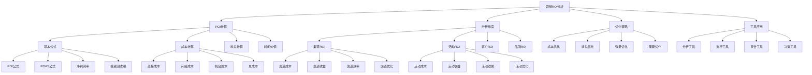

# 营销ROI分析

## 🎯 学习目标
掌握营销ROI分析理论和方法，学会计算和优化营销投资回报率，提升营销效率和效果。

## 📊 营销ROI分析框架

### 营销ROI模型

## 💰 ROI计算

### 基本公式
**ROI公式**：
- **ROI公式**：ROI = (收益 - 投资) / 投资 × 100%
- **ROAS公式**：ROAS = 收益 / 投资
- **净利润率**：净利润率 = 净利润 / 收益
- **投资回收期**：投资回收期 = 投资 / 年净收益

**计算公式**：
- **计算公式**：ROI计算公式
- **计算步骤**：计算步骤
- **计算示例**：计算示例
- **计算验证**：计算验证

**公式应用**：
- **公式应用**：公式应用场景
- **应用条件**：应用条件
- **应用限制**：应用限制
- **应用优化**：应用优化

### 成本计算
**直接成本**：
- **直接成本**：营销直接成本
- **广告成本**：广告投放成本
- **人力成本**：人力成本
- **物料成本**：物料成本

**间接成本**：
- **间接成本**：营销间接成本
- **管理成本**：管理成本
- **设备成本**：设备成本
- **办公成本**：办公成本

**机会成本**：
- **机会成本**：机会成本计算
- **时间成本**：时间成本
- **资源成本**：资源成本
- **选择成本**：选择成本

**总成本**：
- **总成本**：营销总成本
- **成本汇总**：成本汇总
- **成本分析**：成本分析
- **成本控制**：成本控制

### 收益计算
**销售收入**：
- **销售收入**：销售收入计算
- **销售增长**：销售增长
- **销售转化**：销售转化
- **销售价值**：销售价值

**客户价值**：
- **客户价值**：客户价值计算
- **客户获取**：客户获取价值
- **客户留存**：客户留存价值
- **客户增长**：客户增长价值

**品牌价值**：
- **品牌价值**：品牌价值计算
- **品牌认知**：品牌认知价值
- **品牌偏好**：品牌偏好价值
- **品牌忠诚**：品牌忠诚价值

**长期收益**：
- **长期收益**：长期收益计算
- **未来价值**：未来价值
- **持续收益**：持续收益
- **收益预测**：收益预测

### 时间价值
**时间价值**：
- **时间价值**：时间价值计算
- **现值计算**：现值计算
- **终值计算**：终值计算
- **折现率**：折现率

**时间维度**：
- **时间维度**：时间维度分析
- **短期ROI**：短期ROI
- **中期ROI**：中期ROI
- **长期ROI**：长期ROI

**时间调整**：
- **时间调整**：时间调整
- **通胀调整**：通胀调整
- **风险调整**：风险调整
- **机会调整**：机会调整

## 📈 分析维度

### 渠道ROI
**渠道成本**：
- **渠道成本**：渠道成本分析
- **成本结构**：成本结构分析
- **成本效率**：成本效率分析
- **成本优化**：成本优化

**渠道收益**：
- **渠道收益**：渠道收益分析
- **收益来源**：收益来源分析
- **收益质量**：收益质量分析
- **收益增长**：收益增长分析

**渠道效率**：
- **渠道效率**：渠道效率分析
- **效率指标**：效率指标
- **效率比较**：效率比较
- **效率提升**：效率提升

**渠道优化**：
- **渠道优化**：渠道优化策略
- **优化方法**：优化方法
- **优化实施**：优化实施
- **优化效果**：优化效果

### 活动ROI
**活动成本**：
- **活动成本**：活动成本分析
- **成本构成**：成本构成分析
- **成本控制**：成本控制
- **成本优化**：成本优化

**活动收益**：
- **活动收益**：活动收益分析
- **收益类型**：收益类型分析
- **收益计算**：收益计算
- **收益评估**：收益评估

**活动效果**：
- **活动效果**：活动效果分析
- **效果指标**：效果指标
- **效果评估**：效果评估
- **效果优化**：效果优化

**活动优化**：
- **活动优化**：活动优化策略
- **优化方向**：优化方向
- **优化方法**：优化方法
- **优化实施**：优化实施

### 客户ROI
**获客成本**：
- **获客成本**：获客成本分析
- **CAC计算**：客户获取成本
- **成本构成**：成本构成分析
- **成本优化**：成本优化

**客户价值**：
- **客户价值**：客户价值分析
- **LTV计算**：客户生命周期价值
- **价值构成**：价值构成分析
- **价值提升**：价值提升

**客户生命周期**：
- **生命周期**：客户生命周期分析
- **阶段价值**：阶段价值分析
- **生命周期管理**：生命周期管理
- **生命周期优化**：生命周期优化

**客户留存**：
- **客户留存**：客户留存分析
- **留存率**：留存率分析
- **留存价值**：留存价值分析
- **留存优化**：留存优化

### 品牌ROI
**品牌价值**：
- **品牌价值**：品牌价值分析
- **价值构成**：价值构成分析
- **价值评估**：价值评估
- **价值提升**：价值提升

**品牌认知**：
- **品牌认知**：品牌认知分析
- **认知度**：认知度分析
- **认知质量**：认知质量分析
- **认知提升**：认知提升

**品牌偏好**：
- **品牌偏好**：品牌偏好分析
- **偏好度**：偏好度分析
- **偏好原因**：偏好原因分析
- **偏好提升**：偏好提升

**品牌忠诚**：
- **品牌忠诚**：品牌忠诚分析
- **忠诚度**：忠诚度分析
- **忠诚价值**：忠诚价值分析
- **忠诚提升**：忠诚提升

## 🚀 优化策略

### 成本优化
**成本控制**：
- **成本控制**：成本控制策略
- **预算管理**：预算管理
- **成本监控**：成本监控
- **成本预警**：成本预警

**效率提升**：
- **效率提升**：效率提升策略
- **流程优化**：流程优化
- **技术优化**：技术优化
- **管理优化**：管理优化

**资源优化**：
- **资源优化**：资源优化策略
- **资源配置**：资源配置优化
- **资源利用**：资源利用优化
- **资源整合**：资源整合优化

**规模效应**：
- **规模效应**：规模效应利用
- **规模优势**：规模优势
- **规模经济**：规模经济
- **规模优化**：规模优化

### 收益优化
**转化提升**：
- **转化提升**：转化率提升策略
- **转化路径**：转化路径优化
- **转化体验**：转化体验优化
- **转化工具**：转化工具优化

**客单价提升**：
- **客单价提升**：客单价提升策略
- **产品组合**：产品组合优化
- **价格策略**：价格策略优化
- **增值服务**：增值服务

**复购率提升**：
- **复购率提升**：复购率提升策略
- **客户关系**：客户关系管理
- **客户服务**：客户服务优化
- **客户激励**：客户激励

**客户价值提升**：
- **客户价值提升**：客户价值提升策略
- **价值创造**：价值创造
- **价值传递**：价值传递
- **价值实现**：价值实现

### 效果优化
**目标优化**：
- **目标优化**：目标优化策略
- **目标设定**：目标设定优化
- **目标分解**：目标分解优化
- **目标调整**：目标调整

**策略优化**：
- **策略优化**：策略优化
- **策略调整**：策略调整
- **策略创新**：策略创新
- **策略实施**：策略实施

**执行优化**：
- **执行优化**：执行优化
- **执行效率**：执行效率优化
- **执行质量**：执行质量优化
- **执行监控**：执行监控

**监控优化**：
- **监控优化**：监控优化
- **监控体系**：监控体系优化
- **监控指标**：监控指标优化
- **监控工具**：监控工具优化

### 策略优化
**策略制定**：
- **策略制定**：策略制定
- **策略分析**：策略分析
- **策略选择**：策略选择
- **策略实施**：策略实施

**策略调整**：
- **策略调整**：策略调整
- **调整依据**：调整依据
- **调整方法**：调整方法
- **调整效果**：调整效果

**策略创新**：
- **策略创新**：策略创新
- **创新方法**：创新方法
- **创新实施**：创新实施
- **创新效果**：创新效果

## 🛠️ 工具应用

### 分析工具
**Google Analytics**：
- **Google Analytics**：Google Analytics使用
- **功能应用**：功能应用
- **数据分析**：数据分析
- **报告生成**：报告生成

**Adobe Analytics**：
- **Adobe Analytics**：Adobe Analytics使用
- **功能应用**：功能应用
- **数据分析**：数据分析
- **报告生成**：报告生成

**营销云**：
- **营销云**：营销云平台使用
- **功能应用**：功能应用
- **数据分析**：数据分析
- **报告生成**：报告生成

**自定义工具**：
- **自定义工具**：自定义工具开发
- **工具设计**：工具设计
- **工具开发**：工具开发
- **工具应用**：工具应用

### 监控工具
**实时监控**：
- **实时监控**：实时监控工具
- **监控指标**：监控指标
- **监控界面**：监控界面
- **监控预警**：监控预警

**预警系统**：
- **预警系统**：预警系统
- **预警规则**：预警规则
- **预警通知**：预警通知
- **预警处理**：预警处理

**报告生成**：
- **报告生成**：报告生成工具
- **报告模板**：报告模板
- **报告内容**：报告内容
- **报告分发**：报告分发

**数据可视化**：
- **数据可视化**：数据可视化工具
- **图表类型**：图表类型
- **可视化设计**：可视化设计
- **交互功能**：交互功能

### 报告工具
**报告工具**：
- **报告工具**：报告工具
- **报告设计**：报告设计
- **报告内容**：报告内容
- **报告格式**：报告格式

**报告分析**：
- **报告分析**：报告分析
- **分析维度**：分析维度
- **分析方法**：分析方法
- **分析结果**：分析结果

**报告应用**：
- **报告应用**：报告应用
- **决策支持**：决策支持
- **策略调整**：策略调整
- **效果评估**：效果评估

### 决策工具
**决策工具**：
- **决策工具**：决策工具
- **决策模型**：决策模型
- **决策方法**：决策方法
- **决策支持**：决策支持

**决策分析**：
- **决策分析**：决策分析
- **分析框架**：分析框架
- **分析方法**：分析方法
- **分析结果**：分析结果

**决策实施**：
- **决策实施**：决策实施
- **实施计划**：实施计划
- **实施监控**：实施监控
- **实施效果**：实施效果

## 💡 营销ROI案例

### 成功案例
**亚马逊**：
- **ROI策略**：长期ROI策略
- **成本控制**：严格成本控制
- **收益优化**：持续收益优化
- **效果**：ROI持续提升

**谷歌**：
- **ROI策略**：数据驱动ROI优化
- **成本控制**：精准成本控制
- **收益优化**：创新收益优化
- **效果**：ROI行业领先

**苹果**：
- **ROI策略**：品牌ROI策略
- **成本控制**：高效成本控制
- **收益优化**：高价值收益优化
- **效果**：ROI持续增长

### 失败案例
**失败原因**：
- **成本控制不当**：成本控制不当
- **收益计算错误**：收益计算错误
- **ROI分析不准确**：ROI分析不准确
- **优化策略错误**：优化策略错误

**失败教训**：
- **成本控制**：重视成本控制
- **收益计算**：准确计算收益
- **ROI分析**：准确分析ROI
- **优化策略**：制定正确策略

## 🧠 学习要点

### 费曼学习法应用
1. **选择概念**：营销ROI分析
2. **简化解释**：用简单语言解释营销ROI
3. **识别盲点**：找出理解不足的地方
4. **重新学习**：针对盲点深入学习

### 刻意练习要点
- **理论掌握**：掌握营销ROI理论
- **方法应用**：掌握ROI计算方法
- **案例分析**：分析成功失败案例
- **实践应用**：实践应用ROI分析

## 🔗 关联学习

### 前置知识
- [[01-市场调研方法]] - 市场调研方法
- [[01-4P营销理论]] - 4P营销理论
- [[02-STP战略]] - STP战略

### 后续学习
- [[03-客户生命周期价值]] - 客户生命周期价值
- [[01-品牌管理]] - 品牌管理
- [[01-营销自动化]] - 营销自动化

### 实践应用
- 营销ROI计算和分析
- ROI优化策略制定
- 营销效果评估
- 营销投资决策

## 🎯 学习检验

### 理解检验
- [ ] 能够理解营销ROI理论
- [ ] 能够掌握ROI计算方法
- [ ] 能够进行ROI分析
- [ ] 能够制定优化策略

### 应用检验
- [ ] 能够计算营销ROI
- [ ] 能够分析ROI数据
- [ ] 能够优化营销ROI
- [ ] 能够应用ROI分析结果

---
**下一步**：[[03-客户生命周期价值]] - 客户生命周期价值