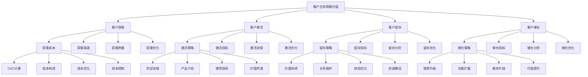

# 客户生命周期价值

## 🎯 学习目标
掌握客户生命周期价值理论和方法，学会计算和优化客户价值，提升客户关系管理效果。

## 📊 客户生命周期价值框架

### CLV模型

## 🎯 客户获取

### 获客成本
**CAC计算**：
- **CAC公式**：CAC = 总获客成本 / 新客户数量
- **成本构成**：营销成本 + 销售成本 + 其他成本
- **计算周期**：月度、季度、年度CAC
- **CAC优化**：CAC优化策略

**成本构成**：
- **营销成本**：广告投放、内容营销、活动成本
- **销售成本**：销售人员成本、销售工具成本
- **其他成本**：技术支持、客户服务、运营成本
- **隐性成本**：机会成本、时间成本

**成本优化**：
- **渠道优化**：高效渠道识别和优化
- **转化优化**：转化率提升
- **质量优化**：客户质量提升
- **效率优化**：获客效率提升

**成本控制**：
- **预算控制**：获客预算控制
- **成本监控**：成本实时监控
- **成本预警**：成本预警机制
- **成本分析**：成本分析报告

### 获客渠道
**渠道类型**：
- **数字渠道**：搜索引擎、社交媒体、内容营销
- **传统渠道**：电视广告、平面广告、户外广告
- **推荐渠道**：客户推荐、合作伙伴推荐
- **直接渠道**：官网、门店、电话销售

**渠道分析**：
- **渠道效果**：各渠道获客效果分析
- **渠道成本**：各渠道获客成本分析
- **渠道质量**：各渠道客户质量分析
- **渠道ROI**：各渠道投资回报分析

**渠道优化**：
- **渠道组合**：最优渠道组合策略
- **渠道分配**：预算在各渠道的分配
- **渠道测试**：新渠道测试和验证
- **渠道淘汰**：低效渠道淘汰

### 获客质量
**质量指标**：
- **客户质量**：客户价值、忠诚度、活跃度
- **转化质量**：转化率、转化速度、转化价值
- **留存质量**：留存率、留存时长、留存价值
- **推荐质量**：推荐率、推荐价值

**质量评估**：
- **质量评估**：客户质量评估方法
- **评估模型**：质量评估模型
- **评估指标**：质量评估指标
- **评估周期**：质量评估周期

**质量提升**：
- **质量提升**：客户质量提升策略
- **筛选优化**：客户筛选优化
- **培育优化**：客户培育优化
- **服务优化**：客户服务优化

### 获客优化
**优化策略**：
- **优化策略**：获客优化策略
- **目标优化**：获客目标优化
- **流程优化**：获客流程优化
- **工具优化**：获客工具优化

**优化方法**：
- **A/B测试**：获客A/B测试
- **数据分析**：获客数据分析
- **用户研究**：用户研究
- **竞品分析**：竞品分析

**优化实施**：
- **优化实施**：优化实施计划
- **实施监控**：实施过程监控
- **效果评估**：优化效果评估
- **持续改进**：持续改进

## ⚡ 客户激活

### 激活策略
**欢迎流程**：
- **欢迎邮件**：欢迎邮件序列设计
- **欢迎页面**：欢迎页面设计
- **欢迎内容**：欢迎内容设计
- **欢迎体验**：欢迎体验优化

**产品介绍**：
- **产品介绍**：产品介绍内容
- **功能介绍**：核心功能介绍
- **价值传递**：产品价值传递
- **使用指导**：产品使用指导

**使用指导**：
- **使用指导**：产品使用指导
- **教程设计**：使用教程设计
- **帮助文档**：帮助文档
- **技术支持**：技术支持

**价值传递**：
- **价值传递**：价值传递策略
- **价值内容**：价值内容设计
- **价值体验**：价值体验设计
- **价值验证**：价值验证

### 激活指标
**激活指标**：
- **激活率**：客户激活率
- **激活时间**：激活时间
- **激活深度**：激活深度
- **激活质量**：激活质量

**指标定义**：
- **激活定义**：激活标准定义
- **指标计算**：指标计算方法
- **指标监控**：指标监控
- **指标分析**：指标分析

**指标优化**：
- **指标优化**：指标优化策略
- **目标设定**：指标目标设定
- **优化方法**：指标优化方法
- **效果评估**：优化效果评估

### 激活流程
**流程设计**：
- **流程设计**：激活流程设计
- **流程步骤**：流程步骤设计
- **流程优化**：流程优化
- **流程监控**：流程监控

**流程实施**：
- **流程实施**：流程实施
- **实施监控**：实施监控
- **问题处理**：问题处理
- **效果评估**：效果评估

**流程优化**：
- **流程优化**：流程优化
- **优化方法**：优化方法
- **优化实施**：优化实施
- **优化效果**：优化效果

### 激活优化
**优化策略**：
- **优化策略**：激活优化策略
- **策略制定**：策略制定
- **策略实施**：策略实施
- **策略评估**：策略评估

**优化方法**：
- **优化方法**：优化方法
- **A/B测试**：A/B测试
- **数据分析**：数据分析
- **用户反馈**：用户反馈

**优化实施**：
- **优化实施**：优化实施
- **实施计划**：实施计划
- **实施监控**：实施监控
- **实施效果**：实施效果

## 💎 客户留存

### 留存策略
**价值持续**：
- **价值持续**：持续价值提供
- **价值内容**：价值内容持续更新
- **价值体验**：价值体验持续优化
- **价值创新**：价值创新

**关系维护**：
- **关系维护**：客户关系维护
- **沟通策略**：沟通策略
- **服务支持**：服务支持
- **问题解决**：问题解决

**体验优化**：
- **体验优化**：客户体验优化
- **体验设计**：体验设计
- **体验监控**：体验监控
- **体验改进**：体验改进

**忠诚建设**：
- **忠诚建设**：客户忠诚度建设
- **忠诚计划**：忠诚计划设计
- **忠诚奖励**：忠诚奖励设计
- **忠诚维护**：忠诚维护

### 留存指标
**留存指标**：
- **留存率**：客户留存率
- **留存时长**：客户留存时长
- **留存价值**：客户留存价值
- **留存质量**：客户留存质量

**指标计算**：
- **指标计算**：留存指标计算
- **计算方法**：计算方法
- **计算周期**：计算周期
- **计算验证**：计算验证

**指标分析**：
- **指标分析**：留存指标分析
- **趋势分析**：趋势分析
- **对比分析**：对比分析
- **归因分析**：归因分析

### 留存分析
**分析维度**：
- **分析维度**：留存分析维度
- **时间维度**：时间维度分析
- **客户维度**：客户维度分析
- **产品维度**：产品维度分析

**分析方法**：
- **分析方法**：留存分析方法
- **队列分析**：队列分析
- **漏斗分析**：漏斗分析
- **路径分析**：路径分析

**分析应用**：
- **分析应用**：分析应用
- **决策支持**：决策支持
- **策略调整**：策略调整
- **效果评估**：效果评估

### 留存优化
**优化策略**：
- **优化策略**：留存优化策略
- **策略制定**：策略制定
- **策略实施**：策略实施
- **策略评估**：策略评估

**优化方法**：
- **优化方法**：优化方法
- **个性化**：个性化策略
- **自动化**：自动化策略
- **智能化**：智能化策略

**优化实施**：
- **优化实施**：优化实施
- **实施计划**：实施计划
- **实施监控**：实施监控
- **实施效果**：实施效果

## 📈 客户增长

### 增长策略
**使用升级**：
- **使用升级**：使用升级策略
- **升级路径**：升级路径设计
- **升级激励**：升级激励设计
- **升级支持**：升级支持

**功能扩展**：
- **功能扩展**：功能扩展策略
- **功能推荐**：功能推荐
- **功能培训**：功能培训
- **功能支持**：功能支持

**服务升级**：
- **服务升级**：服务升级策略
- **服务内容**：服务内容升级
- **服务质量**：服务质量提升
- **服务体验**：服务体验优化

**价值提升**：
- **价值提升**：客户价值提升
- **价值创造**：价值创造
- **价值传递**：价值传递
- **价值实现**：价值实现

### 增长指标
**增长指标**：
- **增长指标**：客户增长指标
- **使用深度**：使用深度增长
- **使用广度**：使用广度增长
- **价值增长**：价值增长

**指标计算**：
- **指标计算**：增长指标计算
- **计算方法**：计算方法
- **计算周期**：计算周期
- **计算验证**：计算验证

**指标分析**：
- **指标分析**：增长指标分析
- **趋势分析**：趋势分析
- **对比分析**：对比分析
- **归因分析**：归因分析

### 增长分析
**分析维度**：
- **分析维度**：增长分析维度
- **客户维度**：客户维度分析
- **产品维度**：产品维度分析
- **时间维度**：时间维度分析

**分析方法**：
- **分析方法**：增长分析方法
- **队列分析**：队列分析
- **路径分析**：路径分析
- **预测分析**：预测分析

**分析应用**：
- **分析应用**：分析应用
- **决策支持**：决策支持
- **策略调整**：策略调整
- **效果评估**：效果评估

### 增长优化
**优化策略**：
- **优化策略**：增长优化策略
- **策略制定**：策略制定
- **策略实施**：策略实施
- **策略评估**：策略评估

**优化方法**：
- **优化方法**：优化方法
- **个性化**：个性化策略
- **自动化**：自动化策略
- **智能化**：智能化策略

**优化实施**：
- **优化实施**：优化实施
- **实施计划**：实施计划
- **实施监控**：实施监控
- **实施效果**：实施效果

## 💡 客户生命周期价值案例

### 成功案例
**Netflix**：
- **CLV策略**：订阅模式CLV优化
- **获客策略**：内容驱动的获客
- **留存策略**：个性化推荐留存
- **效果**：CLV持续增长

**Spotify**：
- **CLV策略**：音乐服务CLV优化
- **获客策略**：免费试用获客
- **留存策略**：个性化音乐推荐
- **效果**：CLV显著提升

**亚马逊**：
- **CLV策略**：电商平台CLV优化
- **获客策略**：Prime会员获客
- **留存策略**：Prime服务留存
- **效果**：CLV行业领先

### 失败案例
**失败原因**：
- **获客成本过高**：获客成本过高
- **留存率低**：客户留存率低
- **价值创造不足**：价值创造不足
- **CLV计算错误**：CLV计算错误

**失败教训**：
- **成本控制**：控制获客成本
- **留存重视**：重视客户留存
- **价值创造**：持续价值创造
- **准确计算**：准确计算CLV

## 🧠 学习要点

### 费曼学习法应用
1. **选择概念**：客户生命周期价值
2. **简化解释**：用简单语言解释CLV
3. **识别盲点**：找出理解不足的地方
4. **重新学习**：针对盲点深入学习

### 刻意练习要点
- **理论掌握**：掌握CLV理论
- **方法应用**：掌握CLV计算方法
- **案例分析**：分析成功失败案例
- **实践应用**：实践应用CLV分析

## 🔗 关联学习

### 前置知识
- [[02-营销ROI分析]] - 营销ROI分析
- [[01-市场调研方法]] - 市场调研方法
- [[01-4P营销理论]] - 4P营销理论

### 后续学习
- [[01-品牌管理]] - 品牌管理
- [[01-营销自动化]] - 营销自动化
- [[01-客户关系管理]] - 客户关系管理

### 实践应用
- CLV计算和分析
- 客户生命周期管理
- 客户价值优化
- 客户关系管理

## 🎯 学习检验

### 理解检验
- [ ] 能够理解CLV理论
- [ ] 能够掌握CLV计算方法
- [ ] 能够进行CLV分析
- [ ] 能够制定CLV优化策略

### 应用检验
- [ ] 能够计算CLV
- [ ] 能够分析CLV数据
- [ ] 能够优化CLV
- [ ] 能够应用CLV分析结果

---
**下一步**：[[01-品牌管理]] - 品牌管理