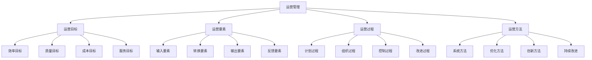

# 运营管理概论

## 🎯 学习目标
理解运营管理的本质，掌握运营管理的基本概念和方法，建立运营管理思维。

## 📊 运营管理框架

### 管理要素

## 🎯 运营管理目标

### 效率目标
**生产效率**：
- **劳动生产率**：单位时间产出
- **设备效率**：设备利用率
- **材料效率**：材料利用率
- **能源效率**：能源利用率

**运营效率**：
- **流程效率**：流程处理速度
- **响应效率**：响应客户需求速度
- **决策效率**：决策制定速度
- **执行效率**：决策执行速度

**效率提升方法**：
- 流程优化
- 技术改进
- 人员培训
- 管理创新

### 质量目标
**产品质量**：
- **功能质量**：产品功能满足程度
- **性能质量**：产品性能水平
- **可靠性**：产品可靠性
- **耐用性**：产品耐用程度

**服务质量**：
- **服务态度**：服务人员态度
- **服务速度**：服务响应速度
- **服务准确性**：服务准确性
- **服务完整性**：服务完整性

**质量改进方法**：
- 质量管理体系
- 质量控制方法
- 质量改进工具
- 质量文化建设

### 成本目标
**生产成本**：
- **直接材料成本**：原材料成本
- **直接人工成本**：人工成本
- **制造费用**：间接制造费用
- **总成本**：总生产成本

**运营成本**：
- **采购成本**：采购相关成本
- **库存成本**：库存持有成本
- **运输成本**：运输配送成本
- **管理成本**：管理相关成本

**成本控制方法**：
- 成本预算
- 成本分析
- 成本控制
- 成本优化

### 服务目标
**客户服务**：
- **客户满意度**：客户满意程度
- **客户忠诚度**：客户忠诚程度
- **客户保留率**：客户保留比例
- **客户推荐率**：客户推荐比例

**服务改进方法**：
- 服务设计
- 服务标准
- 服务培训
- 服务创新

## 🔧 运营要素

### 输入要素
**人力资源**：
- **管理人员**：运营管理人员
- **技术人员**：技术专业人员
- **操作人员**：一线操作人员
- **服务人员**：客户服务人员

**物质资源**：
- **原材料**：生产用原材料
- **设备设施**：生产设备设施
- **工具器具**：生产工具器具
- **能源动力**：能源动力资源

**信息资源**：
- **市场信息**：市场需求信息
- **技术信息**：技术发展信息
- **管理信息**：管理相关信息
- **财务信息**：财务相关信息

**资金资源**：
- **运营资金**：日常运营资金
- **投资资金**：设备投资资金
- **流动资金**：流动资金需求
- **应急资金**：应急备用资金

### 转换要素
**生产转换**：
- **生产过程**：产品生产过程
- **工艺技术**：生产工艺技术
- **质量控制**：生产过程质量控制
- **效率提升**：生产效率提升

**服务转换**：
- **服务过程**：服务提供过程
- **服务技术**：服务技术方法
- **服务质量**：服务质量控制
- **服务创新**：服务创新改进

**管理转换**：
- **管理过程**：管理决策过程
- **管理方法**：管理方法技术
- **管理效率**：管理效率提升
- **管理创新**：管理创新改进

### 输出要素
**产品输出**：
- **有形产品**：实体产品
- **无形产品**：服务产品
- **产品数量**：产品产出数量
- **产品质量**：产品质量水平

**服务输出**：
- **客户服务**：客户服务输出
- **技术支持**：技术支持服务
- **售后服务**：售后服务输出
- **增值服务**：增值服务输出

**价值输出**：
- **客户价值**：为客户创造价值
- **企业价值**：为企业创造价值
- **社会价值**：为社会创造价值
- **环境价值**：为环境创造价值

### 反馈要素
**绩效反馈**：
- **效率反馈**：效率指标反馈
- **质量反馈**：质量指标反馈
- **成本反馈**：成本指标反馈
- **服务反馈**：服务指标反馈

**客户反馈**：
- **满意度反馈**：客户满意度反馈
- **需求反馈**：客户需求反馈
- **投诉反馈**：客户投诉反馈
- **建议反馈**：客户建议反馈

**市场反馈**：
- **竞争反馈**：市场竞争反馈
- **趋势反馈**：市场趋势反馈
- **机会反馈**：市场机会反馈
- **威胁反馈**：市场威胁反馈

## 🔄 运营过程

### 计划过程
**战略计划**：
- **长期计划**：长期运营计划
- **中期计划**：中期运营计划
- **短期计划**：短期运营计划
- **应急计划**：应急运营计划

**运营计划**：
- **生产计划**：生产运营计划
- **采购计划**：采购运营计划
- **库存计划**：库存运营计划
- **服务计划**：服务运营计划

**计划制定**：
- 需求预测
- 资源评估
- 能力分析
- 计划制定

### 组织过程
**组织结构**：
- **组织设计**：运营组织结构设计
- **职责分工**：运营职责分工
- **权限分配**：运营权限分配
- **协调机制**：运营协调机制

**资源配置**：
- **人力资源配置**：人员配置
- **物质资源配置**：物质资源配置
- **信息资源配置**：信息资源配置
- **资金资源配置**：资金资源配置

**组织管理**：
- 组织建设
- 人员管理
- 资源管理
- 协调管理

### 控制过程
**过程控制**：
- **输入控制**：输入要素控制
- **过程控制**：转换过程控制
- **输出控制**：输出要素控制
- **反馈控制**：反馈要素控制

**质量控制**：
- **质量标准**：质量标准制定
- **质量检测**：质量检测实施
- **质量改进**：质量改进措施
- **质量保证**：质量保证体系

**成本控制**：
- **成本预算**：成本预算制定
- **成本监控**：成本监控实施
- **成本分析**：成本分析评估
- **成本优化**：成本优化改进

### 改进过程
**持续改进**：
- **问题识别**：运营问题识别
- **原因分析**：问题原因分析
- **改进措施**：改进措施制定
- **效果评估**：改进效果评估

**创新改进**：
- **技术创新**：技术创新改进
- **管理创新**：管理创新改进
- **服务创新**：服务创新改进
- **模式创新**：模式创新改进

## 🛠️ 运营方法

### 系统方法
**系统思维**：
- **整体思维**：从整体角度思考
- **系统分析**：系统要素分析
- **系统优化**：系统整体优化
- **系统创新**：系统创新改进

**系统管理**：
- 系统设计
- 系统实施
- 系统监控
- 系统改进

### 优化方法
**数学优化**：
- **线性规划**：线性规划方法
- **非线性规划**：非线性规划方法
- **动态规划**：动态规划方法
- **整数规划**：整数规划方法

**启发式优化**：
- **遗传算法**：遗传算法优化
- **模拟退火**：模拟退火优化
- **粒子群优化**：粒子群优化
- **蚁群算法**：蚁群算法优化

### 创新方法
**技术创新**：
- **技术研发**：技术研发创新
- **技术引进**：技术引进创新
- **技术改进**：技术改进创新
- **技术集成**：技术集成创新

**管理创新**：
- **管理理念创新**：管理理念创新
- **管理方法创新**：管理方法创新
- **管理制度创新**：管理制度创新
- **管理模式创新**：管理模式创新

### 持续改进
**PDCA循环**：
- **Plan计划**：制定改进计划
- **Do执行**：执行改进措施
- **Check检查**：检查改进效果
- **Act行动**：标准化改进措施

**六西格玛**：
- **DMAIC方法**：定义、测量、分析、改进、控制
- **质量改进**：质量持续改进
- **流程优化**：流程持续优化
- **成本降低**：成本持续降低

## 💡 实践应用

### 运营管理实施
**实施步骤**：
1. **现状分析**：分析运营现状
2. **目标设定**：设定运营目标
3. **计划制定**：制定运营计划
4. **组织建设**：建设运营组织
5. **过程控制**：控制运营过程
6. **持续改进**：持续改进运营

### 案例分析
**选择案例**：如制造业运营管理
**分析维度**：
- 运营目标：效率、质量、成本、服务
- 运营要素：输入、转换、输出、反馈
- 运营过程：计划、组织、控制、改进
- 运营方法：系统、优化、创新、持续改进

## 🧠 学习要点

### 费曼学习法应用
1. **选择概念**：运营管理
2. **简化解释**：用简单语言解释运营管理
3. **识别盲点**：找出理解不足的地方
4. **重新学习**：针对盲点深入学习

### 刻意练习要点
- **概念理解**：准确理解运营管理概念
- **方法掌握**：掌握运营管理方法
- **工具应用**：能够应用运营管理工具
- **实践能力**：能够实施运营管理

## 🔗 关联学习

### 前置知识
- [[01-商业学概论]] - 商业学基础
- [[01-商业系统理论]] - 系统思维
- [[01-商业环境分析]] - 环境分析

### 后续学习
- [[02-流程设计与管理]] - 流程管理
- [[03-质量管理]] - 质量管理
- [[04-供应链管理]] - 供应链管理

### 实践应用
- 企业运营管理
- 运营流程优化
- 运营绩效提升
- 运营创新改进

## 🎯 学习检验

### 理解检验
- [ ] 能够解释运营管理概念
- [ ] 能够分析运营管理要素
- [ ] 能够掌握运营管理过程
- [ ] 能够应用运营管理方法

### 应用检验
- [ ] 能够分析企业运营现状
- [ ] 能够制定运营管理策略
- [ ] 能够实施运营管理改进
- [ ] 能够评估运营管理效果

---
**下一步**：[[02-流程设计与管理]] - 流程管理