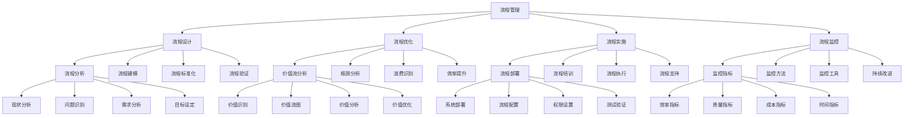

# 流程设计与管理

## 🎯 学习目标
掌握流程设计与管理理论和方法，学会设计和优化业务流程，提升组织运营效率。

## 📊 流程管理框架

### 流程管理模型

## 🔍 流程设计

### 流程分析
**现状分析**：
- **现状分析**：流程现状分析
- **流程梳理**：现有流程梳理
- **流程描述**：流程详细描述
- **流程评估**：流程效果评估

**问题识别**：
- **问题识别**：流程问题识别
- **问题分类**：问题分类整理
- **问题优先级**：问题优先级排序
- **问题影响**：问题影响分析

**需求分析**：
- **需求分析**：流程需求分析
- **需求收集**：需求收集整理
- **需求分析**：需求分析评估
- **需求确认**：需求确认验证

**目标设定**：
- **目标设定**：流程目标设定
- **目标层次**：目标层次分解
- **目标量化**：目标量化指标
- **目标评估**：目标评估标准

### 流程建模
**流程规划**：
- **流程规划**：流程总体规划
- **流程架构**：流程架构设计
- **流程层次**：流程层次划分
- **流程关系**：流程关系梳理

**流程建模**：
- **流程建模**：流程模型构建
- **建模方法**：建模方法选择
- **建模工具**：建模工具使用
- **模型验证**：模型验证确认

**流程优化**：
- **流程优化**：流程优化设计
- **优化策略**：优化策略制定
- **优化方法**：优化方法应用
- **优化效果**：优化效果评估

**流程标准化**：
- **流程标准化**：流程标准化
- **标准制定**：标准制定
- **标准实施**：标准实施
- **标准维护**：标准维护

### 流程实施
**流程部署**：
- **流程部署**：流程部署实施
- **系统部署**：系统部署
- **流程配置**：流程配置
- **权限设置**：权限设置

**流程培训**：
- **流程培训**：流程培训
- **培训计划**：培训计划制定
- **培训实施**：培训实施
- **培训评估**：培训效果评估

**流程监控**：
- **流程监控**：流程监控
- **监控体系**：监控体系建立
- **监控实施**：监控实施
- **监控分析**：监控分析

**流程改进**：
- **流程改进**：流程改进
- **改进识别**：改进机会识别
- **改进实施**：改进实施
- **改进效果**：改进效果评估

## 🚀 流程优化

### 优化方法
**价值流分析**：
- **价值识别**：价值识别
- **价值流图**：价值流图绘制
- **价值分析**：价值分析
- **价值优化**：价值优化

**瓶颈分析**：
- **瓶颈识别**：瓶颈识别
- **瓶颈分析**：瓶颈分析
- **瓶颈解决**：瓶颈解决方案
- **瓶颈预防**：瓶颈预防措施

**浪费识别**：
- **浪费识别**：浪费识别
- **浪费分类**：浪费分类
- **浪费分析**：浪费分析
- **浪费消除**：浪费消除

**效率提升**：
- **效率分析**：效率分析
- **效率提升**：效率提升策略
- **效率实施**：效率提升实施
- **效率评估**：效率提升评估

### 优化工具
**流程图**：
- **流程图**：流程图绘制
- **流程图类型**：流程图类型
- **流程图应用**：流程图应用
- **流程图优化**：流程图优化

**价值流图**：
- **价值流图**：价值流图绘制
- **价值流图分析**：价值流图分析
- **价值流图优化**：价值流图优化
- **价值流图应用**：价值流图应用

**鱼骨图**：
- **鱼骨图**：鱼骨图绘制
- **鱼骨图分析**：鱼骨图分析
- **鱼骨图应用**：鱼骨图应用
- **鱼骨图优化**：鱼骨图优化

**帕累托图**：
- **帕累托图**：帕累托图绘制
- **帕累托图分析**：帕累托图分析
- **帕累托图应用**：帕累托图应用
- **帕累托图优化**：帕累托图优化

### 优化效果
**效率提升**：
- **效率提升**：效率提升效果
- **效率指标**：效率指标改善
- **效率分析**：效率分析
- **效率持续**：效率持续提升

**质量改善**：
- **质量改善**：质量改善效果
- **质量指标**：质量指标改善
- **质量分析**：质量分析
- **质量持续**：质量持续改善

**成本降低**：
- **成本降低**：成本降低效果
- **成本指标**：成本指标改善
- **成本分析**：成本分析
- **成本持续**：成本持续降低

**客户满意**：
- **客户满意**：客户满意度提升
- **客户指标**：客户指标改善
- **客户分析**：客户分析
- **客户持续**：客户持续满意

## 📊 流程监控

### 监控指标
**流程效率**：
- **流程效率**：流程效率指标
- **处理时间**：流程处理时间
- **处理量**：流程处理量
- **资源利用率**：资源利用率

**流程质量**：
- **流程质量**：流程质量指标
- **错误率**：流程错误率
- **返工率**：流程返工率
- **客户满意度**：客户满意度

**流程成本**：
- **流程成本**：流程成本指标
- **人工成本**：人工成本
- **材料成本**：材料成本
- **总成本**：总成本

**流程时间**：
- **流程时间**：流程时间指标
- **周期时间**：流程周期时间
- **等待时间**：等待时间
- **处理时间**：处理时间

### 监控方法
**实时监控**：
- **实时监控**：实时监控
- **监控系统**：监控系统
- **监控指标**：监控指标
- **监控预警**：监控预警

**定期评估**：
- **定期评估**：定期评估
- **评估周期**：评估周期
- **评估方法**：评估方法
- **评估结果**：评估结果

**异常预警**：
- **异常预警**：异常预警
- **预警规则**：预警规则
- **预警通知**：预警通知
- **预警处理**：预警处理

**持续改进**：
- **持续改进**：持续改进
- **改进识别**：改进机会识别
- **改进实施**：改进实施
- **改进效果**：改进效果评估

### 监控工具
**流程仪表板**：
- **流程仪表板**：流程仪表板
- **仪表板设计**：仪表板设计
- **仪表板功能**：仪表板功能
- **仪表板应用**：仪表板应用

**关键指标**：
- **关键指标**：关键指标
- **指标定义**：指标定义
- **指标计算**：指标计算
- **指标分析**：指标分析

**预警系统**：
- **预警系统**：预警系统
- **预警规则**：预警规则
- **预警通知**：预警通知
- **预警处理**：预警处理

**报告系统**：
- **报告系统**：报告系统
- **报告生成**：报告生成
- **报告分发**：报告分发
- **报告分析**：报告分析

## 💡 流程管理案例

### 成功案例
**丰田生产系统**：
- **流程设计**：精益流程设计
- **流程优化**：持续流程优化
- **流程监控**：全面流程监控
- **效果**：效率质量显著提升

**亚马逊物流**：
- **流程设计**：高效物流流程
- **流程优化**：智能化流程优化
- **流程监控**：实时流程监控
- **效果**：物流效率行业领先

**苹果供应链**：
- **流程设计**：全球供应链流程
- **流程优化**：供应链流程优化
- **流程监控**：供应链监控
- **效果**：供应链效率极高

### 失败案例
**失败原因**：
- **流程设计不当**：流程设计不当
- **流程优化不足**：流程优化不足
- **流程监控缺失**：流程监控缺失
- **流程执行不力**：流程执行不力

**失败教训**：
- **流程设计**：重视流程设计
- **流程优化**：持续流程优化
- **流程监控**：建立监控体系
- **流程执行**：确保流程执行

## 🧠 学习要点

### 费曼学习法应用
1. **选择概念**：流程设计与管理
2. **简化解释**：用简单语言解释流程管理
3. **识别盲点**：找出理解不足的地方
4. **重新学习**：针对盲点深入学习

### 刻意练习要点
- **理论掌握**：掌握流程管理理论
- **方法应用**：掌握流程设计方法
- **工具使用**：掌握流程管理工具
- **实践应用**：实践应用流程管理

## 🔗 关联学习

### 前置知识
- [[01-运营管理概论]] - 运营管理概论
- [[01-商业系统理论]] - 系统思维
- [[01-质量管理]] - 质量管理

### 后续学习
- [[03-质量管理]] - 质量管理
- [[04-供应链管理]] - 供应链管理
- [[01-精益生产]] - 精益生产

### 实践应用
- 企业流程设计
- 流程优化改进
- 流程监控管理
- 流程绩效提升

## 🎯 学习检验

### 理解检验
- [ ] 能够理解流程管理理论
- [ ] 能够掌握流程设计方法
- [ ] 能够应用流程优化工具
- [ ] 能够建立流程监控体系

### 应用检验
- [ ] 能够设计业务流程
- [ ] 能够优化现有流程
- [ ] 能够监控流程执行
- [ ] 能够持续改进流程

---
**下一步**：[[03-质量管理]] - 质量管理