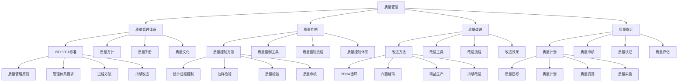

# 质量管理

## 🎯 学习目标
掌握质量管理理论和方法，学会建立质量管理体系，提升产品质量和服务质量。

## 📊 质量管理框架

### 质量管理模型

## 🏗️ 质量管理体系

### ISO 9001标准
**质量管理原则**：
- **质量管理原则**：质量管理基本原则
- **客户导向**：以客户为中心
- **领导作用**：领导层的作用
- **全员参与**：全员参与质量管理
- **过程方法**：过程方法管理

**管理体系要求**：
- **管理体系要求**：管理体系要求
- **组织环境**：组织环境分析
- **领导作用**：领导作用要求
- **策划**：质量管理策划
- **支持**：资源支持要求

**过程方法**：
- **过程方法**：过程方法管理
- **过程识别**：过程识别
- **过程管理**：过程管理
- **过程改进**：过程改进
- **过程监控**：过程监控

**持续改进**：
- **持续改进**：持续改进
- **改进机会**：改进机会识别
- **改进实施**：改进实施
- **改进效果**：改进效果评估
- **改进文化**：改进文化建设

### 质量方针
**质量目标**：
- **质量目标**：质量目标设定
- **目标层次**：目标层次分解
- **目标量化**：目标量化指标
- **目标评估**：目标评估标准

**质量承诺**：
- **质量承诺**：质量承诺
- **承诺内容**：承诺内容
- **承诺实施**：承诺实施
- **承诺监控**：承诺监控

**质量文化**：
- **质量文化**：质量文化建设
- **文化要素**：文化要素
- **文化传播**：文化传播
- **文化评估**：文化评估

**质量责任**：
- **质量责任**：质量责任
- **责任分工**：责任分工
- **责任考核**：责任考核
- **责任追究**：责任追究

### 质量手册
**质量体系**：
- **质量体系**：质量体系
- **体系结构**：体系结构
- **体系要素**：体系要素
- **体系运行**：体系运行

**质量程序**：
- **质量程序**：质量程序
- **程序文件**：程序文件
- **程序实施**：程序实施
- **程序监控**：程序监控

**质量记录**：
- **质量记录**：质量记录
- **记录管理**：记录管理
- **记录保存**：记录保存
- **记录分析**：记录分析

**质量审核**：
- **质量审核**：质量审核
- **审核计划**：审核计划
- **审核实施**：审核实施
- **审核报告**：审核报告

### 质量文化
**质量文化**：
- **质量文化**：质量文化建设
- **文化理念**：文化理念
- **文化行为**：文化行为
- **文化制度**：文化制度

**文化建设**：
- **文化建设**：文化建设
- **文化传播**：文化传播
- **文化培训**：文化培训
- **文化评估**：文化评估

## 🔧 质量控制

### 质量控制方法
**统计过程控制**：
- **统计过程控制**：统计过程控制
- **控制图**：控制图应用
- **过程能力**：过程能力分析
- **过程监控**：过程监控

**抽样检验**：
- **抽样检验**：抽样检验
- **抽样方案**：抽样方案设计
- **抽样实施**：抽样实施
- **抽样分析**：抽样分析

**质量检验**：
- **质量检验**：质量检验
- **检验计划**：检验计划
- **检验实施**：检验实施
- **检验结果**：检验结果

**质量审核**：
- **质量审核**：质量审核
- **审核计划**：审核计划
- **审核实施**：审核实施
- **审核报告**：审核报告

### 质量控制工具
**控制图**：
- **控制图**：控制图
- **控制图类型**：控制图类型
- **控制图应用**：控制图应用
- **控制图分析**：控制图分析

**直方图**：
- **直方图**：直方图
- **直方图绘制**：直方图绘制
- **直方图分析**：直方图分析
- **直方图应用**：直方图应用

**散点图**：
- **散点图**：散点图
- **散点图绘制**：散点图绘制
- **散点图分析**：散点图分析
- **散点图应用**：散点图应用

**检查表**：
- **检查表**：检查表
- **检查表设计**：检查表设计
- **检查表应用**：检查表应用
- **检查表分析**：检查表分析

### 质量控制流程
**来料检验**：
- **来料检验**：来料检验
- **检验标准**：检验标准
- **检验方法**：检验方法
- **检验结果**：检验结果

**过程检验**：
- **过程检验**：过程检验
- **检验点**：检验点设置
- **检验方法**：检验方法
- **检验结果**：检验结果

**成品检验**：
- **成品检验**：成品检验
- **检验标准**：检验标准
- **检验方法**：检验方法
- **检验结果**：检验结果

**出厂检验**：
- **出厂检验**：出厂检验
- **检验标准**：检验标准
- **检验方法**：检验方法
- **检验结果**：检验结果

### 质量控制体系
**质量控制体系**：
- **质量控制体系**：质量控制体系
- **体系设计**：体系设计
- **体系实施**：体系实施
- **体系监控**：体系监控

**质量控制标准**：
- **质量控制标准**：质量控制标准
- **标准制定**：标准制定
- **标准实施**：标准实施
- **标准维护**：标准维护

## 🚀 质量改进

### 改进方法
**PDCA循环**：
- **PDCA循环**：PDCA循环
- **Plan计划**：制定改进计划
- **Do执行**：执行改进措施
- **Check检查**：检查改进效果
- **Act行动**：标准化改进措施

**六西格玛**：
- **六西格玛**：六西格玛
- **DMAIC方法**：定义、测量、分析、改进、控制
- **质量改进**：质量持续改进
- **流程优化**：流程持续优化
- **成本降低**：成本持续降低

**精益生产**：
- **精益生产**：精益生产
- **浪费消除**：浪费消除
- **价值流优化**：价值流优化
- **流程改进**：流程改进
- **持续改进**：持续改进

**持续改进**：
- **持续改进**：持续改进
- **改进文化**：改进文化建设
- **改进方法**：改进方法
- **改进实施**：改进实施
- **改进效果**：改进效果评估

### 改进工具
**头脑风暴**：
- **头脑风暴**：头脑风暴
- **头脑风暴方法**：头脑风暴方法
- **头脑风暴应用**：头脑风暴应用
- **头脑风暴效果**：头脑风暴效果

**鱼骨图**：
- **鱼骨图**：鱼骨图
- **鱼骨图绘制**：鱼骨图绘制
- **鱼骨图分析**：鱼骨图分析
- **鱼骨图应用**：鱼骨图应用

**5W1H**：
- **5W1H**：5W1H方法
- **5W1H应用**：5W1H应用
- **5W1H分析**：5W1H分析
- **5W1H效果**：5W1H效果

**帕累托分析**：
- **帕累托分析**：帕累托分析
- **帕累托图**：帕累托图
- **帕累托分析应用**：帕累托分析应用
- **帕累托分析效果**：帕累托分析效果

### 改进流程
**改进流程**：
- **改进流程**：改进流程
- **问题识别**：问题识别
- **原因分析**：原因分析
- **改进措施**：改进措施
- **效果评估**：效果评估

**改进实施**：
- **改进实施**：改进实施
- **实施计划**：实施计划
- **实施监控**：实施监控
- **实施效果**：实施效果

**改进评估**：
- **改进评估**：改进评估
- **评估方法**：评估方法
- **评估指标**：评估指标
- **评估结果**：评估结果

### 改进效果
**质量提升**：
- **质量提升**：质量提升效果
- **质量指标**：质量指标改善
- **质量分析**：质量分析
- **质量持续**：质量持续提升

**成本降低**：
- **成本降低**：成本降低效果
- **成本指标**：成本指标改善
- **成本分析**：成本分析
- **成本持续**：成本持续降低

**效率提高**：
- **效率提高**：效率提高效果
- **效率指标**：效率指标改善
- **效率分析**：效率分析
- **效率持续**：效率持续提高

**客户满意**：
- **客户满意**：客户满意度提升
- **客户指标**：客户指标改善
- **客户分析**：客户分析
- **客户持续**：客户持续满意

## 🛡️ 质量保证

### 质量计划
**质量目标**：
- **质量目标**：质量目标设定
- **目标层次**：目标层次分解
- **目标量化**：目标量化指标
- **目标评估**：目标评估标准

**质量计划**：
- **质量计划**：质量计划制定
- **计划内容**：计划内容
- **计划实施**：计划实施
- **计划监控**：计划监控

**质量资源**：
- **质量资源**：质量资源
- **人力资源**：人力资源
- **物质资源**：物质资源
- **信息资源**：信息资源

**质量实施**：
- **质量实施**：质量实施
- **实施计划**：实施计划
- **实施监控**：实施监控
- **实施效果**：实施效果

### 质量审核
**质量审核**：
- **质量审核**：质量审核
- **审核计划**：审核计划
- **审核实施**：审核实施
- **审核报告**：审核报告

**内部审核**：
- **内部审核**：内部审核
- **审核计划**：审核计划
- **审核实施**：审核实施
- **审核报告**：审核报告

**外部审核**：
- **外部审核**：外部审核
- **审核准备**：审核准备
- **审核配合**：审核配合
- **审核结果**：审核结果

### 质量认证
**质量认证**：
- **质量认证**：质量认证
- **认证标准**：认证标准
- **认证流程**：认证流程
- **认证维护**：认证维护

**ISO认证**：
- **ISO认证**：ISO认证
- **认证准备**：认证准备
- **认证实施**：认证实施
- **认证维护**：认证维护

**行业认证**：
- **行业认证**：行业认证
- **认证标准**：认证标准
- **认证流程**：认证流程
- **认证维护**：认证维护

### 质量评估
**质量评估**：
- **质量评估**：质量评估
- **评估方法**：评估方法
- **评估指标**：评估指标
- **评估结果**：评估结果

**质量绩效**：
- **质量绩效**：质量绩效
- **绩效指标**：绩效指标
- **绩效评估**：绩效评估
- **绩效改进**：绩效改进

## 💡 质量管理案例

### 成功案例
**丰田质量管理**：
- **质量管理体系**：完善的质量管理体系
- **质量控制**：严格的质量控制
- **质量改进**：持续的质量改进
- **效果**：质量水平行业领先

**苹果质量管理**：
- **质量管理体系**：创新的质量管理体系
- **质量控制**：严格的质量控制
- **质量改进**：持续的质量改进
- **效果**：产品质量极高

**华为质量管理**：
- **质量管理体系**：系统化的质量管理体系
- **质量控制**：全面的质量控制
- **质量改进**：持续的质量改进
- **效果**：质量水平不断提升

### 失败案例
**失败原因**：
- **质量管理体系不完善**：质量管理体系不完善
- **质量控制不严格**：质量控制不严格
- **质量改进不足**：质量改进不足
- **质量文化缺失**：质量文化缺失

**失败教训**：
- **质量管理体系**：建立完善的质量管理体系
- **质量控制**：实施严格的质量控制
- **质量改进**：持续的质量改进
- **质量文化**：建设质量文化

## 🧠 学习要点

### 费曼学习法应用
1. **选择概念**：质量管理
2. **简化解释**：用简单语言解释质量管理
3. **识别盲点**：找出理解不足的地方
4. **重新学习**：针对盲点深入学习

### 刻意练习要点
- **理论掌握**：掌握质量管理理论
- **方法应用**：掌握质量管理方法
- **工具使用**：掌握质量管理工具
- **实践应用**：实践应用质量管理

## 🔗 关联学习

### 前置知识
- [[02-流程设计与管理]] - 流程设计与管理
- [[01-运营管理概论]] - 运营管理概论
- [[01-商业系统理论]] - 系统思维

### 后续学习
- [[04-供应链管理]] - 供应链管理
- [[01-精益生产]] - 精益生产
- [[04-六西格玛]] - 六西格玛

### 实践应用
- 企业质量管理
- 质量管理体系建立
- 质量控制实施
- 质量改进推进

## 🎯 学习检验

### 理解检验
- [ ] 能够理解质量管理理论
- [ ] 能够掌握质量管理方法
- [ ] 能够应用质量管理工具
- [ ] 能够建立质量管理体系

### 应用检验
- [ ] 能够建立质量管理体系
- [ ] 能够实施质量控制
- [ ] 能够推进质量改进
- [ ] 能够评估质量效果

---
**下一步**：[[04-供应链管理]] - 供应链管理