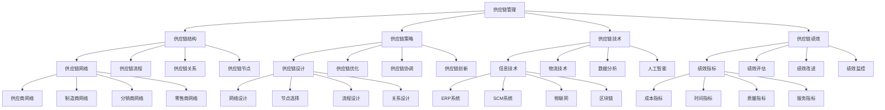

# 供应链管理

## 🎯 学习目标
掌握供应链管理理论和方法，学会设计和优化供应链网络，提升供应链效率和竞争力。

## 📊 供应链管理框架

### 供应链管理模型

## 🏗️ 供应链结构

### 供应链网络
**供应商网络**：
- **供应商网络**：供应商网络管理
- **供应商选择**：供应商选择
- **供应商评估**：供应商评估
- **供应商关系**：供应商关系管理

**制造商网络**：
- **制造商网络**：制造商网络管理
- **生产计划**：生产计划
- **生产协调**：生产协调
- **生产优化**：生产优化

**分销商网络**：
- **分销商网络**：分销商网络管理
- **分销策略**：分销策略
- **分销渠道**：分销渠道
- **分销优化**：分销优化

**零售商网络**：
- **零售商网络**：零售商网络管理
- **零售策略**：零售策略
- **零售渠道**：零售渠道
- **零售优化**：零售优化

### 供应链流程
**计划流程**：
- **计划流程**：计划流程管理
- **需求计划**：需求计划
- **供应计划**：供应计划
- **生产计划**：生产计划

**采购流程**：
- **采购流程**：采购流程管理
- **采购计划**：采购计划
- **采购执行**：采购执行
- **采购监控**：采购监控

**生产流程**：
- **生产流程**：生产流程管理
- **生产计划**：生产计划
- **生产执行**：生产执行
- **生产监控**：生产监控

**配送流程**：
- **配送流程**：配送流程管理
- **配送计划**：配送计划
- **配送执行**：配送执行
- **配送监控**：配送监控

### 供应链关系
**供应商关系**：
- **供应商关系**：供应商关系管理
- **关系类型**：关系类型
- **关系建立**：关系建立
- **关系维护**：关系维护

**客户关系**：
- **客户关系**：客户关系管理
- **关系类型**：关系类型
- **关系建立**：关系建立
- **关系维护**：关系维护

**合作伙伴关系**：
- **合作伙伴关系**：合作伙伴关系管理
- **关系类型**：关系类型
- **关系建立**：关系建立
- **关系维护**：关系维护

**竞争关系**：
- **竞争关系**：竞争关系管理
- **竞争分析**：竞争分析
- **竞争策略**：竞争策略
- **竞争优势**：竞争优势

### 供应链节点
**供应链节点**：
- **供应链节点**：供应链节点管理
- **节点类型**：节点类型
- **节点功能**：节点功能
- **节点优化**：节点优化

**节点管理**：
- **节点管理**：节点管理
- **节点选择**：节点选择
- **节点配置**：节点配置
- **节点监控**：节点监控

## 🎯 供应链策略

### 供应链设计
**网络设计**：
- **网络设计**：供应链网络设计
- **网络结构**：网络结构设计
- **网络优化**：网络优化
- **网络评估**：网络评估

**节点选择**：
- **节点选择**：节点选择
- **选择标准**：选择标准
- **选择方法**：选择方法
- **选择评估**：选择评估

**流程设计**：
- **流程设计**：流程设计
- **流程优化**：流程优化
- **流程标准化**：流程标准化
- **流程监控**：流程监控

**关系设计**：
- **关系设计**：关系设计
- **关系类型**：关系类型
- **关系建立**：关系建立
- **关系维护**：关系维护

### 供应链优化
**成本优化**：
- **成本优化**：成本优化
- **成本分析**：成本分析
- **成本控制**：成本控制
- **成本降低**：成本降低

**时间优化**：
- **时间优化**：时间优化
- **时间分析**：时间分析
- **时间控制**：时间控制
- **时间缩短**：时间缩短

**质量优化**：
- **质量优化**：质量优化
- **质量分析**：质量分析
- **质量控制**：质量控制
- **质量提升**：质量提升

**风险优化**：
- **风险优化**：风险优化
- **风险识别**：风险识别
- **风险评估**：风险评估
- **风险控制**：风险控制

### 供应链协调
**信息协调**：
- **信息协调**：信息协调
- **信息共享**：信息共享
- **信息同步**：信息同步
- **信息安全**：信息安全

**决策协调**：
- **决策协调**：决策协调
- **决策机制**：决策机制
- **决策流程**：决策流程
- **决策优化**：决策优化

**激励协调**：
- **激励协调**：激励协调
- **激励机制**：激励机制
- **激励设计**：激励设计
- **激励效果**：激励效果

**文化协调**：
- **文化协调**：文化协调
- **文化融合**：文化融合
- **文化传播**：文化传播
- **文化评估**：文化评估

### 供应链创新
**供应链创新**：
- **供应链创新**：供应链创新
- **创新类型**：创新类型
- **创新方法**：创新方法
- **创新实施**：创新实施

**技术创新**：
- **技术创新**：技术创新
- **技术应用**：技术应用
- **技术集成**：技术集成
- **技术效果**：技术效果

**模式创新**：
- **模式创新**：模式创新
- **模式设计**：模式设计
- **模式实施**：模式实施
- **模式效果**：模式效果

## 💻 供应链技术

### 信息技术
**ERP系统**：
- **ERP系统**：ERP系统
- **系统功能**：系统功能
- **系统实施**：系统实施
- **系统优化**：系统优化

**SCM系统**：
- **SCM系统**：SCM系统
- **系统功能**：系统功能
- **系统实施**：系统实施
- **系统优化**：系统优化

**物联网**：
- **物联网**：物联网技术
- **技术应用**：技术应用
- **技术集成**：技术集成
- **技术效果**：技术效果

**区块链**：
- **区块链**：区块链技术
- **技术应用**：技术应用
- **技术集成**：技术集成
- **技术效果**：技术效果

### 物流技术
**自动化设备**：
- **自动化设备**：自动化设备
- **设备类型**：设备类型
- **设备应用**：设备应用
- **设备优化**：设备优化

**智能仓储**：
- **智能仓储**：智能仓储
- **仓储系统**：仓储系统
- **仓储优化**：仓储优化
- **仓储监控**：仓储监控

**运输优化**：
- **运输优化**：运输优化
- **路线优化**：路线优化
- **运输方式**：运输方式
- **运输监控**：运输监控

**最后一公里**：
- **最后一公里**：最后一公里配送
- **配送方式**：配送方式
- **配送优化**：配送优化
- **配送监控**：配送监控

### 数据分析
**需求预测**：
- **需求预测**：需求预测
- **预测方法**：预测方法
- **预测模型**：预测模型
- **预测精度**：预测精度

**库存优化**：
- **库存优化**：库存优化
- **优化方法**：优化方法
- **优化模型**：优化模型
- **优化效果**：优化效果

**风险分析**：
- **风险分析**：风险分析
- **分析方法**：分析方法
- **分析模型**：分析模型
- **分析结果**：分析结果

**绩效分析**：
- **绩效分析**：绩效分析
- **分析指标**：分析指标
- **分析方法**：分析方法
- **分析结果**：分析结果

### 人工智能
**人工智能**：
- **人工智能**：人工智能技术
- **技术应用**：技术应用
- **技术集成**：技术集成
- **技术效果**：技术效果

**机器学习**：
- **机器学习**：机器学习技术
- **技术应用**：技术应用
- **技术集成**：技术集成
- **技术效果**：技术效果

**深度学习**：
- **深度学习**：深度学习技术
- **技术应用**：技术应用
- **技术集成**：技术集成
- **技术效果**：技术效果

## 📈 供应链绩效

### 绩效指标
**成本指标**：
- **成本指标**：成本指标
- **总成本**：总成本
- **单位成本**：单位成本
- **成本结构**：成本结构

**时间指标**：
- **时间指标**：时间指标
- **周期时间**：周期时间
- **响应时间**：响应时间
- **交付时间**：交付时间

**质量指标**：
- **质量指标**：质量指标
- **产品质量**：产品质量
- **服务质量**：服务质量
- **过程质量**：过程质量

**服务指标**：
- **服务指标**：服务指标
- **客户满意度**：客户满意度
- **服务水平**：服务水平
- **服务可靠性**：服务可靠性

### 绩效评估
**绩效评估**：
- **绩效评估**：绩效评估
- **评估方法**：评估方法
- **评估指标**：评估指标
- **评估结果**：评估结果

**评估体系**：
- **评估体系**：评估体系
- **体系设计**：体系设计
- **体系实施**：体系实施
- **体系优化**：体系优化

**评估工具**：
- **评估工具**：评估工具
- **工具选择**：工具选择
- **工具应用**：工具应用
- **工具效果**：工具效果

### 绩效改进
**绩效改进**：
- **绩效改进**：绩效改进
- **改进识别**：改进机会识别
- **改进实施**：改进实施
- **改进效果**：改进效果

**改进方法**：
- **改进方法**：改进方法
- **方法选择**：方法选择
- **方法应用**：方法应用
- **方法效果**：方法效果

**改进流程**：
- **改进流程**：改进流程
- **流程设计**：流程设计
- **流程实施**：流程实施
- **流程优化**：流程优化

### 绩效监控
**绩效监控**：
- **绩效监控**：绩效监控
- **监控体系**：监控体系
- **监控指标**：监控指标
- **监控方法**：监控方法

**监控工具**：
- **监控工具**：监控工具
- **工具选择**：工具选择
- **工具应用**：工具应用
- **工具效果**：工具效果

**监控系统**：
- **监控系统**：监控系统
- **系统设计**：系统设计
- **系统实施**：系统实施
- **系统优化**：系统优化

## 💡 供应链管理案例

### 成功案例
**苹果供应链**：
- **供应链设计**：全球供应链网络
- **供应链优化**：持续供应链优化
- **供应链技术**：先进技术应用
- **效果**：供应链效率极高

**亚马逊供应链**：
- **供应链设计**：创新供应链模式
- **供应链优化**：智能化供应链优化
- **供应链技术**：技术驱动供应链
- **效果**：供应链效率行业领先

**丰田供应链**：
- **供应链设计**：精益供应链设计
- **供应链优化**：持续改进优化
- **供应链协调**：紧密供应链协调
- **效果**：供应链效率质量双优

### 失败案例
**失败原因**：
- **供应链设计不当**：供应链设计不当
- **供应链协调不足**：供应链协调不足
- **供应链技术落后**：供应链技术落后
- **供应链风险管理缺失**：供应链风险管理缺失

**失败教训**：
- **供应链设计**：重视供应链设计
- **供应链协调**：加强供应链协调
- **供应链技术**：应用先进技术
- **供应链风险管理**：建立风险管理体系

## 🧠 学习要点

### 费曼学习法应用
1. **选择概念**：供应链管理
2. **简化解释**：用简单语言解释供应链管理
3. **识别盲点**：找出理解不足的地方
4. **重新学习**：针对盲点深入学习

### 刻意练习要点
- **理论掌握**：掌握供应链管理理论
- **方法应用**：掌握供应链管理方法
- **工具使用**：掌握供应链管理工具
- **实践应用**：实践应用供应链管理

## 🔗 关联学习

### 前置知识
- [[03-质量管理]] - 质量管理
- [[02-流程设计与管理]] - 流程设计与管理
- [[01-运营管理概论]] - 运营管理概论

### 后续学习
- [[01-生产计划与控制]] - 生产计划与控制
- [[02-库存管理]] - 库存管理
- [[01-精益生产]] - 精益生产

### 实践应用
- 企业供应链管理
- 供应链网络设计
- 供应链优化改进
- 供应链绩效提升

## 🎯 学习检验

### 理解检验
- [ ] 能够理解供应链管理理论
- [ ] 能够掌握供应链管理方法
- [ ] 能够应用供应链管理工具
- [ ] 能够设计供应链网络

### 应用检验
- [ ] 能够设计供应链网络
- [ ] 能够优化供应链流程
- [ ] 能够协调供应链关系
- [ ] 能够提升供应链绩效

---
**下一步**：[[01-生产计划与控制]] - 生产计划与控制