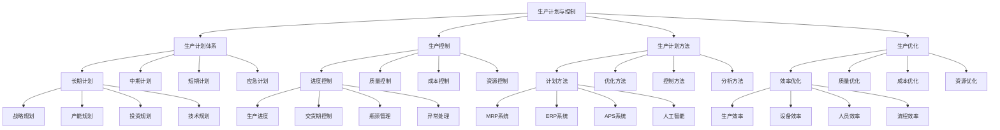

# 生产计划与控制

## 🎯 学习目标
掌握生产计划与控制理论和方法，学会制定生产计划，控制生产进度，提升生产效率。

## 📊 生产计划与控制框架

### 生产计划与控制模型

## 📋 生产计划体系

### 长期计划
**战略规划**：
- **战略规划**：生产战略规划
- **战略目标**：战略目标设定
- **战略分析**：战略分析
- **战略实施**：战略实施

**产能规划**：
- **产能规划**：产能规划
- **产能分析**：产能分析
- **产能设计**：产能设计
- **产能建设**：产能建设

**投资规划**：
- **投资规划**：投资规划
- **投资分析**：投资分析
- **投资决策**：投资决策
- **投资实施**：投资实施

**技术规划**：
- **技术规划**：技术规划
- **技术分析**：技术分析
- **技术选择**：技术选择
- **技术实施**：技术实施

### 中期计划
**生产大纲**：
- **生产大纲**：生产大纲制定
- **大纲内容**：大纲内容
- **大纲实施**：大纲实施
- **大纲监控**：大纲监控

**资源计划**：
- **资源计划**：资源计划
- **资源分析**：资源分析
- **资源配置**：资源配置
- **资源优化**：资源优化

**能力计划**：
- **能力计划**：能力计划
- **能力分析**：能力分析
- **能力建设**：能力建设
- **能力优化**：能力优化

**库存计划**：
- **库存计划**：库存计划
- **库存分析**：库存分析
- **库存控制**：库存控制
- **库存优化**：库存优化

### 短期计划
**主生产计划**：
- **主生产计划**：主生产计划
- **计划制定**：计划制定
- **计划实施**：计划实施
- **计划监控**：计划监控

**物料需求计划**：
- **物料需求计划**：物料需求计划
- **需求分析**：需求分析
- **需求计算**：需求计算
- **需求实施**：需求实施

**车间作业计划**：
- **车间作业计划**：车间作业计划
- **作业安排**：作业安排
- **作业执行**：作业执行
- **作业监控**：作业监控

**生产调度**：
- **生产调度**：生产调度
- **调度策略**：调度策略
- **调度实施**：调度实施
- **调度优化**：调度优化

### 应急计划
**应急计划**：
- **应急计划**：应急计划
- **应急识别**：应急识别
- **应急准备**：应急准备
- **应急响应**：应急响应

**应急管理**：
- **应急管理**：应急管理
- **管理流程**：管理流程
- **管理措施**：管理措施
- **管理效果**：管理效果

## 🎛️ 生产控制

### 进度控制
**生产进度**：
- **生产进度**：生产进度控制
- **进度计划**：进度计划
- **进度监控**：进度监控
- **进度调整**：进度调整

**交货期控制**：
- **交货期控制**：交货期控制
- **交货计划**：交货计划
- **交货监控**：交货监控
- **交货调整**：交货调整

**瓶颈管理**：
- **瓶颈管理**：瓶颈管理
- **瓶颈识别**：瓶颈识别
- **瓶颈分析**：瓶颈分析
- **瓶颈解决**：瓶颈解决

**异常处理**：
- **异常处理**：异常处理
- **异常识别**：异常识别
- **异常分析**：异常分析
- **异常解决**：异常解决

### 质量控制
**过程控制**：
- **过程控制**：过程控制
- **控制标准**：控制标准
- **控制方法**：控制方法
- **控制效果**：控制效果

**质量检验**：
- **质量检验**：质量检验
- **检验标准**：检验标准
- **检验方法**：检验方法
- **检验结果**：检验结果

**不良品处理**：
- **不良品处理**：不良品处理
- **处理流程**：处理流程
- **处理方法**：处理方法
- **处理效果**：处理效果

**质量改进**：
- **质量改进**：质量改进
- **改进识别**：改进识别
- **改进实施**：改进实施
- **改进效果**：改进效果

### 成本控制
**成本预算**：
- **成本预算**：成本预算
- **预算制定**：预算制定
- **预算实施**：预算实施
- **预算监控**：预算监控

**成本监控**：
- **成本监控**：成本监控
- **监控指标**：监控指标
- **监控方法**：监控方法
- **监控结果**：监控结果

**成本分析**：
- **成本分析**：成本分析
- **分析方法**：分析方法
- **分析结果**：分析结果
- **分析应用**：分析应用

**成本改进**：
- **成本改进**：成本改进
- **改进识别**：改进识别
- **改进实施**：改进实施
- **改进效果**：改进效果

### 资源控制
**资源控制**：
- **资源控制**：资源控制
- **控制标准**：控制标准
- **控制方法**：控制方法
- **控制效果**：控制效果

**资源优化**：
- **资源优化**：资源优化
- **优化方法**：优化方法
- **优化实施**：优化实施
- **优化效果**：优化效果

## 🛠️ 生产计划方法

### 计划方法
**MRP系统**：
- **MRP系统**：MRP系统
- **系统功能**：系统功能
- **系统实施**：系统实施
- **系统优化**：系统优化

**ERP系统**：
- **ERP系统**：ERP系统
- **系统功能**：系统功能
- **系统实施**：系统实施
- **系统优化**：系统优化

**APS系统**：
- **APS系统**：APS系统
- **系统功能**：系统功能
- **系统实施**：系统实施
- **系统优化**：系统优化

**人工智能**：
- **人工智能**：人工智能技术
- **技术应用**：技术应用
- **技术集成**：技术集成
- **技术效果**：技术效果

### 优化方法
**线性规划**：
- **线性规划**：线性规划方法
- **模型构建**：模型构建
- **求解方法**：求解方法
- **结果分析**：结果分析

**整数规划**：
- **整数规划**：整数规划方法
- **模型构建**：模型构建
- **求解方法**：求解方法
- **结果分析**：结果分析

**启发式算法**：
- **启发式算法**：启发式算法
- **算法类型**：算法类型
- **算法应用**：算法应用
- **算法效果**：算法效果

**仿真优化**：
- **仿真优化**：仿真优化
- **仿真模型**：仿真模型
- **仿真实施**：仿真实施
- **仿真结果**：仿真结果

### 控制方法
**控制方法**：
- **控制方法**：控制方法
- **方法类型**：方法类型
- **方法应用**：方法应用
- **方法效果**：方法效果

**控制工具**：
- **控制工具**：控制工具
- **工具选择**：工具选择
- **工具应用**：工具应用
- **工具效果**：工具效果

**控制技术**：
- **控制技术**：控制技术
- **技术选择**：技术选择
- **技术应用**：技术应用
- **技术效果**：技术效果

### 分析方法
**分析方法**：
- **分析方法**：分析方法
- **方法类型**：方法类型
- **方法应用**：方法应用
- **方法效果**：方法效果

**分析工具**：
- **分析工具**：分析工具
- **工具选择**：工具选择
- **工具应用**：工具应用
- **工具效果**：工具效果

**分析技术**：
- **分析技术**：分析技术
- **技术选择**：技术选择
- **技术应用**：技术应用
- **技术效果**：技术效果

## 🚀 生产优化

### 效率优化
**生产效率**：
- **生产效率**：生产效率优化
- **效率分析**：效率分析
- **效率提升**：效率提升
- **效率监控**：效率监控

**设备效率**：
- **设备效率**：设备效率优化
- **效率分析**：效率分析
- **效率提升**：效率提升
- **效率监控**：效率监控

**人员效率**：
- **人员效率**：人员效率优化
- **效率分析**：效率分析
- **效率提升**：效率提升
- **效率监控**：效率监控

**流程效率**：
- **流程效率**：流程效率优化
- **效率分析**：效率分析
- **效率提升**：效率提升
- **效率监控**：效率监控

### 质量优化
**质量优化**：
- **质量优化**：质量优化
- **优化方法**：优化方法
- **优化实施**：优化实施
- **优化效果**：优化效果

**质量提升**：
- **质量提升**：质量提升
- **提升方法**：提升方法
- **提升实施**：提升实施
- **提升效果**：提升效果

### 成本优化
**成本优化**：
- **成本优化**：成本优化
- **优化方法**：优化方法
- **优化实施**：优化实施
- **优化效果**：优化效果

**成本降低**：
- **成本降低**：成本降低
- **降低方法**：降低方法
- **降低实施**：降低实施
- **降低效果**：降低效果

### 资源优化
**资源优化**：
- **资源优化**：资源优化
- **优化方法**：优化方法
- **优化实施**：优化实施
- **优化效果**：优化效果

**资源利用**：
- **资源利用**：资源利用优化
- **利用分析**：利用分析
- **利用提升**：利用提升
- **利用监控**：利用监控

## 💡 生产计划与控制案例

### 成功案例
**丰田生产系统**：
- **生产计划**：精益生产计划
- **生产控制**：严格生产控制
- **生产优化**：持续生产优化
- **效果**：生产效率质量双优

**苹果生产管理**：
- **生产计划**：精准生产计划
- **生产控制**：严格生产控制
- **生产优化**：持续生产优化
- **效果**：生产效率极高

**华为生产管理**：
- **生产计划**：系统化生产计划
- **生产控制**：全面生产控制
- **生产优化**：持续生产优化
- **效果**：生产效率不断提升

### 失败案例
**失败原因**：
- **生产计划不当**：生产计划不当
- **生产控制不严**：生产控制不严
- **生产优化不足**：生产优化不足
- **生产管理缺失**：生产管理缺失

**失败教训**：
- **生产计划**：重视生产计划
- **生产控制**：严格生产控制
- **生产优化**：持续生产优化
- **生产管理**：完善生产管理

## 🧠 学习要点

### 费曼学习法应用
1. **选择概念**：生产计划与控制
2. **简化解释**：用简单语言解释生产计划与控制
3. **识别盲点**：找出理解不足的地方
4. **重新学习**：针对盲点深入学习

### 刻意练习要点
- **理论掌握**：掌握生产计划与控制理论
- **方法应用**：掌握生产计划与控制方法
- **工具使用**：掌握生产计划与控制工具
- **实践应用**：实践应用生产计划与控制

## 🔗 关联学习

### 前置知识
- [[04-供应链管理]] - 供应链管理
- [[03-质量管理]] - 质量管理
- [[02-流程设计与管理]] - 流程设计与管理

### 后续学习
- [[02-库存管理]] - 库存管理
- [[03-精益生产]] - 精益生产
- [[04-六西格玛]] - 六西格玛

### 实践应用
- 企业生产计划制定
- 生产进度控制
- 生产优化改进
- 生产效率提升

## 🎯 学习检验

### 理解检验
- [ ] 能够理解生产计划与控制理论
- [ ] 能够掌握生产计划与控制方法
- [ ] 能够应用生产计划与控制工具
- [ ] 能够制定生产计划

### 应用检验
- [ ] 能够制定生产计划
- [ ] 能够控制生产进度
- [ ] 能够优化生产过程
- [ ] 能够提升生产效率

---
**下一步**：[[02-库存管理]] - 库存管理