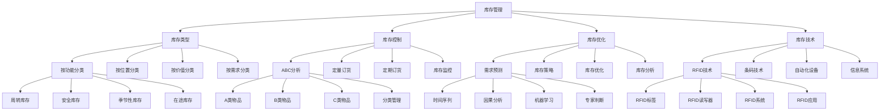

# 库存管理

## 🎯 学习目标
掌握库存管理理论和方法，学会优化库存水平，平衡库存成本和服务水平，提升库存管理效率。

## 📊 库存管理框架

### 库存管理模型

## 📦 库存类型

### 按功能分类
**周转库存**：
- **周转库存**：周转库存管理
- **库存计算**：库存计算
- **库存控制**：库存控制
- **库存优化**：库存优化

**安全库存**：
- **安全库存**：安全库存管理
- **安全库存计算**：安全库存计算
- **安全库存控制**：安全库存控制
- **安全库存优化**：安全库存优化

**季节性库存**：
- **季节性库存**：季节性库存管理
- **季节性分析**：季节性分析
- **季节性计划**：季节性计划
- **季节性控制**：季节性控制

**在途库存**：
- **在途库存**：在途库存管理
- **在途监控**：在途监控
- **在途控制**：在途控制
- **在途优化**：在途优化

### 按位置分类
**原材料库存**：
- **原材料库存**：原材料库存管理
- **库存控制**：库存控制
- **库存优化**：库存优化
- **库存监控**：库存监控

**在制品库存**：
- **在制品库存**：在制品库存管理
- **库存控制**：库存控制
- **库存优化**：库存优化
- **库存监控**：库存监控

**成品库存**：
- **成品库存**：成品库存管理
- **库存控制**：库存控制
- **库存优化**：库存优化
- **库存监控**：库存监控

**维修库存**：
- **维修库存**：维修库存管理
- **库存控制**：库存控制
- **库存优化**：库存优化
- **库存监控**：库存监控

### 按价值分类
**高价值库存**：
- **高价值库存**：高价值库存管理
- **库存控制**：库存控制
- **库存优化**：库存优化
- **库存监控**：库存监控

**中价值库存**：
- **中价值库存**：中价值库存管理
- **库存控制**：库存控制
- **库存优化**：库存优化
- **库存监控**：库存监控

**低价值库存**：
- **低价值库存**：低价值库存管理
- **库存控制**：库存控制
- **库存优化**：库存优化
- **库存监控**：库存监控

### 按需求分类
**独立需求库存**：
- **独立需求库存**：独立需求库存管理
- **需求分析**：需求分析
- **库存控制**：库存控制
- **库存优化**：库存优化

**相关需求库存**：
- **相关需求库存**：相关需求库存管理
- **需求分析**：需求分析
- **库存控制**：库存控制
- **库存优化**：库存优化

## 🎛️ 库存控制方法

### ABC分析
**A类物品**：
- **A类物品**：A类物品管理
- **物品识别**：物品识别
- **管理策略**：管理策略
- **控制方法**：控制方法

**B类物品**：
- **B类物品**：B类物品管理
- **物品识别**：物品识别
- **管理策略**：管理策略
- **控制方法**：控制方法

**C类物品**：
- **C类物品**：C类物品管理
- **物品识别**：物品识别
- **管理策略**：管理策略
- **控制方法**：控制方法

**分类管理**：
- **分类管理**：分类管理
- **分类标准**：分类标准
- **分类方法**：分类方法
- **分类效果**：分类效果

### 定量订货
**经济订货量**：
- **经济订货量**：经济订货量计算
- **EOQ公式**：EOQ公式
- **计算参数**：计算参数
- **计算结果**：计算结果

**订货点**：
- **订货点**：订货点计算
- **订货点公式**：订货点公式
- **计算参数**：计算参数
- **计算结果**：计算结果

**安全库存**：
- **安全库存**：安全库存计算
- **安全库存公式**：安全库存公式
- **计算参数**：计算参数
- **计算结果**：计算结果

**订货周期**：
- **订货周期**：订货周期管理
- **周期计算**：周期计算
- **周期控制**：周期控制
- **周期优化**：周期优化

### 定期订货
**订货周期**：
- **订货周期**：订货周期管理
- **周期设定**：周期设定
- **周期控制**：周期控制
- **周期优化**：周期优化

**最大库存**：
- **最大库存**：最大库存设定
- **设定方法**：设定方法
- **设定标准**：设定标准
- **设定效果**：设定效果

**订货量**：
- **订货量**：订货量计算
- **计算方法**：计算方法
- **计算参数**：计算参数
- **计算结果**：计算结果

**库存检查**：
- **库存检查**：库存检查
- **检查方法**：检查方法
- **检查频率**：检查频率
- **检查结果**：检查结果

### 库存监控
**库存监控**：
- **库存监控**：库存监控
- **监控指标**：监控指标
- **监控方法**：监控方法
- **监控结果**：监控结果

**监控体系**：
- **监控体系**：监控体系
- **体系设计**：体系设计
- **体系实施**：体系实施
- **体系优化**：体系优化

## 🚀 库存优化

### 需求预测
**时间序列**：
- **时间序列**：时间序列分析
- **分析方法**：分析方法
- **分析模型**：分析模型
- **分析结果**：分析结果

**因果分析**：
- **因果分析**：因果分析
- **分析方法**：分析方法
- **分析模型**：分析模型
- **分析结果**：分析结果

**机器学习**：
- **机器学习**：机器学习方法
- **算法选择**：算法选择
- **模型训练**：模型训练
- **预测结果**：预测结果

**专家判断**：
- **专家判断**：专家判断
- **判断方法**：判断方法
- **判断标准**：判断标准
- **判断结果**：判断结果

### 库存策略
**推式策略**：
- **推式策略**：推式策略
- **策略特点**：策略特点
- **策略应用**：策略应用
- **策略效果**：策略效果

**拉式策略**：
- **拉式策略**：拉式策略
- **策略特点**：策略特点
- **策略应用**：策略应用
- **策略效果**：策略效果

**混合策略**：
- **混合策略**：混合策略
- **策略设计**：策略设计
- **策略实施**：策略实施
- **策略效果**：策略效果

**协同策略**：
- **协同策略**：协同策略
- **策略设计**：策略设计
- **策略实施**：策略实施
- **策略效果**：策略效果

### 库存优化
**库存优化**：
- **库存优化**：库存优化
- **优化目标**：优化目标
- **优化方法**：优化方法
- **优化效果**：优化效果

**成本优化**：
- **成本优化**：成本优化
- **成本分析**：成本分析
- **成本控制**：成本控制
- **成本降低**：成本降低

**服务水平优化**：
- **服务水平优化**：服务水平优化
- **服务水平分析**：服务水平分析
- **服务水平提升**：服务水平提升
- **服务水平监控**：服务水平监控

### 库存分析
**库存分析**：
- **库存分析**：库存分析
- **分析方法**：分析方法
- **分析指标**：分析指标
- **分析结果**：分析结果

**库存周转率**：
- **库存周转率**：库存周转率分析
- **周转率计算**：周转率计算
- **周转率分析**：周转率分析
- **周转率优化**：周转率优化

**库存准确率**：
- **库存准确率**：库存准确率分析
- **准确率计算**：准确率计算
- **准确率分析**：准确率分析
- **准确率提升**：准确率提升

## 💻 库存技术

### RFID技术
**RFID标签**：
- **RFID标签**：RFID标签
- **标签类型**：标签类型
- **标签应用**：标签应用
- **标签效果**：标签效果

**RFID读写器**：
- **RFID读写器**：RFID读写器
- **读写器类型**：读写器类型
- **读写器应用**：读写器应用
- **读写器效果**：读写器效果

**RFID系统**：
- **RFID系统**：RFID系统
- **系统功能**：系统功能
- **系统实施**：系统实施
- **系统效果**：系统效果

**RFID应用**：
- **RFID应用**：RFID应用
- **应用场景**：应用场景
- **应用效果**：应用效果
- **应用优化**：应用优化

### 条码技术
**条码技术**：
- **条码技术**：条码技术
- **技术类型**：技术类型
- **技术应用**：技术应用
- **技术效果**：技术效果

**条码系统**：
- **条码系统**：条码系统
- **系统功能**：系统功能
- **系统实施**：系统实施
- **系统效果**：系统效果

**条码应用**：
- **条码应用**：条码应用
- **应用场景**：应用场景
- **应用效果**：应用效果
- **应用优化**：应用优化

### 自动化设备
**自动化设备**：
- **自动化设备**：自动化设备
- **设备类型**：设备类型
- **设备功能**：设备功能
- **设备效果**：设备效果

**自动化系统**：
- **自动化系统**：自动化系统
- **系统功能**：系统功能
- **系统实施**：系统实施
- **系统效果**：系统效果

**自动化应用**：
- **自动化应用**：自动化应用
- **应用场景**：应用场景
- **应用效果**：应用效果
- **应用优化**：应用优化

### 信息系统
**信息系统**：
- **信息系统**：信息系统
- **系统功能**：系统功能
- **系统实施**：系统实施
- **系统效果**：系统效果

**ERP系统**：
- **ERP系统**：ERP系统
- **系统功能**：系统功能
- **系统实施**：系统实施
- **系统效果**：系统效果

**WMS系统**：
- **WMS系统**：WMS系统
- **系统功能**：系统功能
- **系统实施**：系统实施
- **系统效果**：系统效果

## 💡 库存管理案例

### 成功案例
**亚马逊库存管理**：
- **库存策略**：智能库存策略
- **库存技术**：先进技术应用
- **库存优化**：持续库存优化
- **效果**：库存效率极高

**沃尔玛库存管理**：
- **库存策略**：高效库存策略
- **库存技术**：技术驱动库存
- **库存优化**：持续库存优化
- **效果**：库存成本控制优秀

**丰田库存管理**：
- **库存策略**：精益库存策略
- **库存技术**：JIT库存管理
- **库存优化**：持续库存优化
- **效果**：库存水平极低

### 失败案例
**失败原因**：
- **库存策略不当**：库存策略不当
- **库存技术落后**：库存技术落后
- **库存优化不足**：库存优化不足
- **库存监控缺失**：库存监控缺失

**失败教训**：
- **库存策略**：制定合适库存策略
- **库存技术**：应用先进技术
- **库存优化**：持续库存优化
- **库存监控**：建立监控体系

## 🧠 学习要点

### 费曼学习法应用
1. **选择概念**：库存管理
2. **简化解释**：用简单语言解释库存管理
3. **识别盲点**：找出理解不足的地方
4. **重新学习**：针对盲点深入学习

### 刻意练习要点
- **理论掌握**：掌握库存管理理论
- **方法应用**：掌握库存管理方法
- **工具使用**：掌握库存管理工具
- **实践应用**：实践应用库存管理

## 🔗 关联学习

### 前置知识
- [[01-生产计划与控制]] - 生产计划与控制
- [[04-供应链管理]] - 供应链管理
- [[03-质量管理]] - 质量管理

### 后续学习
- [[03-精益生产]] - 精益生产
- [[04-六西格玛]] - 六西格玛
- [[01-服务设计]] - 服务设计

### 实践应用
- 企业库存管理
- 库存优化改进
- 库存成本控制
- 库存服务水平提升

## 🎯 学习检验

### 理解检验
- [ ] 能够理解库存管理理论
- [ ] 能够掌握库存管理方法
- [ ] 能够应用库存管理工具
- [ ] 能够优化库存水平

### 应用检验
- [ ] 能够制定库存策略
- [ ] 能够控制库存水平
- [ ] 能够优化库存成本
- [ ] 能够提升库存服务水平

---
**下一步**：[[03-精益生产]] - 精益生产