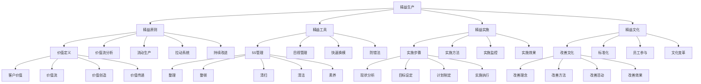

# 精益生产

## 🎯 学习目标
掌握精益生产理论和方法，学会识别和消除浪费，建立持续改进文化，提升生产效率和质量。

## 📊 精益生产框架

### 精益生产模型

## 🎯 精益原则

### 价值定义
**客户价值**：
- **客户价值**：客户价值识别
- **价值分析**：价值分析
- **价值创造**：价值创造
- **价值传递**：价值传递

**价值流**：
- **价值流**：价值流分析
- **价值流图**：价值流图绘制
- **价值流优化**：价值流优化
- **价值流设计**：价值流设计

**价值创造**：
- **价值创造**：价值创造
- **创造方法**：创造方法
- **创造过程**：创造过程
- **创造效果**：创造效果

**价值传递**：
- **价值传递**：价值传递
- **传递方式**：传递方式
- **传递过程**：传递过程
- **传递效果**：传递效果

### 价值流分析
**价值流图**：
- **价值流图**：价值流图绘制
- **绘图方法**：绘图方法
- **绘图工具**：绘图工具
- **绘图应用**：绘图应用

**浪费识别**：
- **浪费识别**：浪费识别
- **浪费类型**：浪费类型
- **浪费分析**：浪费分析
- **浪费消除**：浪费消除

**流程优化**：
- **流程优化**：流程优化
- **优化方法**：优化方法
- **优化实施**：优化实施
- **优化效果**：优化效果

**价值流设计**：
- **价值流设计**：价值流设计
- **设计方法**：设计方法
- **设计实施**：设计实施
- **设计效果**：设计效果

### 流动生产
**单件流**：
- **单件流**：单件流生产
- **单件流设计**：单件流设计
- **单件流实施**：单件流实施
- **单件流效果**：单件流效果

**连续流**：
- **连续流**：连续流生产
- **连续流设计**：连续流设计
- **连续流实施**：连续流实施
- **连续流效果**：连续流效果

**拉动生产**：
- **拉动生产**：拉动生产
- **拉动设计**：拉动设计
- **拉动实施**：拉动实施
- **拉动效果**：拉动效果

**均衡生产**：
- **均衡生产**：均衡生产
- **均衡设计**：均衡设计
- **均衡实施**：均衡实施
- **均衡效果**：均衡效果

### 拉动系统
**看板系统**：
- **看板系统**：看板系统
- **看板设计**：看板设计
- **看板实施**：看板实施
- **看板效果**：看板效果

**超市系统**：
- **超市系统**：超市系统
- **超市设计**：超市设计
- **超市实施**：超市实施
- **超市效果**：超市效果

**信号系统**：
- **信号系统**：信号系统
- **信号设计**：信号设计
- **信号实施**：信号实施
- **信号效果**：信号效果

**拉动规则**：
- **拉动规则**：拉动规则
- **规则制定**：规则制定
- **规则实施**：规则实施
- **规则效果**：规则效果

### 持续改进
**改善活动**：
- **改善活动**：改善活动
- **活动组织**：活动组织
- **活动实施**：活动实施
- **活动效果**：活动效果

**标准化**：
- **标准化**：标准化
- **标准制定**：标准制定
- **标准实施**：标准实施
- **标准维护**：标准维护

**员工参与**：
- **员工参与**：员工参与
- **参与方式**：参与方式
- **参与激励**：参与激励
- **参与效果**：参与效果

**文化变革**：
- **文化变革**：文化变革
- **变革策略**：变革策略
- **变革实施**：变革实施
- **变革效果**：变革效果

## 🛠️ 精益工具

### 5S管理
**整理**：
- **整理**：整理活动
- **整理方法**：整理方法
- **整理标准**：整理标准
- **整理效果**：整理效果

**整顿**：
- **整顿**：整顿活动
- **整顿方法**：整顿方法
- **整顿标准**：整顿标准
- **整顿效果**：整顿效果

**清扫**：
- **清扫**：清扫活动
- **清扫方法**：清扫方法
- **清扫标准**：清扫标准
- **清扫效果**：清扫效果

**清洁**：
- **清洁**：清洁活动
- **清洁方法**：清洁方法
- **清洁标准**：清洁标准
- **清洁效果**：清洁效果

**素养**：
- **素养**：素养培养
- **素养内容**：素养内容
- **素养培养**：素养培养
- **素养效果**：素养效果

### 目视管理
**看板**：
- **看板**：看板管理
- **看板类型**：看板类型
- **看板设计**：看板设计
- **看板应用**：看板应用

**标识**：
- **标识**：标识管理
- **标识类型**：标识类型
- **标识设计**：标识设计
- **标识应用**：标识应用

**颜色**：
- **颜色**：颜色管理
- **颜色标准**：颜色标准
- **颜色应用**：颜色应用
- **颜色效果**：颜色效果

**布局**：
- **布局**：布局管理
- **布局设计**：布局设计
- **布局实施**：布局实施
- **布局效果**：布局效果

### 快速换模
**换模分析**：
- **换模分析**：换模分析
- **分析方法**：分析方法
- **分析结果**：分析结果
- **分析应用**：分析应用

**换模优化**：
- **换模优化**：换模优化
- **优化方法**：优化方法
- **优化实施**：优化实施
- **优化效果**：优化效果

**标准化**：
- **标准化**：换模标准化
- **标准制定**：标准制定
- **标准实施**：标准实施
- **标准维护**：标准维护

**持续改进**：
- **持续改进**：换模持续改进
- **改进方法**：改进方法
- **改进实施**：改进实施
- **改进效果**：改进效果

### 防错法
**防错设计**：
- **防错设计**：防错设计
- **设计方法**：设计方法
- **设计实施**：设计实施
- **设计效果**：设计效果

**防错装置**：
- **防错装置**：防错装置
- **装置类型**：装置类型
- **装置设计**：装置设计
- **装置应用**：装置应用

**防错检查**：
- **防错检查**：防错检查
- **检查方法**：检查方法
- **检查实施**：检查实施
- **检查效果**：检查效果

**防错文化**：
- **防错文化**：防错文化
- **文化建设**：文化建设
- **文化传播**：文化传播
- **文化效果**：文化效果

## 🚀 精益实施

### 实施步骤
**现状分析**：
- **现状分析**：现状分析
- **分析方法**：分析方法
- **分析内容**：分析内容
- **分析结果**：分析结果

**目标设定**：
- **目标设定**：目标设定
- **目标层次**：目标层次
- **目标量化**：目标量化
- **目标评估**：目标评估

**计划制定**：
- **计划制定**：计划制定
- **计划内容**：计划内容
- **计划实施**：计划实施
- **计划监控**：计划监控

**实施执行**：
- **实施执行**：实施执行
- **执行方法**：执行方法
- **执行监控**：执行监控
- **执行效果**：执行效果

### 实施方法
**实施方法**：
- **实施方法**：实施方法
- **方法选择**：方法选择
- **方法应用**：方法应用
- **方法效果**：方法效果

**实施工具**：
- **实施工具**：实施工具
- **工具选择**：工具选择
- **工具应用**：工具应用
- **工具效果**：工具效果

**实施技术**：
- **实施技术**：实施技术
- **技术选择**：技术选择
- **技术应用**：技术应用
- **技术效果**：技术效果

### 实施监控
**实施监控**：
- **实施监控**：实施监控
- **监控指标**：监控指标
- **监控方法**：监控方法
- **监控结果**：监控结果

**监控体系**：
- **监控体系**：监控体系
- **体系设计**：体系设计
- **体系实施**：体系实施
- **体系优化**：体系优化

### 实施效果
**实施效果**：
- **实施效果**：实施效果
- **效果评估**：效果评估
- **效果分析**：效果分析
- **效果改进**：效果改进

## 🏢 精益文化

### 改善文化
**改善理念**：
- **改善理念**：改善理念
- **理念传播**：理念传播
- **理念应用**：理念应用
- **理念效果**：理念效果

**改善方法**：
- **改善方法**：改善方法
- **方法培训**：方法培训
- **方法应用**：方法应用
- **方法效果**：方法效果

**改善活动**：
- **改善活动**：改善活动
- **活动组织**：活动组织
- **活动实施**：活动实施
- **活动效果**：活动效果

**改善效果**：
- **改善效果**：改善效果
- **效果评估**：效果评估
- **效果分析**：效果分析
- **效果改进**：效果改进

### 标准化
**标准化**：
- **标准化**：标准化
- **标准制定**：标准制定
- **标准实施**：标准实施
- **标准维护**：标准维护

**标准体系**：
- **标准体系**：标准体系
- **体系设计**：体系设计
- **体系实施**：体系实施
- **体系优化**：体系优化

### 员工参与
**员工参与**：
- **员工参与**：员工参与
- **参与方式**：参与方式
- **参与激励**：参与激励
- **参与效果**：参与效果

**员工培训**：
- **员工培训**：员工培训
- **培训内容**：培训内容
- **培训方法**：培训方法
- **培训效果**：培训效果

### 文化变革
**文化变革**：
- **文化变革**：文化变革
- **变革策略**：变革策略
- **变革实施**：变革实施
- **变革效果**：变革效果

**变革管理**：
- **变革管理**：变革管理
- **管理方法**：管理方法
- **管理实施**：管理实施
- **管理效果**：管理效果

## 💡 精益生产案例

### 成功案例
**丰田生产系统**：
- **精益原则**：全面应用精益原则
- **精益工具**：系统使用精益工具
- **精益文化**：建立精益文化
- **效果**：生产效率质量双优

**波音公司**：
- **精益原则**：应用精益原则
- **精益工具**：使用精益工具
- **精益文化**：建设精益文化
- **效果**：生产效率显著提升

**通用电气**：
- **精益原则**：应用精益原则
- **精益工具**：使用精益工具
- **精益文化**：建设精益文化
- **效果**：运营效率大幅提升

### 失败案例
**失败原因**：
- **精益原则理解不足**：精益原则理解不足
- **精益工具应用不当**：精益工具应用不当
- **精益文化缺失**：精益文化缺失
- **持续改进不足**：持续改进不足

**失败教训**：
- **精益原则**：深入理解精益原则
- **精益工具**：正确应用精益工具
- **精益文化**：建设精益文化
- **持续改进**：坚持持续改进

## 🧠 学习要点

### 费曼学习法应用
1. **选择概念**：精益生产
2. **简化解释**：用简单语言解释精益生产
3. **识别盲点**：找出理解不足的地方
4. **重新学习**：针对盲点深入学习

### 刻意练习要点
- **理论掌握**：掌握精益生产理论
- **方法应用**：掌握精益生产方法
- **工具使用**：掌握精益生产工具
- **实践应用**：实践应用精益生产

## 🔗 关联学习

### 前置知识
- [[02-库存管理]] - 库存管理
- [[01-生产计划与控制]] - 生产计划与控制
- [[04-供应链管理]] - 供应链管理

### 后续学习
- [[04-六西格玛]] - 六西格玛
- [[01-服务设计]] - 服务设计
- [[02-客户服务管理]] - 客户服务管理

### 实践应用
- 企业精益生产实施
- 浪费识别和消除
- 持续改进推进
- 精益文化建设

## 🎯 学习检验

### 理解检验
- [ ] 能够理解精益生产理论
- [ ] 能够掌握精益生产方法
- [ ] 能够应用精益生产工具
- [ ] 能够识别和消除浪费

### 应用检验
- [ ] 能够实施精益生产
- [ ] 能够识别和消除浪费
- [ ] 能够推进持续改进
- [ ] 能够建设精益文化

---
**下一步**：[[04-六西格玛]] - 六西格玛