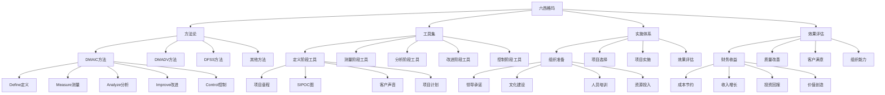

# 六西格玛

## 🎯 学习目标
掌握六西格玛理论和方法，学会使用DMAIC和DMADV方法，提升过程质量和客户满意度。

## 📊 六西格玛框架

### 六西格玛模型

## 🔄 六西格玛方法论

### DMAIC方法
**Define(定义)**：
- **Define**：定义阶段
- **问题定义**：问题定义
- **目标设定**：目标设定
- **范围界定**：范围界定
- **团队组建**：团队组建

**Measure(测量)**：
- **Measure**：测量阶段
- **数据收集**：数据收集
- **测量系统**：测量系统分析
- **过程能力**：过程能力分析
- **基线建立**：基线建立

**Analyze(分析)**：
- **Analyze**：分析阶段
- **原因分析**：原因分析
- **假设检验**：假设检验
- **回归分析**：回归分析
- **方差分析**：方差分析

**Improve(改进)**：
- **Improve**：改进阶段
- **实验设计**：实验设计
- **优化方法**：优化方法
- **解决方案**：解决方案
- **效果验证**：效果验证

**Control(控制)**：
- **Control**：控制阶段
- **控制计划**：控制计划
- **标准化**：标准化
- **监控系统**：监控系统
- **持续改进**：持续改进

### DMADV方法
**Define(定义)**：
- **Define**：定义阶段
- **需求定义**：需求定义
- **目标设定**：目标设定
- **范围界定**：范围界定
- **团队组建**：团队组建

**Measure(测量)**：
- **Measure**：测量阶段
- **需求测量**：需求测量
- **性能测量**：性能测量
- **约束测量**：约束测量
- **基线建立**：基线建立

**Analyze(分析)**：
- **Analyze**：分析阶段
- **需求分析**：需求分析
- **性能分析**：性能分析
- **约束分析**：约束分析
- **设计分析**：设计分析

**Design(设计)**：
- **Design**：设计阶段
- **概念设计**：概念设计
- **详细设计**：详细设计
- **设计优化**：设计优化
- **设计验证**：设计验证

**Verify(验证)**：
- **Verify**：验证阶段
- **设计验证**：设计验证
- **性能验证**：性能验证
- **需求验证**：需求验证
- **持续改进**：持续改进

### DFSS方法
**DFSS**：
- **DFSS**：六西格玛设计
- **设计方法**：设计方法
- **设计工具**：设计工具
- **设计实施**：设计实施
- **设计效果**：设计效果

**IDOV方法**：
- **IDOV**：IDOV方法
- **Identify识别**：识别阶段
- **Design设计**：设计阶段
- **Optimize优化**：优化阶段
- **Validate验证**：验证阶段

### 其他方法
**其他方法**：
- **其他方法**：其他六西格玛方法
- **方法选择**：方法选择
- **方法应用**：方法应用
- **方法效果**：方法效果

## 🛠️ 六西格玛工具

### 定义阶段工具
**项目章程**：
- **项目章程**：项目章程
- **章程内容**：章程内容
- **章程制定**：章程制定
- **章程应用**：章程应用

**SIPOC图**：
- **SIPOC图**：SIPOC图
- **绘图方法**：绘图方法
- **绘图工具**：绘图工具
- **绘图应用**：绘图应用

**客户声音**：
- **客户声音**：客户声音
- **声音收集**：声音收集
- **声音分析**：声音分析
- **声音应用**：声音应用

**项目计划**：
- **项目计划**：项目计划
- **计划制定**：计划制定
- **计划实施**：计划实施
- **计划监控**：计划监控

### 测量阶段工具
**数据收集**：
- **数据收集**：数据收集
- **收集方法**：收集方法
- **收集工具**：收集工具
- **收集质量**：收集质量

**测量系统分析**：
- **测量系统分析**：测量系统分析
- **分析方法**：分析方法
- **分析工具**：分析工具
- **分析结果**：分析结果

**过程能力分析**：
- **过程能力分析**：过程能力分析
- **能力指数**：能力指数
- **能力评估**：能力评估
- **能力改进**：能力改进

**基线建立**：
- **基线建立**：基线建立
- **基线方法**：基线方法
- **基线数据**：基线数据
- **基线应用**：基线应用

### 分析阶段工具
**因果分析**：
- **因果分析**：因果分析
- **鱼骨图**：鱼骨图
- **因果矩阵**：因果矩阵
- **因果验证**：因果验证

**假设检验**：
- **假设检验**：假设检验
- **检验方法**：检验方法
- **检验工具**：检验工具
- **检验结果**：检验结果

**回归分析**：
- **回归分析**：回归分析
- **分析方法**：分析方法
- **分析工具**：分析工具
- **分析结果**：分析结果

**方差分析**：
- **方差分析**：方差分析
- **分析方法**：分析方法
- **分析工具**：分析工具
- **分析结果**：分析结果

### 改进阶段工具
**实验设计**：
- **实验设计**：实验设计
- **设计方法**：设计方法
- **设计工具**：设计工具
- **设计实施**：设计实施

**优化方法**：
- **优化方法**：优化方法
- **方法选择**：方法选择
- **方法应用**：方法应用
- **方法效果**：方法效果

**解决方案**：
- **解决方案**：解决方案
- **方案设计**：方案设计
- **方案实施**：方案实施
- **方案效果**：方案效果

**效果验证**：
- **效果验证**：效果验证
- **验证方法**：验证方法
- **验证工具**：验证工具
- **验证结果**：验证结果

### 控制阶段工具
**控制计划**：
- **控制计划**：控制计划
- **计划制定**：计划制定
- **计划实施**：计划实施
- **计划监控**：计划监控

**标准化**：
- **标准化**：标准化
- **标准制定**：标准制定
- **标准实施**：标准实施
- **标准维护**：标准维护

**监控系统**：
- **监控系统**：监控系统
- **系统设计**：系统设计
- **系统实施**：系统实施
- **系统优化**：系统优化

**持续改进**：
- **持续改进**：持续改进
- **改进方法**：改进方法
- **改进实施**：改进实施
- **改进效果**：改进效果

## 🏗️ 六西格玛实施

### 组织准备
**领导承诺**：
- **领导承诺**：领导承诺
- **承诺内容**：承诺内容
- **承诺实施**：承诺实施
- **承诺效果**：承诺效果

**文化建设**：
- **文化建设**：文化建设
- **文化要素**：文化要素
- **文化传播**：文化传播
- **文化效果**：文化效果

**人员培训**：
- **人员培训**：人员培训
- **培训内容**：培训内容
- **培训方法**：培训方法
- **培训效果**：培训效果

**资源投入**：
- **资源投入**：资源投入
- **投入类型**：投入类型
- **投入管理**：投入管理
- **投入效果**：投入效果

### 项目选择
**项目识别**：
- **项目识别**：项目识别
- **识别方法**：识别方法
- **识别标准**：识别标准
- **识别结果**：识别结果

**项目评估**：
- **项目评估**：项目评估
- **评估方法**：评估方法
- **评估标准**：评估标准
- **评估结果**：评估结果

**项目优先级**：
- **项目优先级**：项目优先级
- **优先级标准**：优先级标准
- **优先级排序**：优先级排序
- **优先级应用**：优先级应用

**项目启动**：
- **项目启动**：项目启动
- **启动准备**：启动准备
- **启动实施**：启动实施
- **启动效果**：启动效果

### 项目实施
**项目实施**：
- **项目实施**：项目实施
- **实施方法**：实施方法
- **实施工具**：实施工具
- **实施效果**：实施效果

**项目监控**：
- **项目监控**：项目监控
- **监控指标**：监控指标
- **监控方法**：监控方法
- **监控结果**：监控结果

**项目调整**：
- **项目调整**：项目调整
- **调整方法**：调整方法
- **调整实施**：调整实施
- **调整效果**：调整效果

### 效果评估
**财务收益**：
- **财务收益**：财务收益
- **收益计算**：收益计算
- **收益分析**：收益分析
- **收益应用**：收益应用

**质量改善**：
- **质量改善**：质量改善
- **改善指标**：改善指标
- **改善分析**：改善分析
- **改善应用**：改善应用

**客户满意**：
- **客户满意**：客户满意度
- **满意度指标**：满意度指标
- **满意度分析**：满意度分析
- **满意度应用**：满意度应用

**组织能力**：
- **组织能力**：组织能力
- **能力指标**：能力指标
- **能力分析**：能力分析
- **能力应用**：能力应用

## 📈 效果评估

### 财务收益
**成本节约**：
- **成本节约**：成本节约
- **节约计算**：节约计算
- **节约分析**：节约分析
- **节约应用**：节约应用

**收入增长**：
- **收入增长**：收入增长
- **增长计算**：增长计算
- **增长分析**：增长分析
- **增长应用**：增长应用

**投资回报**：
- **投资回报**：投资回报
- **回报计算**：回报计算
- **回报分析**：回报分析
- **回报应用**：回报应用

**价值创造**：
- **价值创造**：价值创造
- **价值计算**：价值计算
- **价值分析**：价值分析
- **价值应用**：价值应用

### 质量改善
**质量改善**：
- **质量改善**：质量改善
- **改善指标**：改善指标
- **改善分析**：改善分析
- **改善应用**：改善应用

**缺陷减少**：
- **缺陷减少**：缺陷减少
- **减少计算**：减少计算
- **减少分析**：减少分析
- **减少应用**：减少应用

**过程能力**：
- **过程能力**：过程能力
- **能力指标**：能力指标
- **能力分析**：能力分析
- **能力应用**：能力应用

### 客户满意
**客户满意**：
- **客户满意**：客户满意度
- **满意度指标**：满意度指标
- **满意度分析**：满意度分析
- **满意度应用**：满意度应用

**客户忠诚**：
- **客户忠诚**：客户忠诚度
- **忠诚度指标**：忠诚度指标
- **忠诚度分析**：忠诚度分析
- **忠诚度应用**：忠诚度应用

### 组织能力
**组织能力**：
- **组织能力**：组织能力
- **能力指标**：能力指标
- **能力分析**：能力分析
- **能力应用**：能力应用

**学习能力**：
- **学习能力**：学习能力
- **能力指标**：能力指标
- **能力分析**：能力分析
- **能力应用**：能力应用

## 💡 六西格玛案例

### 成功案例
**通用电气**：
- **六西格玛实施**：全面实施六西格玛
- **实施方法**：DMAIC方法应用
- **实施效果**：质量效率显著提升
- **财务收益**：数十亿美元收益

**摩托罗拉**：
- **六西格玛起源**：六西格玛发源地
- **实施方法**：系统化实施
- **实施效果**：质量水平大幅提升
- **行业影响**：影响整个行业

**霍尼韦尔**：
- **六西格玛实施**：持续实施六西格玛
- **实施方法**：DMAIC和DFSS结合
- **实施效果**：运营效率显著提升
- **财务收益**：持续财务收益

### 失败案例
**失败原因**：
- **领导承诺不足**：领导承诺不足
- **文化建设缺失**：文化建设缺失
- **人员培训不足**：人员培训不足
- **资源投入不足**：资源投入不足

**失败教训**：
- **领导承诺**：获得领导承诺
- **文化建设**：建设六西格玛文化
- **人员培训**：加强人员培训
- **资源投入**：确保资源投入

## 🧠 学习要点

### 费曼学习法应用
1. **选择概念**：六西格玛
2. **简化解释**：用简单语言解释六西格玛
3. **识别盲点**：找出理解不足的地方
4. **重新学习**：针对盲点深入学习

### 刻意练习要点
- **理论掌握**：掌握六西格玛理论
- **方法应用**：掌握DMAIC和DMADV方法
- **工具使用**：掌握六西格玛工具
- **实践应用**：实践应用六西格玛

## 🔗 关联学习

### 前置知识
- [[03-精益生产]] - 精益生产
- [[02-库存管理]] - 库存管理
- [[03-质量管理]] - 质量管理

### 后续学习
- [[01-服务设计]] - 服务设计
- [[02-客户服务管理]] - 客户服务管理
- [[03-服务质量管理]] - 服务质量管理

### 实践应用
- 企业六西格玛实施
- 过程质量改进
- 客户满意度提升
- 组织能力建设

## 🎯 学习检验

### 理解检验
- [ ] 能够理解六西格玛理论
- [ ] 能够掌握DMAIC和DMADV方法
- [ ] 能够应用六西格玛工具
- [ ] 能够实施六西格玛项目

### 应用检验
- [ ] 能够实施六西格玛项目
- [ ] 能够使用DMAIC方法
- [ ] 能够使用DMADV方法
- [ ] 能够评估六西格玛效果

---
**下一步**：[[01-服务设计]] - 服务设计