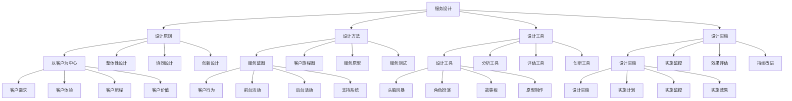

# 服务设计

## 🎯 学习目标
掌握服务设计理论和方法，学会设计优质的服务体验，提升客户满意度和服务价值。

## 📊 服务设计框架

### 服务设计模型

## 🎯 服务设计原则

### 以客户为中心
**客户需求**：
- **客户需求**：客户需求分析
- **需求识别**：需求识别
- **需求分析**：需求分析
- **需求满足**：需求满足

**客户体验**：
- **客户体验**：客户体验设计
- **体验要素**：体验要素
- **体验设计**：体验设计
- **体验优化**：体验优化

**客户旅程**：
- **客户旅程**：客户旅程设计
- **旅程分析**：旅程分析
- **旅程设计**：旅程设计
- **旅程优化**：旅程优化

**客户价值**：
- **客户价值**：客户价值创造
- **价值识别**：价值识别
- **价值创造**：价值创造
- **价值传递**：价值传递

### 整体性设计
**服务系统**：
- **服务系统**：服务系统设计
- **系统架构**：系统架构
- **系统功能**：系统功能
- **系统优化**：系统优化

**服务流程**：
- **服务流程**：服务流程设计
- **流程分析**：流程分析
- **流程设计**：流程设计
- **流程优化**：流程优化

**服务触点**：
- **服务触点**：服务触点设计
- **触点识别**：触点识别
- **触点设计**：触点设计
- **触点优化**：触点优化

**服务环境**：
- **服务环境**：服务环境设计
- **环境分析**：环境分析
- **环境设计**：环境设计
- **环境优化**：环境优化

### 协同设计
**跨部门协作**：
- **跨部门协作**：跨部门协作
- **协作机制**：协作机制
- **协作方法**：协作方法
- **协作效果**：协作效果

**利益相关者参与**：
- **利益相关者参与**：利益相关者参与
- **参与方式**：参与方式
- **参与管理**：参与管理
- **参与效果**：参与效果

**共创设计**：
- **共创设计**：共创设计
- **共创方法**：共创方法
- **共创过程**：共创过程
- **共创效果**：共创效果

**迭代改进**：
- **迭代改进**：迭代改进
- **改进方法**：改进方法
- **改进过程**：改进过程
- **改进效果**：改进效果

### 创新设计
**创新设计**：
- **创新设计**：创新设计
- **创新方法**：创新方法
- **创新过程**：创新过程
- **创新效果**：创新效果

**设计思维**：
- **设计思维**：设计思维
- **思维方法**：思维方法
- **思维应用**：思维应用
- **思维效果**：思维效果

## 🛠️ 服务设计方法

### 服务蓝图
**客户行为**：
- **客户行为**：客户行为分析
- **行为识别**：行为识别
- **行为分析**：行为分析
- **行为设计**：行为设计

**前台活动**：
- **前台活动**：前台活动设计
- **活动识别**：活动识别
- **活动设计**：活动设计
- **活动优化**：活动优化

**后台活动**：
- **后台活动**：后台活动设计
- **活动识别**：活动识别
- **活动设计**：活动设计
- **活动优化**：活动优化

**支持系统**：
- **支持系统**：支持系统设计
- **系统识别**：系统识别
- **系统设计**：系统设计
- **系统优化**：系统优化

### 客户旅程图
**客户阶段**：
- **客户阶段**：客户阶段分析
- **阶段识别**：阶段识别
- **阶段分析**：阶段分析
- **阶段设计**：阶段设计

**客户行为**：
- **客户行为**：客户行为分析
- **行为识别**：行为识别
- **行为分析**：行为分析
- **行为设计**：行为设计

**客户情感**：
- **客户情感**：客户情感分析
- **情感识别**：情感识别
- **情感分析**：情感分析
- **情感设计**：情感设计

**改进机会**：
- **改进机会**：改进机会识别
- **机会识别**：机会识别
- **机会分析**：机会分析
- **机会实施**：机会实施

### 服务原型
**服务概念**：
- **服务概念**：服务概念设计
- **概念生成**：概念生成
- **概念评估**：概念评估
- **概念选择**：概念选择

**服务原型**：
- **服务原型**：服务原型制作
- **原型类型**：原型类型
- **原型制作**：原型制作
- **原型测试**：原型测试

**服务测试**：
- **服务测试**：服务测试
- **测试方法**：测试方法
- **测试实施**：测试实施
- **测试结果**：测试结果

**服务迭代**：
- **服务迭代**：服务迭代
- **迭代方法**：迭代方法
- **迭代实施**：迭代实施
- **迭代效果**：迭代效果

### 服务测试
**服务测试**：
- **服务测试**：服务测试
- **测试方法**：测试方法
- **测试实施**：测试实施
- **测试结果**：测试结果

**可用性测试**：
- **可用性测试**：可用性测试
- **测试方法**：测试方法
- **测试实施**：测试实施
- **测试结果**：测试结果

**用户测试**：
- **用户测试**：用户测试
- **测试方法**：测试方法
- **测试实施**：测试实施
- **测试结果**：测试结果

## 🔧 服务设计工具

### 设计工具
**头脑风暴**：
- **头脑风暴**：头脑风暴
- **风暴方法**：风暴方法
- **风暴实施**：风暴实施
- **风暴效果**：风暴效果

**角色扮演**：
- **角色扮演**：角色扮演
- **扮演方法**：扮演方法
- **扮演实施**：扮演实施
- **扮演效果**：扮演效果

**故事板**：
- **故事板**：故事板
- **故事板制作**：故事板制作
- **故事板应用**：故事板应用
- **故事板效果**：故事板效果

**原型制作**：
- **原型制作**：原型制作
- **制作方法**：制作方法
- **制作工具**：制作工具
- **制作效果**：制作效果

### 分析工具
**客户访谈**：
- **客户访谈**：客户访谈
- **访谈方法**：访谈方法
- **访谈实施**：访谈实施
- **访谈结果**：访谈结果

**观察研究**：
- **观察研究**：观察研究
- **研究方法**：研究方法
- **研究实施**：研究实施
- **研究结果**：研究结果

**问卷调查**：
- **问卷调查**：问卷调查
- **调查方法**：调查方法
- **调查实施**：调查实施
- **调查结果**：调查结果

**数据分析**：
- **数据分析**：数据分析
- **分析方法**：分析方法
- **分析工具**：分析工具
- **分析结果**：分析结果

### 评估工具
**可用性测试**：
- **可用性测试**：可用性测试
- **测试方法**：测试方法
- **测试实施**：测试实施
- **测试结果**：测试结果

**客户反馈**：
- **客户反馈**：客户反馈
- **反馈收集**：反馈收集
- **反馈分析**：反馈分析
- **反馈应用**：反馈应用

**绩效指标**：
- **绩效指标**：绩效指标
- **指标设计**：指标设计
- **指标监控**：指标监控
- **指标分析**：指标分析

**满意度调查**：
- **满意度调查**：满意度调查
- **调查方法**：调查方法
- **调查实施**：调查实施
- **调查结果**：调查结果

### 创新工具
**创新工具**：
- **创新工具**：创新工具
- **工具类型**：工具类型
- **工具应用**：工具应用
- **工具效果**：工具效果

**设计思维工具**：
- **设计思维工具**：设计思维工具
- **工具类型**：工具类型
- **工具应用**：工具应用
- **工具效果**：工具效果

## 🚀 服务设计实施

### 设计实施
**设计实施**：
- **设计实施**：设计实施
- **实施方法**：实施方法
- **实施工具**：实施工具
- **实施效果**：实施效果

**实施计划**：
- **实施计划**：实施计划
- **计划制定**：计划制定
- **计划实施**：计划实施
- **计划监控**：计划监控

**实施监控**：
- **实施监控**：实施监控
- **监控指标**：监控指标
- **监控方法**：监控方法
- **监控结果**：监控结果

**实施效果**：
- **实施效果**：实施效果
- **效果评估**：效果评估
- **效果分析**：效果分析
- **效果改进**：效果改进

### 实施监控
**实施监控**：
- **实施监控**：实施监控
- **监控体系**：监控体系
- **监控指标**：监控指标
- **监控方法**：监控方法

**监控工具**：
- **监控工具**：监控工具
- **工具选择**：工具选择
- **工具应用**：工具应用
- **工具效果**：工具效果

### 效果评估
**效果评估**：
- **效果评估**：效果评估
- **评估方法**：评估方法
- **评估指标**：评估指标
- **评估结果**：评估结果

**评估体系**：
- **评估体系**：评估体系
- **体系设计**：体系设计
- **体系实施**：体系实施
- **体系优化**：体系优化

### 持续改进
**持续改进**：
- **持续改进**：持续改进
- **改进方法**：改进方法
- **改进实施**：改进实施
- **改进效果**：改进效果

**改进文化**：
- **改进文化**：改进文化
- **文化建设**：文化建设
- **文化传播**：文化传播
- **文化效果**：文化效果

## 💡 服务设计案例

### 成功案例
**苹果服务设计**：
- **服务设计**：以客户为中心的服务设计
- **设计方法**：系统化设计方法
- **设计效果**：客户体验极佳
- **商业价值**：品牌价值极高

**星巴克服务设计**：
- **服务设计**：整体性服务设计
- **设计方法**：体验设计方法
- **设计效果**：客户忠诚度极高
- **商业价值**：市场地位稳固

**迪士尼服务设计**：
- **服务设计**：沉浸式服务设计
- **设计方法**：情感设计方法
- **设计效果**：客户满意度极高
- **商业价值**：品牌影响力巨大

### 失败案例
**失败原因**：
- **客户需求理解不足**：客户需求理解不足
- **服务设计不完整**：服务设计不完整
- **实施执行不力**：实施执行不力
- **持续改进不足**：持续改进不足

**失败教训**：
- **客户需求**：深入理解客户需求
- **服务设计**：完整设计服务
- **实施执行**：确保实施执行
- **持续改进**：坚持持续改进

## 🧠 学习要点

### 费曼学习法应用
1. **选择概念**：服务设计
2. **简化解释**：用简单语言解释服务设计
3. **识别盲点**：找出理解不足的地方
4. **重新学习**：针对盲点深入学习

### 刻意练习要点
- **理论掌握**：掌握服务设计理论
- **方法应用**：掌握服务设计方法
- **工具使用**：掌握服务设计工具
- **实践应用**：实践应用服务设计

## 🔗 关联学习

### 前置知识
- [[04-六西格玛]] - 六西格玛
- [[03-精益生产]] - 精益生产
- [[03-质量管理]] - 质量管理

### 后续学习
- [[02-客户服务管理]] - 客户服务管理
- [[03-服务质量管理]] - 服务质量管理
- [[01-品牌管理]] - 品牌管理

### 实践应用
- 企业服务设计
- 客户体验优化
- 服务流程改进
- 服务价值提升

## 🎯 学习检验

### 理解检验
- [ ] 能够理解服务设计理论
- [ ] 能够掌握服务设计方法
- [ ] 能够应用服务设计工具
- [ ] 能够设计服务体验

### 应用检验
- [ ] 能够设计服务体验
- [ ] 能够优化客户旅程
- [ ] 能够改进服务流程
- [ ] 能够提升服务价值

---
**下一步**：[[02-客户服务管理]] - 客户服务管理