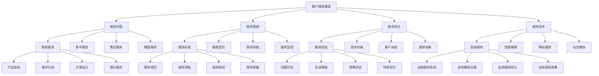

# 客户服务管理

## 🎯 学习目标
掌握客户服务管理理论和方法，学会建立高效的客户服务体系，提升客户满意度和忠诚度。

## 📊 客户服务管理框架

### 客户服务管理模型

## 🛍️ 客户服务内容

### 售前服务
**产品咨询**：
- **产品咨询**：产品咨询服务
- **咨询内容**：咨询内容
- **咨询方式**：咨询方式
- **咨询质量**：咨询质量

**需求分析**：
- **需求分析**：客户需求分析
- **分析方法**：分析方法
- **分析工具**：分析工具
- **分析结果**：分析结果

**方案设计**：
- **方案设计**：解决方案设计
- **设计方法**：设计方法
- **设计工具**：设计工具
- **设计效果**：设计效果

**报价服务**：
- **报价服务**：报价服务
- **报价方法**：报价方法
- **报价工具**：报价工具
- **报价效果**：报价效果

### 售中服务
**订单处理**：
- **订单处理**：订单处理服务
- **处理流程**：处理流程
- **处理标准**：处理标准
- **处理效果**：处理效果

**物流跟踪**：
- **物流跟踪**：物流跟踪服务
- **跟踪方式**：跟踪方式
- **跟踪工具**：跟踪工具
- **跟踪效果**：跟踪效果

**安装调试**：
- **安装调试**：安装调试服务
- **服务流程**：服务流程
- **服务标准**：服务标准
- **服务效果**：服务效果

**培训服务**：
- **培训服务**：培训服务
- **培训内容**：培训内容
- **培训方法**：培训方法
- **培训效果**：培训效果

### 售后服务
**技术支持**：
- **技术支持**：技术支持服务
- **支持方式**：支持方式
- **支持工具**：支持工具
- **支持效果**：支持效果

**维修保养**：
- **维修保养**：维修保养服务
- **服务流程**：服务流程
- **服务标准**：服务标准
- **服务效果**：服务效果

**投诉处理**：
- **投诉处理**：投诉处理服务
- **处理流程**：处理流程
- **处理标准**：处理标准
- **处理效果**：处理效果

**客户关怀**：
- **客户关怀**：客户关怀服务
- **关怀内容**：关怀内容
- **关怀方式**：关怀方式
- **关怀效果**：关怀效果

### 增值服务
**增值服务**：
- **增值服务**：增值服务
- **服务类型**：服务类型
- **服务内容**：服务内容
- **服务价值**：服务价值

**个性化服务**：
- **个性化服务**：个性化服务
- **服务设计**：服务设计
- **服务实施**：服务实施
- **服务效果**：服务效果

**定制化服务**：
- **定制化服务**：定制化服务
- **服务设计**：服务设计
- **服务实施**：服务实施
- **服务效果**：服务效果

## 🏢 客户服务管理

### 服务标准
**服务规范**：
- **服务规范**：服务规范
- **规范制定**：规范制定
- **规范实施**：规范实施
- **规范维护**：规范维护

**服务流程**：
- **服务流程**：服务流程
- **流程设计**：流程设计
- **流程实施**：流程实施
- **流程优化**：流程优化

**服务指标**：
- **服务指标**：服务指标
- **指标设计**：指标设计
- **指标监控**：指标监控
- **指标分析**：指标分析

**服务质量**：
- **服务质量**：服务质量
- **质量标准**：质量标准
- **质量控制**：质量控制
- **质量改进**：质量改进

### 服务团队
**人员配置**：
- **人员配置**：人员配置
- **配置标准**：配置标准
- **配置方法**：配置方法
- **配置效果**：配置效果

**技能培训**：
- **技能培训**：技能培训
- **培训内容**：培训内容
- **培训方法**：培训方法
- **培训效果**：培训效果

**绩效考核**：
- **绩效考核**：绩效考核
- **考核指标**：考核指标
- **考核方法**：考核方法
- **考核结果**：考核结果

**激励机制**：
- **激励机制**：激励机制
- **激励方式**：激励方式
- **激励实施**：激励实施
- **激励效果**：激励效果

### 服务系统
**服务系统**：
- **服务系统**：服务系统
- **系统功能**：系统功能
- **系统实施**：系统实施
- **系统优化**：系统优化

**知识管理**：
- **知识管理**：知识管理
- **知识库**：知识库
- **知识共享**：知识共享
- **知识应用**：知识应用

**工单管理**：
- **工单管理**：工单管理
- **工单流程**：工单流程
- **工单跟踪**：工单跟踪
- **工单分析**：工单分析

**客户关系管理**：
- **客户关系管理**：客户关系管理
- **关系建立**：关系建立
- **关系维护**：关系维护
- **关系优化**：关系优化

### 服务监控
**服务监控**：
- **服务监控**：服务监控
- **监控指标**：监控指标
- **监控方法**：监控方法
- **监控结果**：监控结果

**监控体系**：
- **监控体系**：监控体系
- **体系设计**：体系设计
- **体系实施**：体系实施
- **体系优化**：体系优化

## 🚀 客户服务优化

### 服务改进
**问题识别**：
- **问题识别**：问题识别
- **识别方法**：识别方法
- **识别工具**：识别工具
- **识别结果**：识别结果

**改进措施**：
- **改进措施**：改进措施
- **措施制定**：措施制定
- **措施实施**：措施实施
- **措施效果**：措施效果

**效果评估**：
- **效果评估**：效果评估
- **评估方法**：评估方法
- **评估指标**：评估指标
- **评估结果**：评估结果

**持续优化**：
- **持续优化**：持续优化
- **优化方法**：优化方法
- **优化实施**：优化实施
- **优化效果**：优化效果

### 技术创新
**自助服务**：
- **自助服务**：自助服务
- **服务功能**：服务功能
- **服务设计**：服务设计
- **服务效果**：服务效果

**智能客服**：
- **智能客服**：智能客服
- **客服功能**：客服功能
- **客服设计**：客服设计
- **客服效果**：客服效果

**移动服务**：
- **移动服务**：移动服务
- **服务功能**：服务功能
- **服务设计**：服务设计
- **服务效果**：服务效果

**社交媒体**：
- **社交媒体**：社交媒体服务
- **服务功能**：服务功能
- **服务设计**：服务设计
- **服务效果**：服务效果

### 客户体验
**体验设计**：
- **体验设计**：客户体验设计
- **设计方法**：设计方法
- **设计工具**：设计工具
- **设计效果**：设计效果

**体验测量**：
- **体验测量**：客户体验测量
- **测量方法**：测量方法
- **测量工具**：测量工具
- **测量结果**：测量结果

**体验优化**：
- **体验优化**：客户体验优化
- **优化方法**：优化方法
- **优化实施**：优化实施
- **优化效果**：优化效果

**体验创新**：
- **体验创新**：客户体验创新
- **创新方法**：创新方法
- **创新实施**：创新实施
- **创新效果**：创新效果

### 服务创新
**服务创新**：
- **服务创新**：服务创新
- **创新方法**：创新方法
- **创新实施**：创新实施
- **创新效果**：创新效果

**创新文化**：
- **创新文化**：创新文化
- **文化建设**：文化建设
- **文化传播**：文化传播
- **文化效果**：文化效果

## 💻 客户服务技术

### 自助服务
**自助服务系统**：
- **自助服务系统**：自助服务系统
- **系统功能**：系统功能
- **系统设计**：系统设计
- **系统效果**：系统效果

**自助服务功能**：
- **自助服务功能**：自助服务功能
- **功能设计**：功能设计
- **功能实施**：功能实施
- **功能效果**：功能效果

**自助服务优化**：
- **自助服务优化**：自助服务优化
- **优化方法**：优化方法
- **优化实施**：优化实施
- **优化效果**：优化效果

**自助服务效果**：
- **自助服务效果**：自助服务效果
- **效果评估**：效果评估
- **效果分析**：效果分析
- **效果改进**：效果改进

### 智能客服
**智能客服**：
- **智能客服**：智能客服
- **客服功能**：客服功能
- **客服设计**：客服设计
- **客服效果**：客服效果

**AI客服**：
- **AI客服**：AI客服
- **AI功能**：AI功能
- **AI设计**：AI设计
- **AI效果**：AI效果

**聊天机器人**：
- **聊天机器人**：聊天机器人
- **机器人功能**：机器人功能
- **机器人设计**：机器人设计
- **机器人效果**：机器人效果

### 移动服务
**移动服务**：
- **移动服务**：移动服务
- **服务功能**：服务功能
- **服务设计**：服务设计
- **服务效果**：服务效果

**移动应用**：
- **移动应用**：移动应用
- **应用功能**：应用功能
- **应用设计**：应用设计
- **应用效果**：应用效果

### 社交媒体
**社交媒体**：
- **社交媒体**：社交媒体服务
- **服务功能**：服务功能
- **服务设计**：服务设计
- **服务效果**：服务效果

**社交媒体管理**：
- **社交媒体管理**：社交媒体管理
- **管理方法**：管理方法
- **管理工具**：管理工具
- **管理效果**：管理效果

## 💡 客户服务管理案例

### 成功案例
**亚马逊客户服务**：
- **服务理念**：客户至上的服务理念
- **服务技术**：先进的服务技术
- **服务创新**：持续的服务创新
- **效果**：客户满意度极高

**苹果客户服务**：
- **服务理念**：简约优质的服务理念
- **服务技术**：创新的服务技术
- **服务体验**：卓越的服务体验
- **效果**：客户忠诚度极高

**海底捞客户服务**：
- **服务理念**：超预期的服务理念
- **服务创新**：持续的服务创新
- **服务体验**：独特的服务体验
- **效果**：客户口碑极佳

### 失败案例
**失败原因**：
- **服务理念缺失**：服务理念缺失
- **服务标准不明确**：服务标准不明确
- **服务技术落后**：服务技术落后
- **服务创新不足**：服务创新不足

**失败教训**：
- **服务理念**：建立明确的服务理念
- **服务标准**：制定清晰的服务标准
- **服务技术**：应用先进的服务技术
- **服务创新**：持续的服务创新

## 🧠 学习要点

### 费曼学习法应用
1. **选择概念**：客户服务管理
2. **简化解释**：用简单语言解释客户服务管理
3. **识别盲点**：找出理解不足的地方
4. **重新学习**：针对盲点深入学习

### 刻意练习要点
- **理论掌握**：掌握客户服务管理理论
- **方法应用**：掌握客户服务管理方法
- **工具使用**：掌握客户服务管理工具
- **实践应用**：实践应用客户服务管理

## 🔗 关联学习

### 前置知识
- [[01-服务设计]] - 服务设计
- [[04-六西格玛]] - 六西格玛
- [[03-精益生产]] - 精益生产

### 后续学习
- [[03-服务质量管理]] - 服务质量管理
- [[01-品牌管理]] - 品牌管理
- [[03-客户生命周期价值]] - 客户生命周期价值

### 实践应用
- 企业客户服务管理
- 客户服务体系建设
- 客户服务优化改进
- 客户满意度提升

## 🎯 学习检验

### 理解检验
- [ ] 能够理解客户服务管理理论
- [ ] 能够掌握客户服务管理方法
- [ ] 能够应用客户服务管理工具
- [ ] 能够建立客户服务体系

### 应用检验
- [ ] 能够建立客户服务体系
- [ ] 能够管理客户服务团队
- [ ] 能够优化客户服务流程
- [ ] 能够提升客户满意度

---
**下一步**：[[03-服务质量管理]] - 服务质量管理