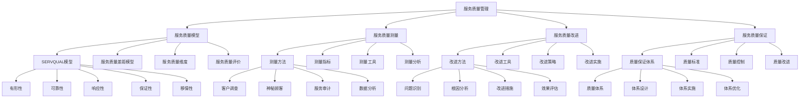

# 服务质量管理

## 🎯 学习目标
掌握服务质量管理理论和方法，学会测量和改进服务质量，提升客户满意度和服务价值。

## 📊 服务质量管理框架

### 服务质量管理模型

## 📋 服务质量模型

### SERVQUAL模型
**有形性**：
- **有形性**：有形性质量
- **设施设备**：设施设备质量
- **人员形象**：人员形象质量
- **服务环境**：服务环境质量

**可靠性**：
- **可靠性**：可靠性质量
- **服务承诺**：服务承诺履行
- **服务一致性**：服务一致性
- **服务准确性**：服务准确性

**响应性**：
- **响应性**：响应性质量
- **服务速度**：服务响应速度
- **服务及时性**：服务及时性
- **服务灵活性**：服务灵活性

**保证性**：
- **保证性**：保证性质量
- **服务能力**：服务人员能力
- **服务知识**：服务人员知识
- **服务态度**：服务人员态度

**移情性**：
- **移情性**：移情性质量
- **个性化服务**：个性化服务
- **客户关怀**：客户关怀
- **服务理解**：服务理解

### 服务质量差距模型
**认知差距**：
- **认知差距**：认知差距
- **差距识别**：差距识别
- **差距分析**：差距分析
- **差距缩小**：差距缩小

**标准差距**：
- **标准差距**：标准差距
- **差距识别**：差距识别
- **差距分析**：差距分析
- **差距缩小**：差距缩小

**传递差距**：
- **传递差距**：传递差距
- **差距识别**：差距识别
- **差距分析**：差距分析
- **差距缩小**：差距缩小

**沟通差距**：
- **沟通差距**：沟通差距
- **差距识别**：差距识别
- **差距分析**：差距分析
- **差距缩小**：差距缩小

### 服务质量维度
**服务质量维度**：
- **服务质量维度**：服务质量维度
- **维度识别**：维度识别
- **维度分析**：维度分析
- **维度优化**：维度优化

**核心维度**：
- **核心维度**：核心维度
- **维度内容**：维度内容
- **维度权重**：维度权重
- **维度优化**：维度优化

**支持维度**：
- **支持维度**：支持维度
- **维度内容**：维度内容
- **维度权重**：维度权重
- **维度优化**：维度优化

### 服务质量评价
**服务质量评价**：
- **服务质量评价**：服务质量评价
- **评价方法**：评价方法
- **评价指标**：评价指标
- **评价结果**：评价结果

**评价体系**：
- **评价体系**：评价体系
- **体系设计**：体系设计
- **体系实施**：体系实施
- **体系优化**：体系优化

## 📊 服务质量测量

### 测量方法
**客户调查**：
- **客户调查**：客户调查
- **调查方法**：调查方法
- **调查工具**：调查工具
- **调查结果**：调查结果

**神秘顾客**：
- **神秘顾客**：神秘顾客
- **顾客选择**：顾客选择
- **评估标准**：评估标准
- **评估结果**：评估结果

**服务审计**：
- **服务审计**：服务审计
- **审计方法**：审计方法
- **审计工具**：审计工具
- **审计结果**：审计结果

**数据分析**：
- **数据分析**：数据分析
- **分析方法**：分析方法
- **分析工具**：分析工具
- **分析结果**：分析结果

### 测量指标
**客户满意度**：
- **客户满意度**：客户满意度
- **满意度指标**：满意度指标
- **满意度测量**：满意度测量
- **满意度分析**：满意度分析

**服务质量指数**：
- **服务质量指数**：服务质量指数
- **指数计算**：指数计算
- **指数分析**：指数分析
- **指数应用**：指数应用

**客户忠诚度**：
- **客户忠诚度**：客户忠诚度
- **忠诚度指标**：忠诚度指标
- **忠诚度测量**：忠诚度测量
- **忠诚度分析**：忠诚度分析

**客户推荐度**：
- **客户推荐度**：客户推荐度
- **推荐度指标**：推荐度指标
- **推荐度测量**：推荐度测量
- **推荐度分析**：推荐度分析

### 测量工具
**问卷调查**：
- **问卷调查**：问卷调查
- **问卷设计**：问卷设计
- **问卷实施**：问卷实施
- **问卷分析**：问卷分析

**焦点小组**：
- **焦点小组**：焦点小组
- **小组组织**：小组组织
- **小组实施**：小组实施
- **小组分析**：小组分析

**客户访谈**：
- **客户访谈**：客户访谈
- **访谈方法**：访谈方法
- **访谈实施**：访谈实施
- **访谈分析**：访谈分析

**在线评价**：
- **在线评价**：在线评价
- **评价收集**：评价收集
- **评价分析**：评价分析
- **评价应用**：评价应用

### 测量分析
**测量分析**：
- **测量分析**：测量分析
- **分析方法**：分析方法
- **分析工具**：分析工具
- **分析结果**：分析结果

**趋势分析**：
- **趋势分析**：趋势分析
- **分析方法**：分析方法
- **分析工具**：分析工具
- **分析结果**：分析结果

**对比分析**：
- **对比分析**：对比分析
- **分析方法**：分析方法
- **分析工具**：分析工具
- **分析结果**：分析结果

## 🚀 服务质量改进

### 改进方法
**问题识别**：
- **问题识别**：问题识别
- **识别方法**：识别方法
- **识别工具**：识别工具
- **识别结果**：识别结果

**根因分析**：
- **根因分析**：根因分析
- **分析方法**：分析方法
- **分析工具**：分析工具
- **分析结果**：分析结果

**改进措施**：
- **改进措施**：改进措施
- **措施制定**：措施制定
- **措施实施**：措施实施
- **措施效果**：措施效果

**效果评估**：
- **效果评估**：效果评估
- **评估方法**：评估方法
- **评估指标**：评估指标
- **评估结果**：评估结果

### 改进工具
**鱼骨图**：
- **鱼骨图**：鱼骨图
- **绘图方法**：绘图方法
- **绘图工具**：绘图工具
- **绘图应用**：绘图应用

**帕累托图**：
- **帕累托图**：帕累托图
- **绘图方法**：绘图方法
- **绘图工具**：绘图工具
- **绘图应用**：绘图应用

**流程图**：
- **流程图**：流程图
- **绘图方法**：绘图方法
- **绘图工具**：绘图工具
- **绘图应用**：绘图应用

**控制图**：
- **控制图**：控制图
- **绘图方法**：绘图方法
- **绘图工具**：绘图工具
- **绘图应用**：绘图应用

### 改进策略
**服务设计**：
- **服务设计**：服务设计改进
- **设计方法**：设计方法
- **设计工具**：设计工具
- **设计效果**：设计效果

**流程优化**：
- **流程优化**：流程优化
- **优化方法**：优化方法
- **优化工具**：优化工具
- **优化效果**：优化效果

**人员培训**：
- **人员培训**：人员培训
- **培训内容**：培训内容
- **培训方法**：培训方法
- **培训效果**：培训效果

**技术升级**：
- **技术升级**：技术升级
- **升级方法**：升级方法
- **升级工具**：升级工具
- **升级效果**：升级效果

### 改进实施
**改进实施**：
- **改进实施**：改进实施
- **实施方法**：实施方法
- **实施工具**：实施工具
- **实施效果**：实施效果

**实施监控**：
- **实施监控**：实施监控
- **监控指标**：监控指标
- **监控方法**：监控方法
- **监控结果**：监控结果

## 🛡️ 服务质量保证

### 质量保证体系
**质量体系**：
- **质量体系**：质量体系
- **体系设计**：体系设计
- **体系实施**：体系实施
- **体系优化**：体系优化

**体系设计**：
- **体系设计**：体系设计
- **设计方法**：设计方法
- **设计工具**：设计工具
- **设计效果**：设计效果

**体系实施**：
- **体系实施**：体系实施
- **实施方法**：实施方法
- **实施工具**：实施工具
- **实施效果**：实施效果

**体系优化**：
- **体系优化**：体系优化
- **优化方法**：优化方法
- **优化工具**：优化工具
- **优化效果**：优化效果

### 质量标准
**质量标准**：
- **质量标准**：质量标准
- **标准制定**：标准制定
- **标准实施**：标准实施
- **标准维护**：标准维护

**标准制定**：
- **标准制定**：标准制定
- **制定方法**：制定方法
- **制定工具**：制定工具
- **制定效果**：制定效果

**标准实施**：
- **标准实施**：标准实施
- **实施方法**：实施方法
- **实施工具**：实施工具
- **实施效果**：实施效果

### 质量控制
**质量控制**：
- **质量控制**：质量控制
- **控制方法**：控制方法
- **控制工具**：控制工具
- **控制效果**：控制效果

**控制体系**：
- **控制体系**：控制体系
- **体系设计**：体系设计
- **体系实施**：体系实施
- **体系优化**：体系优化

### 质量改进
**质量改进**：
- **质量改进**：质量改进
- **改进方法**：改进方法
- **改进工具**：改进工具
- **改进效果**：改进效果

**改进文化**：
- **改进文化**：改进文化
- **文化建设**：文化建设
- **文化传播**：文化传播
- **文化效果**：文化效果

## 💡 服务质量管理案例

### 成功案例
**丽思卡尔顿酒店**：
- **服务理念**：客户至上的服务理念
- **质量标准**：严格的服务质量标准
- **质量改进**：持续的服务质量改进
- **效果**：服务质量行业领先

**迪士尼乐园**：
- **服务理念**：创造快乐的服务理念
- **质量标准**：统一的服务质量标准
- **质量改进**：持续的服务质量改进
- **效果**：客户满意度极高

**星巴克咖啡**：
- **服务理念**：第三空间的服务理念
- **质量标准**：一致的服务质量标准
- **质量改进**：持续的服务质量改进
- **效果**：客户忠诚度极高

### 失败案例
**失败原因**：
- **质量标准不明确**：质量标准不明确
- **质量控制不严格**：质量控制不严格
- **质量改进不足**：质量改进不足
- **质量文化缺失**：质量文化缺失

**失败教训**：
- **质量标准**：制定明确的质量标准
- **质量控制**：实施严格的质量控制
- **质量改进**：持续的质量改进
- **质量文化**：建设质量文化

## 🧠 学习要点

### 费曼学习法应用
1. **选择概念**：服务质量管理
2. **简化解释**：用简单语言解释服务质量管理
3. **识别盲点**：找出理解不足的地方
4. **重新学习**：针对盲点深入学习

### 刻意练习要点
- **理论掌握**：掌握服务质量管理理论
- **方法应用**：掌握服务质量管理方法
- **工具使用**：掌握服务质量管理工具
- **实践应用**：实践应用服务质量管理

## 🔗 关联学习

### 前置知识
- [[02-客户服务管理]] - 客户服务管理
- [[01-服务设计]] - 服务设计
- [[03-质量管理]] - 质量管理

### 后续学习
- [[01-品牌管理]] - 品牌管理
- [[03-客户生命周期价值]] - 客户生命周期价值
- [[01-营销ROI分析]] - 营销ROI分析

### 实践应用
- 企业服务质量管理
- 服务质量体系建设
- 服务质量改进
- 客户满意度提升

## 🎯 学习检验

### 理解检验
- [ ] 能够理解服务质量管理理论
- [ ] 能够掌握服务质量管理方法
- [ ] 能够应用服务质量管理工具
- [ ] 能够建立服务质量管理体系

### 应用检验
- [ ] 能够建立服务质量管理体系
- [ ] 能够测量服务质量
- [ ] 能够改进服务质量
- [ ] 能够提升客户满意度

---
**下一步**：[[01-品牌管理]] - 品牌管理