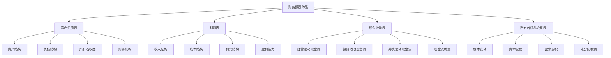

# 财务报表分析

## 🎯 学习目标
掌握财务报表分析方法，学会解读财务数据，提高财务分析能力。

## 📊 财务报表体系

### 主要报表

## 📋 资产负债表分析

### 资产结构分析
**流动资产**：
- **货币资金**：现金、银行存款、其他货币资金
- **交易性金融资产**：短期投资、理财产品
- **应收票据**：商业承兑汇票、银行承兑汇票
- **应收账款**：客户欠款、坏账准备
- **预付款项**：预付货款、预付费用
- **存货**：原材料、在产品、产成品

**非流动资产**：
- **长期股权投资**：对子公司、联营企业投资
- **固定资产**：房屋、设备、机器
- **在建工程**：正在建设的工程项目
- **无形资产**：专利权、商标权、软件
- **商誉**：收购溢价、品牌价值
- **长期待摊费用**：长期待摊的支出

**资产质量分析**：
- **资产流动性**：资产变现能力
- **资产盈利能力**：资产创造收益能力
- **资产安全性**：资产风险程度
- **资产效率性**：资产使用效率

### 负债结构分析
**流动负债**：
- **短期借款**：银行短期借款
- **应付票据**：商业承兑汇票、银行承兑汇票
- **应付账款**：供应商欠款
- **预收款项**：预收货款、预收费用
- **应付职工薪酬**：工资、奖金、福利
- **应交税费**：增值税、所得税等

**非流动负债**：
- **长期借款**：银行长期借款
- **应付债券**：企业债券
- **长期应付款**：长期应付款项
- **预计负债**：预计的负债
- **递延所得税负债**：递延所得税

**负债质量分析**：
- **负债结构**：短期负债与长期负债比例
- **负债成本**：负债的利息成本
- **负债风险**：负债的违约风险
- **负债管理**：负债的管理效率

### 所有者权益分析
**股本**：
- **实收资本**：股东实际投入的资本
- **资本公积**：资本溢价、其他资本公积
- **盈余公积**：法定盈余公积、任意盈余公积
- **未分配利润**：历年累积的未分配利润

**权益质量分析**：
- **权益结构**：各权益项目的构成
- **权益稳定性**：权益的稳定性
- **权益增长性**：权益的增长趋势
- **权益回报性**：权益的回报能力

## 📈 利润表分析

### 收入结构分析
**营业收入**：
- **主营业务收入**：主要业务收入
- **其他业务收入**：其他业务收入
- **收入确认**：收入确认原则
- **收入质量**：收入的质量和可持续性

**收入分析**：
- **收入增长**：收入的增长趋势
- **收入结构**：不同业务收入占比
- **收入质量**：收入的现金含量
- **收入稳定性**：收入的稳定性

### 成本结构分析
**营业成本**：
- **直接材料**：生产用原材料
- **直接人工**：生产工人工资
- **制造费用**：间接制造费用
- **成本控制**：成本控制效果

**期间费用**：
- **销售费用**：销售相关费用
- **管理费用**：管理相关费用
- **财务费用**：财务相关费用
- **研发费用**：研发相关费用

**成本分析**：
- **成本结构**：各项成本占比
- **成本控制**：成本控制效果
- **成本效率**：成本使用效率
- **成本趋势**：成本变化趋势

### 利润结构分析
**毛利润**：
- **毛利润**：营业收入减去营业成本
- **毛利率**：毛利润占营业收入比例
- **毛利率分析**：毛利率的变化趋势
- **毛利率比较**：与同行业比较

**营业利润**：
- **营业利润**：毛利润减去期间费用
- **营业利润率**：营业利润占营业收入比例
- **营业利润分析**：营业利润的变化趋势
- **营业利润比较**：与同行业比较

**净利润**：
- **净利润**：营业利润加上营业外收支
- **净利润率**：净利润占营业收入比例
- **净利润分析**：净利润的变化趋势
- **净利润比较**：与同行业比较

## 💰 现金流量表分析

### 经营活动现金流
**现金流入**：
- **销售商品收入**：销售商品收到的现金
- **提供劳务收入**：提供劳务收到的现金
- **其他经营活动收入**：其他经营活动现金流入

**现金流出**：
- **购买商品支出**：购买商品支付的现金
- **支付职工薪酬**：支付给职工的现金
- **支付税费**：支付各项税费的现金
- **其他经营活动支出**：其他经营活动现金流出

**经营活动现金流分析**：
- **现金流质量**：经营活动现金流的质量
- **现金流稳定性**：经营活动现金流的稳定性
- **现金流增长性**：经营活动现金流的增长性
- **现金流效率**：经营活动现金流的效率

### 投资活动现金流
**现金流入**：
- **收回投资**：收回投资收到的现金
- **投资收益**：投资收益收到的现金
- **处置资产**：处置资产收到的现金

**现金流出**：
- **购建资产**：购建固定资产支付的现金
- **对外投资**：对外投资支付的现金
- **其他投资活动**：其他投资活动现金流出

**投资活动现金流分析**：
- **投资规模**：投资活动的规模
- **投资方向**：投资活动的方向
- **投资效果**：投资活动的效果
- **投资风险**：投资活动的风险

### 筹资活动现金流
**现金流入**：
- **吸收投资**：吸收投资收到的现金
- **取得借款**：取得借款收到的现金
- **发行债券**：发行债券收到的现金

**现金流出**：
- **偿还债务**：偿还债务支付的现金
- **分配股利**：分配股利支付的现金
- **其他筹资活动**：其他筹资活动现金流出

**筹资活动现金流分析**：
- **筹资规模**：筹资活动的规模
- **筹资结构**：筹资活动的结构
- **筹资成本**：筹资活动的成本
- **筹资风险**：筹资活动的风险

## 📊 财务分析方法

### 趋势分析
**时间序列分析**：
- **水平分析**：不同时期财务数据比较
- **垂直分析**：同一时期财务数据比较
- **趋势分析**：财务数据的变化趋势
- **预测分析**：财务数据的未来预测

**趋势分析步骤**：
1. 选择分析期间
2. 计算变化金额
3. 计算变化百分比
4. 分析变化原因
5. 预测未来趋势

### 结构分析
**资产负债表结构分析**：
- **资产结构**：各类资产占总资产比例
- **负债结构**：各类负债占总负债比例
- **权益结构**：各类权益占总权益比例
- **资本结构**：负债与权益的比例关系

**利润表结构分析**：
- **收入结构**：各类收入占总收入比例
- **成本结构**：各类成本占总成本比例
- **费用结构**：各类费用占总费用比例
- **利润结构**：各类利润占总利润比例

### 比较分析
**横向比较**：
- **同行业比较**：与同行业企业比较
- **竞争对手比较**：与主要竞争对手比较
- **标杆企业比较**：与行业标杆企业比较
- **平均水平比较**：与行业平均水平比较

**纵向比较**：
- **历史比较**：与历史同期比较
- **预算比较**：与预算目标比较
- **计划比较**：与计划目标比较
- **标准比较**：与标准值比较

## 💡 实践应用

### 财务报表分析流程
1. **报表阅读**：仔细阅读财务报表
2. **数据整理**：整理相关财务数据
3. **比率计算**：计算相关财务比率
4. **趋势分析**：分析财务数据趋势
5. **结构分析**：分析财务数据结构
6. **比较分析**：进行横向纵向比较
7. **综合评价**：综合评价财务状况
8. **问题识别**：识别财务问题
9. **建议提出**：提出改进建议

### 案例分析
**选择案例**：如某上市公司财务报表
**分析维度**：
- 资产负债表：资产结构、负债结构、权益结构
- 利润表：收入结构、成本结构、利润结构
- 现金流量表：经营活动、投资活动、筹资活动现金流

## 🧠 学习要点

### 费曼学习法应用
1. **选择概念**：财务报表分析
2. **简化解释**：用简单语言解释财务分析
3. **识别盲点**：找出理解不足的地方
4. **重新学习**：针对盲点深入学习

### 刻意练习要点
- **报表理解**：准确理解财务报表
- **分析方法**：掌握财务分析方法
- **数据解读**：能够解读财务数据
- **问题识别**：能够识别财务问题

## 🔗 关联学习

### 前置知识
- [[01-商业学概论]] - 商业学基础
- [[01-商业环境分析]] - 环境分析
- 会计学基础

### 后续学习
- [[02-财务比率分析]] - 财务比率
- [[03-现金流管理]] - 现金流管理
- [[04-成本管理]] - 成本管理

### 实践应用
- 企业财务分析
- 投资决策分析
- 财务风险评估
- 财务绩效评价

## 🎯 学习检验

### 理解检验
- [ ] 能够理解财务报表结构
- [ ] 能够掌握财务分析方法
- [ ] 能够解读财务数据
- [ ] 能够识别财务问题

### 应用检验
- [ ] 能够分析企业财务报表
- [ ] 能够评估企业财务状况
- [ ] 能够识别财务风险
- [ ] 能够提出财务改进建议

---
**下一步**：[[02-财务比率分析]] - 财务比率分析