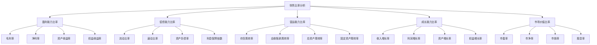

# 财务比率分析

## 🎯 学习目标
掌握财务比率分析的方法和技巧，学会运用财务比率评估企业财务状况，提升财务分析能力。

## 📊 财务比率分析框架

### 分析体系

## 💰 盈利能力比率

### 毛利率
**计算公式**：
- **毛利率** = (营业收入 - 营业成本) / 营业收入 × 100%
- **意义**：反映企业产品盈利能力
- **标准**：行业平均水平比较
- **趋势**：毛利率变化趋势分析

**分析要点**：
- **成本控制**：成本控制效果分析
- **定价策略**：定价策略效果分析
- **产品结构**：产品结构影响分析
- **市场竞争**：市场竞争影响分析

**改进策略**：
- **成本优化**：优化成本结构
- **价格调整**：调整产品价格
- **产品升级**：升级产品结构
- **市场定位**：优化市场定位

### 净利率
**计算公式**：
- **净利率** = 净利润 / 营业收入 × 100%
- **意义**：反映企业整体盈利能力
- **标准**：行业平均水平比较
- **趋势**：净利率变化趋势分析

**分析要点**：
- **费用控制**：费用控制效果分析
- **税收影响**：税收政策影响分析
- **非经常性损益**：非经常性损益影响分析
- **经营效率**：经营效率影响分析

**改进策略**：
- **费用控制**：控制各项费用
- **税收优化**：优化税收结构
- **经营改善**：改善经营效率
- **风险管理**：加强风险管理

### 资产收益率
**计算公式**：
- **ROA** = 净利润 / 平均总资产 × 100%
- **意义**：反映企业资产使用效率
- **标准**：行业平均水平比较
- **趋势**：ROA变化趋势分析

**分析要点**：
- **资产效率**：资产使用效率分析
- **资产结构**：资产结构影响分析
- **资产质量**：资产质量影响分析
- **经营效率**：经营效率影响分析

**改进策略**：
- **资产优化**：优化资产结构
- **效率提升**：提升资产效率
- **质量改善**：改善资产质量
- **经营改善**：改善经营效率

### 权益收益率
**计算公式**：
- **ROE** = 净利润 / 平均股东权益 × 100%
- **意义**：反映企业股东权益回报率
- **标准**：行业平均水平比较
- **趋势**：ROE变化趋势分析

**分析要点**：
- **盈利能力**：盈利能力分析
- **财务杠杆**：财务杠杆影响分析
- **资产效率**：资产效率影响分析
- **权益结构**：权益结构影响分析

**改进策略**：
- **盈利提升**：提升盈利能力
- **杠杆优化**：优化财务杠杆
- **效率改善**：改善资产效率
- **结构优化**：优化权益结构

## 💳 偿债能力比率

### 流动比率
**计算公式**：
- **流动比率** = 流动资产 / 流动负债
- **意义**：反映企业短期偿债能力
- **标准**：一般要求大于1
- **趋势**：流动比率变化趋势分析

**分析要点**：
- **流动性**：企业流动性分析
- **短期债务**：短期债务压力分析
- **资产质量**：流动资产质量分析
- **经营效率**：经营效率影响分析

**改进策略**：
- **流动性管理**：加强流动性管理
- **债务结构**：优化债务结构
- **资产质量**：改善资产质量
- **经营效率**：提升经营效率

### 速动比率
**计算公式**：
- **速动比率** = (流动资产 - 存货) / 流动负债
- **意义**：反映企业快速偿债能力
- **标准**：一般要求大于0.5
- **趋势**：速动比率变化趋势分析

**分析要点**：
- **快速偿债**：快速偿债能力分析
- **存货影响**：存货对偿债能力影响
- **应收账款**：应收账款质量分析
- **现金管理**：现金管理效果分析

**改进策略**：
- **现金管理**：加强现金管理
- **应收账款**：优化应收账款管理
- **存货管理**：优化存货管理
- **债务管理**：优化债务管理

### 资产负债率
**计算公式**：
- **资产负债率** = 总负债 / 总资产 × 100%
- **意义**：反映企业长期偿债能力
- **标准**：一般要求小于70%
- **趋势**：资产负债率变化趋势分析

**分析要点**：
- **债务负担**：企业债务负担分析
- **资产结构**：资产结构影响分析
- **财务风险**：财务风险分析
- **资本结构**：资本结构影响分析

**改进策略**：
- **债务控制**：控制债务规模
- **资产优化**：优化资产结构
- **风险控制**：加强风险控制
- **资本结构**：优化资本结构

### 利息保障倍数
**计算公式**：
- **利息保障倍数** = (利润总额 + 利息费用) / 利息费用
- **意义**：反映企业支付利息能力
- **标准**：一般要求大于3
- **趋势**：利息保障倍数变化趋势分析

**分析要点**：
- **利息支付**：利息支付能力分析
- **盈利能力**：盈利能力影响分析
- **债务成本**：债务成本影响分析
- **财务安全**：财务安全分析

**改进策略**：
- **盈利提升**：提升盈利能力
- **债务优化**：优化债务结构
- **成本控制**：控制债务成本
- **安全加强**：加强财务安全

## 🔄 营运能力比率

### 存货周转率
**计算公式**：
- **存货周转率** = 营业成本 / 平均存货
- **意义**：反映企业存货管理效率
- **标准**：行业平均水平比较
- **趋势**：存货周转率变化趋势分析

**分析要点**：
- **存货管理**：存货管理效率分析
- **销售效率**：销售效率影响分析
- **库存控制**：库存控制效果分析
- **供应链**：供应链效率影响分析

**改进策略**：
- **存货优化**：优化存货管理
- **销售提升**：提升销售效率
- **库存控制**：加强库存控制
- **供应链**：优化供应链管理

### 应收账款周转率
**计算公式**：
- **应收账款周转率** = 营业收入 / 平均应收账款
- **意义**：反映企业应收账款管理效率
- **标准**：行业平均水平比较
- **趋势**：应收账款周转率变化趋势分析

**分析要点**：
- **应收账款管理**：应收账款管理效率分析
- **客户质量**：客户质量影响分析
- **信用政策**：信用政策影响分析
- **收款效率**：收款效率影响分析

**改进策略**：
- **应收账款优化**：优化应收账款管理
- **客户管理**：加强客户管理
- **信用政策**：优化信用政策
- **收款效率**：提升收款效率

### 总资产周转率
**计算公式**：
- **总资产周转率** = 营业收入 / 平均总资产
- **意义**：反映企业总资产使用效率
- **标准**：行业平均水平比较
- **趋势**：总资产周转率变化趋势分析

**分析要点**：
- **资产效率**：总资产使用效率分析
- **经营效率**：经营效率影响分析
- **资产结构**：资产结构影响分析
- **管理效率**：管理效率影响分析

**改进策略**：
- **资产优化**：优化资产结构
- **效率提升**：提升经营效率
- **管理改善**：改善管理效率
- **结构优化**：优化资产结构

### 固定资产周转率
**计算公式**：
- **固定资产周转率** = 营业收入 / 平均固定资产
- **意义**：反映企业固定资产使用效率
- **标准**：行业平均水平比较
- **趋势**：固定资产周转率变化趋势分析

**分析要点**：
- **固定资产效率**：固定资产使用效率分析
- **产能利用**：产能利用率影响分析
- **设备管理**：设备管理效果分析
- **投资效率**：投资效率影响分析

**改进策略**：
- **固定资产优化**：优化固定资产管理
- **产能提升**：提升产能利用率
- **设备管理**：加强设备管理
- **投资优化**：优化投资效率

## 📈 成长能力比率

### 收入增长率
**计算公式**：
- **收入增长率** = (本期营业收入 - 上期营业收入) / 上期营业收入 × 100%
- **意义**：反映企业收入增长能力
- **标准**：行业平均水平比较
- **趋势**：收入增长率变化趋势分析

**分析要点**：
- **收入增长**：收入增长能力分析
- **市场扩张**：市场扩张效果分析
- **产品创新**：产品创新影响分析
- **竞争地位**：竞争地位影响分析

**改进策略**：
- **市场扩张**：加强市场扩张
- **产品创新**：加强产品创新
- **竞争提升**：提升竞争地位
- **增长驱动**：寻找增长驱动因素

### 利润增长率
**计算公式**：
- **利润增长率** = (本期净利润 - 上期净利润) / 上期净利润 × 100%
- **意义**：反映企业利润增长能力
- **标准**：行业平均水平比较
- **趋势**：利润增长率变化趋势分析

**分析要点**：
- **利润增长**：利润增长能力分析
- **盈利能力**：盈利能力影响分析
- **成本控制**：成本控制效果分析
- **经营效率**：经营效率影响分析

**改进策略**：
- **盈利提升**：提升盈利能力
- **成本控制**：加强成本控制
- **效率改善**：改善经营效率
- **增长优化**：优化增长质量

### 资产增长率
**计算公式**：
- **资产增长率** = (本期总资产 - 上期总资产) / 上期总资产 × 100%
- **意义**：反映企业资产增长能力
- **标准**：行业平均水平比较
- **趋势**：资产增长率变化趋势分析

**分析要点**：
- **资产增长**：资产增长能力分析
- **投资效率**：投资效率影响分析
- **资产质量**：资产质量影响分析
- **扩张策略**：扩张策略影响分析

**改进策略**：
- **投资优化**：优化投资效率
- **资产质量**：改善资产质量
- **扩张策略**：优化扩张策略
- **增长质量**：提升增长质量

### 权益增长率
**计算公式**：
- **权益增长率** = (本期股东权益 - 上期股东权益) / 上期股东权益 × 100%
- **意义**：反映企业股东权益增长能力
- **标准**：行业平均水平比较
- **趋势**：权益增长率变化趋势分析

**分析要点**：
- **权益增长**：股东权益增长能力分析
- **盈利积累**：盈利积累影响分析
- **资本结构**：资本结构影响分析
- **股东回报**：股东回报影响分析

**改进策略**：
- **盈利积累**：加强盈利积累
- **资本结构**：优化资本结构
- **股东回报**：提升股东回报
- **增长持续**：确保增长可持续性

## 📊 市场价值比率

### 市盈率
**计算公式**：
- **市盈率** = 股价 / 每股收益
- **意义**：反映企业市场估值水平
- **标准**：行业平均水平比较
- **趋势**：市盈率变化趋势分析

**分析要点**：
- **估值水平**：企业估值水平分析
- **成长预期**：成长预期影响分析
- **盈利能力**：盈利能力影响分析
- **市场情绪**：市场情绪影响分析

**投资策略**：
- **价值投资**：基于市盈率的价值投资
- **成长投资**：基于成长预期的成长投资
- **估值分析**：进行估值分析
- **风险控制**：控制投资风险

### 市净率
**计算公式**：
- **市净率** = 股价 / 每股净资产
- **意义**：反映企业市场价值与账面价值关系
- **标准**：行业平均水平比较
- **趋势**：市净率变化趋势分析

**分析要点**：
- **价值关系**：市场价值与账面价值关系分析
- **资产质量**：资产质量影响分析
- **盈利能力**：盈利能力影响分析
- **市场预期**：市场预期影响分析

**投资策略**：
- **价值投资**：基于市净率的价值投资
- **资产投资**：基于资产质量的投资
- **估值分析**：进行估值分析
- **风险控制**：控制投资风险

### 市销率
**计算公式**：
- **市销率** = 股价 / 每股营业收入
- **意义**：反映企业市场价值与销售收入关系
- **标准**：行业平均水平比较
- **趋势**：市销率变化趋势分析

**分析要点**：
- **价值关系**：市场价值与销售收入关系分析
- **销售效率**：销售效率影响分析
- **盈利能力**：盈利能力影响分析
- **市场地位**：市场地位影响分析

**投资策略**：
- **价值投资**：基于市销率的价值投资
- **销售投资**：基于销售能力的投资
- **估值分析**：进行估值分析
- **风险控制**：控制投资风险

### 股息率
**计算公式**：
- **股息率** = 每股股息 / 股价 × 100%
- **意义**：反映企业股息回报水平
- **标准**：行业平均水平比较
- **趋势**：股息率变化趋势分析

**分析要点**：
- **股息回报**：股息回报水平分析
- **分红政策**：分红政策影响分析
- **盈利能力**：盈利能力影响分析
- **股东回报**：股东回报影响分析

**投资策略**：
- **股息投资**：基于股息率的投资
- **分红投资**：基于分红政策的投资
- **回报分析**：进行回报分析
- **风险控制**：控制投资风险

## 💡 实践应用

### 财务比率分析流程
1. **数据收集**：收集财务报表数据
2. **比率计算**：计算各项财务比率
3. **趋势分析**：分析比率变化趋势
4. **对比分析**：与行业平均水平对比
5. **综合分析**：综合分析企业财务状况
6. **问题识别**：识别财务问题
7. **改进建议**：提出改进建议

### 案例分析
**选择案例**：如某上市公司财务分析
**分析维度**：
- 盈利能力：毛利率、净利率、ROA、ROE
- 偿债能力：流动比率、速动比率、资产负债率、利息保障倍数
- 营运能力：存货周转率、应收账款周转率、总资产周转率、固定资产周转率
- 成长能力：收入增长率、利润增长率、资产增长率、权益增长率
- 市场价值：市盈率、市净率、市销率、股息率

## 🧠 学习要点

### 费曼学习法应用
1. **选择概念**：财务比率分析
2. **简化解释**：用简单语言解释财务比率分析
3. **识别盲点**：找出理解不足的地方
4. **重新学习**：针对盲点深入学习

### 刻意练习要点
- **计算能力**：提升财务比率计算能力
- **分析能力**：提升财务分析能力
- **判断能力**：提升财务判断能力
- **应用能力**：提升财务应用能力

## 🔗 关联学习

### 前置知识
- [[01-财务报表分析]] - 财务报表分析
- [[01-商业学概论]] - 商业学基础
- 会计学基础

### 后续学习
- [[03-现金流管理]] - 现金流管理
- [[04-成本管理]] - 成本管理
- [[01-投资决策]] - 投资决策

### 实践应用
- 企业财务分析
- 投资决策分析
- 财务风险评估
- 财务绩效评价

## 🎯 学习检验

### 理解检验
- [ ] 能够计算各项财务比率
- [ ] 能够分析财务比率含义
- [ ] 能够进行财务比率对比
- [ ] 能够综合评估财务状况

### 应用检验
- [ ] 能够分析企业财务状况
- [ ] 能够识别财务问题
- [ ] 能够提出改进建议
- [ ] 能够支持投资决策

---
**下一步**：[[03-现金流管理]] - 现金流管理