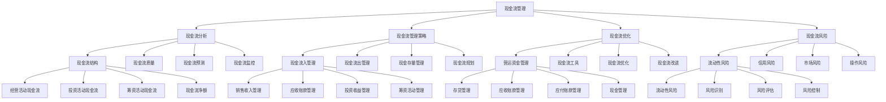

# 现金流管理

## 🎯 学习目标
掌握现金流管理理论和方法，学会优化现金流结构，提升企业资金使用效率和财务安全性。

## 📊 现金流管理框架

### 现金流管理模型

## 📊 现金流分析

### 现金流结构
**经营活动现金流**：
- **经营活动现金流**：经营活动现金流分析
- **现金流入**：经营活动现金流入
- **现金流出**：经营活动现金流出
- **现金流质量**：经营活动现金流质量

**投资活动现金流**：
- **投资活动现金流**：投资活动现金流分析
- **现金流入**：投资活动现金流入
- **现金流出**：投资活动现金流出
- **投资效果**：投资活动效果分析

**筹资活动现金流**：
- **筹资活动现金流**：筹资活动现金流分析
- **现金流入**：筹资活动现金流入
- **现金流出**：筹资活动现金流出
- **筹资效果**：筹资活动效果分析

**现金流净额**：
- **现金流净额**：现金流净额分析
- **净额计算**：现金流净额计算
- **净额分析**：现金流净额分析
- **净额趋势**：现金流净额趋势

### 现金流质量
**现金流稳定性**：
- **现金流稳定性**：现金流稳定性分析
- **稳定性指标**：稳定性指标
- **稳定性评估**：稳定性评估
- **稳定性改进**：稳定性改进

**现金流增长性**：
- **现金流增长性**：现金流增长性分析
- **增长性指标**：增长性指标
- **增长性评估**：增长性评估
- **增长性改进**：增长性改进

**现金流充足性**：
- **现金流充足性**：现金流充足性分析
- **充足性指标**：充足性指标
- **充足性评估**：充足性评估
- **充足性改进**：充足性改进

**现金流效率**：
- **现金流效率**：现金流效率分析
- **效率指标**：效率指标
- **效率评估**：效率评估
- **效率改进**：效率改进

### 现金流预测
**短期预测**：
- **短期预测**：短期现金流预测
- **预测方法**：预测方法
- **预测工具**：预测工具
- **预测精度**：预测精度

**中期预测**：
- **中期预测**：中期现金流预测
- **预测方法**：预测方法
- **预测工具**：预测工具
- **预测精度**：预测精度

**长期预测**：
- **长期预测**：长期现金流预测
- **预测方法**：预测方法
- **预测工具**：预测工具
- **预测精度**：预测精度

**情景分析**：
- **情景分析**：现金流情景分析
- **情景设计**：情景设计
- **情景分析**：情景分析
- **情景应用**：情景应用

### 现金流监控
**现金流监控**：
- **现金流监控**：现金流监控
- **监控指标**：监控指标
- **监控方法**：监控方法
- **监控结果**：监控结果

**监控体系**：
- **监控体系**：监控体系
- **体系设计**：体系设计
- **体系实施**：体系实施
- **体系优化**：体系优化

## 🎯 现金流管理策略

### 现金流入管理
**销售收入管理**：
- **销售收入管理**：销售收入管理
- **收入预测**：收入预测
- **收入控制**：收入控制
- **收入优化**：收入优化

**应收账款管理**：
- **应收账款管理**：应收账款管理
- **信用政策**：信用政策
- **收款管理**：收款管理
- **坏账控制**：坏账控制

**投资收益管理**：
- **投资收益管理**：投资收益管理
- **投资决策**：投资决策
- **收益管理**：收益管理
- **风险控制**：风险控制

**筹资活动管理**：
- **筹资活动管理**：筹资活动管理
- **筹资决策**：筹资决策
- **筹资实施**：筹资实施
- **筹资优化**：筹资优化

### 现金流出管理
**采购支出管理**：
- **采购支出管理**：采购支出管理
- **采购计划**：采购计划
- **采购控制**：采购控制
- **采购优化**：采购优化

**运营支出管理**：
- **运营支出管理**：运营支出管理
- **支出预算**：支出预算
- **支出控制**：支出控制
- **支出优化**：支出优化

**投资支出管理**：
- **投资支出管理**：投资支出管理
- **投资计划**：投资计划
- **投资控制**：投资控制
- **投资优化**：投资优化

**筹资支出管理**：
- **筹资支出管理**：筹资支出管理
- **支出计划**：支出计划
- **支出控制**：支出控制
- **支出优化**：支出优化

### 现金存量管理
**现金持有量**：
- **现金持有量**：现金持有量管理
- **持有量确定**：持有量确定
- **持有量控制**：持有量控制
- **持有量优化**：持有量优化

**现金投资**：
- **现金投资**：现金投资管理
- **投资策略**：投资策略
- **投资实施**：投资实施
- **投资效果**：投资效果

**现金风险**：
- **现金风险**：现金风险管理
- **风险识别**：风险识别
- **风险评估**：风险评估
- **风险控制**：风险控制

**现金收益**：
- **现金收益**：现金收益管理
- **收益目标**：收益目标
- **收益实现**：收益实现
- **收益优化**：收益优化

### 现金流规划
**现金流规划**：
- **现金流规划**：现金流规划
- **规划方法**：规划方法
- **规划工具**：规划工具
- **规划实施**：规划实施

**规划体系**：
- **规划体系**：规划体系
- **体系设计**：体系设计
- **体系实施**：体系实施
- **体系优化**：体系优化

## 🚀 现金流优化

### 营运资金管理
**存货管理**：
- **存货管理**：存货管理
- **存货控制**：存货控制
- **存货优化**：存货优化
- **存货效果**：存货效果

**应收账款管理**：
- **应收账款管理**：应收账款管理
- **信用管理**：信用管理
- **收款管理**：收款管理
- **账款优化**：账款优化

**应付账款管理**：
- **应付账款管理**：应付账款管理
- **付款管理**：付款管理
- **账款控制**：账款控制
- **账款优化**：账款优化

**现金管理**：
- **现金管理**：现金管理
- **现金控制**：现金控制
- **现金优化**：现金优化
- **现金效果**：现金效果

### 现金流工具
**现金预算**：
- **现金预算**：现金预算
- **预算制定**：预算制定
- **预算实施**：预算实施
- **预算控制**：预算控制

**现金流报表**：
- **现金流报表**：现金流报表
- **报表设计**：报表设计
- **报表生成**：报表生成
- **报表分析**：报表分析

**现金流分析**：
- **现金流分析**：现金流分析
- **分析方法**：分析方法
- **分析工具**：分析工具
- **分析结果**：分析结果

**现金流监控**：
- **现金流监控**：现金流监控
- **监控指标**：监控指标
- **监控方法**：监控方法
- **监控结果**：监控结果

### 现金流优化
**现金流优化**：
- **现金流优化**：现金流优化
- **优化方法**：优化方法
- **优化工具**：优化工具
- **优化效果**：优化效果

**优化策略**：
- **优化策略**：优化策略
- **策略制定**：策略制定
- **策略实施**：策略实施
- **策略效果**：策略效果

### 现金流改进
**现金流改进**：
- **现金流改进**：现金流改进
- **改进识别**：改进识别
- **改进实施**：改进实施
- **改进效果**：改进效果

**改进文化**：
- **改进文化**：改进文化
- **文化建设**：文化建设
- **文化传播**：文化传播
- **文化效果**：文化效果

## ⚠️ 现金流风险

### 流动性风险
**流动性风险**：
- **流动性风险**：流动性风险
- **风险识别**：风险识别
- **风险评估**：风险评估
- **风险控制**：风险控制

**风险识别**：
- **风险识别**：风险识别
- **识别方法**：识别方法
- **识别工具**：识别工具
- **识别结果**：识别结果

**风险评估**：
- **风险评估**：风险评估
- **评估方法**：评估方法
- **评估工具**：评估工具
- **评估结果**：评估结果

**风险控制**：
- **风险控制**：风险控制
- **控制方法**：控制方法
- **控制工具**：控制工具
- **控制效果**：控制效果

### 信用风险
**信用风险**：
- **信用风险**：信用风险
- **风险识别**：风险识别
- **风险评估**：风险评估
- **风险控制**：风险控制

**客户信用**：
- **客户信用**：客户信用管理
- **信用评估**：信用评估
- **信用控制**：信用控制
- **信用优化**：信用优化

### 市场风险
**市场风险**：
- **市场风险**：市场风险
- **风险识别**：风险识别
- **风险评估**：风险评估
- **风险控制**：风险控制

**利率风险**：
- **利率风险**：利率风险
- **风险识别**：风险识别
- **风险评估**：风险评估
- **风险控制**：风险控制

### 操作风险
**操作风险**：
- **操作风险**：操作风险
- **风险识别**：风险识别
- **风险评估**：风险评估
- **风险控制**：风险控制

**内部控制**：
- **内部控制**：内部控制
- **控制设计**：控制设计
- **控制实施**：控制实施
- **控制效果**：控制效果

## 💡 现金流管理案例

### 成功案例
**苹果公司**：
- **现金流管理**：优秀的现金流管理
- **现金储备**：大量现金储备
- **投资策略**：稳健的投资策略
- **效果**：现金流状况极佳

**微软公司**：
- **现金流管理**：系统化的现金流管理
- **现金生成**：强大的现金生成能力
- **投资回报**：优秀的投资回报
- **效果**：现金流质量极高

**亚马逊公司**：
- **现金流管理**：创新的现金流管理
- **现金循环**：高效的现金循环
- **投资效率**：高效的投资效率
- **效果**：现金流增长强劲

### 失败案例
**失败原因**：
- **现金流预测不准确**：现金流预测不准确
- **现金流控制不严格**：现金流控制不严格
- **现金流风险控制不足**：现金流风险控制不足
- **现金流管理缺失**：现金流管理缺失

**失败教训**：
- **现金流预测**：重视现金流预测
- **现金流控制**：严格现金流控制
- **现金流风险**：加强现金流风险控制
- **现金流管理**：完善现金流管理

## 🧠 学习要点

### 费曼学习法应用
1. **选择概念**：现金流管理
2. **简化解释**：用简单语言解释现金流管理
3. **识别盲点**：找出理解不足的地方
4. **重新学习**：针对盲点深入学习

### 刻意练习要点
- **理论掌握**：掌握现金流管理理论
- **方法应用**：掌握现金流管理方法
- **工具使用**：掌握现金流管理工具
- **实践应用**：实践应用现金流管理

## 🔗 关联学习

### 前置知识
- [[02-财务比率分析]] - 财务比率分析
- [[01-财务报表分析]] - 财务报表分析
- [[01-商业学概论]] - 商业学基础

### 后续学习
- [[04-成本管理]] - 成本管理
- [[01-投资决策]] - 投资决策
- [[02-风险评估]] - 风险评估

### 实践应用
- 企业现金流管理
- 现金流优化改进
- 现金流风险控制
- 现金流预测分析

## 🎯 学习检验

### 理解检验
- [ ] 能够理解现金流管理理论
- [ ] 能够掌握现金流管理方法
- [ ] 能够应用现金流管理工具
- [ ] 能够分析现金流结构

### 应用检验
- [ ] 能够分析企业现金流
- [ ] 能够优化现金流结构
- [ ] 能够控制现金流风险
- [ ] 能够预测现金流趋势

---
**下一步**：[[04-成本管理]] - 成本管理