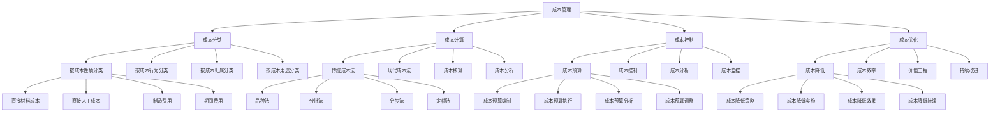

# 成本管理

## 🎯 学习目标
掌握成本管理理论和方法，学会控制和分析成本，提升企业成本效益和竞争优势。

## 📊 成本管理框架

### 成本管理模型

## 📋 成本分类

### 按成本性质分类
**直接材料成本**：
- **直接材料成本**：直接材料成本
- **材料采购**：材料采购成本
- **材料使用**：材料使用成本
- **材料控制**：材料成本控制

**直接人工成本**：
- **直接人工成本**：直接人工成本
- **工资成本**：工资成本
- **福利成本**：福利成本
- **人工控制**：人工成本控制

**制造费用**：
- **制造费用**：制造费用
- **间接材料**：间接材料费用
- **间接人工**：间接人工费用
- **制造费用控制**：制造费用控制

**期间费用**：
- **期间费用**：期间费用
- **销售费用**：销售费用
- **管理费用**：管理费用
- **财务费用**：财务费用

### 按成本行为分类
**固定成本**：
- **固定成本**：固定成本
- **固定成本特征**：固定成本特征
- **固定成本管理**：固定成本管理
- **固定成本优化**：固定成本优化

**变动成本**：
- **变动成本**：变动成本
- **变动成本特征**：变动成本特征
- **变动成本管理**：变动成本管理
- **变动成本优化**：变动成本优化

**混合成本**：
- **混合成本**：混合成本
- **混合成本分解**：混合成本分解
- **混合成本管理**：混合成本管理
- **混合成本优化**：混合成本优化

**阶梯成本**：
- **阶梯成本**：阶梯成本
- **阶梯成本特征**：阶梯成本特征
- **阶梯成本管理**：阶梯成本管理
- **阶梯成本优化**：阶梯成本优化

### 按成本归属分类
**产品成本**：
- **产品成本**：产品成本
- **产品成本计算**：产品成本计算
- **产品成本控制**：产品成本控制
- **产品成本优化**：产品成本优化

**期间成本**：
- **期间成本**：期间成本
- **期间成本计算**：期间成本计算
- **期间成本控制**：期间成本控制
- **期间成本优化**：期间成本优化

**可控成本**：
- **可控成本**：可控成本
- **可控成本识别**：可控成本识别
- **可控成本管理**：可控成本管理
- **可控成本优化**：可控成本优化

**不可控成本**：
- **不可控成本**：不可控成本
- **不可控成本识别**：不可控成本识别
- **不可控成本管理**：不可控成本管理
- **不可控成本应对**：不可控成本应对

### 按成本用途分类
**按成本用途分类**：
- **按成本用途分类**：按成本用途分类
- **用途识别**：用途识别
- **用途管理**：用途管理
- **用途优化**：用途优化

**生产成本**：
- **生产成本**：生产成本
- **生产成本计算**：生产成本计算
- **生产成本控制**：生产成本控制
- **生产成本优化**：生产成本优化

**销售成本**：
- **销售成本**：销售成本
- **销售成本计算**：销售成本计算
- **销售成本控制**：销售成本控制
- **销售成本优化**：销售成本优化

## 🧮 成本计算方法

### 传统成本法
**品种法**：
- **品种法**：品种法
- **品种法特点**：品种法特点
- **品种法计算**：品种法计算
- **品种法应用**：品种法应用

**分批法**：
- **分批法**：分批法
- **分批法特点**：分批法特点
- **分批法计算**：分批法计算
- **分批法应用**：分批法应用

**分步法**：
- **分步法**：分步法
- **分步法特点**：分步法特点
- **分步法计算**：分步法计算
- **分步法应用**：分步法应用

**定额法**：
- **定额法**：定额法
- **定额法特点**：定额法特点
- **定额法计算**：定额法计算
- **定额法应用**：定额法应用

### 现代成本法
**作业成本法**：
- **作业成本法**：作业成本法
- **作业成本法特点**：作业成本法特点
- **作业成本法计算**：作业成本法计算
- **作业成本法应用**：作业成本法应用

**目标成本法**：
- **目标成本法**：目标成本法
- **目标成本法特点**：目标成本法特点
- **目标成本法计算**：目标成本法计算
- **目标成本法应用**：目标成本法应用

**标准成本法**：
- **标准成本法**：标准成本法
- **标准成本法特点**：标准成本法特点
- **标准成本法计算**：标准成本法计算
- **标准成本法应用**：标准成本法应用

**生命周期成本法**：
- **生命周期成本法**：生命周期成本法
- **生命周期成本法特点**：生命周期成本法特点
- **生命周期成本法计算**：生命周期成本法计算
- **生命周期成本法应用**：生命周期成本法应用

### 成本核算
**成本核算**：
- **成本核算**：成本核算
- **核算方法**：核算方法
- **核算流程**：核算流程
- **核算结果**：核算结果

**核算体系**：
- **核算体系**：核算体系
- **体系设计**：体系设计
- **体系实施**：体系实施
- **体系优化**：体系优化

### 成本分析
**成本分析**：
- **成本分析**：成本分析
- **分析方法**：分析方法
- **分析工具**：分析工具
- **分析结果**：分析结果

**分析报告**：
- **分析报告**：分析报告
- **报告内容**：报告内容
- **报告格式**：报告格式
- **报告应用**：报告应用

## 🎯 成本控制

### 成本预算
**成本预算编制**：
- **成本预算编制**：成本预算编制
- **编制方法**：编制方法
- **编制工具**：编制工具
- **编制结果**：编制结果

**成本预算执行**：
- **成本预算执行**：成本预算执行
- **执行监控**：执行监控
- **执行控制**：执行控制
- **执行效果**：执行效果

**成本预算分析**：
- **成本预算分析**：成本预算分析
- **分析方法**：分析方法
- **分析工具**：分析工具
- **分析结果**：分析结果

**成本预算调整**：
- **成本预算调整**：成本预算调整
- **调整原因**：调整原因
- **调整方法**：调整方法
- **调整效果**：调整效果

### 成本控制
**成本控制**：
- **成本控制**：成本控制
- **控制方法**：控制方法
- **控制工具**：控制工具
- **控制效果**：控制效果

**控制体系**：
- **控制体系**：控制体系
- **体系设计**：体系设计
- **体系实施**：体系实施
- **体系优化**：体系优化

### 成本分析
**成本结构分析**：
- **成本结构分析**：成本结构分析
- **分析方法**：分析方法
- **分析工具**：分析工具
- **分析结果**：分析结果

**成本趋势分析**：
- **成本趋势分析**：成本趋势分析
- **分析方法**：分析方法
- **分析工具**：分析工具
- **分析结果**：分析结果

**成本差异分析**：
- **成本差异分析**：成本差异分析
- **分析方法**：分析方法
- **分析工具**：分析工具
- **分析结果**：分析结果

**成本效益分析**：
- **成本效益分析**：成本效益分析
- **分析方法**：分析方法
- **分析工具**：分析工具
- **分析结果**：分析结果

### 成本监控
**成本监控**：
- **成本监控**：成本监控
- **监控指标**：监控指标
- **监控方法**：监控方法
- **监控结果**：监控结果

**监控体系**：
- **监控体系**：监控体系
- **体系设计**：体系设计
- **体系实施**：体系实施
- **体系优化**：体系优化

## 🚀 成本优化

### 成本降低
**成本降低策略**：
- **成本降低策略**：成本降低策略
- **策略制定**：策略制定
- **策略实施**：策略实施
- **策略效果**：策略效果

**成本降低实施**：
- **成本降低实施**：成本降低实施
- **实施方法**：实施方法
- **实施工具**：实施工具
- **实施效果**：实施效果

**成本降低效果**：
- **成本降低效果**：成本降低效果
- **效果评估**：效果评估
- **效果分析**：效果分析
- **效果改进**：效果改进

**成本降低持续**：
- **成本降低持续**：成本降低持续
- **持续方法**：持续方法
- **持续工具**：持续工具
- **持续效果**：持续效果

### 成本效率
**成本效率**：
- **成本效率**：成本效率
- **效率提升**：效率提升
- **效率管理**：效率管理
- **效率优化**：效率优化

**效率指标**：
- **效率指标**：效率指标
- **指标设计**：指标设计
- **指标监控**：指标监控
- **指标分析**：指标分析

### 价值工程
**价值工程**：
- **价值工程**：价值工程
- **工程方法**：工程方法
- **工程工具**：工程工具
- **工程效果**：工程效果

**价值分析**：
- **价值分析**：价值分析
- **分析方法**：分析方法
- **分析工具**：分析工具
- **分析结果**：分析结果

### 持续改进
**持续改进**：
- **持续改进**：持续改进
- **改进方法**：改进方法
- **改进工具**：改进工具
- **改进效果**：改进效果

**改进文化**：
- **改进文化**：改进文化
- **文化建设**：文化建设
- **文化传播**：文化传播
- **文化效果**：文化效果

## 💡 成本管理案例

### 成功案例
**丰田汽车**：
- **成本管理**：精益成本管理
- **成本控制**：严格成本控制
- **成本优化**：持续成本优化
- **效果**：成本控制行业领先

**沃尔玛**：
- **成本管理**：供应链成本管理
- **成本控制**：高效成本控制
- **成本优化**：系统成本优化
- **效果**：成本优势明显

**宜家家居**：
- **成本管理**：设计成本管理
- **成本控制**：创新成本控制
- **成本优化**：价值成本优化
- **效果**：成本效益极佳

### 失败案例
**失败原因**：
- **成本控制不严格**：成本控制不严格
- **成本分析不足**：成本分析不足
- **成本优化缺失**：成本优化缺失
- **成本管理缺失**：成本管理缺失

**失败教训**：
- **成本控制**：严格成本控制
- **成本分析**：加强成本分析
- **成本优化**：持续成本优化
- **成本管理**：完善成本管理

## 🧠 学习要点

### 费曼学习法应用
1. **选择概念**：成本管理
2. **简化解释**：用简单语言解释成本管理
3. **识别盲点**：找出理解不足的地方
4. **重新学习**：针对盲点深入学习

### 刻意练习要点
- **理论掌握**：掌握成本管理理论
- **方法应用**：掌握成本管理方法
- **工具使用**：掌握成本管理工具
- **实践应用**：实践应用成本管理

## 🔗 关联学习

### 前置知识
- [[03-现金流管理]] - 现金流管理
- [[02-财务比率分析]] - 财务比率分析
- [[01-财务报表分析]] - 财务报表分析

### 后续学习
- [[01-投资决策]] - 投资决策
- [[02-风险评估]] - 风险评估
- [[01-资本预算]] - 资本预算

### 实践应用
- 企业成本管理
- 成本控制优化
- 成本分析改进
- 成本效益提升

## 🎯 学习检验

### 理解检验
- [ ] 能够理解成本管理理论
- [ ] 能够掌握成本管理方法
- [ ] 能够应用成本管理工具
- [ ] 能够分析成本结构

### 应用检验
- [ ] 能够分析企业成本
- [ ] 能够控制成本支出
- [ ] 能够优化成本结构
- [ ] 能够提升成本效益

---
**下一步**：[[01-投资决策]] - 投资决策