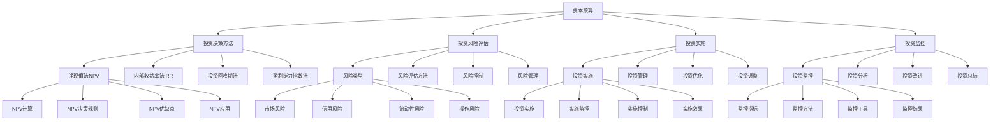

# 资本预算

## 🎯 学习目标
掌握资本预算理论和方法，学会评估投资项目，提升投资决策能力和投资回报率。

## 📊 资本预算框架

### 资本预算模型

## 💰 投资决策方法

### 净现值法(NPV)
**NPV计算**：
- **NPV计算**：净现值计算
- **计算公式**：NPV = Σ(CFt/(1+r)^t) - I0
- **计算步骤**：计算步骤
- **计算工具**：计算工具

**NPV决策规则**：
- **NPV决策规则**：NPV决策规则
- **规则内容**：NPV > 0 接受项目
- **规则应用**：规则应用
- **规则效果**：规则效果

**NPV优缺点**：
- **NPV优点**：NPV优点
- **NPV缺点**：NPV缺点
- **优缺点分析**：优缺点分析
- **优缺点应用**：优缺点应用

**NPV应用**：
- **NPV应用**：NPV应用
- **应用场景**：应用场景
- **应用方法**：应用方法
- **应用效果**：应用效果

### 内部收益率法(IRR)
**IRR计算**：
- **IRR计算**：内部收益率计算
- **计算方法**：计算方法
- **计算工具**：计算工具
- **计算精度**：计算精度

**IRR决策规则**：
- **IRR决策规则**：IRR决策规则
- **规则内容**：IRR > 资本成本 接受项目
- **规则应用**：规则应用
- **规则效果**：规则效果

**IRR优缺点**：
- **IRR优点**：IRR优点
- **IRR缺点**：IRR缺点
- **优缺点分析**：优缺点分析
- **优缺点应用**：优缺点应用

**IRR应用**：
- **IRR应用**：IRR应用
- **应用场景**：应用场景
- **应用方法**：应用方法
- **应用效果**：应用效果

### 投资回收期法
**静态回收期**：
- **静态回收期**：静态回收期
- **计算方法**：计算方法
- **计算工具**：计算工具
- **计算精度**：计算精度

**动态回收期**：
- **动态回收期**：动态回收期
- **计算方法**：计算方法
- **计算工具**：计算工具
- **计算精度**：计算精度

**回收期决策规则**：
- **回收期决策规则**：回收期决策规则
- **规则内容**：回收期 < 标准回收期 接受项目
- **规则应用**：规则应用
- **规则效果**：规则效果

**回收期应用**：
- **回收期应用**：回收期应用
- **应用场景**：应用场景
- **应用方法**：应用方法
- **应用效果**：应用效果

### 盈利能力指数法
**盈利能力指数计算**：
- **盈利能力指数计算**：盈利能力指数计算
- **计算公式**：PI = NPV / I0
- **计算步骤**：计算步骤
- **计算工具**：计算工具

**决策规则**：
- **决策规则**：决策规则
- **规则内容**：PI > 1 接受项目
- **规则应用**：规则应用
- **规则效果**：规则效果

**优缺点分析**：
- **优点分析**：优点分析
- **缺点分析**：缺点分析
- **优缺点比较**：优缺点比较
- **优缺点应用**：优缺点应用

**应用场景**：
- **应用场景**：应用场景
- **场景分析**：场景分析
- **场景选择**：场景选择
- **场景效果**：场景效果

## ⚠️ 投资风险评估

### 风险类型
**市场风险**：
- **市场风险**：市场风险
- **风险识别**：风险识别
- **风险评估**：风险评估
- **风险控制**：风险控制

**信用风险**：
- **信用风险**：信用风险
- **风险识别**：风险识别
- **风险评估**：风险评估
- **风险控制**：风险控制

**流动性风险**：
- **流动性风险**：流动性风险
- **风险识别**：风险识别
- **风险评估**：风险评估
- **风险控制**：风险控制

**操作风险**：
- **操作风险**：操作风险
- **风险识别**：风险识别
- **风险评估**：风险评估
- **风险控制**：风险控制

### 风险评估方法
**敏感性分析**：
- **敏感性分析**：敏感性分析
- **分析方法**：分析方法
- **分析工具**：分析工具
- **分析结果**：分析结果

**情景分析**：
- **情景分析**：情景分析
- **分析方法**：分析方法
- **分析工具**：分析工具
- **分析结果**：分析结果

**蒙特卡洛模拟**：
- **蒙特卡洛模拟**：蒙特卡洛模拟
- **模拟方法**：模拟方法
- **模拟工具**：模拟工具
- **模拟结果**：模拟结果

**风险价值(VaR)**：
- **风险价值**：风险价值
- **计算方法**：计算方法
- **计算工具**：计算工具
- **计算结果**：计算结果

### 风险控制
**风险分散**：
- **风险分散**：风险分散
- **分散方法**：分散方法
- **分散工具**：分散工具
- **分散效果**：分散效果

**风险对冲**：
- **风险对冲**：风险对冲
- **对冲方法**：对冲方法
- **对冲工具**：对冲工具
- **对冲效果**：对冲效果

**风险转移**：
- **风险转移**：风险转移
- **转移方法**：转移方法
- **转移工具**：转移工具
- **转移效果**：转移效果

**风险规避**：
- **风险规避**：风险规避
- **规避方法**：规避方法
- **规避工具**：规避工具
- **规避效果**：规避效果

### 风险管理
**风险管理**：
- **风险管理**：风险管理
- **管理方法**：管理方法
- **管理工具**：管理工具
- **管理效果**：管理效果

**风险体系**：
- **风险体系**：风险体系
- **体系设计**：体系设计
- **体系实施**：体系实施
- **体系优化**：体系优化

## 🚀 投资实施

### 投资实施
**投资实施**：
- **投资实施**：投资实施
- **实施计划**：实施计划
- **实施监控**：实施监控
- **实施控制**：实施控制

**实施监控**：
- **实施监控**：实施监控
- **监控指标**：监控指标
- **监控方法**：监控方法
- **监控结果**：监控结果

**实施控制**：
- **实施控制**：实施控制
- **控制方法**：控制方法
- **控制工具**：控制工具
- **控制效果**：控制效果

**实施效果**：
- **实施效果**：实施效果
- **效果评估**：效果评估
- **效果分析**：效果分析
- **效果改进**：效果改进

### 投资管理
**投资管理**：
- **投资管理**：投资管理
- **管理方法**：管理方法
- **管理工具**：管理工具
- **管理效果**：管理效果

**管理流程**：
- **管理流程**：管理流程
- **流程设计**：流程设计
- **流程实施**：流程实施
- **流程优化**：流程优化

### 投资优化
**投资优化**：
- **投资优化**：投资优化
- **优化方法**：优化方法
- **优化工具**：优化工具
- **优化效果**：优化效果

**优化策略**：
- **优化策略**：优化策略
- **策略制定**：策略制定
- **策略实施**：策略实施
- **策略效果**：策略效果

### 投资调整
**投资调整**：
- **投资调整**：投资调整
- **调整原因**：调整原因
- **调整方法**：调整方法
- **调整效果**：调整效果

**调整策略**：
- **调整策略**：调整策略
- **策略制定**：策略制定
- **策略实施**：策略实施
- **策略效果**：策略效果

## 📊 投资监控

### 投资监控
**投资监控**：
- **投资监控**：投资监控
- **监控指标**：监控指标
- **监控方法**：监控方法
- **监控结果**：监控结果

**监控指标**：
- **监控指标**：监控指标
- **指标设计**：指标设计
- **指标监控**：指标监控
- **指标分析**：指标分析

**监控方法**：
- **监控方法**：监控方法
- **方法选择**：方法选择
- **方法实施**：方法实施
- **方法效果**：方法效果

**监控工具**：
- **监控工具**：监控工具
- **工具选择**：工具选择
- **工具使用**：工具使用
- **工具效果**：工具效果

**监控结果**：
- **监控结果**：监控结果
- **结果分析**：结果分析
- **结果应用**：结果应用
- **结果改进**：结果改进

### 投资分析
**投资分析**：
- **投资分析**：投资分析
- **分析方法**：分析方法
- **分析工具**：分析工具
- **分析结果**：分析结果

**分析报告**：
- **分析报告**：分析报告
- **报告内容**：报告内容
- **报告格式**：报告格式
- **报告应用**：报告应用

### 投资改进
**投资改进**：
- **投资改进**：投资改进
- **改进识别**：改进识别
- **改进实施**：改进实施
- **改进效果**：改进效果

**改进文化**：
- **改进文化**：改进文化
- **文化建设**：文化建设
- **文化传播**：文化传播
- **文化效果**：文化效果

### 投资总结
**投资总结**：
- **投资总结**：投资总结
- **总结内容**：总结内容
- **总结方法**：总结方法
- **总结应用**：总结应用

**经验总结**：
- **经验总结**：经验总结
- **经验提取**：经验提取
- **经验应用**：经验应用
- **经验传承**：经验传承

## 💡 资本预算案例

### 成功案例
**苹果公司**：
- **投资决策**：精准的投资决策
- **投资管理**：高效的投资管理
- **投资回报**：优秀的投资回报
- **效果**：投资效果极佳

**特斯拉公司**：
- **投资决策**：创新的投资决策
- **投资管理**：系统的投资管理
- **投资回报**：卓越的投资回报
- **效果**：投资效果显著

**亚马逊公司**：
- **投资决策**：前瞻的投资决策
- **投资管理**：全面的投资管理
- **投资回报**：持续的投资回报
- **效果**：投资效果突出

### 失败案例
**失败原因**：
- **投资决策失误**：投资决策失误
- **风险评估不足**：风险评估不足
- **投资管理缺失**：投资管理缺失
- **投资监控不足**：投资监控不足

**失败教训**：
- **投资决策**：重视投资决策
- **风险评估**：加强风险评估
- **投资管理**：完善投资管理
- **投资监控**：加强投资监控

## 🧠 学习要点

### 费曼学习法应用
1. **选择概念**：资本预算
2. **简化解释**：用简单语言解释资本预算
3. **识别盲点**：找出理解不足的地方
4. **重新学习**：针对盲点深入学习

### 刻意练习要点
- **理论掌握**：掌握资本预算理论
- **方法应用**：掌握资本预算方法
- **工具使用**：掌握资本预算工具
- **实践应用**：实践应用资本预算

## 🔗 关联学习

### 前置知识
- [[04-成本管理]] - 成本管理
- [[03-现金流管理]] - 现金流管理
- [[02-财务比率分析]] - 财务比率分析

### 后续学习
- [[02-风险评估]] - 风险评估
- [[03-投资组合理论]] - 投资组合理论
- [[04-估值方法]] - 估值方法

### 实践应用
- 企业投资决策
- 投资项目评估
- 投资风险控制
- 投资回报优化

## 🎯 学习检验

### 理解检验
- [ ] 能够理解资本预算理论
- [ ] 能够掌握资本预算方法
- [ ] 能够应用资本预算工具
- [ ] 能够评估投资项目

### 应用检验
- [ ] 能够进行投资决策
- [ ] 能够评估投资风险
- [ ] 能够管理投资项目
- [ ] 能够优化投资回报

---
**下一步**：[[02-风险评估]] - 风险评估