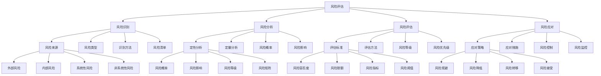

# 风险评估

## 🎯 学习目标
掌握风险评估理论和方法，学会识别、分析和应对企业风险，提升风险管理能力和决策质量。

## 📊 风险评估框架

### 风险评估模型

## 🔍 风险识别

### 风险来源
**外部风险**：
- **外部风险**：外部风险识别
- **市场风险**：市场风险识别
- **政策风险**：政策风险识别
- **竞争风险**：竞争风险识别

**内部风险**：
- **内部风险**：内部风险识别
- **运营风险**：运营风险识别
- **财务风险**：财务风险识别
- **管理风险**：管理风险识别

**系统性风险**：
- **系统性风险**：系统性风险识别
- **经济风险**：经济风险识别
- **金融风险**：金融风险识别
- **技术风险**：技术风险识别

**非系统性风险**：
- **非系统性风险**：非系统性风险识别
- **企业风险**：企业风险识别
- **行业风险**：行业风险识别
- **项目风险**：项目风险识别

### 风险类型
**市场风险**：
- **市场风险**：市场风险识别
- **价格风险**：价格风险识别
- **汇率风险**：汇率风险识别
- **利率风险**：利率风险识别

**信用风险**：
- **信用风险**：信用风险识别
- **客户风险**：客户风险识别
- **供应商风险**：供应商风险识别
- **合作伙伴风险**：合作伙伴风险识别

**操作风险**：
- **操作风险**：操作风险识别
- **流程风险**：流程风险识别
- **人员风险**：人员风险识别
- **系统风险**：系统风险识别

**流动性风险**：
- **流动性风险**：流动性风险识别
- **资金风险**：资金风险识别
- **资产风险**：资产风险识别
- **负债风险**：负债风险识别

### 识别方法
**风险清单**：
- **风险清单**：风险清单识别
- **清单制定**：清单制定
- **清单使用**：清单使用
- **清单更新**：清单更新

**流程图分析**：
- **流程图分析**：流程图分析
- **流程识别**：流程识别
- **风险点识别**：风险点识别
- **风险分析**：风险分析

**专家判断**：
- **专家判断**：专家判断
- **专家选择**：专家选择
- **判断方法**：判断方法
- **判断结果**：判断结果

**历史数据分析**：
- **历史数据分析**：历史数据分析
- **数据收集**：数据收集
- **数据分析**：数据分析
- **数据应用**：数据应用

### 风险清单
**风险清单**：
- **风险清单**：风险清单
- **清单内容**：清单内容
- **清单格式**：清单格式
- **清单应用**：清单应用

**清单管理**：
- **清单管理**：清单管理
- **管理方法**：管理方法
- **管理工具**：管理工具
- **管理效果**：管理效果

## 📈 风险分析

### 定性分析
**风险概率**：
- **风险概率**：风险概率分析
- **概率评估**：概率评估
- **概率等级**：概率等级
- **概率应用**：概率应用

**风险影响**：
- **风险影响**：风险影响分析
- **影响评估**：影响评估
- **影响等级**：影响等级
- **影响应用**：影响应用

**风险等级**：
- **风险等级**：风险等级分析
- **等级划分**：等级划分
- **等级标准**：等级标准
- **等级应用**：等级应用

**风险矩阵**：
- **风险矩阵**：风险矩阵分析
- **矩阵构建**：矩阵构建
- **矩阵应用**：矩阵应用
- **矩阵效果**：矩阵效果

### 定量分析
**统计方法**：
- **统计方法**：统计方法分析
- **方法选择**：方法选择
- **方法应用**：方法应用
- **方法效果**：方法效果

**概率分布**：
- **概率分布**：概率分布分析
- **分布选择**：分布选择
- **分布应用**：分布应用
- **分布效果**：分布效果

**蒙特卡洛模拟**：
- **蒙特卡洛模拟**：蒙特卡洛模拟分析
- **模拟方法**：模拟方法
- **模拟工具**：模拟工具
- **模拟结果**：模拟结果

**敏感性分析**：
- **敏感性分析**：敏感性分析
- **分析方法**：分析方法
- **分析工具**：分析工具
- **分析结果**：分析结果

### 风险概率
**风险概率**：
- **风险概率**：风险概率
- **概率计算**：概率计算
- **概率评估**：概率评估
- **概率应用**：概率应用

**概率模型**：
- **概率模型**：概率模型
- **模型选择**：模型选择
- **模型应用**：模型应用
- **模型效果**：模型效果

### 风险影响
**风险影响**：
- **风险影响**：风险影响
- **影响评估**：影响评估
- **影响量化**：影响量化
- **影响应用**：影响应用

**影响模型**：
- **影响模型**：影响模型
- **模型选择**：模型选择
- **模型应用**：模型应用
- **模型效果**：模型效果

## 📊 风险评估

### 评估标准
**风险容忍度**：
- **风险容忍度**：风险容忍度
- **容忍度确定**：容忍度确定
- **容忍度应用**：容忍度应用
- **容忍度调整**：容忍度调整

**风险限额**：
- **风险限额**：风险限额
- **限额设定**：限额设定
- **限额监控**：限额监控
- **限额调整**：限额调整

**风险指标**：
- **风险指标**：风险指标
- **指标设计**：指标设计
- **指标监控**：指标监控
- **指标分析**：指标分析

**风险阈值**：
- **风险阈值**：风险阈值
- **阈值设定**：阈值设定
- **阈值监控**：阈值监控
- **阈值调整**：阈值调整

### 评估方法
**风险评分**：
- **风险评分**：风险评分
- **评分方法**：评分方法
- **评分工具**：评分工具
- **评分结果**：评分结果

**风险排序**：
- **风险排序**：风险排序
- **排序方法**：排序方法
- **排序工具**：排序工具
- **排序结果**：排序结果

**风险分类**：
- **风险分类**：风险分类
- **分类方法**：分类方法
- **分类工具**：分类工具
- **分类结果**：分类结果

**风险优先级**：
- **风险优先级**：风险优先级
- **优先级确定**：优先级确定
- **优先级应用**：优先级应用
- **优先级调整**：优先级调整

### 风险等级
**风险等级**：
- **风险等级**：风险等级
- **等级划分**：等级划分
- **等级标准**：等级标准
- **等级应用**：等级应用

**等级管理**：
- **等级管理**：等级管理
- **管理方法**：管理方法
- **管理工具**：管理工具
- **管理效果**：管理效果

### 风险优先级
**风险优先级**：
- **风险优先级**：风险优先级
- **优先级确定**：优先级确定
- **优先级应用**：优先级应用
- **优先级调整**：优先级调整

**优先级管理**：
- **优先级管理**：优先级管理
- **管理方法**：管理方法
- **管理工具**：管理工具
- **管理效果**：管理效果

## 🛡️ 风险应对

### 应对策略
**风险规避**：
- **风险规避**：风险规避策略
- **规避方法**：规避方法
- **规避工具**：规避工具
- **规避效果**：规避效果

**风险降低**：
- **风险降低**：风险降低策略
- **降低方法**：降低方法
- **降低工具**：降低工具
- **降低效果**：降低效果

**风险转移**：
- **风险转移**：风险转移策略
- **转移方法**：转移方法
- **转移工具**：转移工具
- **转移效果**：转移效果

**风险接受**：
- **风险接受**：风险接受策略
- **接受方法**：接受方法
- **接受工具**：接受工具
- **接受效果**：接受效果

### 应对措施
**预防措施**：
- **预防措施**：预防措施
- **措施制定**：措施制定
- **措施实施**：措施实施
- **措施效果**：措施效果

**控制措施**：
- **控制措施**：控制措施
- **措施制定**：措施制定
- **措施实施**：措施实施
- **措施效果**：措施效果

**应急措施**：
- **应急措施**：应急措施
- **措施制定**：措施制定
- **措施实施**：措施实施
- **措施效果**：措施效果

**恢复措施**：
- **恢复措施**：恢复措施
- **措施制定**：措施制定
- **措施实施**：措施实施
- **措施效果**：措施效果

### 风险控制
**风险控制**：
- **风险控制**：风险控制
- **控制方法**：控制方法
- **控制工具**：控制工具
- **控制效果**：控制效果

**控制体系**：
- **控制体系**：控制体系
- **体系设计**：体系设计
- **体系实施**：体系实施
- **体系优化**：体系优化

### 风险监控
**风险监控**：
- **风险监控**：风险监控
- **监控指标**：监控指标
- **监控方法**：监控方法
- **监控结果**：监控结果

**监控体系**：
- **监控体系**：监控体系
- **体系设计**：体系设计
- **体系实施**：体系实施
- **体系优化**：体系优化

## 💡 风险评估案例

### 成功案例
**苹果公司**：
- **风险评估**：全面的风险评估
- **风险控制**：严格的风险控制
- **风险管理**：系统的风险管理
- **效果**：风险控制效果极佳

**微软公司**：
- **风险评估**：科学的风险评估
- **风险控制**：有效的风险控制
- **风险管理**：完善的风险管理
- **效果**：风险控制效果显著

**亚马逊公司**：
- **风险评估**：前瞻的风险评估
- **风险控制**：创新的风险控制
- **风险管理**：全面的风险管理
- **效果**：风险控制效果突出

### 失败案例
**失败原因**：
- **风险评估不足**：风险评估不足
- **风险控制缺失**：风险控制缺失
- **风险管理缺失**：风险管理缺失
- **风险监控不足**：风险监控不足

**失败教训**：
- **风险评估**：重视风险评估
- **风险控制**：加强风险控制
- **风险管理**：完善风险管理
- **风险监控**：加强风险监控

## 🧠 学习要点

### 费曼学习法应用
1. **选择概念**：风险评估
2. **简化解释**：用简单语言解释风险评估
3. **识别盲点**：找出理解不足的地方
4. **重新学习**：针对盲点深入学习

### 刻意练习要点
- **理论掌握**：掌握风险评估理论
- **方法应用**：掌握风险评估方法
- **工具使用**：掌握风险评估工具
- **实践应用**：实践应用风险评估

## 🔗 关联学习

### 前置知识
- [[01-资本预算]] - 资本预算
- [[04-成本管理]] - 成本管理
- [[03-现金流管理]] - 现金流管理

### 后续学习
- [[03-投资组合理论]] - 投资组合理论
- [[04-估值方法]] - 估值方法
- [[01-战略管理概论]] - 战略管理概论

### 实践应用
- 企业风险评估
- 投资风险评估
- 项目风险评估
- 风险控制优化

## 🎯 学习检验

### 理解检验
- [ ] 能够理解风险评估理论
- [ ] 能够掌握风险评估方法
- [ ] 能够应用风险评估工具
- [ ] 能够识别企业风险

### 应用检验
- [ ] 能够进行风险评估
- [ ] 能够制定风险应对策略
- [ ] 能够实施风险控制
- [ ] 能够优化风险管理

---
**下一步**：[[03-投资组合理论]] - 投资组合理论