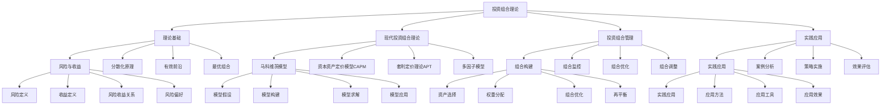

# 投资组合理论

## 🎯 学习目标
掌握投资组合理论和方法，学会构建和管理投资组合，提升投资效率和风险控制能力。

## 📊 投资组合理论框架

### 投资组合理论模型

## 📈 投资组合理论基础

### 风险与收益
**风险定义**：
- **风险定义**：风险定义
- **风险类型**：风险类型
- **风险度量**：风险度量
- **风险管理**：风险管理

**收益定义**：
- **收益定义**：收益定义
- **收益类型**：收益类型
- **收益度量**：收益度量
- **收益管理**：收益管理

**风险收益关系**：
- **风险收益关系**：风险收益关系
- **关系分析**：关系分析
- **关系模型**：关系模型
- **关系应用**：关系应用

**风险偏好**：
- **风险偏好**：风险偏好
- **偏好类型**：偏好类型
- **偏好评估**：偏好评估
- **偏好应用**：偏好应用

### 分散化原理
**分散化效应**：
- **分散化效应**：分散化效应
- **效应分析**：效应分析
- **效应模型**：效应模型
- **效应应用**：效应应用

**相关系数**：
- **相关系数**：相关系数
- **系数计算**：系数计算
- **系数分析**：系数分析
- **系数应用**：系数应用

**组合风险**：
- **组合风险**：组合风险
- **风险计算**：风险计算
- **风险分析**：风险分析
- **风险控制**：风险控制

**最优组合**：
- **最优组合**：最优组合
- **组合选择**：组合选择
- **组合优化**：组合优化
- **组合效果**：组合效果

### 有效前沿
**有效前沿概念**：
- **有效前沿概念**：有效前沿概念
- **概念理解**：概念理解
- **概念应用**：概念应用
- **概念效果**：概念效果

**有效前沿构建**：
- **有效前沿构建**：有效前沿构建
- **构建方法**：构建方法
- **构建工具**：构建工具
- **构建效果**：构建效果

**最优投资组合**：
- **最优投资组合**：最优投资组合
- **组合选择**：组合选择
- **组合优化**：组合优化
- **组合效果**：组合效果

**资本市场线**：
- **资本市场线**：资本市场线
- **线条构建**：线条构建
- **线条应用**：线条应用
- **线条效果**：线条效果

### 最优组合
**最优组合**：
- **最优组合**：最优组合
- **组合选择**：组合选择
- **组合优化**：组合优化
- **组合效果**：组合效果

**组合策略**：
- **组合策略**：组合策略
- **策略制定**：策略制定
- **策略实施**：策略实施
- **策略效果**：策略效果

## 🧮 现代投资组合理论

### 马科维茨模型
**模型假设**：
- **模型假设**：模型假设
- **假设内容**：假设内容
- **假设分析**：假设分析
- **假设应用**：假设应用

**模型构建**：
- **模型构建**：模型构建
- **构建方法**：构建方法
- **构建工具**：构建工具
- **构建效果**：构建效果

**模型求解**：
- **模型求解**：模型求解
- **求解方法**：求解方法
- **求解工具**：求解工具
- **求解结果**：求解结果

**模型应用**：
- **模型应用**：模型应用
- **应用场景**：应用场景
- **应用方法**：应用方法
- **应用效果**：应用效果

### 资本资产定价模型(CAPM)
**CAPM假设**：
- **CAPM假设**：CAPM假设
- **假设内容**：假设内容
- **假设分析**：假设分析
- **假设应用**：假设应用

**CAPM公式**：
- **CAPM公式**：CAPM公式
- **公式推导**：公式推导
- **公式应用**：公式应用
- **公式效果**：公式效果

**Beta系数**：
- **Beta系数**：Beta系数
- **系数计算**：系数计算
- **系数分析**：系数分析
- **系数应用**：系数应用

**CAPM应用**：
- **CAPM应用**：CAPM应用
- **应用场景**：应用场景
- **应用方法**：应用方法
- **应用效果**：应用效果

### 套利定价理论(APT)
**APT假设**：
- **APT假设**：APT假设
- **假设内容**：假设内容
- **假设分析**：假设分析
- **假设应用**：假设应用

**APT模型**：
- **APT模型**：APT模型
- **模型构建**：模型构建
- **模型应用**：模型应用
- **模型效果**：模型效果

**因子模型**：
- **因子模型**：因子模型
- **模型选择**：模型选择
- **模型应用**：模型应用
- **模型效果**：模型效果

**APT应用**：
- **APT应用**：APT应用
- **应用场景**：应用场景
- **应用方法**：应用方法
- **应用效果**：应用效果

### 多因子模型
**多因子模型**：
- **多因子模型**：多因子模型
- **模型构建**：模型构建
- **模型应用**：模型应用
- **模型效果**：模型效果

**因子选择**：
- **因子选择**：因子选择
- **选择方法**：选择方法
- **选择工具**：选择工具
- **选择效果**：选择效果

## 🎯 投资组合管理

### 组合构建
**资产选择**：
- **资产选择**：资产选择
- **选择方法**：选择方法
- **选择工具**：选择工具
- **选择效果**：选择效果

**权重分配**：
- **权重分配**：权重分配
- **分配方法**：分配方法
- **分配工具**：分配工具
- **分配效果**：分配效果

**组合优化**：
- **组合优化**：组合优化
- **优化方法**：优化方法
- **优化工具**：优化工具
- **优化效果**：优化效果

**再平衡**：
- **再平衡**：再平衡
- **再平衡方法**：再平衡方法
- **再平衡工具**：再平衡工具
- **再平衡效果**：再平衡效果

### 组合监控
**绩效评估**：
- **绩效评估**：绩效评估
- **评估方法**：评估方法
- **评估工具**：评估工具
- **评估结果**：评估结果

**风险监控**：
- **风险监控**：风险监控
- **监控指标**：监控指标
- **监控方法**：监控方法
- **监控结果**：监控结果

**组合调整**：
- **组合调整**：组合调整
- **调整方法**：调整方法
- **调整工具**：调整工具
- **调整效果**：调整效果

**持续优化**：
- **持续优化**：持续优化
- **优化方法**：优化方法
- **优化工具**：优化工具
- **优化效果**：优化效果

### 组合优化
**组合优化**：
- **组合优化**：组合优化
- **优化方法**：优化方法
- **优化工具**：优化工具
- **优化效果**：优化效果

**优化策略**：
- **优化策略**：优化策略
- **策略制定**：策略制定
- **策略实施**：策略实施
- **策略效果**：策略效果

### 组合调整
**组合调整**：
- **组合调整**：组合调整
- **调整方法**：调整方法
- **调整工具**：调整工具
- **调整效果**：调整效果

**调整策略**：
- **调整策略**：调整策略
- **策略制定**：策略制定
- **策略实施**：策略实施
- **策略效果**：策略效果

## 💡 实践应用

### 实践应用
**实践应用**：
- **实践应用**：实践应用
- **应用方法**：应用方法
- **应用工具**：应用工具
- **应用效果**：应用效果

**应用场景**：
- **应用场景**：应用场景
- **场景分析**：场景分析
- **场景选择**：场景选择
- **场景效果**：场景效果

### 案例分析
**案例分析**：
- **案例分析**：案例分析
- **案例选择**：案例选择
- **案例分析**：案例分析
- **案例应用**：案例应用

**成功案例**：
- **成功案例**：成功案例
- **案例特点**：案例特点
- **案例分析**：案例分析
- **案例应用**：案例应用

### 策略实施
**策略实施**：
- **策略实施**：策略实施
- **实施方法**：实施方法
- **实施工具**：实施工具
- **实施效果**：实施效果

**实施监控**：
- **实施监控**：实施监控
- **监控指标**：监控指标
- **监控方法**：监控方法
- **监控结果**：监控结果

### 效果评估
**效果评估**：
- **效果评估**：效果评估
- **评估方法**：评估方法
- **评估工具**：评估工具
- **评估结果**：评估结果

**评估改进**：
- **评估改进**：评估改进
- **改进方法**：改进方法
- **改进工具**：改进工具
- **改进效果**：改进效果

## 💡 投资组合理论案例

### 成功案例
**巴菲特投资组合**：
- **投资组合**：价值投资组合
- **组合策略**：长期持有策略
- **组合效果**：长期优秀回报
- **效果**：投资效果极佳

**桥水基金**：
- **投资组合**：全天候投资组合
- **组合策略**：风险平价策略
- **组合效果**：稳定优秀回报
- **效果**：投资效果显著

**先锋基金**：
- **投资组合**：指数投资组合
- **组合策略**：被动投资策略
- **组合效果**：低成本优秀回报
- **效果**：投资效果突出

### 失败案例
**失败原因**：
- **投资组合构建不当**：投资组合构建不当
- **风险管理缺失**：风险管理缺失
- **组合监控不足**：组合监控不足
- **策略执行不力**：策略执行不力

**失败教训**：
- **投资组合构建**：重视投资组合构建
- **风险管理**：加强风险管理
- **组合监控**：完善组合监控
- **策略执行**：加强策略执行

## 🧠 学习要点

### 费曼学习法应用
1. **选择概念**：投资组合理论
2. **简化解释**：用简单语言解释投资组合理论
3. **识别盲点**：找出理解不足的地方
4. **重新学习**：针对盲点深入学习

### 刻意练习要点
- **理论掌握**：掌握投资组合理论
- **方法应用**：掌握投资组合方法
- **工具使用**：掌握投资组合工具
- **实践应用**：实践应用投资组合理论

## 🔗 关联学习

### 前置知识
- [[02-风险评估]] - 风险评估
- [[01-资本预算]] - 资本预算
- [[04-成本管理]] - 成本管理

### 后续学习
- [[04-估值方法]] - 估值方法
- [[01-战略管理概论]] - 战略管理概论
- [[02-战略分析工具]] - 战略分析工具

### 实践应用
- 企业投资组合管理
- 个人投资组合构建
- 投资组合优化
- 投资组合风险控制

## 🎯 学习检验

### 理解检验
- [ ] 能够理解投资组合理论
- [ ] 能够掌握投资组合方法
- [ ] 能够应用投资组合工具
- [ ] 能够构建投资组合

### 应用检验
- [ ] 能够构建投资组合
- [ ] 能够管理投资组合
- [ ] 能够优化投资组合
- [ ] 能够控制投资组合风险

---
**下一步**：[[04-估值方法]] - 估值方法