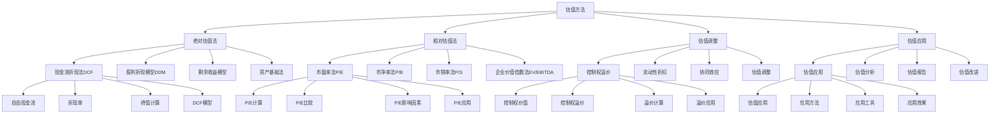

# 估值方法

## 🎯 学习目标
掌握企业估值理论和方法，学会评估企业价值，提升投资决策能力和价值判断水平。

## 📊 估值方法框架

### 估值方法模型

## 💰 绝对估值法

### 现金流折现法(DCF)
**自由现金流**：
- **自由现金流**：自由现金流
- **现金流计算**：现金流计算
- **现金流预测**：现金流预测
- **现金流分析**：现金流分析

**折现率**：
- **折现率**：折现率
- **折现率确定**：折现率确定
- **折现率计算**：折现率计算
- **折现率应用**：折现率应用

**终值计算**：
- **终值计算**：终值计算
- **计算方法**：计算方法
- **计算工具**：计算工具
- **计算结果**：计算结果

**DCF模型**：
- **DCF模型**：DCF模型
- **模型构建**：模型构建
- **模型应用**：模型应用
- **模型效果**：模型效果

### 股利折现模型(DDM)
**股利增长模型**：
- **股利增长模型**：股利增长模型
- **模型构建**：模型构建
- **模型应用**：模型应用
- **模型效果**：模型效果

**多阶段模型**：
- **多阶段模型**：多阶段模型
- **模型构建**：模型构建
- **模型应用**：模型应用
- **模型效果**：模型效果

**零增长模型**：
- **零增长模型**：零增长模型
- **模型构建**：模型构建
- **模型应用**：模型应用
- **模型效果**：模型效果

**固定增长模型**：
- **固定增长模型**：固定增长模型
- **模型构建**：模型构建
- **模型应用**：模型应用
- **模型效果**：模型效果

### 剩余收益模型
**剩余收益概念**：
- **剩余收益概念**：剩余收益概念
- **概念理解**：概念理解
- **概念应用**：概念应用
- **概念效果**：概念效果

**剩余收益计算**：
- **剩余收益计算**：剩余收益计算
- **计算方法**：计算方法
- **计算工具**：计算工具
- **计算结果**：计算结果

**剩余收益模型**：
- **剩余收益模型**：剩余收益模型
- **模型构建**：模型构建
- **模型应用**：模型应用
- **模型效果**：模型效果

**模型应用**：
- **模型应用**：模型应用
- **应用场景**：应用场景
- **应用方法**：应用方法
- **应用效果**：应用效果

### 资产基础法
**资产基础法**：
- **资产基础法**：资产基础法
- **方法构建**：方法构建
- **方法应用**：方法应用
- **方法效果**：方法效果

**资产估值**：
- **资产估值**：资产估值
- **估值方法**：估值方法
- **估值工具**：估值工具
- **估值结果**：估值结果

## 📊 相对估值法

### 市盈率法(P/E)
**P/E计算**：
- **P/E计算**：P/E计算
- **计算方法**：计算方法
- **计算工具**：计算工具
- **计算结果**：计算结果

**P/E比较**：
- **P/E比较**：P/E比较
- **比较方法**：比较方法
- **比较工具**：比较工具
- **比较结果**：比较结果

**P/E影响因素**：
- **P/E影响因素**：P/E影响因素
- **因素分析**：因素分析
- **因素影响**：因素影响
- **因素应用**：因素应用

**P/E应用**：
- **P/E应用**：P/E应用
- **应用场景**：应用场景
- **应用方法**：应用方法
- **应用效果**：应用效果

### 市净率法(P/B)
**P/B计算**：
- **P/B计算**：P/B计算
- **计算方法**：计算方法
- **计算工具**：计算工具
- **计算结果**：计算结果

**P/B比较**：
- **P/B比较**：P/B比较
- **比较方法**：比较方法
- **比较工具**：比较工具
- **比较结果**：比较结果

**P/B影响因素**：
- **P/B影响因素**：P/B影响因素
- **因素分析**：因素分析
- **因素影响**：因素影响
- **因素应用**：因素应用

**P/B应用**：
- **P/B应用**：P/B应用
- **应用场景**：应用场景
- **应用方法**：应用方法
- **应用效果**：应用效果

### 市销率法(P/S)
**P/S计算**：
- **P/S计算**：P/S计算
- **计算方法**：计算方法
- **计算工具**：计算工具
- **计算结果**：计算结果

**P/S比较**：
- **P/S比较**：P/S比较
- **比较方法**：比较方法
- **比较工具**：比较工具
- **比较结果**：比较结果

**P/S影响因素**：
- **P/S影响因素**：P/S影响因素
- **因素分析**：因素分析
- **因素影响**：因素影响
- **因素应用**：因素应用

**P/S应用**：
- **P/S应用**：P/S应用
- **应用场景**：应用场景
- **应用方法**：应用方法
- **应用效果**：应用效果

### 企业价值倍数法(EV/EBITDA)
**EV/EBITDA计算**：
- **EV/EBITDA计算**：EV/EBITDA计算
- **计算方法**：计算方法
- **计算工具**：计算工具
- **计算结果**：计算结果

**EV/EBITDA比较**：
- **EV/EBITDA比较**：EV/EBITDA比较
- **比较方法**：比较方法
- **比较工具**：比较工具
- **比较结果**：比较结果

**EV/EBITDA影响因素**：
- **EV/EBITDA影响因素**：EV/EBITDA影响因素
- **因素分析**：因素分析
- **因素影响**：因素影响
- **因素应用**：因素应用

**EV/EBITDA应用**：
- **EV/EBITDA应用**：EV/EBITDA应用
- **应用场景**：应用场景
- **应用方法**：应用方法
- **应用效果**：应用效果

## 🔧 估值调整

### 控制权溢价
**控制权价值**：
- **控制权价值**：控制权价值
- **价值计算**：价值计算
- **价值分析**：价值分析
- **价值应用**：价值应用

**控制权溢价**：
- **控制权溢价**：控制权溢价
- **溢价计算**：溢价计算
- **溢价分析**：溢价分析
- **溢价应用**：溢价应用

**溢价计算**：
- **溢价计算**：溢价计算
- **计算方法**：计算方法
- **计算工具**：计算工具
- **计算结果**：计算结果

**溢价应用**：
- **溢价应用**：溢价应用
- **应用场景**：应用场景
- **应用方法**：应用方法
- **应用效果**：应用效果

### 流动性折扣
**流动性价值**：
- **流动性价值**：流动性价值
- **价值计算**：价值计算
- **价值分析**：价值分析
- **价值应用**：价值应用

**流动性折扣**：
- **流动性折扣**：流动性折扣
- **折扣计算**：折扣计算
- **折扣分析**：折扣分析
- **折扣应用**：折扣应用

**折扣计算**：
- **折扣计算**：折扣计算
- **计算方法**：计算方法
- **计算工具**：计算工具
- **计算结果**：计算结果

**折扣应用**：
- **折扣应用**：折扣应用
- **应用场景**：应用场景
- **应用方法**：应用方法
- **应用效果**：应用效果

### 协同效应
**协同价值**：
- **协同价值**：协同价值
- **价值计算**：价值计算
- **价值分析**：价值分析
- **价值应用**：价值应用

**协同效应**：
- **协同效应**：协同效应
- **效应计算**：效应计算
- **效应分析**：效应分析
- **效应应用**：效应应用

**效应计算**：
- **效应计算**：效应计算
- **计算方法**：计算方法
- **计算工具**：计算工具
- **计算结果**：计算结果

**效应应用**：
- **效应应用**：效应应用
- **应用场景**：应用场景
- **应用方法**：应用方法
- **应用效果**：应用效果

### 估值调整
**估值调整**：
- **估值调整**：估值调整
- **调整方法**：调整方法
- **调整工具**：调整工具
- **调整效果**：调整效果

**调整策略**：
- **调整策略**：调整策略
- **策略制定**：策略制定
- **策略实施**：策略实施
- **策略效果**：策略效果

## 💡 估值应用

### 估值应用
**估值应用**：
- **估值应用**：估值应用
- **应用方法**：应用方法
- **应用工具**：应用工具
- **应用效果**：应用效果

**应用场景**：
- **应用场景**：应用场景
- **场景分析**：场景分析
- **场景选择**：场景选择
- **场景效果**：场景效果

### 估值分析
**估值分析**：
- **估值分析**：估值分析
- **分析方法**：分析方法
- **分析工具**：分析工具
- **分析结果**：分析结果

**分析报告**：
- **分析报告**：分析报告
- **报告内容**：报告内容
- **报告格式**：报告格式
- **报告应用**：报告应用

### 估值报告
**估值报告**：
- **估值报告**：估值报告
- **报告内容**：报告内容
- **报告格式**：报告格式
- **报告应用**：报告应用

**报告质量**：
- **报告质量**：报告质量
- **质量评估**：质量评估
- **质量改进**：质量改进
- **质量应用**：质量应用

### 估值改进
**估值改进**：
- **估值改进**：估值改进
- **改进方法**：改进方法
- **改进工具**：改进工具
- **改进效果**：改进效果

**改进策略**：
- **改进策略**：改进策略
- **策略制定**：策略制定
- **策略实施**：策略实施
- **策略效果**：策略效果

## 💡 估值方法案例

### 成功案例
**苹果公司估值**：
- **估值方法**：DCF模型估值
- **估值结果**：估值结果准确
- **估值应用**：投资决策应用
- **效果**：估值效果极佳

**微软公司估值**：
- **估值方法**：相对估值法
- **估值结果**：估值结果合理
- **估值应用**：并购决策应用
- **效果**：估值效果显著

**亚马逊公司估值**：
- **估值方法**：多方法综合估值
- **估值结果**：估值结果全面
- **估值应用**：战略决策应用
- **效果**：估值效果突出

### 失败案例
**失败原因**：
- **估值方法选择不当**：估值方法选择不当
- **估值假设不合理**：估值假设不合理
- **估值参数错误**：估值参数错误
- **估值分析不足**：估值分析不足

**失败教训**：
- **估值方法**：选择合适的估值方法
- **估值假设**：建立合理的估值假设
- **估值参数**：使用正确的估值参数
- **估值分析**：进行充分的估值分析

## 🧠 学习要点

### 费曼学习法应用
1. **选择概念**：估值方法
2. **简化解释**：用简单语言解释估值方法
3. **识别盲点**：找出理解不足的地方
4. **重新学习**：针对盲点深入学习

### 刻意练习要点
- **理论掌握**：掌握估值方法理论
- **方法应用**：掌握估值方法应用
- **工具使用**：掌握估值工具使用
- **实践应用**：实践应用估值方法

## 🔗 关联学习

### 前置知识
- [[03-投资组合理论]] - 投资组合理论
- [[02-风险评估]] - 风险评估
- [[01-资本预算]] - 资本预算

### 后续学习
- [[01-战略管理概论]] - 战略管理概论
- [[02-战略分析工具]] - 战略分析工具
- [[03-战略制定]] - 战略制定

### 实践应用
- 企业估值分析
- 投资决策支持
- 并购估值
- 价值评估

## 🎯 学习检验

### 理解检验
- [ ] 能够理解估值方法理论
- [ ] 能够掌握估值方法应用
- [ ] 能够使用估值工具
- [ ] 能够进行企业估值

### 应用检验
- [ ] 能够进行企业估值
- [ ] 能够分析估值结果
- [ ] 能够支持投资决策
- [ ] 能够优化估值方法

---
**下一步**：[[01-战略管理概论]] - 战略管理概论