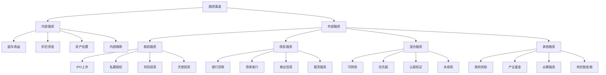

# 融资渠道

## 🎯 学习目标
掌握企业融资渠道的类型和特点，学会选择合适的融资方式，提升融资管理能力。

## 📊 融资渠道框架

### 融资类型

## 💰 内部融资

### 留存收益
**特点**：
- **成本低**：无利息成本
- **灵活性高**：使用灵活
- **控制权**：不影响控制权
- **限制性**：受盈利水平限制

**适用条件**：
- 企业盈利能力强
- 现金流充足
- 投资回报率高
- 股东同意

**管理要点**：
- 合理确定留存比例
- 平衡股东利益
- 考虑税务影响
- 评估机会成本

### 折旧资金
**特点**：
- **非现金成本**：非现金性成本
- **税收优势**：具有税收优势
- **资金回收**：资金回收方式
- **设备更新**：用于设备更新

**适用条件**：
- 固定资产较多
- 折旧政策合理
- 设备需要更新
- 现金流紧张

**管理要点**：
- 合理制定折旧政策
- 及时更新设备
- 优化资产结构
- 提高资产效率

### 资产处置
**特点**：
- **一次性收入**：一次性获得资金
- **资产优化**：优化资产结构
- **流动性**：提高流动性
- **损失风险**：可能产生损失

**适用条件**：
- 有闲置资产
- 资产价值较高
- 急需资金
- 资产效率低

**管理要点**：
- 评估资产价值
- 选择合适的处置方式
- 控制处置成本
- 优化资产配置

### 内部借款
**特点**：
- **成本低**：内部资金成本
- **手续简单**：手续相对简单
- **灵活性**：使用灵活
- **限制性**：受内部资金限制

**适用条件**：
- 集团内部企业
- 资金需求临时性
- 内部资金充足
- 管理规范

**管理要点**：
- 建立内部资金市场
- 制定借款规则
- 控制借款风险
- 优化资金配置

## 🏦 外部融资

### 股权融资

#### IPO上市
**特点**：
- **融资规模大**：融资规模较大
- **成本高**：上市成本高
- **透明度高**：信息披露要求高
- **流动性强**：股票流动性强

**适用条件**：
- 企业规模大
- 盈利能力稳定
- 治理结构完善
- 符合上市条件

**管理要点**：
- 完善治理结构
- 规范财务管理
- 加强信息披露
- 维护投资者关系

#### 私募股权
**特点**：
- **专业性强**：投资机构专业
- **增值服务**：提供增值服务
- **退出机制**：有明确退出机制
- **控制权**：可能影响控制权

**适用条件**：
- 成长型企业
- 有发展潜力
- 需要专业指导
- 接受外部投资

**管理要点**：
- 选择合适的投资机构
- 明确投资条款
- 利用增值服务
- 规划退出路径

#### 风险投资
**特点**：
- **高风险高回报**：高风险高回报
- **早期投资**：主要投资早期项目
- **专业指导**：提供专业指导
- **退出要求**：有明确退出要求

**适用条件**：
- 初创企业
- 创新项目
- 高成长潜力
- 接受风险投资

**管理要点**：
- 准备商业计划书
- 展示项目价值
- 建立信任关系
- 规划发展路径

#### 天使投资
**特点**：
- **个人投资**：个人投资者
- **早期支持**：早期项目支持
- **经验分享**：分享创业经验
- **灵活性**：投资方式灵活

**适用条件**：
- 早期项目
- 有创新性
- 团队优秀
- 市场前景好

**管理要点**：
- 寻找合适的天使投资人
- 建立良好关系
- 展示项目价值
- 获得经验指导

### 债权融资

#### 银行贷款
**特点**：
- **成本相对较低**：利率相对较低
- **手续相对简单**：手续相对简单
- **期限灵活**：期限选择灵活
- **担保要求**：通常需要担保

**适用条件**：
- 信用状况良好
- 有稳定现金流
- 有担保能力
- 符合银行要求

**管理要点**：
- 维护良好信用
- 准备充分材料
- 选择合适的银行
- 控制借款成本

#### 债券发行
**特点**：
- **融资规模大**：融资规模较大
- **期限长**：期限相对较长
- **成本固定**：成本相对固定
- **手续复杂**：发行手续复杂

**适用条件**：
- 企业规模大
- 信用等级高
- 有稳定现金流
- 符合发行条件

**管理要点**：
- 提高信用等级
- 选择合适的发行时机
- 控制发行成本
- 维护投资者关系

#### 商业信用
**特点**：
- **成本低**：通常无利息成本
- **手续简单**：手续相对简单
- **期限短**：期限相对较短
- **关系依赖**：依赖商业关系

**适用条件**：
- 商业关系良好
- 信用状况良好
- 资金需求短期
- 供应商支持

**管理要点**：
- 维护商业关系
- 提高信用等级
- 控制信用风险
- 优化资金使用

#### 租赁融资
**特点**：
- **门槛低**：门槛相对较低
- **灵活性**：使用灵活
- **税收优势**：具有税收优势
- **成本较高**：成本相对较高

**适用条件**：
- 需要设备但资金不足
- 设备更新频繁
- 有稳定现金流
- 接受租赁方式

**管理要点**：
- 选择合适的租赁公司
- 比较租赁成本
- 利用税收优势
- 控制租赁风险

### 混合融资

#### 可转债
**特点**：
- **灵活性**：可转换为股权
- **成本低**：初期成本较低
- **风险控制**：风险相对可控
- **复杂性**：结构相对复杂

**适用条件**：
- 有成长潜力
- 股价波动较大
- 需要灵活融资
- 投资者接受

**管理要点**：
- 设计合理条款
- 控制转换风险
- 维护股价稳定
- 优化资本结构

#### 优先股
**特点**：
- **优先权**：享有优先权
- **固定收益**：固定股息
- **无投票权**：通常无投票权
- **灵活性**：条款设计灵活

**适用条件**：
- 需要资金但不想稀释控制权
- 有稳定现金流
- 投资者接受
- 符合发行条件

**管理要点**：
- 设计合理条款
- 控制股息负担
- 维护投资者关系
- 优化资本结构

### 其他融资

#### 政府资助
**特点**：
- **成本低**：通常无成本或低成本
- **政策导向**：符合政策导向
- **条件严格**：条件相对严格
- **额度有限**：额度相对有限

**适用条件**：
- 符合政策导向
- 有创新性
- 社会效益好
- 符合申请条件

**管理要点**：
- 了解政策导向
- 准备申请材料
- 满足使用条件
- 维护政府关系

#### 产业基金
**特点**：
- **专业性强**：投资机构专业
- **产业导向**：符合产业发展方向
- **增值服务**：提供增值服务
- **退出机制**：有明确退出机制

**适用条件**：
- 符合产业发展方向
- 有发展潜力
- 需要专业指导
- 接受外部投资

**管理要点**：
- 选择合适的产业基金
- 明确投资条款
- 利用增值服务
- 规划退出路径

## 💡 融资策略

### 融资规划
**规划原则**：
- **匹配原则**：融资与投资匹配
- **成本原则**：控制融资成本
- **风险原则**：控制融资风险
- **时机原则**：选择合适的融资时机

**规划内容**：
- 资金需求分析
- 融资渠道选择
- 融资时机确定
- 融资成本控制

### 融资决策
**决策因素**：
- **资金需求**：资金需求规模
- **成本考虑**：融资成本考虑
- **风险承受**：风险承受能力
- **控制权**：控制权要求

**决策方法**：
- 成本效益分析
- 风险评估
- 时机选择
- 渠道比较

### 融资管理
**管理要点**：
- 建立融资管理体系
- 控制融资风险
- 优化资本结构
- 维护投资者关系

## 🧠 学习要点

### 费曼学习法应用
1. **选择概念**：融资渠道
2. **简化解释**：用简单语言解释融资渠道
3. **识别盲点**：找出理解不足的地方
4. **重新学习**：针对盲点深入学习

### 刻意练习要点
- **渠道了解**：了解各种融资渠道
- **选择能力**：提升融资渠道选择能力
- **成本分析**：提升融资成本分析能力
- **风险管理**：提升融资风险管理能力

## 🔗 关联学习

### 前置知识
- [[01-财务报表分析]] - 财务报表分析
- [[02-财务比率分析]] - 财务比率分析
- [[01-商业学概论]] - 商业学基础

### 后续学习
- [[02-资本结构]] - 资本结构
- [[03-股利政策]] - 股利政策
- [[01-投资决策]] - 投资决策

### 实践应用
- 企业融资规划
- 融资渠道选择
- 融资成本控制
- 融资风险管理

## 🎯 学习检验

### 理解检验
- [ ] 能够理解各种融资渠道特点
- [ ] 能够分析融资渠道适用条件
- [ ] 能够比较融资渠道成本
- [ ] 能够制定融资策略

### 应用检验
- [ ] 能够为企业选择合适的融资渠道
- [ ] 能够控制融资成本
- [ ] 能够管理融资风险
- [ ] 能够优化资本结构

---
**下一步**：[[02-资本结构]] - 资本结构

