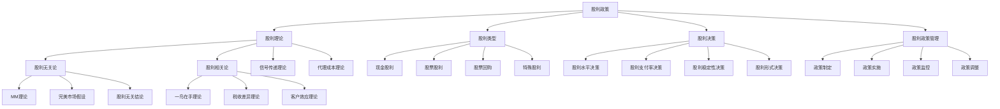

# 股利政策

## 🎯 学习目标
掌握股利政策理论，学会制定合理的股利政策，平衡股东收益和企业发展，实现企业价值最大化。

## 📊 股利政策框架

### 股利政策模型

## 📚 股利理论

### 股利无关论
**MM理论**：
- **基本假设**：完美资本市场
- **核心观点**：股利政策不影响企业价值
- **理论依据**：投资者可自制股利
- **政策含义**：股利政策无关紧要

**完美市场假设**：
- **无交易成本**：无交易费用
- **无税收**：无个人所得税
- **无信息不对称**：信息完全对称
- **无代理成本**：无代理问题

**股利无关结论**：
- **企业价值**：企业价值与股利无关
- **股东财富**：股东财富与股利无关
- **投资决策**：投资决策独立于股利
- **融资决策**：融资决策独立于股利

**理论局限性**：
- **假设严格**：现实条件不符
- **忽略税收**：忽略税收影响
- **忽略成本**：忽略交易成本
- **忽略信息**：忽略信息不对称

### 股利相关论
**一鸟在手理论**：
- **基本观点**：现金股利比资本利得更确定
- **风险偏好**：投资者偏好确定性收益
- **股利溢价**：股利有风险溢价
- **政策含义**：高股利政策

**税收差异理论**：
- **基本观点**：股利和资本利得税率不同
- **税收优势**：资本利得税收优势
- **股利劣势**：股利税收劣势
- **政策含义**：低股利政策

**客户效应理论**：
- **基本观点**：不同投资者偏好不同股利
- **客户群体**：不同股利偏好的客户
- **市场均衡**：市场自动达到均衡
- **政策含义**：稳定股利政策

### 信号传递理论
**基本观点**：
- **信息不对称**：管理者与投资者信息不对称
- **信号传递**：股利政策传递企业信息
- **市场反应**：市场对股利信号的反应
- **政策含义**：股利政策有信息价值

**信号内容**：
- **盈利能力**：传递盈利能力信息
- **发展前景**：传递发展前景信息
- **财务状况**：传递财务状况信息
- **管理信心**：传递管理信心

**信号机制**：
- **股利增加**：传递积极信号
- **股利减少**：传递消极信号
- **股利稳定**：传递稳定信号
- **股利变化**：传递变化信号

**市场反应**：
- **股价反应**：股价对股利信号的反应
- **交易量变化**：交易量变化
- **分析师反应**：分析师反应
- **投资者行为**：投资者行为变化

### 代理成本理论
**基本观点**：
- **代理关系**：股东与管理者代理关系
- **代理成本**：代理关系产生的成本
- **股利作用**：股利减少代理成本
- **政策含义**：股利政策影响代理成本

**代理成本类型**：
- **监督成本**：监督管理者成本
- **约束成本**：约束管理者成本
- **剩余损失**：代理关系损失
- **总代理成本**：所有代理成本

**股利作用机制**：
- **现金约束**：股利减少自由现金流
- **外部融资**：股利增加外部融资需求
- **市场监督**：外部融资增加市场监督
- **代理成本**：减少代理成本

**政策含义**：
- **高股利**：高股利减少代理成本
- **低股利**：低股利增加代理成本
- **最优股利**：最优股利政策
- **动态调整**：根据代理成本调整

## 💰 股利类型

### 现金股利
**基本特征**：
- **现金支付**：以现金形式支付
- **定期支付**：通常定期支付
- **股东收益**：股东直接收益
- **企业流出**：企业现金流出

**支付方式**：
- **定期股利**：定期支付股利
- **特别股利**：特别情况支付
- **中期股利**：中期支付股利
- **年度股利**：年度支付股利

**影响因素**：
- **盈利能力**：企业盈利能力
- **现金流**：企业现金流状况
- **投资需求**：企业投资需求
- **股东偏好**：股东股利偏好

**优缺点**：
- **优点**：股东直接收益、信号传递
- **缺点**：现金流出、税收负担
- **适用性**：现金流充足企业
- **局限性**：现金约束

### 股票股利
**基本特征**：
- **股票支付**：以股票形式支付
- **股份增加**：股东股份增加
- **现金保留**：企业保留现金
- **稀释效应**：每股收益稀释

**支付方式**：
- **股票分割**：股票分割
- **股票股利**：股票股利
- **转增股本**：转增股本
- **送股**：送股

**影响因素**：
- **股价水平**：股价水平
- **流动性**：股票流动性
- **股东偏好**：股东偏好
- **市场反应**：市场反应

**优缺点**：
- **优点**：保留现金、降低股价
- **缺点**：稀释每股收益、无现金收益
- **适用性**：股价过高企业
- **局限性**：无直接现金收益

### 股票回购
**基本特征**：
- **股票购买**：企业购买自己股票
- **股份减少**：流通股份减少
- **现金支付**：现金购买股票
- **价值提升**：每股价值提升

**回购方式**：
- **公开市场**：公开市场回购
- **要约收购**：要约收购回购
- **协议回购**：协议回购
- **荷兰式拍卖**：荷兰式拍卖

**影响因素**：
- **股价水平**：股价水平
- **现金状况**：现金状况
- **投资机会**：投资机会
- **股东偏好**：股东偏好

**优缺点**：
- **优点**：提升股价、税收优势
- **缺点**：现金流出、机会成本
- **适用性**：现金充足、股价低估
- **局限性**：现金约束

### 特殊股利
**基本特征**：
- **特殊情况**：特殊情况下支付
- **一次性**：通常一次性支付
- **特殊形式**：特殊支付形式
- **特殊目的**：特殊目的

**支付方式**：
- **资产股利**：以资产支付
- **负债股利**：以负债支付
- **混合股利**：混合形式支付
- **条件股利**：有条件支付

**影响因素**：
- **特殊情况**：特殊情况
- **资产状况**：资产状况
- **股东同意**：股东同意
- **监管要求**：监管要求

**优缺点**：
- **优点**：灵活支付、特殊目的
- **缺点**：复杂操作、不确定性
- **适用性**：特殊情况
- **局限性**：操作复杂

## 🎯 股利决策

### 股利水平决策
**决策因素**：
- **盈利能力**：企业盈利能力
- **现金流**：企业现金流状况
- **投资需求**：企业投资需求
- **股东偏好**：股东股利偏好

**决策方法**：
- **剩余股利政策**：剩余收益分配
- **固定股利政策**：固定股利水平
- **稳定增长政策**：稳定增长股利
- **低正常股利**：低正常股利+额外股利

**决策原则**：
- **可持续性**：股利可持续性
- **稳定性**：股利稳定性
- **增长性**：股利增长性
- **灵活性**：股利灵活性

### 股利支付率决策
**支付率计算**：
- **基本公式**：支付率 = 股利/净利润
- **影响因素**：股利、净利润
- **行业比较**：与行业比较
- **历史分析**：历史数据分析

**支付率水平**：
- **高支付率**：高股利支付率
- **低支付率**：低股利支付率
- **适中支付率**：适中支付率
- **最优支付率**：最优支付率

**影响因素**：
- **行业特征**：行业特征
- **企业规模**：企业规模
- **成长阶段**：企业成长阶段
- **财务状况**：财务状况

### 股利稳定性决策
**稳定性类型**：
- **固定股利**：固定股利水平
- **稳定增长**：稳定增长股利
- **波动股利**：波动股利水平
- **不规则股利**：不规则股利

**稳定性优势**：
- **信号传递**：传递稳定信号
- **股东满意**：提高股东满意度
- **市场反应**：稳定市场反应
- **融资便利**：便利融资

**稳定性成本**：
- **灵活性**：降低灵活性
- **机会成本**：机会成本
- **财务压力**：财务压力
- **投资约束**：投资约束

### 股利形式决策
**形式选择**：
- **现金股利**：现金形式
- **股票股利**：股票形式
- **股票回购**：股票回购
- **混合形式**：混合形式

**选择因素**：
- **股东偏好**：股东偏好
- **税收考虑**：税收考虑
- **现金状况**：现金状况
- **市场反应**：市场反应

**选择原则**：
- **股东利益**：最大化股东利益
- **企业价值**：最大化企业价值
- **税收优化**：优化税收
- **市场反应**：考虑市场反应

## 🛠️ 股利政策管理

### 政策制定
**制定原则**：
- **股东利益**：最大化股东利益
- **企业价值**：最大化企业价值
- **可持续发展**：可持续发展
- **市场反应**：考虑市场反应

**制定流程**：
- **目标设定**：设定股利政策目标
- **现状分析**：分析现状股利政策
- **方案设计**：设计股利政策方案
- **方案评估**：评估股利政策方案
- **方案选择**：选择最优方案

**制定内容**：
- **股利水平**：确定股利水平
- **支付率**：确定支付率
- **支付频率**：确定支付频率
- **支付形式**：确定支付形式

### 政策实施
**实施准备**：
- **资金准备**：准备支付资金
- **程序准备**：准备支付程序
- **人员准备**：准备相关人员
- **系统准备**：准备支付系统

**实施过程**：
- **公告发布**：发布股利公告
- **登记确认**：登记确认股东
- **资金划转**：划转支付资金
- **支付执行**：执行股利支付

**实施监控**：
- **进度监控**：监控实施进度
- **质量监控**：监控实施质量
- **成本监控**：监控实施成本
- **风险监控**：监控实施风险

### 政策监控
**监控指标**：
- **支付率**：股利支付率
- **支付水平**：股利支付水平
- **支付频率**：股利支付频率
- **股东满意度**：股东满意度

**监控方法**：
- **定期评估**：定期评估政策
- **实时监控**：实时监控执行
- **对比分析**：与历史对比
- **行业比较**：与行业比较

**监控内容**：
- **政策执行**：政策执行情况
- **市场反应**：市场反应情况
- **股东反应**：股东反应情况
- **财务影响**：财务影响情况

### 政策调整
**调整动因**：
- **市场变化**：市场环境变化
- **经营变化**：经营状况变化
- **战略调整**：发展战略调整
- **股东要求**：股东要求变化

**调整方式**：
- **渐进调整**：渐进式调整
- **大幅调整**：大幅调整
- **临时调整**：临时调整
- **结构性调整**：结构性调整

**调整策略**：
- **时机选择**：选择调整时机
- **方式选择**：选择调整方式
- **幅度控制**：控制调整幅度
- **风险控制**：控制调整风险

## 💡 股利政策案例

### 成功案例
**苹果公司**：
- **政策特点**：高现金股利+股票回购
- **优势**：提升股东价值
- **策略**：现金回购股票
- **效果**：股价上涨

**微软公司**：
- **政策特点**：稳定增长股利
- **优势**：稳定股东收益
- **策略**：稳定增长政策
- **效果**：股东满意

**可口可乐**：
- **政策特点**：连续增长股利
- **优势**：长期股东价值
- **策略**：连续增长政策
- **效果**：长期投资回报

### 失败案例
**失败原因**：
- **过度支付**：过度支付股利
- **现金流不足**：现金流不足
- **投资不足**：投资不足
- **市场变化**：市场环境变化

**失败教训**：
- **平衡支付**：平衡股利支付
- **现金流管理**：管理现金流
- **投资平衡**：平衡投资需求
- **市场适应**：适应市场变化

## 🧠 学习要点

### 费曼学习法应用
1. **选择概念**：股利政策
2. **简化解释**：用简单语言解释股利政策
3. **识别盲点**：找出理解不足的地方
4. **重新学习**：针对盲点深入学习

### 刻意练习要点
- **理论掌握**：掌握股利政策理论
- **方法应用**：掌握股利决策方法
- **案例分析**：分析成功失败案例
- **实践应用**：实践应用股利政策

## 🔗 关联学习

### 前置知识
- [[02-资本结构]] - 资本结构
- [[01-融资渠道]] - 融资渠道
- [[01-财务报表分析]] - 财务报表分析

### 后续学习
- [[01-投资决策]] - 投资决策
- [[01-估值方法]] - 估值方法
- [[01-企业价值评估]] - 企业价值评估

### 实践应用
- 企业股利政策制定
- 股利决策分析
- 股东价值管理
- 企业价值评估

## 🎯 学习检验

### 理解检验
- [ ] 能够理解股利政策理论
- [ ] 能够掌握股利决策方法
- [ ] 能够分析股利政策影响
- [ ] 能够制定股利政策

### 应用检验
- [ ] 能够分析企业股利政策
- [ ] 能够制定股利政策方案
- [ ] 能够实施股利政策管理
- [ ] 能够评估股利政策效果

---
**下一步**：[[01-投资决策]] - 投资决策

