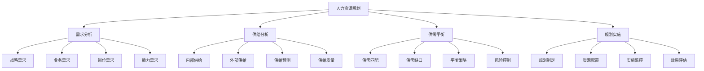

# 人力资源规划

## 🎯 学习目标
掌握人力资源规划的基本理论和方法，学会制定人力资源规划，提高人力资源管理水平。

## 📊 人力资源规划框架

### 规划要素

## 🔍 需求分析

### 战略需求分析
**战略目标**：
- **长期目标**：企业长期战略目标
- **中期目标**：企业中期战略目标
- **短期目标**：企业短期战略目标
- **年度目标**：企业年度战略目标

**战略转型**：
- **业务转型**：业务模式转型
- **技术转型**：技术升级转型
- **管理转型**：管理模式转型
- **文化转型**：企业文化转型

**战略需求**：
- **人才需求**：战略人才需求
- **能力需求**：战略能力需求
- **结构需求**：人才结构需求
- **数量需求**：人才数量需求

### 业务需求分析
**业务发展**：
- **业务扩张**：业务规模扩张
- **业务创新**：业务模式创新
- **业务优化**：业务流程优化
- **业务转型**：业务方向转型

**业务需求**：
- **岗位需求**：业务岗位需求
- **技能需求**：业务技能需求
- **经验需求**：业务经验需求
- **数量需求**：人员数量需求

**需求预测**：
- **定量预测**：基于数据的预测
- **定性预测**：基于经验的预测
- **趋势预测**：基于趋势的预测
- **情景预测**：基于情景的预测

### 岗位需求分析
**岗位设计**：
- **岗位职责**：岗位职责设计
- **岗位要求**：岗位要求设计
- **岗位等级**：岗位等级设计
- **岗位关系**：岗位关系设计

**岗位分析**：
- **工作分析**：工作内容分析
- **能力分析**：能力要求分析
- **经验分析**：经验要求分析
- **学历分析**：学历要求分析

**岗位需求**：
- **新增岗位**：新增岗位需求
- **调整岗位**：调整岗位需求
- **优化岗位**：优化岗位需求
- **取消岗位**：取消岗位需求

### 能力需求分析
**核心能力**：
- **专业能力**：专业知识和技能
- **管理能力**：管理知识和技能
- **沟通能力**：沟通协调能力
- **创新能力**：创新思维能力

**通用能力**：
- **学习能力**：学习适应能力
- **分析能力**：分析判断能力
- **执行能力**：执行落实能力
- **团队能力**：团队合作能力

**能力需求**：
- **能力标准**：能力标准要求
- **能力等级**：能力等级要求
- **能力结构**：能力结构要求
- **能力发展**：能力发展要求

## 📈 供给分析

### 内部供给分析
**现有人力资源**：
- **人员数量**：现有人员数量
- **人员结构**：现有人员结构
- **人员能力**：现有人员能力
- **人员绩效**：现有人员绩效

**人员流动**：
- **晋升流动**：内部晋升流动
- **调岗流动**：内部调岗流动
- **离职流动**：人员离职流动
- **退休流动**：人员退休流动

**能力发展**：
- **培训发展**：培训能力发展
- **实践发展**：实践能力发展
- **学习发展**：学习能力发展
- **经验积累**：经验能力积累

**供给预测**：
- **数量预测**：人员数量预测
- **结构预测**：人员结构预测
- **能力预测**：人员能力预测
- **流动预测**：人员流动预测

### 外部供给分析
**劳动力市场**：
- **市场供给**：劳动力市场供给
- **市场需求**：劳动力市场需求
- **供需平衡**：劳动力供需平衡
- **价格水平**：劳动力价格水平

**人才供给**：
- **高校毕业生**：高校毕业生供给
- **社会人才**：社会人才供给
- **海外人才**：海外人才供给
- **退休人才**：退休人才供给

**供给质量**：
- **教育水平**：人才教育水平
- **技能水平**：人才技能水平
- **经验水平**：人才经验水平
- **素质水平**：人才素质水平

**供给预测**：
- **数量预测**：外部供给数量预测
- **质量预测**：外部供给质量预测
- **结构预测**：外部供给结构预测
- **趋势预测**：外部供给趋势预测

## ⚖️ 供需平衡

### 供需匹配
**匹配分析**：
- **数量匹配**：供需数量匹配
- **结构匹配**：供需结构匹配
- **能力匹配**：供需能力匹配
- **时间匹配**：供需时间匹配

**匹配策略**：
- **精准匹配**：精准供需匹配
- **灵活匹配**：灵活供需匹配
- **动态匹配**：动态供需匹配
- **优化匹配**：优化供需匹配

### 供需缺口
**缺口识别**：
- **数量缺口**：人员数量缺口
- **结构缺口**：人员结构缺口
- **能力缺口**：人员能力缺口
- **时间缺口**：人员时间缺口

**缺口分析**：
- **缺口原因**：缺口产生原因
- **缺口影响**：缺口产生影响
- **缺口程度**：缺口严重程度
- **缺口趋势**：缺口变化趋势

### 平衡策略
**数量平衡**：
- **招聘策略**：外部招聘策略
- **内部调配**：内部调配策略
- **人员优化**：人员优化策略
- **弹性用工**：弹性用工策略

**结构平衡**：
- **结构调整**：人员结构调整
- **能力提升**：人员能力提升
- **培训发展**：培训发展策略
- **人才引进**：人才引进策略

**时间平衡**：
- **提前规划**：提前规划策略
- **分阶段实施**：分阶段实施策略
- **应急准备**：应急准备策略
- **持续调整**：持续调整策略

### 风险控制
**风险识别**：
- **供给风险**：供给不足风险
- **需求风险**：需求变化风险
- **匹配风险**：供需匹配风险
- **时间风险**：时间错配风险

**风险控制**：
- **风险预防**：风险预防措施
- **风险应对**：风险应对措施
- **风险监控**：风险监控机制
- **风险调整**：风险调整机制

## 🚀 规划实施

### 规划制定
**规划内容**：
- **总体目标**：人力资源规划总体目标
- **具体目标**：人力资源规划具体目标
- **实施计划**：人力资源规划实施计划
- **保障措施**：人力资源规划保障措施

**规划原则**：
- **战略导向**：以战略为导向
- **系统思维**：系统思维规划
- **动态调整**：动态调整规划
- **可操作性**：可操作性强

**规划方法**：
- **定量分析**：定量分析方法
- **定性分析**：定性分析方法
- **情景分析**：情景分析方法
- **专家判断**：专家判断方法

### 资源配置
**资源需求**：
- **人力资源**：人力资源需求
- **财务资源**：财务资源需求
- **物质资源**：物质资源需求
- **信息资源**：信息资源需求

**资源配置**：
- **资源分配**：资源合理分配
- **资源优化**：资源优化配置
- **资源整合**：资源整合利用
- **资源保障**：资源保障机制

### 实施监控
**监控指标**：
- **数量指标**：人员数量指标
- **质量指标**：人员质量指标
- **结构指标**：人员结构指标
- **效率指标**：人员效率指标

**监控方法**：
- **定期监控**：定期监控方法
- **实时监控**：实时监控方法
- **重点监控**：重点监控方法
- **全面监控**：全面监控方法

**监控机制**：
- **监控体系**：监控体系建立
- **监控流程**：监控流程设计
- **监控责任**：监控责任明确
- **监控反馈**：监控反馈机制

### 效果评估
**评估内容**：
- **目标达成**：规划目标达成情况
- **实施效果**：规划实施效果
- **问题识别**：实施问题识别
- **改进建议**：改进建议提出

**评估方法**：
- **定量评估**：定量评估方法
- **定性评估**：定性评估方法
- **对比评估**：对比评估方法
- **综合评估**：综合评估方法

## 💡 实践应用

### 人力资源规划流程
1. **现状分析**：分析现有人力资源状况
2. **需求预测**：预测未来人力资源需求
3. **供给分析**：分析人力资源供给情况
4. **供需平衡**：平衡人力资源供需
5. **规划制定**：制定人力资源规划
6. **资源配置**：配置人力资源
7. **实施监控**：监控规划实施
8. **效果评估**：评估规划效果

### 案例分析
**选择案例**：如某科技公司人力资源规划
**分析维度**：
- 需求分析：战略需求、业务需求、岗位需求、能力需求
- 供给分析：内部供给、外部供给、供给预测
- 供需平衡：供需匹配、供需缺口、平衡策略
- 规划实施：规划制定、资源配置、实施监控、效果评估

## 🧠 学习要点

### 费曼学习法应用
1. **选择概念**：人力资源规划
2. **简化解释**：用简单语言解释人力资源规划
3. **识别盲点**：找出理解不足的地方
4. **重新学习**：针对盲点深入学习

### 刻意练习要点
- **理论掌握**：掌握人力资源规划理论
- **方法应用**：能够应用规划方法
- **分析能力**：能够进行需求供给分析
- **规划能力**：能够制定人力资源规划

## 🔗 关联学习

### 前置知识
- [[01-商业学概论]] - 商业学基础
- [[01-战略管理概论]] - 战略管理
- [[01-商业环境分析]] - 环境分析

### 后续学习
- [[02-招聘与选拔]] - 招聘管理
- [[03-培训与发展]] - 培训管理
- [[04-绩效管理]] - 绩效管理

### 实践应用
- 企业人力资源规划
- 人力资源需求预测
- 人力资源供给分析
- 人力资源供需平衡

## 🎯 学习检验

### 理解检验
- [ ] 能够解释人力资源规划概念
- [ ] 能够进行人力资源需求分析
- [ ] 能够进行人力资源供给分析
- [ ] 能够制定人力资源规划

### 应用检验
- [ ] 能够分析企业人力资源现状
- [ ] 能够预测企业人力资源需求
- [ ] 能够制定企业人力资源规划
- [ ] 能够实施人力资源规划

---
**下一步**：[[02-招聘与选拔]] - 招聘管理