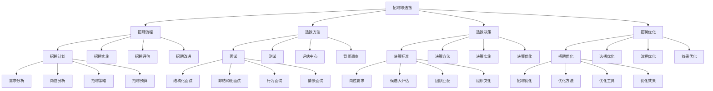

# 招聘与选拔

## 🎯 学习目标
掌握招聘与选拔理论和方法，学会建立高效的招聘体系，提升人才获取质量和效率。

## 📊 招聘与选拔框架

### 招聘与选拔模型

## 📋 招聘流程

### 招聘计划
**需求分析**：
- **需求分析**：招聘需求分析
- **需求识别**：需求识别
- **需求评估**：需求评估
- **需求规划**：需求规划

**岗位分析**：
- **岗位分析**：岗位分析
- **岗位描述**：岗位描述
- **岗位要求**：岗位要求
- **岗位评估**：岗位评估

**招聘策略**：
- **招聘策略**：招聘策略
- **策略制定**：策略制定
- **策略实施**：策略实施
- **策略效果**：策略效果

**招聘预算**：
- **招聘预算**：招聘预算
- **预算制定**：预算制定
- **预算控制**：预算控制
- **预算优化**：预算优化

### 招聘实施
**招聘渠道**：
- **招聘渠道**：招聘渠道
- **渠道选择**：渠道选择
- **渠道管理**：渠道管理
- **渠道优化**：渠道优化

**招聘信息**：
- **招聘信息**：招聘信息
- **信息设计**：信息设计
- **信息发布**：信息发布
- **信息优化**：信息优化

**简历筛选**：
- **简历筛选**：简历筛选
- **筛选标准**：筛选标准
- **筛选方法**：筛选方法
- **筛选效果**：筛选效果

**面试安排**：
- **面试安排**：面试安排
- **安排方法**：安排方法
- **安排工具**：安排工具
- **安排效果**：安排效果

### 招聘评估
**招聘效果**：
- **招聘效果**：招聘效果
- **效果评估**：效果评估
- **效果分析**：效果分析
- **效果改进**：效果改进

**招聘成本**：
- **招聘成本**：招聘成本
- **成本分析**：成本分析
- **成本控制**：成本控制
- **成本优化**：成本优化

**招聘质量**：
- **招聘质量**：招聘质量
- **质量评估**：质量评估
- **质量分析**：质量分析
- **质量改进**：质量改进

**招聘改进**：
- **招聘改进**：招聘改进
- **改进识别**：改进识别
- **改进实施**：改进实施
- **改进效果**：改进效果

### 招聘改进
**招聘改进**：
- **招聘改进**：招聘改进
- **改进方法**：改进方法
- **改进工具**：改进工具
- **改进效果**：改进效果

**改进策略**：
- **改进策略**：改进策略
- **策略制定**：策略制定
- **策略实施**：策略实施
- **策略效果**：策略效果

## 🎯 选拔方法

### 面试
**结构化面试**：
- **结构化面试**：结构化面试
- **面试设计**：面试设计
- **面试实施**：面试实施
- **面试效果**：面试效果

**非结构化面试**：
- **非结构化面试**：非结构化面试
- **面试方法**：面试方法
- **面试技巧**：面试技巧
- **面试效果**：面试效果

**行为面试**：
- **行为面试**：行为面试
- **面试方法**：面试方法
- **面试技巧**：面试技巧
- **面试效果**：面试效果

**情景面试**：
- **情景面试**：情景面试
- **面试设计**：面试设计
- **面试实施**：面试实施
- **面试效果**：面试效果

### 测试
**能力测试**：
- **能力测试**：能力测试
- **测试设计**：测试设计
- **测试实施**：测试实施
- **测试效果**：测试效果

**性格测试**：
- **性格测试**：性格测试
- **测试方法**：测试方法
- **测试工具**：测试工具
- **测试效果**：测试效果

**技能测试**：
- **技能测试**：技能测试
- **测试设计**：测试设计
- **测试实施**：测试实施
- **测试效果**：测试效果

**知识测试**：
- **知识测试**：知识测试
- **测试内容**：测试内容
- **测试方法**：测试方法
- **测试效果**：测试效果

### 评估中心
**无领导小组讨论**：
- **无领导小组讨论**：无领导小组讨论
- **讨论设计**：讨论设计
- **讨论实施**：讨论实施
- **讨论效果**：讨论效果

**角色扮演**：
- **角色扮演**：角色扮演
- **扮演设计**：扮演设计
- **扮演实施**：扮演实施
- **扮演效果**：扮演效果

**案例分析**：
- **案例分析**：案例分析
- **案例设计**：案例设计
- **分析实施**：分析实施
- **分析效果**：分析效果

**演讲展示**：
- **演讲展示**：演讲展示
- **展示设计**：展示设计
- **展示实施**：展示实施
- **展示效果**：展示效果

### 背景调查
**背景调查**：
- **背景调查**：背景调查
- **调查方法**：调查方法
- **调查工具**：调查工具
- **调查效果**：调查效果

**调查内容**：
- **调查内容**：调查内容
- **内容设计**：内容设计
- **内容实施**：内容实施
- **内容效果**：内容效果

## 🎯 选拔决策

### 决策标准
**岗位要求**：
- **岗位要求**：岗位要求
- **要求分析**：要求分析
- **要求评估**：要求评估
- **要求应用**：要求应用

**候选人评估**：
- **候选人评估**：候选人评估
- **评估方法**：评估方法
- **评估工具**：评估工具
- **评估结果**：评估结果

**团队匹配**：
- **团队匹配**：团队匹配
- **匹配分析**：匹配分析
- **匹配评估**：匹配评估
- **匹配效果**：匹配效果

**组织文化**：
- **组织文化**：组织文化
- **文化匹配**：文化匹配
- **文化评估**：文化评估
- **文化效果**：文化效果

### 决策方法
**评分法**：
- **评分法**：评分法
- **评分标准**：评分标准
- **评分方法**：评分方法
- **评分效果**：评分效果

**比较法**：
- **比较法**：比较法
- **比较标准**：比较标准
- **比较方法**：比较方法
- **比较效果**：比较效果

**综合评估**：
- **综合评估**：综合评估
- **评估方法**：评估方法
- **评估工具**：评估工具
- **评估结果**：评估结果

**决策支持**：
- **决策支持**：决策支持
- **支持方法**：支持方法
- **支持工具**：支持工具
- **支持效果**：支持效果

### 决策实施
**录用通知**：
- **录用通知**：录用通知
- **通知设计**：通知设计
- **通知实施**：通知实施
- **通知效果**：通知效果

**入职安排**：
- **入职安排**：入职安排
- **安排设计**：安排设计
- **安排实施**：安排实施
- **安排效果**：安排效果

**试用期管理**：
- **试用期管理**：试用期管理
- **管理方法**：管理方法
- **管理工具**：管理工具
- **管理效果**：管理效果

**转正评估**：
- **转正评估**：转正评估
- **评估方法**：评估方法
- **评估工具**：评估工具
- **评估结果**：评估结果

### 决策优化
**决策优化**：
- **决策优化**：决策优化
- **优化方法**：优化方法
- **优化工具**：优化工具
- **优化效果**：优化效果

**优化策略**：
- **优化策略**：优化策略
- **策略制定**：策略制定
- **策略实施**：策略实施
- **策略效果**：策略效果

## 🚀 招聘优化

### 招聘优化
**招聘优化**：
- **招聘优化**：招聘优化
- **优化方法**：优化方法
- **优化工具**：优化工具
- **优化效果**：优化效果

**优化策略**：
- **优化策略**：优化策略
- **策略制定**：策略制定
- **策略实施**：策略实施
- **策略效果**：策略效果

### 选拔优化
**选拔优化**：
- **选拔优化**：选拔优化
- **优化方法**：优化方法
- **优化工具**：优化工具
- **优化效果**：优化效果

**优化策略**：
- **优化策略**：优化策略
- **策略制定**：策略制定
- **策略实施**：策略实施
- **策略效果**：策略效果

### 流程优化
**流程优化**：
- **流程优化**：流程优化
- **优化方法**：优化方法
- **优化工具**：优化工具
- **优化效果**：优化效果

**优化策略**：
- **优化策略**：优化策略
- **策略制定**：策略制定
- **策略实施**：策略实施
- **策略效果**：策略效果

### 效果优化
**效果优化**：
- **效果优化**：效果优化
- **优化方法**：优化方法
- **优化工具**：优化工具
- **优化效果**：优化效果

**优化策略**：
- **优化策略**：优化策略
- **策略制定**：策略制定
- **策略实施**：策略实施
- **策略效果**：策略效果

## 💡 招聘与选拔案例

### 成功案例
**谷歌招聘**：
- **招聘理念**：人才至上的招聘理念
- **招聘方法**：创新的招聘方法
- **招聘效果**：优秀的招聘效果
- **效果**：招聘质量极高

**苹果招聘**：
- **招聘理念**：创新人才的招聘理念
- **招聘方法**：严格的招聘方法
- **招聘效果**：卓越的招聘效果
- **效果**：招聘质量极佳

**微软招聘**：
- **招聘理念**：技术人才的招聘理念
- **招聘方法**：系统的招聘方法
- **招聘效果**：显著的招聘效果
- **效果**：招聘质量突出

### 失败案例
**失败原因**：
- **招聘标准不明确**：招聘标准不明确
- **选拔方法不当**：选拔方法不当
- **决策过程不科学**：决策过程不科学
- **招聘管理缺失**：招聘管理缺失

**失败教训**：
- **招聘标准**：明确招聘标准
- **选拔方法**：优化选拔方法
- **决策过程**：科学决策过程
- **招聘管理**：完善招聘管理

## 🧠 学习要点

### 费曼学习法应用
1. **选择概念**：招聘与选拔
2. **简化解释**：用简单语言解释招聘与选拔
3. **识别盲点**：找出理解不足的地方
4. **重新学习**：针对盲点深入学习

### 刻意练习要点
- **理论掌握**：掌握招聘与选拔理论
- **方法应用**：掌握招聘与选拔方法
- **工具使用**：掌握招聘与选拔工具
- **实践应用**：实践应用招聘与选拔

## 🔗 关联学习

### 前置知识
- [[01-人力资源规划]] - 人力资源规划
- [[01-商业学概论]] - 商业学基础
- [[01-商业环境分析]] - 环境分析

### 后续学习
- [[03-培训与发展]] - 培训与发展
- [[04-绩效管理]] - 绩效管理
- [[01-薪酬体系设计]] - 薪酬体系设计

### 实践应用
- 企业招聘管理
- 人才选拔优化
- 招聘流程改进
- 选拔方法创新

## 🎯 学习检验

### 理解检验
- [ ] 能够理解招聘与选拔理论
- [ ] 能够掌握招聘与选拔方法
- [ ] 能够应用招聘与选拔工具
- [ ] 能够建立招聘体系

### 应用检验
- [ ] 能够建立招聘体系
- [ ] 能够实施人才选拔
- [ ] 能够优化招聘流程
- [ ] 能够提升招聘质量

---
**下一步**：[[03-培训与发展]] - 培训与发展