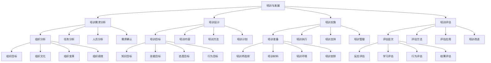

# 培训与发展

## 🎯 学习目标
掌握培训与发展理论和方法，学会建立高效的培训体系，提升员工能力和组织绩效。

## 📊 培训与发展框架

### 培训与发展模型

## 🔍 培训需求分析

### 组织分析
**组织目标**：
- **组织目标**：组织目标分析
- **目标分析**：目标分析
- **目标影响**：目标影响
- **目标应用**：目标应用

**组织文化**：
- **组织文化**：组织文化分析
- **文化分析**：文化分析
- **文化影响**：文化影响
- **文化应用**：文化应用

**组织变革**：
- **组织变革**：组织变革分析
- **变革分析**：变革分析
- **变革影响**：变革影响
- **变革应用**：变革应用

**组织绩效**：
- **组织绩效**：组织绩效分析
- **绩效分析**：绩效分析
- **绩效影响**：绩效影响
- **绩效应用**：绩效应用

### 任务分析
**岗位要求**：
- **岗位要求**：岗位要求分析
- **要求分析**：要求分析
- **要求影响**：要求影响
- **要求应用**：要求应用

**工作标准**：
- **工作标准**：工作标准分析
- **标准分析**：标准分析
- **标准影响**：标准影响
- **标准应用**：标准应用

**技能要求**：
- **技能要求**：技能要求分析
- **要求分析**：要求分析
- **要求影响**：要求影响
- **要求应用**：要求应用

**知识要求**：
- **知识要求**：知识要求分析
- **要求分析**：要求分析
- **要求影响**：要求影响
- **要求应用**：要求应用

### 人员分析
**能力评估**：
- **能力评估**：能力评估
- **评估方法**：评估方法
- **评估工具**：评估工具
- **评估结果**：评估结果

**绩效分析**：
- **绩效分析**：绩效分析
- **分析方法**：分析方法
- **分析工具**：分析工具
- **分析结果**：分析结果

**发展需求**：
- **发展需求**：发展需求分析
- **需求分析**：需求分析
- **需求影响**：需求影响
- **需求应用**：需求应用

**学习偏好**：
- **学习偏好**：学习偏好分析
- **偏好分析**：偏好分析
- **偏好影响**：偏好影响
- **偏好应用**：偏好应用

### 需求确认
**需求确认**：
- **需求确认**：需求确认
- **确认方法**：确认方法
- **确认工具**：确认工具
- **确认结果**：确认结果

**需求优先级**：
- **需求优先级**：需求优先级
- **优先级确定**：优先级确定
- **优先级应用**：优先级应用
- **优先级调整**：优先级调整

## 🎯 培训设计

### 培训目标
**知识目标**：
- **知识目标**：知识目标
- **目标设定**：目标设定
- **目标评估**：目标评估
- **目标应用**：目标应用

**技能目标**：
- **技能目标**：技能目标
- **目标设定**：目标设定
- **目标评估**：目标评估
- **目标应用**：目标应用

**态度目标**：
- **态度目标**：态度目标
- **目标设定**：目标设定
- **目标评估**：目标评估
- **目标应用**：目标应用

**行为目标**：
- **行为目标**：行为目标
- **目标设定**：目标设定
- **目标评估**：目标评估
- **目标应用**：目标应用

### 培训内容
**知识内容**：
- **知识内容**：知识内容
- **内容设计**：内容设计
- **内容组织**：内容组织
- **内容应用**：内容应用

**技能内容**：
- **技能内容**：技能内容
- **内容设计**：内容设计
- **内容组织**：内容组织
- **内容应用**：内容应用

**态度内容**：
- **态度内容**：态度内容
- **内容设计**：内容设计
- **内容组织**：内容组织
- **内容应用**：内容应用

**实践内容**：
- **实践内容**：实践内容
- **内容设计**：内容设计
- **内容组织**：内容组织
- **内容应用**：内容应用

### 培训方法
**课堂培训**：
- **课堂培训**：课堂培训
- **培训方法**：培训方法
- **培训技巧**：培训技巧
- **培训效果**：培训效果

**在线培训**：
- **在线培训**：在线培训
- **培训平台**：培训平台
- **培训工具**：培训工具
- **培训效果**：培训效果

**实践培训**：
- **实践培训**：实践培训
- **培训方法**：培训方法
- **培训环境**：培训环境
- **培训效果**：培训效果

**混合培训**：
- **混合培训**：混合培训
- **培训组合**：培训组合
- **培训策略**：培训策略
- **培训效果**：培训效果

### 培训计划
**培训计划**：
- **培训计划**：培训计划
- **计划制定**：计划制定
- **计划实施**：计划实施
- **计划效果**：计划效果

**计划管理**：
- **计划管理**：计划管理
- **管理方法**：管理方法
- **管理工具**：管理工具
- **管理效果**：管理效果

## 🚀 培训实施

### 培训准备
**培训师选择**：
- **培训师选择**：培训师选择
- **选择标准**：选择标准
- **选择方法**：选择方法
- **选择效果**：选择效果

**培训材料**：
- **培训材料**：培训材料
- **材料设计**：材料设计
- **材料制作**：材料制作
- **材料应用**：材料应用

**培训环境**：
- **培训环境**：培训环境
- **环境设计**：环境设计
- **环境布置**：环境布置
- **环境效果**：环境效果

**培训安排**：
- **培训安排**：培训安排
- **安排设计**：安排设计
- **安排实施**：安排实施
- **安排效果**：安排效果

### 培训执行
**培训过程**：
- **培训过程**：培训过程
- **过程管理**：过程管理
- **过程控制**：过程控制
- **过程效果**：过程效果

**培训互动**：
- **培训互动**：培训互动
- **互动设计**：互动设计
- **互动实施**：互动实施
- **互动效果**：互动效果

**培训评估**：
- **培训评估**：培训评估
- **评估方法**：评估方法
- **评估工具**：评估工具
- **评估结果**：评估结果

**培训调整**：
- **培训调整**：培训调整
- **调整方法**：调整方法
- **调整工具**：调整工具
- **调整效果**：调整效果

### 培训支持
**学习支持**：
- **学习支持**：学习支持
- **支持方法**：支持方法
- **支持工具**：支持工具
- **支持效果**：支持效果

**实践支持**：
- **实践支持**：实践支持
- **支持方法**：支持方法
- **支持工具**：支持工具
- **支持效果**：支持效果

**反馈支持**：
- **反馈支持**：反馈支持
- **支持方法**：支持方法
- **支持工具**：支持工具
- **支持效果**：支持效果

**持续支持**：
- **持续支持**：持续支持
- **支持方法**：支持方法
- **支持工具**：支持工具
- **支持效果**：支持效果

### 培训管理
**培训管理**：
- **培训管理**：培训管理
- **管理方法**：管理方法
- **管理工具**：管理工具
- **管理效果**：管理效果

**管理体系**：
- **管理体系**：管理体系
- **体系设计**：体系设计
- **体系实施**：体系实施
- **体系优化**：体系优化

## 📊 培训评估

### 评估层次
**反应评估**：
- **反应评估**：反应评估
- **评估方法**：评估方法
- **评估工具**：评估工具
- **评估结果**：评估结果

**学习评估**：
- **学习评估**：学习评估
- **评估方法**：评估方法
- **评估工具**：评估工具
- **评估结果**：评估结果

**行为评估**：
- **行为评估**：行为评估
- **评估方法**：评估方法
- **评估工具**：评估工具
- **评估结果**：评估结果

**结果评估**：
- **结果评估**：结果评估
- **评估方法**：评估方法
- **评估工具**：评估工具
- **评估结果**：评估结果

### 评估方法
**问卷调查**：
- **问卷调查**：问卷调查
- **问卷设计**：问卷设计
- **问卷实施**：问卷实施
- **问卷分析**：问卷分析

**测试评估**：
- **测试评估**：测试评估
- **测试设计**：测试设计
- **测试实施**：测试实施
- **测试分析**：测试分析

**观察评估**：
- **观察评估**：观察评估
- **观察方法**：观察方法
- **观察工具**：观察工具
- **观察结果**：观察结果

**绩效评估**：
- **绩效评估**：绩效评估
- **评估方法**：评估方法
- **评估工具**：评估工具
- **评估结果**：评估结果

### 评估应用
**培训改进**：
- **培训改进**：培训改进
- **改进方法**：改进方法
- **改进工具**：改进工具
- **改进效果**：改进效果

**培训决策**：
- **培训决策**：培训决策
- **决策方法**：决策方法
- **决策工具**：决策工具
- **决策效果**：决策效果

**培训投资**：
- **培训投资**：培训投资
- **投资分析**：投资分析
- **投资决策**：投资决策
- **投资效果**：投资效果

**培训效果**：
- **培训效果**：培训效果
- **效果分析**：效果分析
- **效果应用**：效果应用
- **效果改进**：效果改进

### 培训改进
**培训改进**：
- **培训改进**：培训改进
- **改进方法**：改进方法
- **改进工具**：改进工具
- **改进效果**：改进效果

**改进策略**：
- **改进策略**：改进策略
- **策略制定**：策略制定
- **策略实施**：策略实施
- **策略效果**：策略效果

## 💡 培训与发展案例

### 成功案例
**谷歌培训**：
- **培训理念**：学习型组织理念
- **培训方法**：创新培训方法
- **培训效果**：优秀培训效果
- **效果**：培训质量极高

**苹果培训**：
- **培训理念**：创新人才培养理念
- **培训方法**：系统培训方法
- **培训效果**：卓越培训效果
- **效果**：培训质量极佳

**微软培训**：
- **培训理念**：技术人才培养理念
- **培训方法**：全面培训方法
- **培训效果**：显著培训效果
- **效果**：培训质量突出

### 失败案例
**失败原因**：
- **培训需求分析不足**：培训需求分析不足
- **培训设计不合理**：培训设计不合理
- **培训实施不到位**：培训实施不到位
- **培训评估缺失**：培训评估缺失

**失败教训**：
- **培训需求分析**：重视培训需求分析
- **培训设计**：优化培训设计
- **培训实施**：加强培训实施
- **培训评估**：完善培训评估

## 🧠 学习要点

### 费曼学习法应用
1. **选择概念**：培训与发展
2. **简化解释**：用简单语言解释培训与发展
3. **识别盲点**：找出理解不足的地方
4. **重新学习**：针对盲点深入学习

### 刻意练习要点
- **理论掌握**：掌握培训与发展理论
- **方法应用**：掌握培训与发展方法
- **工具使用**：掌握培训与发展工具
- **实践应用**：实践应用培训与发展

## 🔗 关联学习

### 前置知识
- [[02-招聘与选拔]] - 招聘与选拔
- [[01-人力资源规划]] - 人力资源规划
- [[01-商业学概论]] - 商业学基础

### 后续学习
- [[04-绩效管理]] - 绩效管理
- [[01-薪酬体系设计]] - 薪酬体系设计
- [[01-组织文化]] - 组织文化

### 实践应用
- 企业培训体系建设
- 员工能力发展
- 培训效果评估
- 学习型组织建设

## 🎯 学习检验

### 理解检验
- [ ] 能够理解培训与发展理论
- [ ] 能够掌握培训需求分析方法
- [ ] 能够设计培训方案
- [ ] 能够评估培训效果

### 应用检验
- [ ] 能够进行培训需求分析
- [ ] 能够设计培训方案
- [ ] 能够实施培训项目
- [ ] 能够评估培训效果

---
**下一步**：[[04-绩效管理]] - 绩效管理