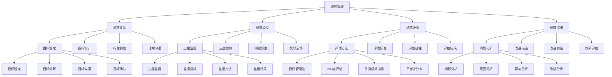

# 绩效管理

## 🎯 学习目标
掌握绩效管理理论和方法，学会建立高效的绩效管理体系，提升员工绩效和组织效能。

## 📊 绩效管理框架

### 绩效管理模型

## 📋 绩效管理体系

### 绩效计划
**目标设定**：
- **目标设定**：绩效目标设定
- **目标分解**：目标分解
- **目标沟通**：目标沟通
- **目标确认**：目标确认

**指标设计**：
- **指标设计**：绩效指标设计
- **指标选择**：指标选择
- **指标权重**：指标权重
- **指标标准**：指标标准

**标准制定**：
- **标准制定**：绩效标准制定
- **标准内容**：标准内容
- **标准等级**：标准等级
- **标准应用**：标准应用

**计划沟通**：
- **计划沟通**：绩效计划沟通
- **沟通方法**：沟通方法
- **沟通工具**：沟通工具
- **沟通效果**：沟通效果

### 绩效监控
**过程监控**：
- **过程监控**：绩效过程监控
- **监控指标**：监控指标
- **监控方法**：监控方法
- **监控结果**：监控结果

**进度跟踪**：
- **进度跟踪**：绩效进度跟踪
- **跟踪方法**：跟踪方法
- **跟踪工具**：跟踪工具
- **跟踪结果**：跟踪结果

**问题识别**：
- **问题识别**：绩效问题识别
- **识别方法**：识别方法
- **识别工具**：识别工具
- **识别结果**：识别结果

**及时反馈**：
- **及时反馈**：及时反馈
- **反馈方法**：反馈方法
- **反馈工具**：反馈工具
- **反馈效果**：反馈效果

### 绩效评估
**评估方法**：
- **评估方法**：绩效评估方法
- **方法选择**：方法选择
- **方法应用**：方法应用
- **方法效果**：方法效果

**评估标准**：
- **评估标准**：绩效评估标准
- **标准制定**：标准制定
- **标准应用**：标准应用
- **标准效果**：标准效果

**评估过程**：
- **评估过程**：绩效评估过程
- **过程设计**：过程设计
- **过程实施**：过程实施
- **过程效果**：过程效果

**评估结果**：
- **评估结果**：绩效评估结果
- **结果分析**：结果分析
- **结果应用**：结果应用
- **结果改进**：结果改进

### 绩效改进
**问题分析**：
- **问题分析**：绩效问题分析
- **原因分析**：原因分析
- **影响分析**：影响分析
- **改进分析**：改进分析

**改进措施**：
- **改进措施**：绩效改进措施
- **措施制定**：措施制定
- **措施实施**：措施实施
- **措施效果**：措施效果

**改进实施**：
- **改进实施**：绩效改进实施
- **实施方法**：实施方法
- **实施工具**：实施工具
- **实施效果**：实施效果

**效果评估**：
- **效果评估**：改进效果评估
- **评估方法**：评估方法
- **评估工具**：评估工具
- **评估结果**：评估结果

## 📊 绩效评估方法

### 目标管理法
**目标设定**：
- **目标设定**：目标设定
- **设定方法**：设定方法
- **设定工具**：设定工具
- **设定效果**：设定效果

**目标分解**：
- **目标分解**：目标分解
- **分解方法**：分解方法
- **分解工具**：分解工具
- **分解效果**：分解效果

**目标跟踪**：
- **目标跟踪**：目标跟踪
- **跟踪方法**：跟踪方法
- **跟踪工具**：跟踪工具
- **跟踪效果**：跟踪效果

**目标评估**：
- **目标评估**：目标评估
- **评估方法**：评估方法
- **评估工具**：评估工具
- **评估结果**：评估结果

### 360度评估
**上级评估**：
- **上级评估**：上级评估
- **评估方法**：评估方法
- **评估工具**：评估工具
- **评估结果**：评估结果

**下级评估**：
- **下级评估**：下级评估
- **评估方法**：评估方法
- **评估工具**：评估工具
- **评估结果**：评估结果

**同级评估**：
- **同级评估**：同级评估
- **评估方法**：评估方法
- **评估工具**：评估工具
- **评估结果**：评估结果

**客户评估**：
- **客户评估**：客户评估
- **评估方法**：评估方法
- **评估工具**：评估工具
- **评估结果**：评估结果

### 关键绩效指标
**KPI设计**：
- **KPI设计**：KPI设计
- **设计方法**：设计方法
- **设计工具**：设计工具
- **设计效果**：设计效果

**KPI监控**：
- **KPI监控**：KPI监控
- **监控方法**：监控方法
- **监控工具**：监控工具
- **监控结果**：监控结果

**KPI评估**：
- **KPI评估**：KPI评估
- **评估方法**：评估方法
- **评估工具**：评估工具
- **评估结果**：评估结果

**KPI改进**：
- **KPI改进**：KPI改进
- **改进方法**：改进方法
- **改进工具**：改进工具
- **改进效果**：改进效果

### 平衡计分卡
**财务维度**：
- **财务维度**：财务维度
- **维度指标**：维度指标
- **指标设计**：指标设计
- **指标应用**：指标应用

**客户维度**：
- **客户维度**：客户维度
- **维度指标**：维度指标
- **指标设计**：指标设计
- **指标应用**：指标应用

**内部流程**：
- **内部流程**：内部流程
- **流程指标**：流程指标
- **指标设计**：指标设计
- **指标应用**：指标应用

**学习成长**：
- **学习成长**：学习成长
- **成长指标**：成长指标
- **指标设计**：指标设计
- **指标应用**：指标应用

## 💼 绩效管理应用

### 薪酬管理
**绩效薪酬**：
- **绩效薪酬**：绩效薪酬
- **薪酬设计**：薪酬设计
- **薪酬实施**：薪酬实施
- **薪酬效果**：薪酬效果

**奖金分配**：
- **奖金分配**：奖金分配
- **分配方法**：分配方法
- **分配工具**：分配工具
- **分配效果**：分配效果

**薪酬调整**：
- **薪酬调整**：薪酬调整
- **调整方法**：调整方法
- **调整工具**：调整工具
- **调整效果**：调整效果

**激励效果**：
- **激励效果**：激励效果
- **效果评估**：效果评估
- **效果分析**：效果分析
- **效果改进**：效果改进

### 职业发展
**晋升决策**：
- **晋升决策**：晋升决策
- **决策方法**：决策方法
- **决策工具**：决策工具
- **决策效果**：决策效果

**职业规划**：
- **职业规划**：职业规划
- **规划方法**：规划方法
- **规划工具**：规划工具
- **规划效果**：规划效果

**发展机会**：
- **发展机会**：发展机会
- **机会识别**：机会识别
- **机会评估**：机会评估
- **机会应用**：机会应用

**能力提升**：
- **能力提升**：能力提升
- **提升方法**：提升方法
- **提升工具**：提升工具
- **提升效果**：提升效果

### 培训发展
**培训需求**：
- **培训需求**：培训需求
- **需求分析**：需求分析
- **需求评估**：需求评估
- **需求应用**：需求应用

**培训计划**：
- **培训计划**：培训计划
- **计划制定**：计划制定
- **计划实施**：计划实施
- **计划效果**：计划效果

**培训效果**：
- **培训效果**：培训效果
- **效果评估**：效果评估
- **效果分析**：效果分析
- **效果改进**：效果改进

**能力发展**：
- **能力发展**：能力发展
- **发展方法**：发展方法
- **发展工具**：发展工具
- **发展效果**：发展效果

## 💡 绩效管理案例

### 成功案例
**谷歌绩效管理**：
- **绩效理念**：OKR绩效管理理念
- **绩效方法**：目标与关键结果方法
- **绩效效果**：优秀绩效效果
- **效果**：绩效管理质量极高

**苹果绩效管理**：
- **绩效理念**：创新绩效管理理念
- **绩效方法**：系统绩效管理方法
- **绩效效果**：卓越绩效效果
- **效果**：绩效管理质量极佳

**微软绩效管理**：
- **绩效理念**：技术绩效管理理念
- **绩效方法**：全面绩效管理方法
- **绩效效果**：显著绩效效果
- **效果**：绩效管理质量突出

### 失败案例
**失败原因**：
- **绩效目标不明确**：绩效目标不明确
- **绩效评估不公正**：绩效评估不公正
- **绩效反馈不及时**：绩效反馈不及时
- **绩效改进缺失**：绩效改进缺失

**失败教训**：
- **绩效目标**：明确绩效目标
- **绩效评估**：公正绩效评估
- **绩效反馈**：及时绩效反馈
- **绩效改进**：持续绩效改进

## 🧠 学习要点

### 费曼学习法应用
1. **选择概念**：绩效管理
2. **简化解释**：用简单语言解释绩效管理
3. **识别盲点**：找出理解不足的地方
4. **重新学习**：针对盲点深入学习

### 刻意练习要点
- **理论掌握**：掌握绩效管理理论
- **方法应用**：掌握绩效管理方法
- **工具使用**：掌握绩效管理工具
- **实践应用**：实践应用绩效管理

## 🔗 关联学习

### 前置知识
- [[03-培训与发展]] - 培训与发展
- [[02-招聘与选拔]] - 招聘与选拔
- [[01-人力资源规划]] - 人力资源规划

### 后续学习
- [[01-薪酬体系设计]] - 薪酬体系设计
- [[02-福利管理]] - 福利管理
- [[01-组织文化]] - 组织文化

### 实践应用
- 企业绩效管理体系建设
- 员工绩效评估
- 绩效改进优化
- 绩效激励设计

## 🎯 学习检验

### 理解检验
- [ ] 能够理解绩效管理理论
- [ ] 能够掌握绩效管理方法
- [ ] 能够应用绩效管理工具
- [ ] 能够建立绩效管理体系

### 应用检验
- [ ] 能够建立绩效管理体系
- [ ] 能够实施绩效评估
- [ ] 能够进行绩效改进
- [ ] 能够优化绩效管理

---
**下一步**：[[01-薪酬体系设计]] - 薪酬体系设计