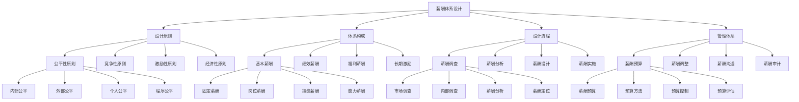

# 薪酬体系设计

## 🎯 学习目标
掌握薪酬体系设计理论和方法，学会设计公平、竞争、激励的薪酬体系，提升员工满意度和企业绩效。

## 📊 薪酬体系设计框架

### 薪酬体系设计模型

## ⚖️ 薪酬体系设计原则

### 公平性原则
**内部公平**：
- **内部公平**：内部公平性
- **公平标准**：公平标准制定
- **公平评估**：公平性评估
- **公平维护**：公平性维护

**外部公平**：
- **外部公平**：外部公平性
- **市场对标**：市场对标分析
- **行业对标**：行业对标分析
- **地区对标**：地区对标分析

**个人公平**：
- **个人公平**：个人公平性
- **个人贡献**：个人贡献评估
- **个人能力**：个人能力评估
- **个人发展**：个人发展支持

**程序公平**：
- **程序公平**：程序公平性
- **程序透明**：程序透明度
- **程序公正**：程序公正性
- **程序参与**：程序参与度

### 竞争性原则
**市场竞争力**：
- **市场竞争力**：市场竞争力
- **竞争力分析**：竞争力分析
- **竞争力提升**：竞争力提升
- **竞争力维护**：竞争力维护

**行业竞争力**：
- **行业竞争力**：行业竞争力
- **行业对标**：行业对标分析
- **行业定位**：行业定位策略
- **行业优势**：行业优势建立

**地区竞争力**：
- **地区竞争力**：地区竞争力
- **地区对标**：地区对标分析
- **地区定位**：地区定位策略
- **地区优势**：地区优势建立

**人才竞争力**：
- **人才竞争力**：人才竞争力
- **人才吸引**：人才吸引能力
- **人才保留**：人才保留能力
- **人才发展**：人才发展能力

### 激励性原则
**绩效导向**：
- **绩效导向**：绩效导向薪酬
- **绩效评估**：绩效评估体系
- **绩效激励**：绩效激励机制
- **绩效改进**：绩效改进支持

**能力导向**：
- **能力导向**：能力导向薪酬
- **能力评估**：能力评估体系
- **能力激励**：能力激励机制
- **能力发展**：能力发展支持

**贡献导向**：
- **贡献导向**：贡献导向薪酬
- **贡献评估**：贡献评估体系
- **贡献激励**：贡献激励机制
- **贡献认可**：贡献认可机制

**发展导向**：
- **发展导向**：发展导向薪酬
- **发展支持**：发展支持体系
- **发展激励**：发展激励机制
- **发展机会**：发展机会提供

### 经济性原则
**成本控制**：
- **成本控制**：薪酬成本控制
- **成本分析**：成本分析体系
- **成本优化**：成本优化策略
- **成本监控**：成本监控体系

**效益最大化**：
- **效益最大化**：薪酬效益最大化
- **效益分析**：效益分析体系
- **效益优化**：效益优化策略
- **效益评估**：效益评估体系

**可持续发展**：
- **可持续发展**：薪酬可持续发展
- **可持续性**：可持续性分析
- **可持续策略**：可持续策略制定
- **可持续管理**：可持续管理实施

**投资回报**：
- **投资回报**：薪酬投资回报
- **投资分析**：投资分析体系
- **投资优化**：投资优化策略
- **投资评估**：投资评估体系

## 💰 薪酬体系构成

### 基本薪酬
**固定薪酬**：
- **固定薪酬**：固定薪酬设计
- **薪酬水平**：薪酬水平设定
- **薪酬结构**：薪酬结构设计
- **薪酬管理**：薪酬管理实施

**岗位薪酬**：
- **岗位薪酬**：岗位薪酬设计
- **岗位评估**：岗位评估体系
- **岗位等级**：岗位等级设计
- **岗位薪酬**：岗位薪酬管理

**技能薪酬**：
- **技能薪酬**：技能薪酬设计
- **技能评估**：技能评估体系
- **技能等级**：技能等级设计
- **技能薪酬**：技能薪酬管理

**能力薪酬**：
- **能力薪酬**：能力薪酬设计
- **能力评估**：能力评估体系
- **能力等级**：能力等级设计
- **能力薪酬**：能力薪酬管理

### 绩效薪酬
**奖金**：
- **奖金**：奖金设计
- **奖金类型**：奖金类型设计
- **奖金标准**：奖金标准制定
- **奖金管理**：奖金管理实施

**提成**：
- **提成**：提成设计
- **提成比例**：提成比例设定
- **提成计算**：提成计算方法
- **提成管理**：提成管理实施

**分红**：
- **分红**：分红设计
- **分红比例**：分红比例设定
- **分红条件**：分红条件设定
- **分红管理**：分红管理实施

**股权**：
- **股权**：股权激励设计
- **股权类型**：股权类型选择
- **股权比例**：股权比例设定
- **股权管理**：股权管理实施

### 福利薪酬
**法定福利**：
- **法定福利**：法定福利管理
- **福利类型**：法定福利类型
- **福利标准**：法定福利标准
- **福利管理**：法定福利管理

**企业福利**：
- **企业福利**：企业福利设计
- **福利类型**：企业福利类型
- **福利标准**：企业福利标准
- **福利管理**：企业福利管理

**补充福利**：
- **补充福利**：补充福利设计
- **福利类型**：补充福利类型
- **福利标准**：补充福利标准
- **福利管理**：补充福利管理

**特殊福利**：
- **特殊福利**：特殊福利设计
- **福利类型**：特殊福利类型
- **福利标准**：特殊福利标准
- **福利管理**：特殊福利管理

### 长期激励
**股票期权**：
- **股票期权**：股票期权设计
- **期权类型**：期权类型选择
- **期权条件**：期权条件设定
- **期权管理**：期权管理实施

**限制性股票**：
- **限制性股票**：限制性股票设计
- **限制条件**：限制条件设定
- **限制期限**：限制期限设定
- **限制管理**：限制性股票管理

**员工持股**：
- **员工持股**：员工持股设计
- **持股比例**：持股比例设定
- **持股条件**：持股条件设定
- **持股管理**：员工持股管理

**利润分享**：
- **利润分享**：利润分享设计
- **分享比例**：分享比例设定
- **分享条件**：分享条件设定
- **分享管理**：利润分享管理

## 🔄 薪酬体系设计流程

### 薪酬调查
**市场调查**：
- **市场调查**：市场薪酬调查
- **调查方法**：调查方法选择
- **调查范围**：调查范围确定
- **调查实施**：调查实施执行

**内部调查**：
- **内部调查**：内部薪酬调查
- **调查内容**：调查内容确定
- **调查方法**：调查方法选择
- **调查实施**：调查实施执行

**薪酬分析**：
- **薪酬分析**：薪酬数据分析
- **分析方法**：分析方法选择
- **分析工具**：分析工具使用
- **分析结果**：分析结果应用

**薪酬定位**：
- **薪酬定位**：薪酬定位策略
- **定位方法**：定位方法选择
- **定位标准**：定位标准制定
- **定位实施**：定位实施执行

### 薪酬分析
**薪酬分析**：
- **薪酬分析**：薪酬分析体系
- **分析方法**：分析方法选择
- **分析工具**：分析工具使用
- **分析结果**：分析结果应用

**市场分析**：
- **市场分析**：市场薪酬分析
- **分析方法**：分析方法选择
- **分析工具**：分析工具使用
- **分析结果**：分析结果应用

**内部分析**：
- **内部分析**：内部薪酬分析
- **分析方法**：分析方法选择
- **分析工具**：分析工具使用
- **分析结果**：分析结果应用

**对比分析**：
- **对比分析**：薪酬对比分析
- **对比方法**：对比方法选择
- **对比工具**：对比工具使用
- **对比结果**：对比结果应用

### 薪酬设计
**薪酬设计**：
- **薪酬设计**：薪酬体系设计
- **设计原则**：设计原则制定
- **设计方法**：设计方法选择
- **设计工具**：设计工具使用

**结构设计**：
- **结构设计**：薪酬结构设计
- **设计方法**：设计方法选择
- **设计工具**：设计工具使用
- **设计效果**：设计效果评估

**水平设计**：
- **水平设计**：薪酬水平设计
- **设计方法**：设计方法选择
- **设计工具**：设计工具使用
- **设计效果**：设计效果评估

**管理设计**：
- **管理设计**：薪酬管理设计
- **设计方法**：设计方法选择
- **设计工具**：设计工具使用
- **设计效果**：设计效果评估

### 薪酬实施
**薪酬实施**：
- **薪酬实施**：薪酬体系实施
- **实施计划**：实施计划制定
- **实施方法**：实施方法选择
- **实施工具**：实施工具使用

**实施准备**：
- **实施准备**：实施准备工作
- **准备内容**：准备内容确定
- **准备方法**：准备方法选择
- **准备效果**：准备效果评估

**实施执行**：
- **实施执行**：实施执行过程
- **执行方法**：执行方法选择
- **执行工具**：执行工具使用
- **执行效果**：执行效果评估

**实施监控**：
- **实施监控**：实施监控体系
- **监控方法**：监控方法选择
- **监控工具**：监控工具使用
- **监控效果**：监控效果评估

## 📊 薪酬管理体系

### 薪酬预算
**薪酬预算**：
- **薪酬预算**：薪酬预算管理
- **预算方法**：预算方法选择
- **预算工具**：预算工具使用
- **预算效果**：预算效果评估

**预算方法**：
- **预算方法**：预算方法选择
- **方法类型**：方法类型确定
- **方法应用**：方法应用实施
- **方法效果**：方法效果评估

**预算控制**：
- **预算控制**：预算控制体系
- **控制方法**：控制方法选择
- **控制工具**：控制工具使用
- **控制效果**：控制效果评估

**预算评估**：
- **预算评估**：预算评估体系
- **评估方法**：评估方法选择
- **评估工具**：评估工具使用
- **评估结果**：评估结果应用

### 薪酬调整
**薪酬调整**：
- **薪酬调整**：薪酬调整管理
- **调整方法**：调整方法选择
- **调整工具**：调整工具使用
- **调整效果**：调整效果评估

**调整策略**：
- **调整策略**：薪酬调整策略
- **策略制定**：策略制定过程
- **策略实施**：策略实施执行
- **策略效果**：策略效果评估

**调整时机**：
- **调整时机**：薪酬调整时机
- **时机选择**：时机选择标准
- **时机把握**：时机把握方法
- **时机效果**：时机效果评估

**调整幅度**：
- **调整幅度**：薪酬调整幅度
- **幅度确定**：幅度确定方法
- **幅度控制**：幅度控制措施
- **幅度效果**：幅度效果评估

### 薪酬沟通
**薪酬沟通**：
- **薪酬沟通**：薪酬沟通管理
- **沟通方法**：沟通方法选择
- **沟通工具**：沟通工具使用
- **沟通效果**：沟通效果评估

**沟通策略**：
- **沟通策略**：薪酬沟通策略
- **策略制定**：策略制定过程
- **策略实施**：策略实施执行
- **策略效果**：策略效果评估

**沟通内容**：
- **沟通内容**：薪酬沟通内容
- **内容设计**：内容设计方法
- **内容实施**：内容实施执行
- **内容效果**：内容效果评估

**沟通效果**：
- **沟通效果**：薪酬沟通效果
- **效果评估**：效果评估方法
- **效果改进**：效果改进措施
- **效果维护**：效果维护机制

### 薪酬审计
**薪酬审计**：
- **薪酬审计**：薪酬审计管理
- **审计方法**：审计方法选择
- **审计工具**：审计工具使用
- **审计效果**：审计效果评估

**审计内容**：
- **审计内容**：薪酬审计内容
- **内容确定**：内容确定方法
- **内容实施**：内容实施执行
- **内容效果**：内容效果评估

**审计标准**：
- **审计标准**：薪酬审计标准
- **标准制定**：标准制定过程
- **标准实施**：标准实施执行
- **标准效果**：标准效果评估

**审计结果**：
- **审计结果**：薪酬审计结果
- **结果分析**：结果分析方法
- **结果应用**：结果应用实施
- **结果改进**：结果改进措施

## 💡 薪酬体系设计案例

### 成功案例
**谷歌薪酬体系**：
- **薪酬设计**：创新薪酬设计
- **薪酬实施**：成功薪酬实施
- **薪酬效果**：卓越薪酬效果
- **效果**：薪酬体系质量极高

**微软薪酬体系**：
- **薪酬设计**：系统薪酬设计
- **薪酬实施**：成功薪酬实施
- **薪酬效果**：显著薪酬效果
- **效果**：薪酬体系质量极佳

**苹果薪酬体系**：
- **薪酬设计**：独特薪酬设计
- **薪酬实施**：成功薪酬实施
- **薪酬效果**：突出薪酬效果
- **效果**：薪酬体系质量突出

### 失败案例
**失败原因**：
- **薪酬设计不合理**：薪酬设计不合理
- **薪酬实施不到位**：薪酬实施不到位
- **薪酬管理缺失**：薪酬管理缺失
- **薪酬效果不佳**：薪酬效果不佳

**失败教训**：
- **薪酬设计**：合理设计薪酬体系
- **薪酬实施**：有效实施薪酬体系
- **薪酬管理**：完善薪酬管理体系
- **薪酬效果**：持续改进薪酬效果

## 🧠 学习要点

### 费曼学习法应用
1. **选择概念**：薪酬体系设计
2. **简化解释**：用简单语言解释薪酬体系设计
3. **识别盲点**：找出理解不足的地方
4. **重新学习**：针对盲点深入学习

### 刻意练习要点
- **理论掌握**：掌握薪酬体系设计理论
- **方法应用**：掌握薪酬体系设计方法
- **工具使用**：掌握薪酬体系设计工具
- **实践应用**：实践应用薪酬体系设计

## 🔗 关联学习

### 前置知识
- [[04-绩效管理]] - 绩效管理
- [[01-人力资源规划]] - 人力资源规划
- [[02-招聘与选拔]] - 招聘与选拔

### 后续学习
- [[02-福利管理]] - 福利管理
- [[03-股权激励]] - 股权激励
- [[01-组织文化]] - 组织文化

### 实践应用
- 企业薪酬体系设计
- 薪酬体系实施
- 薪酬体系管理
- 薪酬体系优化

## 🎯 学习检验

### 理解检验
- [ ] 能够理解薪酬体系设计理论
- [ ] 能够掌握薪酬体系设计方法
- [ ] 能够应用薪酬体系设计工具
- [ ] 能够设计薪酬体系

### 应用检验
- [ ] 能够设计薪酬体系
- [ ] 能够实施薪酬体系
- [ ] 能够管理薪酬体系
- [ ] 能够优化薪酬体系

---
**下一步**：[[02-福利管理]] - 福利管理