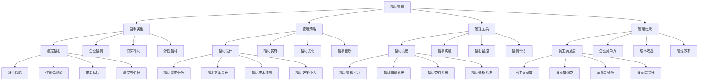

# 福利管理

## 🎯 学习目标
掌握福利管理理论和方法，学会设计和管理员工福利体系，提升员工满意度和企业竞争力。

## 📊 福利管理框架

### 福利管理模型

## 🏛️ 福利类型

### 法定福利
**社会保险**：
- **社会保险**：社会保险管理
- **保险类型**：保险类型管理
- **保险标准**：保险标准管理
- **保险服务**：保险服务管理

**住房公积金**：
- **住房公积金**：住房公积金管理
- **缴存标准**：缴存标准管理
- **提取服务**：提取服务管理
- **贷款服务**：贷款服务管理

**带薪休假**：
- **带薪休假**：带薪休假管理
- **休假标准**：休假标准管理
- **休假申请**：休假申请管理
- **休假监控**：休假监控管理

**法定节假日**：
- **法定节假日**：法定节假日管理
- **节假日安排**：节假日安排管理
- **节假日工资**：节假日工资管理
- **节假日服务**：节假日服务管理

### 企业福利
**补充保险**：
- **补充保险**：补充保险管理
- **保险类型**：补充保险类型
- **保险标准**：补充保险标准
- **保险服务**：补充保险服务

**健康体检**：
- **健康体检**：健康体检管理
- **体检标准**：体检标准管理
- **体检服务**：体检服务管理
- **体检结果**：体检结果管理

**员工培训**：
- **员工培训**：员工培训管理
- **培训类型**：培训类型管理
- **培训标准**：培训标准管理
- **培训服务**：培训服务管理

**员工活动**：
- **员工活动**：员工活动管理
- **活动类型**：活动类型管理
- **活动标准**：活动标准管理
- **活动服务**：活动服务管理

### 特殊福利
**住房补贴**：
- **住房补贴**：住房补贴管理
- **补贴标准**：补贴标准管理
- **补贴申请**：补贴申请管理
- **补贴发放**：补贴发放管理

**交通补贴**：
- **交通补贴**：交通补贴管理
- **补贴标准**：补贴标准管理
- **补贴申请**：补贴申请管理
- **补贴发放**：补贴发放管理

**餐饮补贴**：
- **餐饮补贴**：餐饮补贴管理
- **补贴标准**：补贴标准管理
- **补贴申请**：补贴申请管理
- **补贴发放**：补贴发放管理

**通讯补贴**：
- **通讯补贴**：通讯补贴管理
- **补贴标准**：补贴标准管理
- **补贴申请**：补贴申请管理
- **补贴发放**：补贴发放管理

### 弹性福利
**福利选择**：
- **福利选择**：福利选择管理
- **选择标准**：选择标准管理
- **选择流程**：选择流程管理
- **选择服务**：选择服务管理

**福利组合**：
- **福利组合**：福利组合管理
- **组合标准**：组合标准管理
- **组合流程**：组合流程管理
- **组合服务**：组合服务管理

**福利兑换**：
- **福利兑换**：福利兑换管理
- **兑换标准**：兑换标准管理
- **兑换流程**：兑换流程管理
- **兑换服务**：兑换服务管理

**福利个性化**：
- **福利个性化**：福利个性化管理
- **个性化标准**：个性化标准管理
- **个性化流程**：个性化流程管理
- **个性化服务**：个性化服务管理

## 🎯 福利管理策略

### 福利设计
**福利需求分析**：
- **福利需求分析**：福利需求分析
- **分析方法**：分析方法选择
- **分析工具**：分析工具使用
- **分析结果**：分析结果应用

**福利方案设计**：
- **福利方案设计**：福利方案设计
- **设计方法**：设计方法选择
- **设计工具**：设计工具使用
- **设计效果**：设计效果评估

**福利成本控制**：
- **福利成本控制**：福利成本控制
- **控制方法**：控制方法选择
- **控制工具**：控制工具使用
- **控制效果**：控制效果评估

**福利效果评估**：
- **福利效果评估**：福利效果评估
- **评估方法**：评估方法选择
- **评估工具**：评估工具使用
- **评估结果**：评估结果应用

### 福利实施
**福利宣传**：
- **福利宣传**：福利宣传管理
- **宣传方法**：宣传方法选择
- **宣传工具**：宣传工具使用
- **宣传效果**：宣传效果评估

**福利申请**：
- **福利申请**：福利申请管理
- **申请流程**：申请流程设计
- **申请标准**：申请标准制定
- **申请服务**：申请服务提供

**福利审核**：
- **福利审核**：福利审核管理
- **审核标准**：审核标准制定
- **审核流程**：审核流程设计
- **审核服务**：审核服务提供

**福利发放**：
- **福利发放**：福利发放管理
- **发放标准**：发放标准制定
- **发放流程**：发放流程设计
- **发放服务**：发放服务提供

### 福利优化
**福利调整**：
- **福利调整**：福利调整管理
- **调整方法**：调整方法选择
- **调整工具**：调整工具使用
- **调整效果**：调整效果评估

**福利创新**：
- **福利创新**：福利创新管理
- **创新方法**：创新方法选择
- **创新工具**：创新工具使用
- **创新效果**：创新效果评估

**福利整合**：
- **福利整合**：福利整合管理
- **整合方法**：整合方法选择
- **整合工具**：整合工具使用
- **整合效果**：整合效果评估

**福利外包**：
- **福利外包**：福利外包管理
- **外包方法**：外包方法选择
- **外包工具**：外包工具使用
- **外包效果**：外包效果评估

### 福利创新
**福利创新**：
- **福利创新**：福利创新管理
- **创新方法**：创新方法选择
- **创新工具**：创新工具使用
- **创新效果**：创新效果评估

**创新策略**：
- **创新策略**：福利创新策略
- **策略制定**：策略制定过程
- **策略实施**：策略实施执行
- **策略效果**：策略效果评估

**创新管理**：
- **创新管理**：福利创新管理
- **管理方法**：管理方法选择
- **管理工具**：管理工具使用
- **管理效果**：管理效果评估

## 🛠️ 福利管理工具

### 福利系统
**福利管理平台**：
- **福利管理平台**：福利管理平台
- **平台功能**：平台功能设计
- **平台实施**：平台实施执行
- **平台效果**：平台效果评估

**福利申请系统**：
- **福利申请系统**：福利申请系统
- **系统功能**：系统功能设计
- **系统实施**：系统实施执行
- **系统效果**：系统效果评估

**福利查询系统**：
- **福利查询系统**：福利查询系统
- **系统功能**：系统功能设计
- **系统实施**：系统实施执行
- **系统效果**：系统效果评估

**福利分析系统**：
- **福利分析系统**：福利分析系统
- **系统功能**：系统功能设计
- **系统实施**：系统实施执行
- **系统效果**：系统效果评估

### 福利沟通
**福利手册**：
- **福利手册**：福利手册管理
- **手册内容**：手册内容设计
- **手册制作**：手册制作实施
- **手册效果**：手册效果评估

**福利培训**：
- **福利培训**：福利培训管理
- **培训内容**：培训内容设计
- **培训实施**：培训实施执行
- **培训效果**：培训效果评估

**福利咨询**：
- **福利咨询**：福利咨询服务
- **咨询服务**：咨询服务提供
- **咨询标准**：咨询标准制定
- **咨询效果**：咨询效果评估

**福利反馈**：
- **福利反馈**：福利反馈管理
- **反馈收集**：反馈收集方法
- **反馈分析**：反馈分析方法
- **反馈应用**：反馈应用实施

### 福利监控
**福利监控**：
- **福利监控**：福利监控管理
- **监控方法**：监控方法选择
- **监控工具**：监控工具使用
- **监控效果**：监控效果评估

**监控指标**：
- **监控指标**：福利监控指标
- **指标设计**：指标设计方法
- **指标实施**：指标实施执行
- **指标效果**：指标效果评估

**监控报告**：
- **监控报告**：福利监控报告
- **报告内容**：报告内容设计
- **报告制作**：报告制作实施
- **报告效果**：报告效果评估

### 福利评估
**福利评估**：
- **福利评估**：福利评估管理
- **评估方法**：评估方法选择
- **评估工具**：评估工具使用
- **评估结果**：评估结果应用

**评估标准**：
- **评估标准**：福利评估标准
- **标准制定**：标准制定过程
- **标准实施**：标准实施执行
- **标准效果**：标准效果评估

**评估报告**：
- **评估报告**：福利评估报告
- **报告内容**：报告内容设计
- **报告制作**：报告制作实施
- **报告效果**：报告效果评估

## 📈 福利管理效果

### 员工满意度
**员工满意度**：
- **员工满意度**：员工满意度管理
- **满意度调查**：满意度调查实施
- **满意度分析**：满意度分析方法
- **满意度提升**：满意度提升措施

**满意度调查**：
- **满意度调查**：员工满意度调查
- **调查方法**：调查方法选择
- **调查工具**：调查工具使用
- **调查结果**：调查结果应用

**满意度分析**：
- **满意度分析**：满意度分析方法
- **分析方法**：分析方法选择
- **分析工具**：分析工具使用
- **分析结果**：分析结果应用

**满意度提升**：
- **满意度提升**：满意度提升措施
- **提升方法**：提升方法选择
- **提升工具**：提升工具使用
- **提升效果**：提升效果评估

### 企业竞争力
**企业竞争力**：
- **企业竞争力**：企业竞争力提升
- **竞争力分析**：竞争力分析方法
- **竞争力提升**：竞争力提升措施
- **竞争力维护**：竞争力维护机制

**竞争力分析**：
- **竞争力分析**：企业竞争力分析
- **分析方法**：分析方法选择
- **分析工具**：分析工具使用
- **分析结果**：分析结果应用

**竞争力提升**：
- **竞争力提升**：竞争力提升措施
- **提升方法**：提升方法选择
- **提升工具**：提升工具使用
- **提升效果**：提升效果评估

### 成本效益
**成本效益**：
- **成本效益**：福利成本效益分析
- **效益分析**：效益分析方法
- **效益优化**：效益优化措施
- **效益评估**：效益评估体系

**效益分析**：
- **效益分析**：福利效益分析
- **分析方法**：分析方法选择
- **分析工具**：分析工具使用
- **分析结果**：分析结果应用

**效益优化**：
- **效益优化**：福利效益优化
- **优化方法**：优化方法选择
- **优化工具**：优化工具使用
- **优化效果**：优化效果评估

### 管理效率
**管理效率**：
- **管理效率**：福利管理效率提升
- **效率分析**：效率分析方法
- **效率提升**：效率提升措施
- **效率维护**：效率维护机制

**效率分析**：
- **效率分析**：福利管理效率分析
- **分析方法**：分析方法选择
- **分析工具**：分析工具使用
- **分析结果**：分析结果应用

**效率提升**：
- **效率提升**：管理效率提升措施
- **提升方法**：提升方法选择
- **提升工具**：提升工具使用
- **提升效果**：提升效果评估

## 💡 福利管理案例

### 成功案例
**谷歌福利管理**：
- **福利设计**：创新福利设计
- **福利实施**：成功福利实施
- **福利效果**：卓越福利效果
- **效果**：福利管理质量极高

**微软福利管理**：
- **福利设计**：系统福利设计
- **福利实施**：成功福利实施
- **福利效果**：显著福利效果
- **效果**：福利管理质量极佳

**苹果福利管理**：
- **福利设计**：独特福利设计
- **福利实施**：成功福利实施
- **福利效果**：突出福利效果
- **效果**：福利管理质量突出

### 失败案例
**失败原因**：
- **福利设计不合理**：福利设计不合理
- **福利实施不到位**：福利实施不到位
- **福利管理缺失**：福利管理缺失
- **福利效果不佳**：福利效果不佳

**失败教训**：
- **福利设计**：合理设计福利体系
- **福利实施**：有效实施福利体系
- **福利管理**：完善福利管理体系
- **福利效果**：持续改进福利效果

## 🧠 学习要点

### 费曼学习法应用
1. **选择概念**：福利管理
2. **简化解释**：用简单语言解释福利管理
3. **识别盲点**：找出理解不足的地方
4. **重新学习**：针对盲点深入学习

### 刻意练习要点
- **理论掌握**：掌握福利管理理论
- **方法应用**：掌握福利管理方法
- **工具使用**：掌握福利管理工具
- **实践应用**：实践应用福利管理

## 🔗 关联学习

### 前置知识
- [[01-薪酬体系设计]] - 薪酬体系设计
- [[04-绩效管理]] - 绩效管理
- [[01-人力资源规划]] - 人力资源规划

### 后续学习
- [[03-股权激励]] - 股权激励
- [[01-组织文化]] - 组织文化
- [[02-领导力]] - 领导力

### 实践应用
- 企业福利体系设计
- 福利体系实施
- 福利体系管理
- 福利体系优化

## 🎯 学习检验

### 理解检验
- [ ] 能够理解福利管理理论
- [ ] 能够掌握福利管理方法
- [ ] 能够应用福利管理工具
- [ ] 能够管理福利体系

### 应用检验
- [ ] 能够设计福利体系
- [ ] 能够实施福利体系
- [ ] 能够管理福利体系
- [ ] 能够优化福利体系

---
**下一步**：[[03-股权激励]] - 股权激励