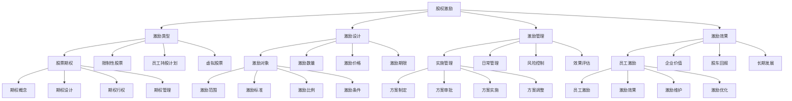

# 股权激励

## 🎯 学习目标
掌握股权激励理论和方法，学会设计和管理股权激励体系，提升员工积极性和企业长期价值。

## 📊 股权激励框架

### 股权激励模型

## 💎 股权激励类型

### 股票期权
**期权概念**：
- **期权概念**：股票期权概念
- **期权特征**：期权特征分析
- **期权价值**：期权价值分析
- **期权风险**：期权风险分析

**期权设计**：
- **期权设计**：股票期权设计
- **设计原则**：设计原则制定
- **设计方法**：设计方法选择
- **设计效果**：设计效果评估

**期权行权**：
- **期权行权**：股票期权行权
- **行权条件**：行权条件设定
- **行权方式**：行权方式选择
- **行权管理**：行权管理实施

**期权管理**：
- **期权管理**：股票期权管理
- **管理方法**：管理方法选择
- **管理工具**：管理工具使用
- **管理效果**：管理效果评估

### 限制性股票
**限制性股票概念**：
- **限制性股票概念**：限制性股票概念
- **股票特征**：股票特征分析
- **股票价值**：股票价值分析
- **股票风险**：股票风险分析

**限制条件**：
- **限制条件**：限制性股票限制条件
- **条件设定**：条件设定方法
- **条件管理**：条件管理实施
- **条件效果**：条件效果评估

**解锁条件**：
- **解锁条件**：限制性股票解锁条件
- **解锁标准**：解锁标准制定
- **解锁流程**：解锁流程设计
- **解锁管理**：解锁管理实施

**管理方式**：
- **管理方式**：限制性股票管理方式
- **管理方法**：管理方法选择
- **管理工具**：管理工具使用
- **管理效果**：管理效果评估

### 员工持股计划
**持股计划设计**：
- **持股计划设计**：员工持股计划设计
- **计划原则**：计划原则制定
- **计划方法**：计划方法选择
- **计划效果**：计划效果评估

**持股方式**：
- **持股方式**：员工持股方式
- **方式选择**：方式选择标准
- **方式实施**：方式实施执行
- **方式效果**：方式效果评估

**持股管理**：
- **持股管理**：员工持股管理
- **管理方法**：管理方法选择
- **管理工具**：管理工具使用
- **管理效果**：管理效果评估

**退出机制**：
- **退出机制**：员工持股退出机制
- **机制设计**：机制设计方法
- **机制实施**：机制实施执行
- **机制效果**：机制效果评估

### 虚拟股票
**虚拟股票概念**：
- **虚拟股票概念**：虚拟股票概念
- **股票特征**：股票特征分析
- **股票价值**：股票价值分析
- **股票风险**：股票风险分析

**虚拟股票设计**：
- **虚拟股票设计**：虚拟股票设计
- **设计原则**：设计原则制定
- **设计方法**：设计方法选择
- **设计效果**：设计效果评估

**虚拟股票管理**：
- **虚拟股票管理**：虚拟股票管理
- **管理方法**：管理方法选择
- **管理工具**：管理工具使用
- **管理效果**：管理效果评估

**虚拟股票结算**：
- **虚拟股票结算**：虚拟股票结算
- **结算方式**：结算方式选择
- **结算流程**：结算流程设计
- **结算管理**：结算管理实施

## 🎯 股权激励设计

### 激励对象
**激励范围**：
- **激励范围**：股权激励范围
- **范围确定**：范围确定方法
- **范围管理**：范围管理实施
- **范围效果**：范围效果评估

**激励标准**：
- **激励标准**：股权激励标准
- **标准制定**：标准制定方法
- **标准实施**：标准实施执行
- **标准效果**：标准效果评估

**激励比例**：
- **激励比例**：股权激励比例
- **比例设定**：比例设定方法
- **比例管理**：比例管理实施
- **比例效果**：比例效果评估

**激励条件**：
- **激励条件**：股权激励条件
- **条件设定**：条件设定方法
- **条件管理**：条件管理实施
- **条件效果**：条件效果评估

### 激励数量
**激励总量**：
- **激励总量**：股权激励总量
- **总量确定**：总量确定方法
- **总量管理**：总量管理实施
- **总量效果**：总量效果评估

**个人数量**：
- **个人数量**：个人激励数量
- **数量确定**：数量确定方法
- **数量管理**：数量管理实施
- **数量效果**：数量效果评估

**分配原则**：
- **分配原则**：股权激励分配原则
- **原则制定**：原则制定方法
- **原则实施**：原则实施执行
- **原则效果**：原则效果评估

**调整机制**：
- **调整机制**：股权激励调整机制
- **机制设计**：机制设计方法
- **机制实施**：机制实施执行
- **机制效果**：机制效果评估

### 激励价格
**定价方法**：
- **定价方法**：股权激励定价方法
- **方法选择**：方法选择标准
- **方法应用**：方法应用实施
- **方法效果**：方法效果评估

**价格确定**：
- **价格确定**：股权激励价格确定
- **确定方法**：确定方法选择
- **确定流程**：确定流程设计
- **确定效果**：确定效果评估

**价格调整**：
- **价格调整**：股权激励价格调整
- **调整方法**：调整方法选择
- **调整流程**：调整流程设计
- **调整效果**：调整效果评估

**价格保护**：
- **价格保护**：股权激励价格保护
- **保护措施**：保护措施制定
- **保护实施**：保护实施执行
- **保护效果**：保护效果评估

### 激励期限
**激励周期**：
- **激励周期**：股权激励周期
- **周期设定**：周期设定方法
- **周期管理**：周期管理实施
- **周期效果**：周期效果评估

**行权期限**：
- **行权期限**：股权激励行权期限
- **期限设定**：期限设定方法
- **期限管理**：期限管理实施
- **期限效果**：期限效果评估

**解锁期限**：
- **解锁期限**：股权激励解锁期限
- **期限设定**：期限设定方法
- **期限管理**：期限管理实施
- **期限效果**：期限效果评估

**有效期**：
- **有效期**：股权激励有效期
- **期限设定**：期限设定方法
- **期限管理**：期限管理实施
- **期限效果**：期限效果评估

## 📊 股权激励管理

### 实施管理
**方案制定**：
- **方案制定**：股权激励方案制定
- **制定方法**：制定方法选择
- **制定工具**：制定工具使用
- **制定效果**：制定效果评估

**方案审批**：
- **方案审批**：股权激励方案审批
- **审批流程**：审批流程设计
- **审批标准**：审批标准制定
- **审批效果**：审批效果评估

**方案实施**：
- **方案实施**：股权激励方案实施
- **实施方法**：实施方法选择
- **实施工具**：实施工具使用
- **实施效果**：实施效果评估

**方案调整**：
- **方案调整**：股权激励方案调整
- **调整方法**：调整方法选择
- **调整工具**：调整工具使用
- **调整效果**：调整效果评估

### 日常管理
**股权登记**：
- **股权登记**：股权激励登记管理
- **登记方法**：登记方法选择
- **登记工具**：登记工具使用
- **登记效果**：登记效果评估

**股权变更**：
- **股权变更**：股权激励变更管理
- **变更方法**：变更方法选择
- **变更工具**：变更工具使用
- **变更效果**：变更效果评估

**股权转让**：
- **股权转让**：股权激励转让管理
- **转让方法**：转让方法选择
- **转让工具**：转让工具使用
- **转让效果**：转让效果评估

**股权注销**：
- **股权注销**：股权激励注销管理
- **注销方法**：注销方法选择
- **注销工具**：注销工具使用
- **注销效果**：注销效果评估

### 风险控制
**合规风险**：
- **合规风险**：股权激励合规风险
- **风险识别**：风险识别方法
- **风险控制**：风险控制措施
- **风险效果**：风险控制效果

**财务风险**：
- **财务风险**：股权激励财务风险
- **风险识别**：风险识别方法
- **风险控制**：风险控制措施
- **风险效果**：风险控制效果

**操作风险**：
- **操作风险**：股权激励操作风险
- **风险识别**：风险识别方法
- **风险控制**：风险控制措施
- **风险效果**：风险控制效果

**市场风险**：
- **市场风险**：股权激励市场风险
- **风险识别**：风险识别方法
- **风险控制**：风险控制措施
- **风险效果**：风险控制效果

### 效果评估
**效果评估**：
- **效果评估**：股权激励效果评估
- **评估方法**：评估方法选择
- **评估工具**：评估工具使用
- **评估结果**：评估结果应用

**评估指标**：
- **评估指标**：股权激励评估指标
- **指标设计**：指标设计方法
- **指标实施**：指标实施执行
- **指标效果**：指标效果评估

**评估报告**：
- **评估报告**：股权激励评估报告
- **报告内容**：报告内容设计
- **报告制作**：报告制作实施
- **报告效果**：报告效果评估

## 📈 股权激励效果

### 员工激励
**员工激励**：
- **员工激励**：股权激励员工激励效果
- **激励效果**：激励效果分析
- **激励维护**：激励维护机制
- **激励优化**：激励优化措施

**激励效果**：
- **激励效果**：员工激励效果分析
- **效果评估**：效果评估方法
- **效果改进**：效果改进措施
- **效果维护**：效果维护机制

**激励维护**：
- **激励维护**：员工激励维护机制
- **维护方法**：维护方法选择
- **维护工具**：维护工具使用
- **维护效果**：维护效果评估

**激励优化**：
- **激励优化**：员工激励优化措施
- **优化方法**：优化方法选择
- **优化工具**：优化工具使用
- **优化效果**：优化效果评估

### 企业价值
**企业价值**：
- **企业价值**：股权激励企业价值提升
- **价值分析**：价值分析方法
- **价值提升**：价值提升措施
- **价值维护**：价值维护机制

**价值分析**：
- **价值分析**：企业价值分析
- **分析方法**：分析方法选择
- **分析工具**：分析工具使用
- **分析结果**：分析结果应用

**价值提升**：
- **价值提升**：企业价值提升措施
- **提升方法**：提升方法选择
- **提升工具**：提升工具使用
- **提升效果**：提升效果评估

### 股东回报
**股东回报**：
- **股东回报**：股权激励股东回报
- **回报分析**：回报分析方法
- **回报提升**：回报提升措施
- **回报维护**：回报维护机制

**回报分析**：
- **回报分析**：股东回报分析
- **分析方法**：分析方法选择
- **分析工具**：分析工具使用
- **分析结果**：分析结果应用

**回报提升**：
- **回报提升**：股东回报提升措施
- **提升方法**：提升方法选择
- **提升工具**：提升工具使用
- **提升效果**：提升效果评估

### 长期发展
**长期发展**：
- **长期发展**：股权激励长期发展
- **发展分析**：发展分析方法
- **发展策略**：发展策略制定
- **发展维护**：发展维护机制

**发展分析**：
- **发展分析**：长期发展分析
- **分析方法**：分析方法选择
- **分析工具**：分析工具使用
- **分析结果**：分析结果应用

**发展策略**：
- **发展策略**：长期发展战略
- **策略制定**：策略制定过程
- **策略实施**：策略实施执行
- **策略效果**：策略效果评估

## 💡 股权激励案例

### 成功案例
**谷歌股权激励**：
- **激励设计**：创新股权激励设计
- **激励实施**：成功激励实施
- **激励效果**：卓越激励效果
- **效果**：股权激励质量极高

**微软股权激励**：
- **激励设计**：系统股权激励设计
- **激励实施**：成功激励实施
- **激励效果**：显著激励效果
- **效果**：股权激励质量极佳

**苹果股权激励**：
- **激励设计**：独特股权激励设计
- **激励实施**：成功激励实施
- **激励效果**：突出激励效果
- **效果**：股权激励质量突出

### 失败案例
**失败原因**：
- **激励设计不合理**：激励设计不合理
- **激励实施不到位**：激励实施不到位
- **激励管理缺失**：激励管理缺失
- **激励效果不佳**：激励效果不佳

**失败教训**：
- **激励设计**：合理设计股权激励
- **激励实施**：有效实施股权激励
- **激励管理**：完善激励管理体系
- **激励效果**：持续改进激励效果

## 🧠 学习要点

### 费曼学习法应用
1. **选择概念**：股权激励
2. **简化解释**：用简单语言解释股权激励
3. **识别盲点**：找出理解不足的地方
4. **重新学习**：针对盲点深入学习

### 刻意练习要点
- **理论掌握**：掌握股权激励理论
- **方法应用**：掌握股权激励方法
- **工具使用**：掌握股权激励工具
- **实践应用**：实践应用股权激励

## 🔗 关联学习

### 前置知识
- [[02-福利管理]] - 福利管理
- [[01-薪酬体系设计]] - 薪酬体系设计
- [[04-绩效管理]] - 绩效管理

### 后续学习
- [[01-组织文化]] - 组织文化
- [[02-领导力]] - 领导力
- [[03-团队管理]] - 团队管理

### 实践应用
- 企业股权激励设计
- 股权激励实施
- 股权激励管理
- 股权激励优化

## 🎯 学习检验

### 理解检验
- [ ] 能够理解股权激励理论
- [ ] 能够掌握股权激励方法
- [ ] 能够应用股权激励工具
- [ ] 能够设计股权激励

### 应用检验
- [ ] 能够设计股权激励
- [ ] 能够实施股权激励
- [ ] 能够管理股权激励
- [ ] 能够优化股权激励

---
**下一步**：[[01-组织文化]] - 组织文化