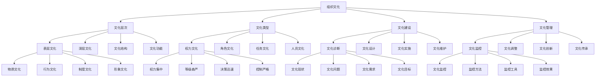

# 组织文化

## 🎯 学习目标
掌握组织文化理论和方法，学会建设和维护组织文化，提升组织凝聚力和竞争力。

## 📊 组织文化框架

### 组织文化模型

## 🏗️ 组织文化层次

### 表层文化
**物质文化**：
- **物质文化**：组织物质文化
- **文化载体**：文化载体建设
- **文化环境**：文化环境营造
- **文化标识**：文化标识设计

**行为文化**：
- **行为文化**：组织行为文化
- **行为规范**：行为规范制定
- **行为示范**：行为示范实施
- **行为监督**：行为监督机制

**制度文化**：
- **制度文化**：组织制度文化
- **制度设计**：制度设计方法
- **制度实施**：制度实施执行
- **制度维护**：制度维护机制

**形象文化**：
- **形象文化**：组织形象文化
- **形象设计**：形象设计方法
- **形象传播**：形象传播策略
- **形象维护**：形象维护机制

### 深层文化
**价值观念**：
- **价值观念**：组织价值观念
- **价值观体系**：价值观体系建设
- **价值观传播**：价值观传播策略
- **价值观实践**：价值观实践机制

**基本假设**：
- **基本假设**：组织基本假设
- **假设识别**：假设识别方法
- **假设验证**：假设验证过程
- **假设调整**：假设调整机制

**信念体系**：
- **信念体系**：组织信念体系
- **信念建设**：信念建设方法
- **信念传播**：信念传播策略
- **信念维护**：信念维护机制

**思维方式**：
- **思维方式**：组织思维方式
- **思维模式**：思维模式建设
- **思维创新**：思维创新机制
- **思维传承**：思维传承方法

### 文化结构
**文化结构**：
- **文化结构**：组织文化结构
- **结构设计**：结构设计方法
- **结构优化**：结构优化策略
- **结构维护**：结构维护机制

**文化要素**：
- **文化要素**：组织文化要素
- **要素识别**：要素识别方法
- **要素整合**：要素整合策略
- **要素优化**：要素优化措施

**文化关系**：
- **文化关系**：组织文化关系
- **关系分析**：关系分析方法
- **关系优化**：关系优化策略
- **关系维护**：关系维护机制

### 文化功能
**文化功能**：
- **文化功能**：组织文化功能
- **功能分析**：功能分析方法
- **功能优化**：功能优化策略
- **功能维护**：功能维护机制

**导向功能**：
- **导向功能**：文化导向功能
- **导向机制**：导向机制建设
- **导向实施**：导向实施执行
- **导向效果**：导向效果评估

**凝聚功能**：
- **凝聚功能**：文化凝聚功能
- **凝聚机制**：凝聚机制建设
- **凝聚实施**：凝聚实施执行
- **凝聚效果**：凝聚效果评估

## 🎭 组织文化类型

### 权力文化
**权力集中**：
- **权力集中**：权力文化权力集中
- **集中机制**：集中机制建设
- **集中实施**：集中实施执行
- **集中效果**：集中效果评估

**等级森严**：
- **等级森严**：权力文化等级森严
- **等级体系**：等级体系建设
- **等级管理**：等级管理实施
- **等级效果**：等级效果评估

**决策迅速**：
- **决策迅速**：权力文化决策迅速
- **决策机制**：决策机制建设
- **决策实施**：决策实施执行
- **决策效果**：决策效果评估

**控制严格**：
- **控制严格**：权力文化控制严格
- **控制机制**：控制机制建设
- **控制实施**：控制实施执行
- **控制效果**：控制效果评估

### 角色文化
**职责明确**：
- **职责明确**：角色文化职责明确
- **职责体系**：职责体系建设
- **职责管理**：职责管理实施
- **职责效果**：职责效果评估

**程序规范**：
- **程序规范**：角色文化程序规范
- **程序体系**：程序体系建设
- **程序管理**：程序管理实施
- **程序效果**：程序效果评估

**稳定可靠**：
- **稳定可靠**：角色文化稳定可靠
- **稳定机制**：稳定机制建设
- **稳定实施**：稳定实施执行
- **稳定效果**：稳定效果评估

**效率较高**：
- **效率较高**：角色文化效率较高
- **效率机制**：效率机制建设
- **效率实施**：效率实施执行
- **效率效果**：效率效果评估

### 任务文化
**目标导向**：
- **目标导向**：任务文化目标导向
- **目标体系**：目标体系建设
- **目标管理**：目标管理实施
- **目标效果**：目标效果评估

**团队协作**：
- **团队协作**：任务文化团队协作
- **协作机制**：协作机制建设
- **协作实施**：协作实施执行
- **协作效果**：协作效果评估

**灵活适应**：
- **灵活适应**：任务文化灵活适应
- **适应机制**：适应机制建设
- **适应实施**：适应实施执行
- **适应效果**：适应效果评估

**创新驱动**：
- **创新驱动**：任务文化创新驱动
- **创新机制**：创新机制建设
- **创新实施**：创新实施执行
- **创新效果**：创新效果评估

### 人员文化
**以人为本**：
- **以人为本**：人员文化以人为本
- **人本机制**：人本机制建设
- **人本实施**：人本实施执行
- **人本效果**：人本效果评估

**个人发展**：
- **个人发展**：人员文化个人发展
- **发展机制**：发展机制建设
- **发展实施**：发展实施执行
- **发展效果**：发展效果评估

**自主管理**：
- **自主管理**：人员文化自主管理
- **自主机制**：自主机制建设
- **自主实施**：自主实施执行
- **自主效果**：自主效果评估

**创新创造**：
- **创新创造**：人员文化创新创造
- **创造机制**：创造机制建设
- **创造实施**：创造实施执行
- **创造效果**：创造效果评估

## 🏗️ 组织文化建设

### 文化诊断
**文化现状**：
- **文化现状**：组织文化现状分析
- **现状调查**：现状调查方法
- **现状分析**：现状分析方法
- **现状评估**：现状评估体系

**文化问题**：
- **文化问题**：组织文化问题识别
- **问题识别**：问题识别方法
- **问题分析**：问题分析方法
- **问题解决**：问题解决策略

**文化需求**：
- **文化需求**：组织文化需求分析
- **需求调查**：需求调查方法
- **需求分析**：需求分析方法
- **需求满足**：需求满足策略

**文化目标**：
- **文化目标**：组织文化目标设定
- **目标制定**：目标制定方法
- **目标实施**：目标实施执行
- **目标评估**：目标评估体系

### 文化设计
**文化理念**：
- **文化理念**：组织文化理念设计
- **理念制定**：理念制定方法
- **理念传播**：理念传播策略
- **理念实践**：理念实践机制

**文化体系**：
- **文化体系**：组织文化体系设计
- **体系构建**：体系构建方法
- **体系实施**：体系实施执行
- **体系维护**：体系维护机制

**文化制度**：
- **文化制度**：组织文化制度设计
- **制度制定**：制度制定方法
- **制度实施**：制度实施执行
- **制度维护**：制度维护机制

**文化行为**：
- **文化行为**：组织文化行为设计
- **行为规范**：行为规范制定
- **行为实施**：行为实施执行
- **行为监督**：行为监督机制

### 文化实施
**文化宣传**：
- **文化宣传**：组织文化宣传
- **宣传策略**：宣传策略制定
- **宣传实施**：宣传实施执行
- **宣传效果**：宣传效果评估

**文化培训**：
- **文化培训**：组织文化培训
- **培训设计**：培训设计方法
- **培训实施**：培训实施执行
- **培训效果**：培训效果评估

**文化示范**：
- **文化示范**：组织文化示范
- **示范机制**：示范机制建设
- **示范实施**：示范实施执行
- **示范效果**：示范效果评估

**文化激励**：
- **文化激励**：组织文化激励
- **激励机制**：激励机制建设
- **激励实施**：激励实施执行
- **激励效果**：激励效果评估

### 文化维护
**文化监控**：
- **文化监控**：组织文化监控
- **监控机制**：监控机制建设
- **监控实施**：监控实施执行
- **监控效果**：监控效果评估

**文化调整**：
- **文化调整**：组织文化调整
- **调整机制**：调整机制建设
- **调整实施**：调整实施执行
- **调整效果**：调整效果评估

**文化创新**：
- **文化创新**：组织文化创新
- **创新机制**：创新机制建设
- **创新实施**：创新实施执行
- **创新效果**：创新效果评估

**文化传承**：
- **文化传承**：组织文化传承
- **传承机制**：传承机制建设
- **传承实施**：传承实施执行
- **传承效果**：传承效果评估

## 📊 组织文化管理

### 文化监控
**文化监控**：
- **文化监控**：组织文化监控
- **监控方法**：监控方法选择
- **监控工具**：监控工具使用
- **监控效果**：监控效果评估

**监控指标**：
- **监控指标**：文化监控指标
- **指标设计**：指标设计方法
- **指标实施**：指标实施执行
- **指标效果**：指标效果评估

**监控报告**：
- **监控报告**：文化监控报告
- **报告内容**：报告内容设计
- **报告制作**：报告制作实施
- **报告效果**：报告效果评估

### 文化调整
**文化调整**：
- **文化调整**：组织文化调整
- **调整方法**：调整方法选择
- **调整工具**：调整工具使用
- **调整效果**：调整效果评估

**调整策略**：
- **调整策略**：文化调整策略
- **策略制定**：策略制定过程
- **策略实施**：策略实施执行
- **策略效果**：策略效果评估

**调整时机**：
- **调整时机**：文化调整时机
- **时机选择**：时机选择标准
- **时机把握**：时机把握方法
- **时机效果**：时机效果评估

### 文化创新
**文化创新**：
- **文化创新**：组织文化创新
- **创新方法**：创新方法选择
- **创新工具**：创新工具使用
- **创新效果**：创新效果评估

**创新策略**：
- **创新策略**：文化创新策略
- **策略制定**：策略制定过程
- **策略实施**：策略实施执行
- **策略效果**：策略效果评估

**创新管理**：
- **创新管理**：文化创新管理
- **管理方法**：管理方法选择
- **管理工具**：管理工具使用
- **管理效果**：管理效果评估

### 文化传承
**文化传承**：
- **文化传承**：组织文化传承
- **传承方法**：传承方法选择
- **传承工具**：传承工具使用
- **传承效果**：传承效果评估

**传承策略**：
- **传承策略**：文化传承策略
- **策略制定**：策略制定过程
- **策略实施**：策略实施执行
- **策略效果**：策略效果评估

**传承管理**：
- **传承管理**：文化传承管理
- **管理方法**：管理方法选择
- **管理工具**：管理工具使用
- **管理效果**：管理效果评估

## 💡 组织文化案例

### 成功案例
**谷歌组织文化**：
- **文化设计**：创新文化设计
- **文化实施**：成功文化实施
- **文化效果**：卓越文化效果
- **效果**：组织文化质量极高

**微软组织文化**：
- **文化设计**：系统文化设计
- **文化实施**：成功文化实施
- **文化效果**：显著文化效果
- **效果**：组织文化质量极佳

**苹果组织文化**：
- **文化设计**：独特文化设计
- **文化实施**：成功文化实施
- **文化效果**：突出文化效果
- **效果**：组织文化质量突出

### 失败案例
**失败原因**：
- **文化设计不合理**：文化设计不合理
- **文化实施不到位**：文化实施不到位
- **文化管理缺失**：文化管理缺失
- **文化效果不佳**：文化效果不佳

**失败教训**：
- **文化设计**：合理设计组织文化
- **文化实施**：有效实施组织文化
- **文化管理**：完善文化管理体系
- **文化效果**：持续改进文化效果

## 🧠 学习要点

### 费曼学习法应用
1. **选择概念**：组织文化
2. **简化解释**：用简单语言解释组织文化
3. **识别盲点**：找出理解不足的地方
4. **重新学习**：针对盲点深入学习

### 刻意练习要点
- **理论掌握**：掌握组织文化理论
- **方法应用**：掌握组织文化方法
- **工具使用**：掌握组织文化工具
- **实践应用**：实践应用组织文化

## 🔗 关联学习

### 前置知识
- [[03-股权激励]] - 股权激励
- [[02-福利管理]] - 福利管理
- [[01-薪酬体系设计]] - 薪酬体系设计

### 后续学习
- [[02-领导力]] - 领导力
- [[03-团队管理]] - 团队管理
- [[01-战略管理概论]] - 战略管理概论

### 实践应用
- 企业组织文化建设
- 组织文化实施
- 组织文化管理
- 组织文化优化

## 🎯 学习检验

### 理解检验
- [ ] 能够理解组织文化理论
- [ ] 能够掌握组织文化方法
- [ ] 能够应用组织文化工具
- [ ] 能够建设组织文化

### 应用检验
- [ ] 能够建设组织文化
- [ ] 能够实施组织文化
- [ ] 能够管理组织文化
- [ ] 能够优化组织文化

---
**下一步**：[[02-领导力]] - 领导力