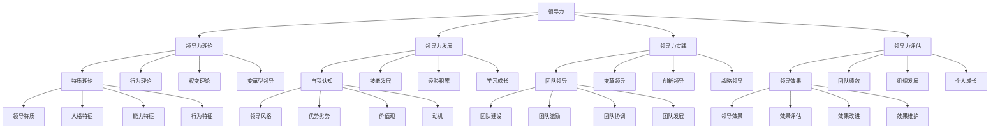

# 领导力

## 🎯 学习目标
掌握领导力理论和方法，学会发展和实践领导力，提升个人领导能力和团队绩效。

## 📊 领导力框架

### 领导力模型

## 🧠 领导力理论

### 特质理论
**领导特质**：
- **领导特质**：领导特质理论
- **特质识别**：特质识别方法
- **特质发展**：特质发展策略
- **特质应用**：特质应用实践

**人格特征**：
- **人格特征**：领导人格特征
- **特征分析**：特征分析方法
- **特征发展**：特征发展策略
- **特征应用**：特征应用实践

**能力特征**：
- **能力特征**：领导能力特征
- **能力分析**：能力分析方法
- **能力发展**：能力发展策略
- **能力应用**：能力应用实践

**行为特征**：
- **行为特征**：领导行为特征
- **行为分析**：行为分析方法
- **行为发展**：行为发展策略
- **行为应用**：行为应用实践

### 行为理论
**领导行为**：
- **领导行为**：领导行为理论
- **行为识别**：行为识别方法
- **行为发展**：行为发展策略
- **行为应用**：行为应用实践

**任务导向**：
- **任务导向**：任务导向领导
- **导向方法**：导向方法选择
- **导向实施**：导向实施执行
- **导向效果**：导向效果评估

**关系导向**：
- **关系导向**：关系导向领导
- **导向方法**：导向方法选择
- **导向实施**：导向实施执行
- **导向效果**：导向效果评估

**行为风格**：
- **行为风格**：领导行为风格
- **风格识别**：风格识别方法
- **风格发展**：风格发展策略
- **风格应用**：风格应用实践

### 权变理论
**情境因素**：
- **情境因素**：领导情境因素
- **因素分析**：因素分析方法
- **因素管理**：因素管理策略
- **因素应用**：因素应用实践

**领导风格**：
- **领导风格**：领导风格理论
- **风格识别**：风格识别方法
- **风格发展**：风格发展策略
- **风格应用**：风格应用实践

**情境匹配**：
- **情境匹配**：领导情境匹配
- **匹配方法**：匹配方法选择
- **匹配实施**：匹配实施执行
- **匹配效果**：匹配效果评估

**效果评估**：
- **效果评估**：领导效果评估
- **评估方法**：评估方法选择
- **评估工具**：评估工具使用
- **评估结果**：评估结果应用

### 变革型领导
**变革愿景**：
- **变革愿景**：变革型领导愿景
- **愿景制定**：愿景制定方法
- **愿景传播**：愿景传播策略
- **愿景实施**：愿景实施执行

**激励启发**：
- **激励启发**：变革型领导激励启发
- **激励方法**：激励方法选择
- **激励实施**：激励实施执行
- **激励效果**：激励效果评估

**智力激发**：
- **智力激发**：变革型领导智力激发
- **激发方法**：激发方法选择
- **激发实施**：激发实施执行
- **激发效果**：激发效果评估

**个性化关怀**：
- **个性化关怀**：变革型领导个性化关怀
- **关怀方法**：关怀方法选择
- **关怀实施**：关怀实施执行
- **关怀效果**：关怀效果评估

## 🚀 领导力发展

### 自我认知
**领导风格**：
- **领导风格**：领导风格自我认知
- **风格识别**：风格识别方法
- **风格分析**：风格分析方法
- **风格发展**：风格发展策略

**优势劣势**：
- **优势劣势**：领导优势劣势分析
- **分析方法**：分析方法选择
- **分析工具**：分析工具使用
- **分析结果**：分析结果应用

**价值观**：
- **价值观**：领导价值观认知
- **价值观识别**：价值观识别方法
- **价值观分析**：价值观分析方法
- **价值观发展**：价值观发展策略

**动机**：
- **动机**：领导动机认知
- **动机识别**：动机识别方法
- **动机分析**：动机分析方法
- **动机发展**：动机发展策略

### 技能发展
**沟通技能**：
- **沟通技能**：领导沟通技能发展
- **技能识别**：技能识别方法
- **技能发展**：技能发展策略
- **技能应用**：技能应用实践

**决策技能**：
- **决策技能**：领导决策技能发展
- **技能识别**：技能识别方法
- **技能发展**：技能发展策略
- **技能应用**：技能应用实践

**团队技能**：
- **团队技能**：领导团队技能发展
- **技能识别**：技能识别方法
- **技能发展**：技能发展策略
- **技能应用**：技能应用实践

**创新技能**：
- **创新技能**：领导创新技能发展
- **技能识别**：技能识别方法
- **技能发展**：技能发展策略
- **技能应用**：技能应用实践

### 经验积累
**挑战性任务**：
- **挑战性任务**：挑战性任务经验积累
- **任务选择**：任务选择标准
- **任务实施**：任务实施执行
- **任务总结**：任务总结反思

**跨部门工作**：
- **跨部门工作**：跨部门工作经验积累
- **工作安排**：工作安排方法
- **工作实施**：工作实施执行
- **工作总结**：工作总结反思

**国际经验**：
- **国际经验**：国际工作经验积累
- **经验获取**：经验获取方法
- **经验应用**：经验应用实践
- **经验总结**：经验总结反思

**失败经验**：
- **失败经验**：失败经验积累
- **失败分析**：失败分析方法
- **失败学习**：失败学习策略
- **失败应用**：失败应用实践

### 学习成长
**理论学习**：
- **理论学习**：领导力理论学习
- **学习内容**：学习内容选择
- **学习方法**：学习方法选择
- **学习效果**：学习效果评估

**实践学习**：
- **实践学习**：领导力实践学习
- **学习内容**：学习内容选择
- **学习方法**：学习方法选择
- **学习效果**：学习效果评估

**反思学习**：
- **反思学习**：领导力反思学习
- **反思方法**：反思方法选择
- **反思工具**：反思工具使用
- **反思效果**：反思效果评估

**持续学习**：
- **持续学习**：领导力持续学习
- **学习计划**：学习计划制定
- **学习实施**：学习实施执行
- **学习效果**：学习效果评估

## 🎯 领导力实践

### 团队领导
**团队建设**：
- **团队建设**：团队建设领导实践
- **建设方法**：建设方法选择
- **建设实施**：建设实施执行
- **建设效果**：建设效果评估

**团队激励**：
- **团队激励**：团队激励领导实践
- **激励方法**：激励方法选择
- **激励实施**：激励实施执行
- **激励效果**：激励效果评估

**团队协调**：
- **团队协调**：团队协调领导实践
- **协调方法**：协调方法选择
- **协调实施**：协调实施执行
- **协调效果**：协调效果评估

**团队发展**：
- **团队发展**：团队发展领导实践
- **发展方法**：发展方法选择
- **发展实施**：发展实施执行
- **发展效果**：发展效果评估

### 变革领导
**变革愿景**：
- **变革愿景**：变革领导愿景实践
- **愿景制定**：愿景制定方法
- **愿景传播**：愿景传播策略
- **愿景实施**：愿景实施执行

**变革策略**：
- **变革策略**：变革领导策略实践
- **策略制定**：策略制定方法
- **策略实施**：策略实施执行
- **策略效果**：策略效果评估

**变革实施**：
- **变革实施**：变革领导实施实践
- **实施方法**：实施方法选择
- **实施工具**：实施工具使用
- **实施效果**：实施效果评估

**变革管理**：
- **变革管理**：变革领导管理实践
- **管理方法**：管理方法选择
- **管理工具**：管理工具使用
- **管理效果**：管理效果评估

### 创新领导
**创新文化**：
- **创新文化**：创新领导文化实践
- **文化建设**：文化建设方法
- **文化实施**：文化实施执行
- **文化效果**：文化效果评估

**创新激励**：
- **创新激励**：创新领导激励实践
- **激励方法**：激励方法选择
- **激励实施**：激励实施执行
- **激励效果**：激励效果评估

**创新管理**：
- **创新管理**：创新领导管理实践
- **管理方法**：管理方法选择
- **管理工具**：管理工具使用
- **管理效果**：管理效果评估

**创新成果**：
- **创新成果**：创新领导成果实践
- **成果管理**：成果管理方法
- **成果应用**：成果应用实践
- **成果效果**：成果效果评估

### 战略领导
**战略领导**：
- **战略领导**：战略领导实践
- **领导方法**：领导方法选择
- **领导工具**：领导工具使用
- **领导效果**：领导效果评估

**战略制定**：
- **战略制定**：战略领导制定实践
- **制定方法**：制定方法选择
- **制定工具**：制定工具使用
- **制定效果**：制定效果评估

**战略实施**：
- **战略实施**：战略领导实施实践
- **实施方法**：实施方法选择
- **实施工具**：实施工具使用
- **实施效果**：实施效果评估

**战略管理**：
- **战略管理**：战略领导管理实践
- **管理方法**：管理方法选择
- **管理工具**：管理工具使用
- **管理效果**：管理效果评估

## 📊 领导力评估

### 领导效果
**领导效果**：
- **领导效果**：领导力效果评估
- **效果评估**：效果评估方法
- **效果分析**：效果分析方法
- **效果改进**：效果改进措施

**效果评估**：
- **效果评估**：领导效果评估
- **评估方法**：评估方法选择
- **评估工具**：评估工具使用
- **评估结果**：评估结果应用

**效果改进**：
- **效果改进**：领导效果改进
- **改进方法**：改进方法选择
- **改进工具**：改进工具使用
- **改进效果**：改进效果评估

**效果维护**：
- **效果维护**：领导效果维护
- **维护方法**：维护方法选择
- **维护工具**：维护工具使用
- **维护效果**：维护效果评估

### 团队绩效
**团队绩效**：
- **团队绩效**：领导团队绩效评估
- **绩效评估**：绩效评估方法
- **绩效分析**：绩效分析方法
- **绩效改进**：绩效改进措施

**绩效评估**：
- **绩效评估**：团队绩效评估
- **评估方法**：评估方法选择
- **评估工具**：评估工具使用
- **评估结果**：评估结果应用

**绩效改进**：
- **绩效改进**：团队绩效改进
- **改进方法**：改进方法选择
- **改进工具**：改进工具使用
- **改进效果**：改进效果评估

### 组织发展
**组织发展**：
- **组织发展**：领导组织发展评估
- **发展评估**：发展评估方法
- **发展分析**：发展分析方法
- **发展改进**：发展改进措施

**发展评估**：
- **发展评估**：组织发展评估
- **评估方法**：评估方法选择
- **评估工具**：评估工具使用
- **评估结果**：评估结果应用

**发展改进**：
- **发展改进**：组织发展改进
- **改进方法**：改进方法选择
- **改进工具**：改进工具使用
- **改进效果**：改进效果评估

### 个人成长
**个人成长**：
- **个人成长**：领导个人成长评估
- **成长评估**：成长评估方法
- **成长分析**：成长分析方法
- **成长改进**：成长改进措施

**成长评估**：
- **成长评估**：个人成长评估
- **评估方法**：评估方法选择
- **评估工具**：评估工具使用
- **评估结果**：评估结果应用

**成长改进**：
- **成长改进**：个人成长改进
- **改进方法**：改进方法选择
- **改进工具**：改进工具使用
- **改进效果**：改进效果评估

## 💡 领导力案例

### 成功案例
**史蒂夫·乔布斯**：
- **领导风格**：变革型领导风格
- **领导实践**：创新领导实践
- **领导效果**：卓越领导效果
- **效果**：领导力质量极高

**杰克·韦尔奇**：
- **领导风格**：变革型领导风格
- **领导实践**：战略领导实践
- **领导效果**：显著领导效果
- **效果**：领导力质量极佳

**马云**：
- **领导风格**：变革型领导风格
- **领导实践**：创新领导实践
- **领导效果**：突出领导效果
- **效果**：领导力质量突出

### 失败案例
**失败原因**：
- **领导风格不当**：领导风格不当
- **领导实践不足**：领导实践不足
- **领导效果不佳**：领导效果不佳
- **领导发展缺失**：领导发展缺失

**失败教训**：
- **领导风格**：选择合适的领导风格
- **领导实践**：有效进行领导实践
- **领导效果**：持续改进领导效果
- **领导发展**：持续进行领导发展

## 🧠 学习要点

### 费曼学习法应用
1. **选择概念**：领导力
2. **简化解释**：用简单语言解释领导力
3. **识别盲点**：找出理解不足的地方
4. **重新学习**：针对盲点深入学习

### 刻意练习要点
- **理论掌握**：掌握领导力理论
- **方法应用**：掌握领导力方法
- **工具使用**：掌握领导力工具
- **实践应用**：实践应用领导力

## 🔗 关联学习

### 前置知识
- [[01-组织文化]] - 组织文化
- [[03-股权激励]] - 股权激励
- [[02-福利管理]] - 福利管理

### 后续学习
- [[03-团队管理]] - 团队管理
- [[01-战略管理概论]] - 战略管理概论
- [[02-战略分析工具]] - 战略分析工具

### 实践应用
- 个人领导力发展
- 团队领导实践
- 组织变革领导
- 战略领导实施

## 🎯 学习检验

### 理解检验
- [ ] 能够理解领导力理论
- [ ] 能够掌握领导力方法
- [ ] 能够应用领导力工具
- [ ] 能够发展领导力

### 应用检验
- [ ] 能够发展个人领导力
- [ ] 能够进行团队领导
- [ ] 能够实施变革领导
- [ ] 能够进行战略领导

---
**下一步**：[[03-团队管理]] - 团队管理