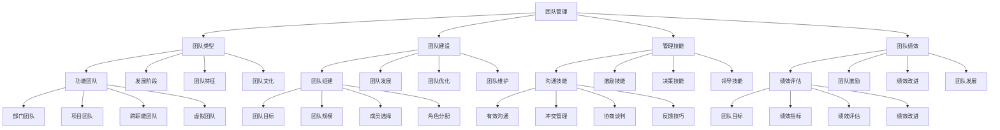

# 团队管理

## 🎯 学习目标
掌握团队管理理论和方法，学会建设和管理高效团队，提升团队绩效和组织竞争力。

## 📊 团队管理框架

### 团队管理模型

## 👥 团队类型

### 功能团队
**部门团队**：
- **部门团队**：部门团队管理
- **团队特征**：团队特征分析
- **团队建设**：团队建设方法
- **团队管理**：团队管理实践

**项目团队**：
- **项目团队**：项目团队管理
- **团队特征**：团队特征分析
- **团队建设**：团队建设方法
- **团队管理**：团队管理实践

**跨职能团队**：
- **跨职能团队**：跨职能团队管理
- **团队特征**：团队特征分析
- **团队建设**：团队建设方法
- **团队管理**：团队管理实践

**虚拟团队**：
- **虚拟团队**：虚拟团队管理
- **团队特征**：团队特征分析
- **团队建设**：团队建设方法
- **团队管理**：团队管理实践

### 团队发展阶段
**形成期**：
- **形成期**：团队形成期管理
- **期特征**：期特征分析
- **期管理**：期管理方法
- **期效果**：期效果评估

**震荡期**：
- **震荡期**：团队震荡期管理
- **期特征**：期特征分析
- **期管理**：期管理方法
- **期效果**：期效果评估

**规范期**：
- **规范期**：团队规范期管理
- **期特征**：期特征分析
- **期管理**：期管理方法
- **期效果**：期效果评估

**执行期**：
- **执行期**：团队执行期管理
- **期特征**：期特征分析
- **期管理**：期管理方法
- **期效果**：期效果评估

### 团队特征
**团队特征**：
- **团队特征**：团队特征分析
- **特征识别**：特征识别方法
- **特征管理**：特征管理策略
- **特征优化**：特征优化措施

**团队优势**：
- **团队优势**：团队优势分析
- **优势识别**：优势识别方法
- **优势利用**：优势利用策略
- **优势维护**：优势维护机制

**团队劣势**：
- **团队劣势**：团队劣势分析
- **劣势识别**：劣势识别方法
- **劣势改进**：劣势改进策略
- **劣势管理**：劣势管理机制

### 团队文化
**团队文化**：
- **团队文化**：团队文化建设
- **文化建设**：文化建设方法
- **文化传播**：文化传播策略
- **文化维护**：文化维护机制

**文化特征**：
- **文化特征**：团队文化特征
- **特征识别**：特征识别方法
- **特征发展**：特征发展策略
- **特征应用**：特征应用实践

## 🏗️ 团队建设

### 团队组建
**团队目标**：
- **团队目标**：团队目标设定
- **目标制定**：目标制定方法
- **目标管理**：目标管理实施
- **目标效果**：目标效果评估

**团队规模**：
- **团队规模**：团队规模确定
- **规模设计**：规模设计方法
- **规模管理**：规模管理实施
- **规模效果**：规模效果评估

**成员选择**：
- **成员选择**：团队成员选择
- **选择标准**：选择标准制定
- **选择方法**：选择方法选择
- **选择效果**：选择效果评估

**角色分配**：
- **角色分配**：团队成员角色分配
- **角色设计**：角色设计方法
- **角色管理**：角色管理实施
- **角色效果**：角色效果评估

### 团队发展
**团队培训**：
- **团队培训**：团队培训管理
- **培训设计**：培训设计方法
- **培训实施**：培训实施执行
- **培训效果**：培训效果评估

**团队建设**：
- **团队建设**：团队建设活动
- **建设方法**：建设方法选择
- **建设实施**：建设实施执行
- **建设效果**：建设效果评估

**团队激励**：
- **团队激励**：团队激励机制
- **激励方法**：激励方法选择
- **激励实施**：激励实施执行
- **激励效果**：激励效果评估

**团队评估**：
- **团队评估**：团队评估体系
- **评估方法**：评估方法选择
- **评估工具**：评估工具使用
- **评估结果**：评估结果应用

### 团队优化
**团队调整**：
- **团队调整**：团队调整管理
- **调整方法**：调整方法选择
- **调整实施**：调整实施执行
- **调整效果**：调整效果评估

**团队改进**：
- **团队改进**：团队改进管理
- **改进方法**：改进方法选择
- **改进实施**：改进实施执行
- **改进效果**：改进效果评估

**团队创新**：
- **团队创新**：团队创新管理
- **创新方法**：创新方法选择
- **创新实施**：创新实施执行
- **创新效果**：创新效果评估

**团队传承**：
- **团队传承**：团队传承管理
- **传承方法**：传承方法选择
- **传承实施**：传承实施执行
- **传承效果**：传承效果评估

### 团队维护
**团队维护**：
- **团队维护**：团队维护管理
- **维护方法**：维护方法选择
- **维护工具**：维护工具使用
- **维护效果**：维护效果评估

**维护策略**：
- **维护策略**：团队维护策略
- **策略制定**：策略制定过程
- **策略实施**：策略实施执行
- **策略效果**：策略效果评估

## 🛠️ 团队管理技能

### 沟通技能
**有效沟通**：
- **有效沟通**：团队有效沟通
- **沟通方法**：沟通方法选择
- **沟通工具**：沟通工具使用
- **沟通效果**：沟通效果评估

**冲突管理**：
- **冲突管理**：团队冲突管理
- **冲突识别**：冲突识别方法
- **冲突解决**：冲突解决方法
- **冲突预防**：冲突预防措施

**协商谈判**：
- **协商谈判**：团队协商谈判
- **谈判方法**：谈判方法选择
- **谈判技巧**：谈判技巧应用
- **谈判效果**：谈判效果评估

**反馈技巧**：
- **反馈技巧**：团队反馈技巧
- **反馈方法**：反馈方法选择
- **反馈工具**：反馈工具使用
- **反馈效果**：反馈效果评估

### 激励技能
**动机激发**：
- **动机激发**：团队动机激发
- **激发方法**：激发方法选择
- **激发工具**：激发工具使用
- **激发效果**：激发效果评估

**目标设定**：
- **目标设定**：团队目标设定
- **设定方法**：设定方法选择
- **设定工具**：设定工具使用
- **设定效果**：设定效果评估

**奖励机制**：
- **奖励机制**：团队奖励机制
- **机制设计**：机制设计方法
- **机制实施**：机制实施执行
- **机制效果**：机制效果评估

**认可激励**：
- **认可激励**：团队认可激励
- **激励方法**：激励方法选择
- **激励工具**：激励工具使用
- **激励效果**：激励效果评估

### 决策技能
**决策过程**：
- **决策过程**：团队决策过程
- **过程设计**：过程设计方法
- **过程实施**：过程实施执行
- **过程效果**：过程效果评估

**决策方法**：
- **决策方法**：团队决策方法
- **方法选择**：方法选择标准
- **方法应用**：方法应用实践
- **方法效果**：方法效果评估

**决策质量**：
- **决策质量**：团队决策质量
- **质量评估**：质量评估方法
- **质量改进**：质量改进措施
- **质量维护**：质量维护机制

**决策执行**：
- **决策执行**：团队决策执行
- **执行方法**：执行方法选择
- **执行工具**：执行工具使用
- **执行效果**：执行效果评估

### 领导技能
**领导技能**：
- **领导技能**：团队领导技能
- **技能识别**：技能识别方法
- **技能发展**：技能发展策略
- **技能应用**：技能应用实践

**技能发展**：
- **技能发展**：领导技能发展
- **发展方法**：发展方法选择
- **发展工具**：发展工具使用
- **发展效果**：发展效果评估

**技能应用**：
- **技能应用**：领导技能应用
- **应用方法**：应用方法选择
- **应用工具**：应用工具使用
- **应用效果**：应用效果评估

## 📈 团队绩效

### 绩效评估
**团队目标**：
- **团队目标**：团队绩效目标
- **目标设定**：目标设定方法
- **目标管理**：目标管理实施
- **目标效果**：目标效果评估

**绩效指标**：
- **绩效指标**：团队绩效指标
- **指标设计**：指标设计方法
- **指标实施**：指标实施执行
- **指标效果**：指标效果评估

**绩效评估**：
- **绩效评估**：团队绩效评估
- **评估方法**：评估方法选择
- **评估工具**：评估工具使用
- **评估结果**：评估结果应用

**绩效改进**：
- **绩效改进**：团队绩效改进
- **改进方法**：改进方法选择
- **改进工具**：改进工具使用
- **改进效果**：改进效果评估

### 团队激励
**团队奖励**：
- **团队奖励**：团队奖励机制
- **奖励设计**：奖励设计方法
- **奖励实施**：奖励实施执行
- **奖励效果**：奖励效果评估

**团队认可**：
- **团队认可**：团队认可机制
- **认可方法**：认可方法选择
- **认可实施**：认可实施执行
- **认可效果**：认可效果评估

**团队发展**：
- **团队发展**：团队发展机制
- **发展方法**：发展方法选择
- **发展实施**：发展实施执行
- **发展效果**：发展效果评估

**团队文化**：
- **团队文化**：团队文化建设
- **文化建设**：文化建设方法
- **文化实施**：文化实施执行
- **文化效果**：文化效果评估

### 绩效改进
**绩效改进**：
- **绩效改进**：团队绩效改进
- **改进方法**：改进方法选择
- **改进工具**：改进工具使用
- **改进效果**：改进效果评估

**改进策略**：
- **改进策略**：绩效改进策略
- **策略制定**：策略制定过程
- **策略实施**：策略实施执行
- **策略效果**：策略效果评估

**改进管理**：
- **改进管理**：绩效改进管理
- **管理方法**：管理方法选择
- **管理工具**：管理工具使用
- **管理效果**：管理效果评估

### 团队发展
**团队发展**：
- **团队发展**：团队发展管理
- **发展方法**：发展方法选择
- **发展工具**：发展工具使用
- **发展效果**：发展效果评估

**发展策略**：
- **发展策略**：团队发展策略
- **策略制定**：策略制定过程
- **策略实施**：策略实施执行
- **策略效果**：策略效果评估

**发展管理**：
- **发展管理**：团队发展管理
- **管理方法**：管理方法选择
- **管理工具**：管理工具使用
- **管理效果**：管理效果评估

## 💡 团队管理案例

### 成功案例
**谷歌团队管理**：
- **团队建设**：创新团队建设
- **团队管理**：成功团队管理
- **团队绩效**：卓越团队绩效
- **效果**：团队管理质量极高

**微软团队管理**：
- **团队建设**：系统团队建设
- **团队管理**：成功团队管理
- **团队绩效**：显著团队绩效
- **效果**：团队管理质量极佳

**苹果团队管理**：
- **团队建设**：独特团队建设
- **团队管理**：成功团队管理
- **团队绩效**：突出团队绩效
- **效果**：团队管理质量突出

### 失败案例
**失败原因**：
- **团队建设不足**：团队建设不足
- **团队管理缺失**：团队管理缺失
- **团队绩效不佳**：团队绩效不佳
- **团队发展停滞**：团队发展停滞

**失败教训**：
- **团队建设**：充分进行团队建设
- **团队管理**：完善团队管理体系
- **团队绩效**：持续改进团队绩效
- **团队发展**：持续进行团队发展

## 🧠 学习要点

### 费曼学习法应用
1. **选择概念**：团队管理
2. **简化解释**：用简单语言解释团队管理
3. **识别盲点**：找出理解不足的地方
4. **重新学习**：针对盲点深入学习

### 刻意练习要点
- **理论掌握**：掌握团队管理理论
- **方法应用**：掌握团队管理方法
- **工具使用**：掌握团队管理工具
- **实践应用**：实践应用团队管理

## 🔗 关联学习

### 前置知识
- [[02-领导力]] - 领导力
- [[01-组织文化]] - 组织文化
- [[03-股权激励]] - 股权激励

### 后续学习
- [[01-战略管理概论]] - 战略管理概论
- [[02-战略分析工具]] - 战略分析工具
- [[03-战略制定]] - 战略制定

### 实践应用
- 企业团队建设
- 团队管理实践
- 团队绩效提升
- 团队发展优化

## 🎯 学习检验

### 理解检验
- [ ] 能够理解团队管理理论
- [ ] 能够掌握团队管理方法
- [ ] 能够应用团队管理工具
- [ ] 能够管理团队

### 应用检验
- [ ] 能够建设高效团队
- [ ] 能够管理团队绩效
- [ ] 能够提升团队能力
- [ ] 能够优化团队发展

---
**下一步**：[[01-战略管理概论]] - 战略管理概论