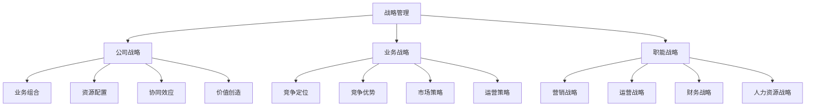

# 战略管理概论

## 🎯 学习目标
理解战略管理的本质，掌握战略管理过程，建立战略思维框架。

## 📊 战略管理定义

### 核心定义
**战略管理**是企业确定使命、愿景和目标，制定和实施战略，评估和控制战略执行的管理过程。

### 战略层次

## 🔄 战略管理过程

### 战略分析
**外部环境分析**：
- 宏观环境分析
- 行业环境分析
- 竞争环境分析
- 市场环境分析

**内部环境分析**：
- 资源分析
- 能力分析
- 价值链分析
- 核心竞争力分析

**综合分析**：
- SWOT分析
- 战略群组分析
- 情景分析
- 利益相关者分析

### 战略制定
**战略选择**：
- 战略方案生成
- 战略方案评估
- 战略方案选择
- 战略方案优化

**战略内容**：
- 使命愿景
- 战略目标
- 战略重点
- 战略措施

### 战略实施
**战略分解**：
- 目标分解
- 任务分解
- 责任分解
- 时间分解

**资源配置**：
- 人力资源配置
- 财务资源配置
- 技术资源配置
- 信息资源配置

**组织调整**：
- 组织结构调整
- 管理流程优化
- 企业文化变革
- 激励机制设计

### 战略控制
**战略监控**：
- 绩效监控
- 进度监控
- 风险监控
- 环境监控

**战略评估**：
- 目标达成评估
- 战略效果评估
- 资源配置评估
- 组织能力评估

**战略调整**：
- 战略修正
- 战略更新
- 战略创新
- 战略转型

## 🧠 战略思维

### 系统思维
**整体思维**：
- 全局视角
- 系统思考
- 整体优化
- 协同效应

**动态思维**：
- 变化适应
- 趋势预测
- 机会把握
- 风险控制

### 竞争思维
**竞争优势**：
- 成本优势
- 差异化优势
- 聚焦优势
- 创新优势

**竞争策略**：
- 成本领先
- 差异化
- 聚焦战略
- 蓝海战略

### 价值思维
**价值创造**：
- 客户价值
- 股东价值
- 员工价值
- 社会价值

**价值传递**：
- 价值主张
- 价值实现
- 价值分配
- 价值维护

## 🛠️ 战略管理工具

### 分析工具
**环境分析工具**：
- PEST分析
- 波特五力模型
- 价值链分析
- 资源基础观

**战略分析工具**：
- SWOT分析
- 战略群组分析
- 情景规划
- 利益相关者分析

### 规划工具
**战略规划工具**：
- 战略地图
- 平衡计分卡
- 战略时钟
- 战略选择矩阵

**实施工具**：
- 项目管理
- 变革管理
- 绩效管理
- 风险管理

## 💡 实践应用

### 战略制定流程
**制定步骤**：
1. 环境分析
2. 战略选择
3. 战略规划
4. 战略实施
5. 战略控制

### 战略案例分析
**选择案例**：如华为公司
**分析维度**：
- 战略分析：环境分析，资源分析
- 战略制定：使命愿景，战略目标
- 战略实施：资源配置，组织调整
- 战略控制：绩效监控，战略调整

## 🧠 学习要点

### 费曼学习法应用
1. **选择概念**：战略管理
2. **简化解释**：用简单语言解释战略管理
3. **识别盲点**：找出理解不足的地方
4. **重新学习**：针对盲点深入学习

### 刻意练习要点
- **概念理解**：准确理解战略管理概念
- **过程掌握**：掌握战略管理过程
- **工具应用**：能够运用战略工具
- **思维建立**：形成战略思维

## 🔗 关联学习

### 前置知识
- [[01-商业学概论]] - 商业学基础
- [[02-商业环境分析]] - 环境分析
- [[03-商业系统理论]] - 系统思维

### 后续学习
- [[02-战略分析工具]] - 分析工具
- [[03-战略制定]] - 战略制定
- [[04-战略实施]] - 战略实施

### 实践应用
- 企业战略制定
- 战略规划实施
- 战略绩效评估
- 战略变革管理

## 🎯 学习检验

### 理解检验
- [ ] 能够解释战略管理定义
- [ ] 能够描述战略管理过程
- [ ] 能够运用战略分析工具
- [ ] 能够建立战略思维框架

### 应用检验
- [ ] 能够制定企业战略
- [ ] 能够分析战略案例
- [ ] 能够实施战略规划
- [ ] 能够评估战略效果

---
**下一步**：[[02-战略分析工具]] - 战略分析工具