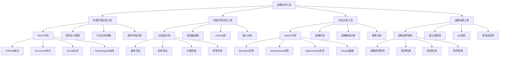

# 战略分析工具

## 🎯 学习目标
掌握战略分析工具的理论和方法，学会运用各种分析工具进行战略分析，提升战略分析能力和决策质量。

## 📊 战略分析工具框架

### 战略分析工具模型

## 🌍 外部环境分析工具

### PEST分析
**Political(政治)**：
- **Political**：政治环境分析
- **政策分析**：政策分析
- **法规分析**：法规分析
- **政治风险**：政治风险分析

**Economic(经济)**：
- **Economic**：经济环境分析
- **经济指标**：经济指标分析
- **经济趋势**：经济趋势分析
- **经济影响**：经济影响分析

**Social(社会)**：
- **Social**：社会环境分析
- **社会趋势**：社会趋势分析
- **文化分析**：文化分析
- **社会影响**：社会影响分析

**Technological(技术)**：
- **Technological**：技术环境分析
- **技术趋势**：技术趋势分析
- **技术影响**：技术影响分析
- **技术机会**：技术机会分析

### 波特五力模型
**供应商议价能力**：
- **供应商议价能力**：供应商议价能力分析
- **议价能力评估**：议价能力评估
- **议价能力影响**：议价能力影响
- **议价能力应对**：议价能力应对

**买方议价能力**：
- **买方议价能力**：买方议价能力分析
- **议价能力评估**：议价能力评估
- **议价能力影响**：议价能力影响
- **议价能力应对**：议价能力应对

**潜在进入者威胁**：
- **潜在进入者威胁**：潜在进入者威胁分析
- **威胁评估**：威胁评估
- **威胁影响**：威胁影响
- **威胁应对**：威胁应对

**替代品威胁**：
- **替代品威胁**：替代品威胁分析
- **威胁评估**：威胁评估
- **威胁影响**：威胁影响
- **威胁应对**：威胁应对

**现有竞争者竞争**：
- **现有竞争者竞争**：现有竞争者竞争分析
- **竞争强度**：竞争强度分析
- **竞争策略**：竞争策略分析
- **竞争应对**：竞争应对

### 行业生命周期
**导入期**：
- **导入期**：行业导入期分析
- **期特征**：期特征分析
- **期策略**：期策略分析
- **期机会**：期机会分析

**成长期**：
- **成长期**：行业成长期分析
- **期特征**：期特征分析
- **期策略**：期策略分析
- **期机会**：期机会分析

**成熟期**：
- **成熟期**：行业成熟期分析
- **期特征**：期特征分析
- **期策略**：期策略分析
- **期机会**：期机会分析

**衰退期**：
- **衰退期**：行业衰退期分析
- **期特征**：期特征分析
- **期策略**：期策略分析
- **期机会**：期机会分析

### 竞争环境分析
**竞争环境分析**：
- **竞争环境分析**：竞争环境分析
- **分析方法**：分析方法
- **分析工具**：分析工具
- **分析结果**：分析结果

**竞争格局**：
- **竞争格局**：竞争格局分析
- **格局识别**：格局识别
- **格局分析**：格局分析
- **格局应对**：格局应对

## 🏢 内部环境分析工具

### 价值链分析
**基本活动**：
- **基本活动**：基本活动分析
- **活动识别**：活动识别
- **活动分析**：活动分析
- **活动优化**：活动优化

**支持活动**：
- **支持活动**：支持活动分析
- **活动识别**：活动识别
- **活动分析**：活动分析
- **活动优化**：活动优化

**价值创造**：
- **价值创造**：价值创造分析
- **创造过程**：创造过程分析
- **创造效率**：创造效率分析
- **创造优化**：创造优化

**竞争优势**：
- **竞争优势**：竞争优势分析
- **优势识别**：优势识别
- **优势分析**：优势分析
- **优势维护**：优势维护

### 资源基础观
**资源识别**：
- **资源识别**：资源识别
- **识别方法**：识别方法
- **识别工具**：识别工具
- **识别结果**：识别结果

**能力分析**：
- **能力分析**：能力分析
- **分析方法**：分析方法
- **分析工具**：分析工具
- **分析结果**：分析结果

**竞争优势**：
- **竞争优势**：竞争优势分析
- **优势识别**：优势识别
- **优势分析**：优势分析
- **优势维护**：优势维护

**可持续性**：
- **可持续性**：可持续性分析
- **持续性评估**：持续性评估
- **持续性维护**：持续性维护
- **持续性发展**：持续性发展

### VRIO分析
**Value(价值)**：
- **Value**：价值分析
- **价值评估**：价值评估
- **价值创造**：价值创造
- **价值维护**：价值维护

**Rarity(稀缺性)**：
- **Rarity**：稀缺性分析
- **稀缺性评估**：稀缺性评估
- **稀缺性维护**：稀缺性维护
- **稀缺性发展**：稀缺性发展

**Imitability(可模仿性)**：
- **Imitability**：可模仿性分析
- **模仿性评估**：模仿性评估
- **模仿性控制**：模仿性控制
- **模仿性应对**：模仿性应对

**Organization(组织)**：
- **Organization**：组织分析
- **组织能力**：组织能力分析
- **组织效率**：组织效率分析
- **组织优化**：组织优化

### 能力分析
**能力分析**：
- **能力分析**：能力分析
- **分析方法**：分析方法
- **分析工具**：分析工具
- **分析结果**：分析结果

**核心能力**：
- **核心能力**：核心能力分析
- **能力识别**：能力识别
- **能力评估**：能力评估
- **能力发展**：能力发展

## 🔄 综合分析工具

### SWOT分析
**Strengths(优势)**：
- **Strengths**：优势分析
- **优势识别**：优势识别
- **优势评估**：优势评估
- **优势利用**：优势利用

**Weaknesses(劣势)**：
- **Weaknesses**：劣势分析
- **劣势识别**：劣势识别
- **劣势评估**：劣势评估
- **劣势改进**：劣势改进

**Opportunities(机会)**：
- **Opportunities**：机会分析
- **机会识别**：机会识别
- **机会评估**：机会评估
- **机会利用**：机会利用

**Threats(威胁)**：
- **Threats**：威胁分析
- **威胁识别**：威胁识别
- **威胁评估**：威胁评估
- **威胁应对**：威胁应对

### 战略时钟
**低价战略**：
- **低价战略**：低价战略分析
- **战略特征**：战略特征分析
- **战略实施**：战略实施分析
- **战略效果**：战略效果分析

**差异化战略**：
- **差异化战略**：差异化战略分析
- **战略特征**：战略特征分析
- **战略实施**：战略实施分析
- **战略效果**：战略效果分析

**混合战略**：
- **混合战略**：混合战略分析
- **战略特征**：战略特征分析
- **战略实施**：战略实施分析
- **战略效果**：战略效果分析

**失败战略**：
- **失败战略**：失败战略分析
- **失败原因**：失败原因分析
- **失败教训**：失败教训分析
- **失败避免**：失败避免分析

### 战略群组分析
**群组识别**：
- **群组识别**：群组识别
- **识别方法**：识别方法
- **识别工具**：识别工具
- **识别结果**：识别结果

**群组特征**：
- **群组特征**：群组特征分析
- **特征识别**：特征识别
- **特征分析**：特征分析
- **特征应用**：特征应用

**群组竞争**：
- **群组竞争**：群组竞争分析
- **竞争分析**：竞争分析
- **竞争策略**：竞争策略
- **竞争应对**：竞争应对

**群组移动**：
- **群组移动**：群组移动分析
- **移动分析**：移动分析
- **移动策略**：移动策略
- **移动应对**：移动应对

### 情景分析
**情景分析**：
- **情景分析**：情景分析
- **分析方法**：分析方法
- **分析工具**：分析工具
- **分析结果**：分析结果

**情景设计**：
- **情景设计**：情景设计
- **设计方法**：设计方法
- **设计工具**：设计工具
- **设计效果**：设计效果

## 🎯 战略选择工具

### 战略选择矩阵
**战略选择矩阵**：
- **战略选择矩阵**：战略选择矩阵
- **矩阵构建**：矩阵构建
- **矩阵应用**：矩阵应用
- **矩阵效果**：矩阵效果

**矩阵构建**：
- **矩阵构建**：矩阵构建
- **构建方法**：构建方法
- **构建工具**：构建工具
- **构建效果**：构建效果

**矩阵应用**：
- **矩阵应用**：矩阵应用
- **应用方法**：应用方法
- **应用工具**：应用工具
- **应用效果**：应用效果

**矩阵效果**：
- **矩阵效果**：矩阵效果
- **效果评估**：效果评估
- **效果分析**：效果分析
- **效果改进**：效果改进

### 波士顿矩阵
**波士顿矩阵**：
- **波士顿矩阵**：波士顿矩阵
- **矩阵构建**：矩阵构建
- **矩阵应用**：矩阵应用
- **矩阵效果**：矩阵效果

**明星业务**：
- **明星业务**：明星业务分析
- **业务特征**：业务特征分析
- **业务策略**：业务策略分析
- **业务发展**：业务发展分析

**现金牛业务**：
- **现金牛业务**：现金牛业务分析
- **业务特征**：业务特征分析
- **业务策略**：业务策略分析
- **业务发展**：业务发展分析

**问题业务**：
- **问题业务**：问题业务分析
- **业务特征**：业务特征分析
- **业务策略**：业务策略分析
- **业务发展**：业务发展分析

**瘦狗业务**：
- **瘦狗业务**：瘦狗业务分析
- **业务特征**：业务特征分析
- **业务策略**：业务策略分析
- **业务发展**：业务发展分析

### GE矩阵
**GE矩阵**：
- **GE矩阵**：GE矩阵
- **矩阵构建**：矩阵构建
- **矩阵应用**：矩阵应用
- **矩阵效果**：矩阵效果

**矩阵维度**：
- **矩阵维度**：矩阵维度分析
- **维度设计**：维度设计
- **维度应用**：维度应用
- **维度效果**：维度效果

### 安索夫矩阵
**安索夫矩阵**：
- **安索夫矩阵**：安索夫矩阵
- **矩阵构建**：矩阵构建
- **矩阵应用**：矩阵应用
- **矩阵效果**：矩阵效果

**市场渗透**：
- **市场渗透**：市场渗透分析
- **渗透策略**：渗透策略分析
- **渗透实施**：渗透实施分析
- **渗透效果**：渗透效果分析

**市场开发**：
- **市场开发**：市场开发分析
- **开发策略**：开发策略分析
- **开发实施**：开发实施分析
- **开发效果**：开发效果分析

**产品开发**：
- **产品开发**：产品开发分析
- **开发策略**：开发策略分析
- **开发实施**：开发实施分析
- **开发效果**：开发效果分析

**多元化**：
- **多元化**：多元化分析
- **多元化策略**：多元化策略分析
- **多元化实施**：多元化实施分析
- **多元化效果**：多元化效果分析

## 💡 战略分析工具案例

### 成功案例
**苹果公司战略分析**：
- **分析工具**：综合运用多种分析工具
- **分析结果**：准确识别竞争优势
- **分析应用**：成功制定战略
- **效果**：战略分析效果极佳

**特斯拉公司战略分析**：
- **分析工具**：创新运用分析工具
- **分析结果**：前瞻性战略分析
- **分析应用**：成功制定战略
- **效果**：战略分析效果显著

**亚马逊公司战略分析**：
- **分析工具**：系统运用分析工具
- **分析结果**：全面战略分析
- **分析应用**：成功制定战略
- **效果**：战略分析效果突出

### 失败案例
**失败原因**：
- **分析工具选择不当**：分析工具选择不当
- **分析过程不科学**：分析过程不科学
- **分析结果不准确**：分析结果不准确
- **分析应用不到位**：分析应用不到位

**失败教训**：
- **分析工具**：选择合适的分析工具
- **分析过程**：科学进行分析过程
- **分析结果**：确保分析结果准确
- **分析应用**：有效应用分析结果

## 🧠 学习要点

### 费曼学习法应用
1. **选择概念**：战略分析工具
2. **简化解释**：用简单语言解释战略分析工具
3. **识别盲点**：找出理解不足的地方
4. **重新学习**：针对盲点深入学习

### 刻意练习要点
- **理论掌握**：掌握战略分析工具理论
- **方法应用**：掌握战略分析工具方法
- **工具使用**：掌握战略分析工具使用
- **实践应用**：实践应用战略分析工具

## 🔗 关联学习

### 前置知识
- [[01-战略管理概论]] - 战略管理概论
- [[01-商业环境分析]] - 商业环境分析
- [[01-商业系统理论]] - 商业系统理论

### 后续学习
- [[03-战略制定]] - 战略制定
- [[04-战略实施]] - 战略实施
- [[01-波特五力模型]] - 波特五力模型

### 实践应用
- 企业战略分析
- 竞争环境分析
- 战略工具应用
- 战略决策支持

## 🎯 学习检验

### 理解检验
- [ ] 能够理解战略分析工具理论
- [ ] 能够掌握战略分析工具方法
- [ ] 能够应用战略分析工具
- [ ] 能够进行战略分析

### 应用检验
- [ ] 能够进行战略分析
- [ ] 能够运用分析工具
- [ ] 能够制定战略方案
- [ ] 能够支持战略决策

---
**下一步**：[[03-战略制定]] - 战略制定