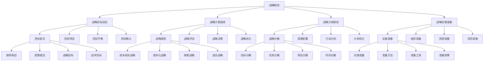

# 战略制定

## 🎯 学习目标
掌握战略制定理论和方法，学会制定有效的企业战略，提升战略制定能力和战略实施效果。

## 📊 战略制定框架

### 战略制定模型

## 🎯 战略目标设定

### 目标层次
**使命陈述**：
- **使命陈述**：使命陈述
- **使命制定**：使命制定
- **使命内容**：使命内容
- **使命应用**：使命应用

**愿景描述**：
- **愿景描述**：愿景描述
- **愿景制定**：愿景制定
- **愿景内容**：愿景内容
- **愿景应用**：愿景应用

**战略目标**：
- **战略目标**：战略目标
- **目标制定**：目标制定
- **目标内容**：目标内容
- **目标应用**：目标应用

**战术目标**：
- **战术目标**：战术目标
- **目标制定**：目标制定
- **目标内容**：目标内容
- **目标应用**：目标应用

### 目标特征
**具体性**：
- **具体性**：目标具体性
- **具体化**：目标具体化
- **具体标准**：具体标准
- **具体应用**：具体应用

**可测量性**：
- **可测量性**：目标可测量性
- **测量方法**：测量方法
- **测量工具**：测量工具
- **测量应用**：测量应用

**可实现性**：
- **可实现性**：目标可实现性
- **实现评估**：实现评估
- **实现条件**：实现条件
- **实现应用**：实现应用

**相关性**：
- **相关性**：目标相关性
- **相关分析**：相关分析
- **相关影响**：相关影响
- **相关应用**：相关应用

**时限性**：
- **时限性**：目标时限性
- **时限设定**：时限设定
- **时限管理**：时限管理
- **时限应用**：时限应用

### 目标平衡
**财务目标**：
- **财务目标**：财务目标
- **目标设定**：目标设定
- **目标管理**：目标管理
- **目标应用**：目标应用

**客户目标**：
- **客户目标**：客户目标
- **目标设定**：目标设定
- **目标管理**：目标管理
- **目标应用**：目标应用

**内部流程目标**：
- **内部流程目标**：内部流程目标
- **目标设定**：目标设定
- **目标管理**：目标管理
- **目标应用**：目标应用

**学习成长目标**：
- **学习成长目标**：学习成长目标
- **目标设定**：目标设定
- **目标管理**：目标管理
- **目标应用**：目标应用

### 目标确认
**目标确认**：
- **目标确认**：目标确认
- **确认方法**：确认方法
- **确认工具**：确认工具
- **确认效果**：确认效果

**目标沟通**：
- **目标沟通**：目标沟通
- **沟通方法**：沟通方法
- **沟通工具**：沟通工具
- **沟通效果**：沟通效果

## 🎯 战略方案选择

### 战略类型
**成本领先战略**：
- **成本领先战略**：成本领先战略
- **战略特征**：战略特征
- **战略实施**：战略实施
- **战略效果**：战略效果

**差异化战略**：
- **差异化战略**：差异化战略
- **战略特征**：战略特征
- **战略实施**：战略实施
- **战略效果**：战略效果

**聚焦战略**：
- **聚焦战略**：聚焦战略
- **战略特征**：战略特征
- **战略实施**：战略实施
- **战略效果**：战略效果

**混合战略**：
- **混合战略**：混合战略
- **战略特征**：战略特征
- **战略实施**：战略实施
- **战略效果**：战略效果

### 战略评估
**可行性分析**：
- **可行性分析**：可行性分析
- **分析方法**：分析方法
- **分析工具**：分析工具
- **分析结果**：分析结果

**可接受性分析**：
- **可接受性分析**：可接受性分析
- **分析方法**：分析方法
- **分析工具**：分析工具
- **分析结果**：分析结果

**适宜性分析**：
- **适宜性分析**：适宜性分析
- **分析方法**：分析方法
- **分析工具**：分析工具
- **分析结果**：分析结果

**风险评估**：
- **风险评估**：风险评估
- **评估方法**：评估方法
- **评估工具**：评估工具
- **评估结果**：评估结果

### 战略决策
**决策标准**：
- **决策标准**：决策标准
- **标准制定**：标准制定
- **标准应用**：标准应用
- **标准效果**：标准效果

**决策方法**：
- **决策方法**：决策方法
- **方法选择**：方法选择
- **方法应用**：方法应用
- **方法效果**：方法效果

**决策过程**：
- **决策过程**：决策过程
- **过程设计**：过程设计
- **过程实施**：过程实施
- **过程效果**：过程效果

**决策实施**：
- **决策实施**：决策实施
- **实施方法**：实施方法
- **实施工具**：实施工具
- **实施效果**：实施效果

### 战略优化
**战略优化**：
- **战略优化**：战略优化
- **优化方法**：优化方法
- **优化工具**：优化工具
- **优化效果**：优化效果

**优化策略**：
- **优化策略**：优化策略
- **策略制定**：策略制定
- **策略实施**：策略实施
- **策略效果**：策略效果

## 📋 战略计划制定

### 战略分解
**目标分解**：
- **目标分解**：目标分解
- **分解方法**：分解方法
- **分解工具**：分解工具
- **分解效果**：分解效果

**任务分解**：
- **任务分解**：任务分解
- **分解方法**：分解方法
- **分解工具**：分解工具
- **分解效果**：分解效果

**责任分解**：
- **责任分解**：责任分解
- **分解方法**：分解方法
- **分解工具**：分解工具
- **分解效果**：分解效果

**时间分解**：
- **时间分解**：时间分解
- **分解方法**：分解方法
- **分解工具**：分解工具
- **分解效果**：分解效果

### 资源配置
**人力资源**：
- **人力资源**：人力资源配置
- **配置方法**：配置方法
- **配置工具**：配置工具
- **配置效果**：配置效果

**财务资源**：
- **财务资源**：财务资源配置
- **配置方法**：配置方法
- **配置工具**：配置工具
- **配置效果**：配置效果

**技术资源**：
- **技术资源**：技术资源配置
- **配置方法**：配置方法
- **配置工具**：配置工具
- **配置效果**：配置效果

**信息资源**：
- **信息资源**：信息资源配置
- **配置方法**：配置方法
- **配置工具**：配置工具
- **配置效果**：配置效果

### 行动计划
**行动步骤**：
- **行动步骤**：行动步骤
- **步骤设计**：步骤设计
- **步骤实施**：步骤实施
- **步骤效果**：步骤效果

**时间安排**：
- **时间安排**：时间安排
- **安排方法**：安排方法
- **安排工具**：安排工具
- **安排效果**：安排效果

**资源配置**：
- **资源配置**：资源配置
- **配置方法**：配置方法
- **配置工具**：配置工具
- **配置效果**：配置效果

**风险控制**：
- **风险控制**：风险控制
- **控制方法**：控制方法
- **控制工具**：控制工具
- **控制效果**：控制效果

### 计划优化
**计划优化**：
- **计划优化**：计划优化
- **优化方法**：优化方法
- **优化工具**：优化工具
- **优化效果**：优化效果

**优化策略**：
- **优化策略**：优化策略
- **策略制定**：策略制定
- **策略实施**：策略实施
- **策略效果**：策略效果

## 🚀 战略实施准备

### 实施准备
**实施准备**：
- **实施准备**：实施准备
- **准备方法**：准备方法
- **准备工具**：准备工具
- **准备效果**：准备效果

**准备策略**：
- **准备策略**：准备策略
- **策略制定**：策略制定
- **策略实施**：策略实施
- **策略效果**：策略效果

### 组织准备
**组织准备**：
- **组织准备**：组织准备
- **准备方法**：准备方法
- **准备工具**：准备工具
- **准备效果**：准备效果

**组织调整**：
- **组织调整**：组织调整
- **调整方法**：调整方法
- **调整工具**：调整工具
- **调整效果**：调整效果

### 资源准备
**资源准备**：
- **资源准备**：资源准备
- **准备方法**：准备方法
- **准备工具**：准备工具
- **准备效果**：准备效果

**资源保障**：
- **资源保障**：资源保障
- **保障方法**：保障方法
- **保障工具**：保障工具
- **保障效果**：保障效果

### 风险准备
**风险准备**：
- **风险准备**：风险准备
- **准备方法**：准备方法
- **准备工具**：准备工具
- **准备效果**：准备效果

**风险控制**：
- **风险控制**：风险控制
- **控制方法**：控制方法
- **控制工具**：控制工具
- **控制效果**：控制效果

## 💡 战略制定案例

### 成功案例
**苹果公司战略制定**：
- **战略制定**：创新战略制定
- **战略实施**：成功战略实施
- **战略效果**：卓越战略效果
- **效果**：战略制定质量极高

**特斯拉公司战略制定**：
- **战略制定**：前瞻战略制定
- **战略实施**：成功战略实施
- **战略效果**：显著战略效果
- **效果**：战略制定质量极佳

**亚马逊公司战略制定**：
- **战略制定**：系统战略制定
- **战略实施**：成功战略实施
- **战略效果**：突出战略效果
- **效果**：战略制定质量突出

### 失败案例
**失败原因**：
- **战略目标不明确**：战略目标不明确
- **战略方案不科学**：战略方案不科学
- **战略计划不完善**：战略计划不完善
- **战略实施准备不足**：战略实施准备不足

**失败教训**：
- **战略目标**：明确战略目标
- **战略方案**：科学制定战略方案
- **战略计划**：完善战略计划
- **战略实施**：充分准备战略实施

## 🧠 学习要点

### 费曼学习法应用
1. **选择概念**：战略制定
2. **简化解释**：用简单语言解释战略制定
3. **识别盲点**：找出理解不足的地方
4. **重新学习**：针对盲点深入学习

### 刻意练习要点
- **理论掌握**：掌握战略制定理论
- **方法应用**：掌握战略制定方法
- **工具使用**：掌握战略制定工具
- **实践应用**：实践应用战略制定

## 🔗 关联学习

### 前置知识
- [[02-战略分析工具]] - 战略分析工具
- [[01-战略管理概论]] - 战略管理概论
- [[01-商业环境分析]] - 商业环境分析

### 后续学习
- [[04-战略实施]] - 战略实施
- [[01-成本领先战略]] - 成本领先战略
- [[02-差异化战略]] - 差异化战略

### 实践应用
- 企业战略制定
- 战略目标设定
- 战略方案选择
- 战略计划制定

## 🎯 学习检验

### 理解检验
- [ ] 能够理解战略制定理论
- [ ] 能够掌握战略制定方法
- [ ] 能够应用战略制定工具
- [ ] 能够制定企业战略

### 应用检验
- [ ] 能够制定企业战略
- [ ] 能够设定战略目标
- [ ] 能够选择战略方案
- [ ] 能够制定战略计划

---
**下一步**：[[04-战略实施]] - 战略实施